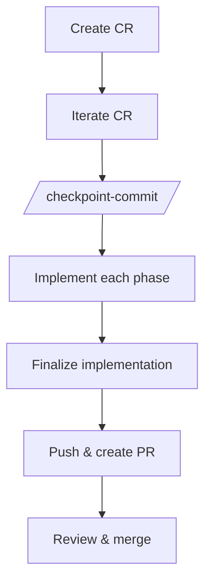
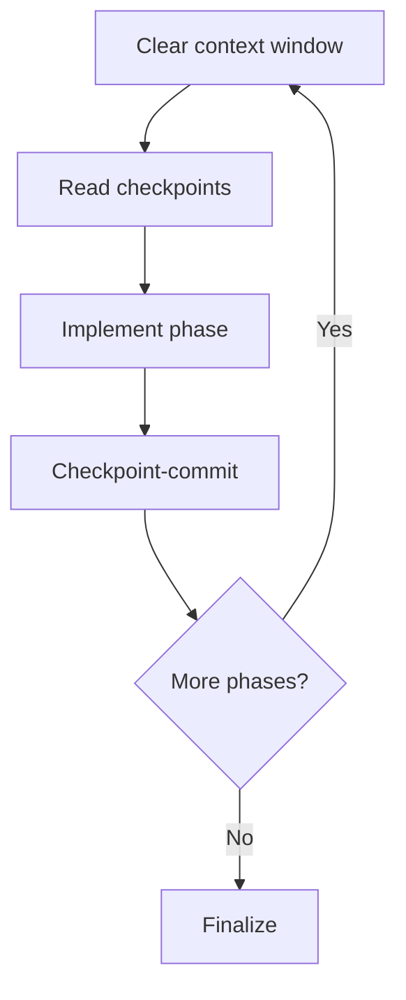
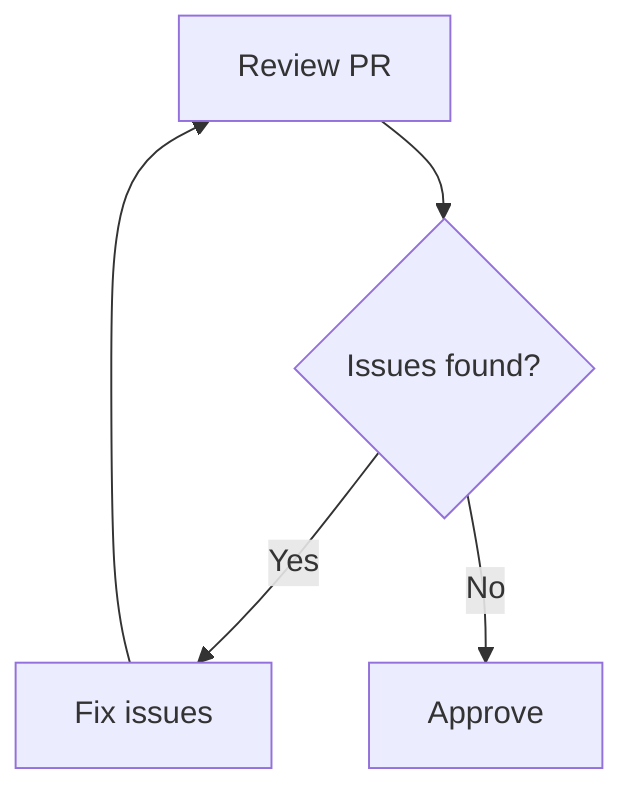
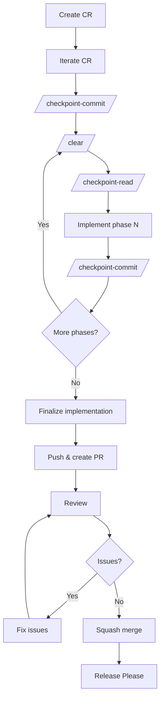

# Implementation Workflow

This document describes the end-to-end workflow for implementing changes in this repository using AI agents, Change Requests (CRs), and checkpoint commits.

### Overview

### Step 1: Create a Change Request

Ask the AI agent to create a CR for the desired change. The CR captures motivation, current state, proposed changes, and a phased implementation plan.

**Prompt:**
> Create a CR for \<description of the desired change\>

### Step 2: Iterate the CR

Review the generated CR and refine it until it meets quality standards. This can be zero-shot (accepted on first attempt) but is typically few-shot (a few rounds of feedback).

**Prompt (repeat as needed):**
> \<feedback on the CR\>

### Step 3: Checkpoint-commit the finalized CR

Once the CR is finalized, create a checkpoint commit to preserve it.

**Prompt:**
> /checkpoint-commit

### Step 4: Implement each phase

For each phase defined in the CR, execute the following sub-steps in a clean context window:

#### 4a. Clear the context window

Start with a fresh context to avoid confusion from prior conversation.

**Action:**
> /clear

#### 4b. Read checkpoint history

Recover context from previous work by reading checkpoint commits.

**Prompt:**
> /checkpoint-read

#### 4c. Implement the phase

Direct the agent to systematically implement the current phase.

**Prompt:**
> Systematically implement phase {phase number} of @path/to/cr.md

#### 4d. Checkpoint-commit

Preserve the phase's work with a checkpoint commit.

**Prompt:**
> /checkpoint-commit

Repeat steps 4a–4d for each phase in the CR.

### Step 5: Finalize the implementation

After all phases are complete, run a finalization pass to ensure everything is consistent and complete.

**Prompt:**
> Finalize the implementation of @path/to/cr.md

### Step 6: Push and create a PR

Push the branch and create a pull request.

**Prompt:**
> git push and create a pr

### Step 7: Review

Review the PR for correctness, completeness, and adherence to project standards.

### Step 8: Fix any issues

If the review surfaces issues, fix them and return to step 7.

### Step 9: Merge the PR

Squash merge the PR into `main`. The PR title becomes the commit message and must follow [Conventional Commits](https://www.conventionalcommits.org/).

### Step 10: Release

[Release Please](https://github.com/googleapis/release-please) automatically creates a release PR based on conventional commit messages. Merge the release PR to publish the new version.

### Complete Workflow

