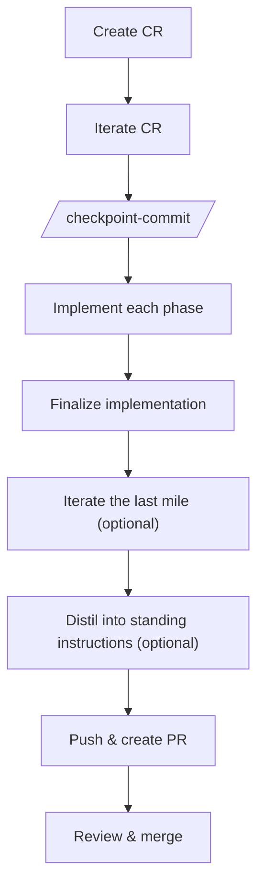
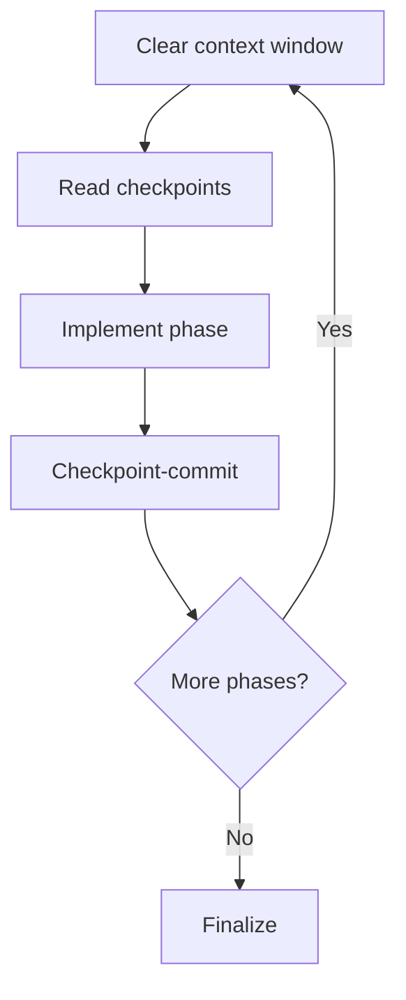
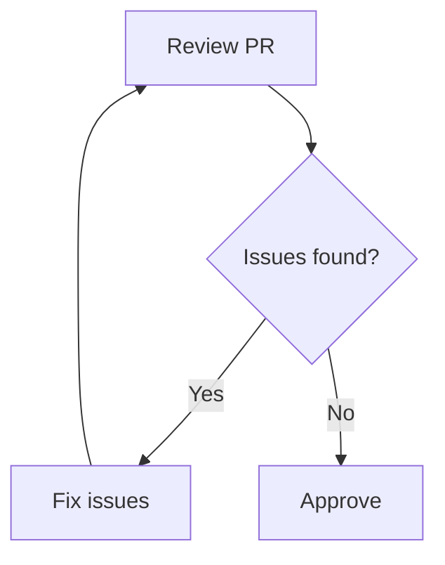
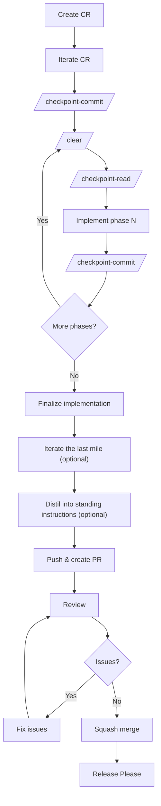

# Implementation Workflow

This document describes the end-to-end workflow for implementing changes in this repository using AI agents, Change Requests (CRs), and checkpoint commits.

### Overview

```mermaid
flowchart TD
    A[Create CR] --> B[Iterate CR]
    B --> C[/checkpoint-commit/]
    C --> D[Implement each phase]
    D --> E[Finalize implementation]
    E --> F["Iterate the last mile (optional)"]
    F --> F2["Distil into standing instructions (optional)"]
    F2 --> G[Push & create PR]
    G --> H[Review & merge]
```

### Step 1: Create a Change Request

Ask the AI agent to create a CR for the desired change. The CR captures motivation, current state, proposed changes, and a phased implementation plan.

**Prompt:**
> Create a CR for \<description of the desired change\>

### Step 2: Iterate the CR

Review the generated CR and refine it until it meets quality standards. This can be zero-shot (accepted on first attempt) but is typically few-shot (a few rounds of feedback).

**Prompt (repeat as needed):**
> \<feedback on the CR\>

### Step 3: Checkpoint-commit the finalized CR

Once the CR is finalized, create a checkpoint commit to preserve it.

**Prompt:**
> /checkpoint-commit

### Step 4: Implement each phase

For each phase defined in the CR, execute the following sub-steps in a clean context window:

```mermaid
flowchart TD
    A[Clear context window] --> B[Read checkpoints]
    B --> C[Implement phase]
    C --> D[Checkpoint-commit]
    D --> E{More phases?}
    E -->|Yes| A
    E -->|No| F[Finalize]
```

#### 4a. Clear the context window

Start with a fresh context to avoid confusion from prior conversation.

**Action:**
> /clear

#### 4b. Read checkpoint history

Recover context from previous work by reading checkpoint commits.

**Prompt:**
> /checkpoint-read

#### 4c. Implement the phase

Direct the agent to systematically implement the current phase.

**Prompt:**
> Systematically implement phase {phase number} of @path/to/cr.md

#### 4d. Checkpoint-commit

Preserve the phase's work with a checkpoint commit.

**Prompt:**
> /checkpoint-commit

Repeat steps 4a–4d for each phase in the CR.

### Step 5: Finalize the implementation

After all phases are complete, run a finalization pass to ensure everything is consistent and complete.

**Prompt:**
> Finalize the implementation of @path/to/cr.md

### Step 6: Iterate the last mile (optional)

A Change Request is written before the code exists, so the delivered implementation is usually approximately right rather than exactly right. Closing that final gap is an interactive loop you drive: you name what to try next, the agent makes the change and reports what it observed, you name the next thing to try. When you have looked at the finalized result and judged it not yet right, open a **last-mile iteration session** to work that gap while it is recorded rather than forgotten.

The session is opt-in and user-initiated — it is never started automatically. It maintains a **roll-forward ledger** beside the Change Request that records every change, including the approaches a later change superseded, which are the observations the commit history alone would lose.

#### 6a. Open a session

Open (or resume) a session against the implemented Change Request.

**Prompt:**
> /checkpoint-iterate CR-XXXX

The agent creates a ledger at `docs/cr/CR-XXXX-iterate.md` (or resumes the open one), then awaits the next thing to try.

#### 6b. Iterate

Name each thing to try. The agent makes the change, runs the tests, records what it observed, and commits — then waits for your next instruction. It does not pause to ask for a verdict. The ledger follows a roll-forward model with three properties:

- **Kept is implicit** — a change left in the working tree stands; nothing confirms the ordinary outcome.
- **Supersession is explicit** — when a later change undoes or replaces earlier work, the new entry names the earlier entry it supersedes and why. The earlier entry is never edited or deleted; it is the record of an approach that was tried.
- **What stands is derived** — the ledger's current-state summary is read forward from the entries, honouring supersessions, rather than maintained by hand.

Each session commit uses the scoped subject `checkpoint(CR-XXXX-iterate): {summary}`, so session work stays visible to `/checkpoint-read` while remaining separable from the core implementation commits. The ledger survives context loss: after a `/clear`, the same invocation re-hydrates the session from the ledger alone.

#### 6c. Stop when the gap is closed

There is nothing to close. The session ends when you stop naming things to try, and the ledger is complete because its last entry is its last entry. No sub-command marks it, and none needs to: the ledger is a tracked document, so what was recorded is in the file and when each entry landed is in `git log`. Ask the agent what the session has done and it reads the ledger back to you.

The session draws no conclusions from its own ledger and hands off to no other skill. The ledger holds what was done, why, and what stands; that is a complete input for the distillation stage (Step 7), which you run deliberately when you choose to.

See the [checkpoint-iterate skill](skills/checkpoint-iterate/SKILL.md) for the full protocol, including concurrency rules for running sessions in separate Git worktrees.

### Step 7: Distil the session into standing instructions (optional)

Finished work leaves a durable record — the Change Request, its validation report, and (when a last-mile session ran) its iteration ledger — that holds knowledge worth carrying into future sessions: the invariants the implementation now depends on, the paths that were tried and abandoned, the foot-guns that cost real debugging time. Nothing promotes that record into the project's standing instructions on its own. This stage does, converting the completed unit of work into guidance the next session inherits rather than relearns.

The stage is opt-in and user-initiated. It reads the durable artifacts, identifies candidates across invariants, failure narratives, reusable patterns, foot-guns, and documentation drift, ranks them by leverage against decay risk and cost of being wrong into three tiers, and then **stops**. Nothing is written without per-tier approval — you may accept the top tier and decline the rest. On approval each rule is written as narrative that carries the mechanism making it work, the cost of breaking it, and what was tried before it stuck, matching whatever structure the target document already uses.

**Run it before the branch merges.** The three file-borne inputs survive a squash merge, but the branch's checkpoint commits do not — they collapse into a single squashed commit and their per-phase reasoning is lost from the default branch. A run that wants the commit-borne reasoning must therefore happen while the branch is still unmerged, which is why this stage sits before the push and review. The stage reports which inputs it found rather than silently producing a thinner analysis, so a post-merge run remains useful but is visibly working from the file inputs alone.

**Prompt:**
> /checkpoint-distill CR-XXXX

The analysis is scoped to the unit of work the identifier names, not to a count of recent commits. Approved additions land on the branch and travel into the same pull request as the implementation. See the [checkpoint-distill skill](skills/checkpoint-distill/SKILL.md) for the full protocol, including the branch-scoped mode and the input-availability reporting.

### Step 8: Push and create a PR

Push the branch and create a pull request.

**Prompt:**
> git push and create a pr

### Step 9: Review

Review the PR for correctness, completeness, and adherence to project standards.

### Step 10: Fix any issues

If the review surfaces issues, fix them and return to step 8.

```mermaid
flowchart TD
    A[Review PR] --> B{Issues found?}
    B -->|Yes| C[Fix issues]
    C --> A
    B -->|No| D[Approve]
```

### Step 11: Merge the PR

Squash merge the PR into `main`. The PR title becomes the commit message and must follow [Conventional Commits](https://www.conventionalcommits.org/).

### Step 12: Release

[Release Please](https://github.com/googleapis/release-please) automatically creates a release PR based on conventional commit messages. Merge the release PR to publish the new version.

### Complete Workflow

```mermaid
flowchart TD
    A[Create CR] --> B[Iterate CR]
    B --> C[/checkpoint-commit/]
    C --> D[/clear/]
    D --> E[/checkpoint-read/]
    E --> F["Implement phase N"]
    F --> G[/checkpoint-commit/]
    G --> H{More phases?}
    H -->|Yes| D
    H -->|No| I[Finalize implementation]
    I --> P["Iterate the last mile (optional)"]
    P --> P2["Distil into standing instructions (optional)"]
    P2 --> J[Push & create PR]
    J --> K[Review]
    K --> L{Issues?}
    L -->|Yes| M[Fix issues]
    M --> K
    L -->|No| N[Squash merge]
    N --> O[Release Please]
```
