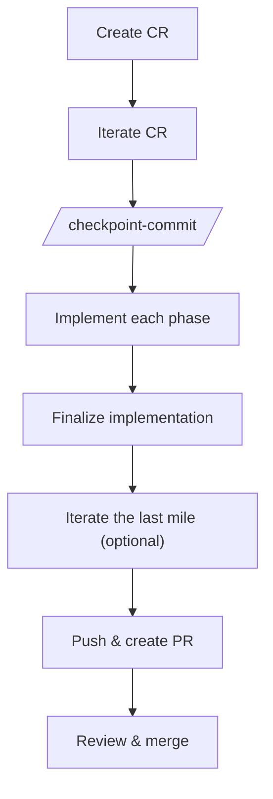
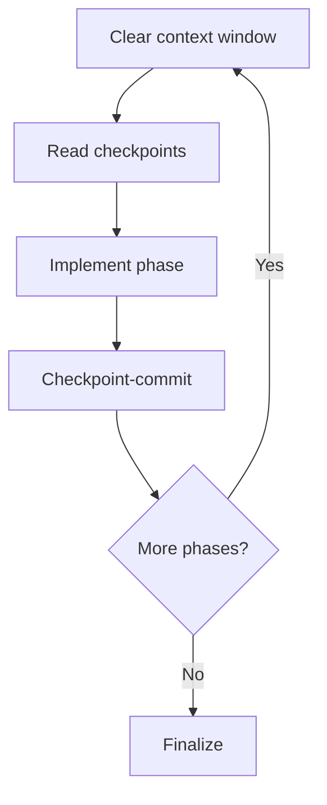
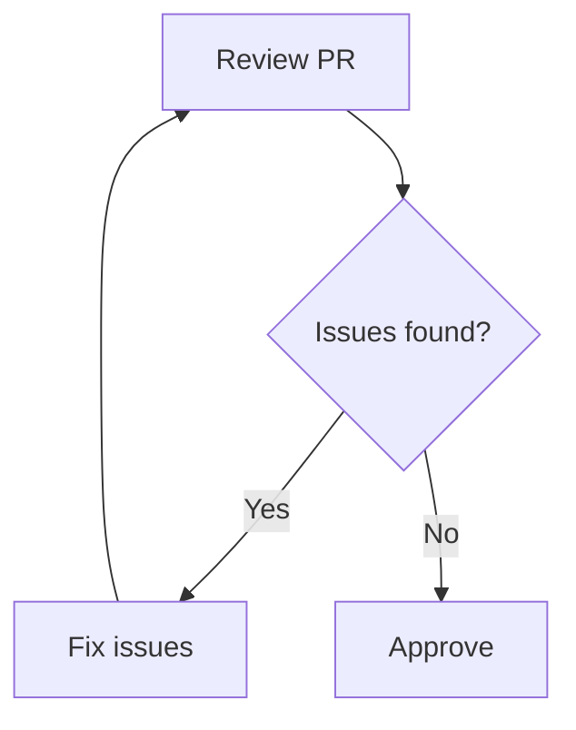
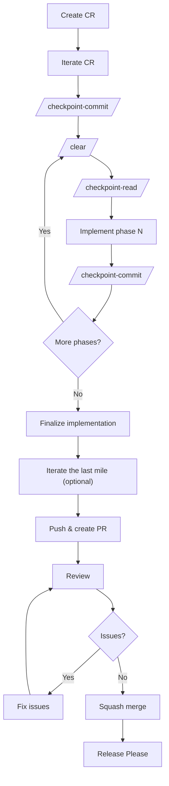

# Implementation Workflow

This document describes the end-to-end workflow for implementing changes in this repository using AI agents, Change Requests (CRs), and checkpoint commits.

### Overview

```mermaid
flowchart TD
    A[Create CR] --> B[Iterate CR]
    B --> C[/checkpoint-commit/]
    C --> D[Implement each phase]
    D --> E[Finalize implementation]
    E --> F["Iterate the last mile (optional)"]
    F --> G[Push & create PR]
    G --> H[Review & merge]
```

### Step 1: Create a Change Request

Ask the AI agent to create a CR for the desired change. The CR captures motivation, current state, proposed changes, and a phased implementation plan.

**Prompt:**
> Create a CR for \<description of the desired change\>

### Step 2: Iterate the CR

Review the generated CR and refine it until it meets quality standards. This can be zero-shot (accepted on first attempt) but is typically few-shot (a few rounds of feedback).

**Prompt (repeat as needed):**
> \<feedback on the CR\>

### Step 3: Checkpoint-commit the finalized CR

Once the CR is finalized, create a checkpoint commit to preserve it.

**Prompt:**
> /checkpoint-commit

### Step 4: Implement each phase

For each phase defined in the CR, execute the following sub-steps in a clean context window:

```mermaid
flowchart TD
    A[Clear context window] --> B[Read checkpoints]
    B --> C[Implement phase]
    C --> D[Checkpoint-commit]
    D --> E{More phases?}
    E -->|Yes| A
    E -->|No| F[Finalize]
```

#### 4a. Clear the context window

Start with a fresh context to avoid confusion from prior conversation.

**Action:**
> /clear

#### 4b. Read checkpoint history

Recover context from previous work by reading checkpoint commits.

**Prompt:**
> /checkpoint-read

#### 4c. Implement the phase

Direct the agent to systematically implement the current phase.

**Prompt:**
> Systematically implement phase {phase number} of @path/to/cr.md

#### 4d. Checkpoint-commit

Preserve the phase's work with a checkpoint commit.

**Prompt:**
> /checkpoint-commit

Repeat steps 4a–4d for each phase in the CR.

### Step 5: Finalize the implementation

After all phases are complete, run a finalization pass to ensure everything is consistent and complete.

**Prompt:**
> Finalize the implementation of @path/to/cr.md

### Step 6: Iterate the last mile (optional)

A Change Request is written before the code exists, so the delivered implementation is usually approximately right rather than exactly right. Closing that final gap is an interactive loop: you name what to try next, the agent makes the change and reports the evidence, you render the verdict. When you have looked at the finalized result and judged it not yet right, open a **last-mile iteration session** to work that gap while it is recorded rather than forgotten.

The session is opt-in and user-initiated — it is never started automatically. It maintains a ledger beside the Change Request that records every attempt, including the ones that were tried and abandoned, which are the observations the commit history alone would lose.

#### 6a. Open a session

Open (or resume) a session against the implemented Change Request.

**Prompt:**
> /checkpoint-iterate CR-XXXX

The agent creates a ledger at `docs/cr/CR-XXXX-iterate.md` (or resumes the open one), then awaits the next thing to try.

#### 6b. Iterate

Name each thing to try. The agent makes the change, runs the tests, and reports the evidence before asking for your verdict. You render the verdict; the agent records it and commits:

- **kept** — the attempt worked and survives in full.
- **discarded** — the attempt did not work and is reverted in the working tree; the ledger entry is retained as anti-pattern evidence.
- **partially-kept** — part survives; the entry records which part was kept and which was reverted.

Each session commit uses the scoped subject `checkpoint(CR-XXXX-iterate): {summary}`, so session work stays visible to `/checkpoint-read` while remaining separable from the core implementation commits. The ledger survives context loss: after a `/clear`, the same invocation re-hydrates the session from the ledger alone.

#### 6c. Close and distil

When the gap is closed, close the session. The agent distils the ledger into recommended patterns and anti-patterns and hands them to the distillation workflow, which routes durable practices into the project's standing instructions.

**Prompt:**
> /checkpoint-iterate close CR-XXXX

Use `/checkpoint-iterate status CR-XXXX` at any point to report the active session, its attempt count, and its dispositions so far. See the [checkpoint-iterate skill](skills/checkpoint-iterate/SKILL.md) for the full protocol, including concurrency rules for running sessions in separate Git worktrees.

### Step 7: Push and create a PR

Push the branch and create a pull request.

**Prompt:**
> git push and create a pr

### Step 8: Review

Review the PR for correctness, completeness, and adherence to project standards.

### Step 9: Fix any issues

If the review surfaces issues, fix them and return to step 7.

```mermaid
flowchart TD
    A[Review PR] --> B{Issues found?}
    B -->|Yes| C[Fix issues]
    C --> A
    B -->|No| D[Approve]
```

### Step 10: Merge the PR

Squash merge the PR into `main`. The PR title becomes the commit message and must follow [Conventional Commits](https://www.conventionalcommits.org/).

### Step 11: Release

[Release Please](https://github.com/googleapis/release-please) automatically creates a release PR based on conventional commit messages. Merge the release PR to publish the new version.

### Complete Workflow

```mermaid
flowchart TD
    A[Create CR] --> B[Iterate CR]
    B --> C[/checkpoint-commit/]
    C --> D[/clear/]
    D --> E[/checkpoint-read/]
    E --> F["Implement phase N"]
    F --> G[/checkpoint-commit/]
    G --> H{More phases?}
    H -->|Yes| D
    H -->|No| I[Finalize implementation]
    I --> P["Iterate the last mile (optional)"]
    P --> J[Push & create PR]
    J --> K[Review]
    K --> L{Issues?}
    L -->|Yes| M[Fix issues]
    M --> K
    L -->|No| N[Squash merge]
    N --> O[Release Please]
```
