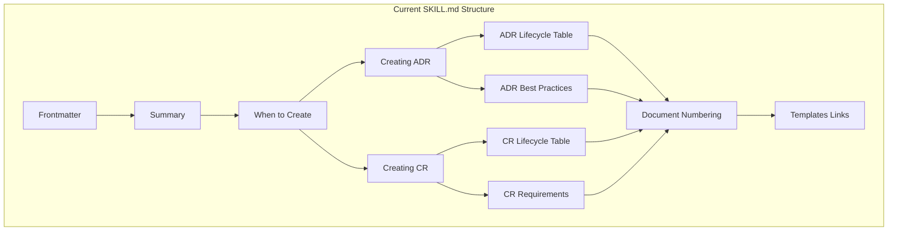
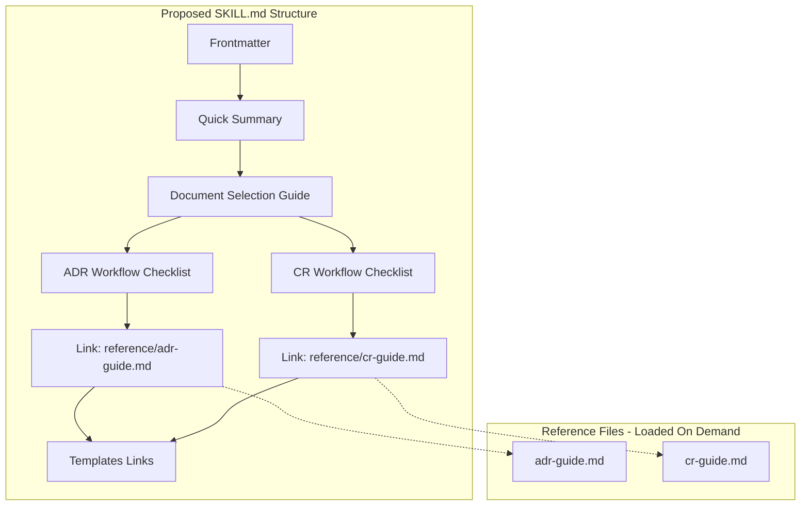
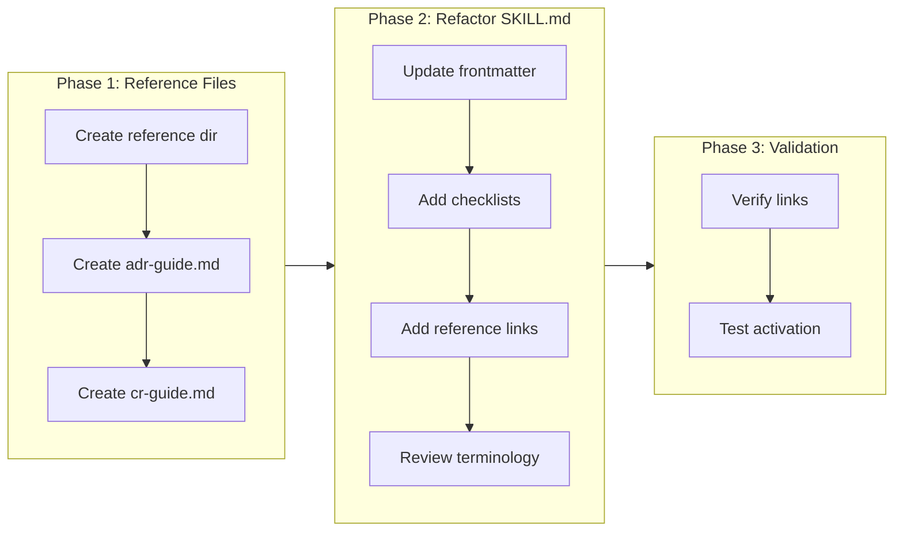

# Refactor Governance Skill to Follow Best Practices

## Change Summary

The `skills/governance/SKILL.md` file needs refactoring to align with Anthropic's agent skill and prompt engineering best practices documented in `docs/anthropic/`. The current implementation is functional but does not fully leverage progressive disclosure patterns, optimal description formatting, or workflow checklists that improve Claude's ability to discover and execute the skill effectively.

## Motivation and Background

Anthropic has published comprehensive best practices for authoring agent skills that maximize Claude's effectiveness. The governance skill was created before these guidelines were fully integrated into the project. Applying these best practices will:

1. Improve skill discovery through better-formatted descriptions with explicit triggers
2. Reduce token usage through progressive disclosure patterns
3. Increase reliability through workflow checklists
4. Enhance clarity through consistent terminology and structure

## Change Drivers

* Alignment with Anthropic's official agent skill best practices (`docs/anthropic/agent-skills-best-practices.md`)
* Improved skill discovery and activation accuracy
* Better prompt engineering patterns (`docs/anthropic/prompt-engineering-*.md`)
* Reduced context window consumption through progressive disclosure

## Current State

The current `skills/governance/SKILL.md` (105 lines) has the following characteristics:

### Current Frontmatter

```yaml
---
name: governance
description: Creates Architecture Decision Records (ADRs) and Change Requests (CRs) for project governance. Use when making architectural decisions, documenting technology choices, or requesting changes to project requirements, features, or scope.
metadata:
  author: desek
  version: "1.0"
---
```

### Current Structure

1. Title and summary paragraph
2. "When to Create Documents" section with ADR and CR triggers
3. "Creating an ADR" section with steps and lifecycle table
4. "Creating a CR" section with steps and lifecycle table
5. "Document Numbering" section
6. "Templates" section with links

### Current Issues

1. **Description format**: While functional, could include more specific trigger keywords
2. **No workflow checklists**: Steps are listed but not in a copyable checklist format
3. **Inline content**: All content is in SKILL.md rather than using progressive disclosure
4. **No explicit degrees of freedom**: Instructions don't clarify what Claude can adapt vs. must follow exactly

### Current State Diagram



## Proposed Change

Refactor `skills/governance/SKILL.md` to follow Anthropic's best practices while maintaining all existing functionality.

### Key Changes

1. **Enhanced description**: Add more trigger keywords and use third-person consistently
2. **Workflow checklists**: Convert step lists to copyable checklists for ADR and CR creation
3. **Progressive disclosure**: Move detailed lifecycle tables and best practices to separate reference files
4. **Degrees of freedom**: Clarify which instructions are strict vs. flexible
5. **Consistent terminology**: Ensure terms are used consistently throughout

### Proposed Structure

```
skills/governance/
├── SKILL.md              # Main instructions (streamlined, ~80 lines)
├── reference/
│   ├── adr-guide.md      # ADR lifecycle, best practices, examples
│   └── cr-guide.md       # CR lifecycle, requirements, examples
└── templates/
    ├── ADR.md            # (existing)
    └── CR.md             # (existing)
```

### Proposed State Diagram



## Requirements

### Functional Requirements

1. The refactored SKILL.md **MUST** maintain all existing functionality for creating ADRs and CRs
2. The skill **MUST** include workflow checklists that Claude can copy and track progress
3. The skill **MUST** use progressive disclosure by moving detailed reference content to separate files
4. The description **MUST** be written in third person and include explicit trigger keywords
5. The skill **MUST** clearly indicate degrees of freedom (what is strict vs. flexible)
6. All file references **MUST** be one level deep from SKILL.md (no nested references)
7. The skill **MUST** use consistent terminology throughout all files

### Non-Functional Requirements

1. The main SKILL.md **MUST** be under 100 lines to optimize token usage
2. Reference files **MUST** include a table of contents if over 100 lines
3. The skill **MUST** follow the naming convention using lowercase letters, numbers, and hyphens only

## Affected Components

* `skills/governance/SKILL.md` - Main skill file (modified)
* `skills/governance/reference/adr-guide.md` - New reference file
* `skills/governance/reference/cr-guide.md` - New reference file
* `skills/governance/templates/ADR.md` - Unchanged
* `skills/governance/templates/CR.md` - Unchanged

## Scope Boundaries

### In Scope

* Refactoring `SKILL.md` structure and content
* Creating new reference files for progressive disclosure
* Updating frontmatter description with better triggers
* Adding workflow checklists for ADR and CR creation
* Ensuring consistent terminology

### Out of Scope ("Here, But Not Further")

* Modifying ADR template content (`templates/ADR.md`)
* Modifying CR template content (`templates/CR.md`)
* Adding new document types beyond ADR and CR
* Changing the fundamental governance workflow or requirements
* Adding executable scripts to the skill

## Alternative Approaches Considered

* **Keep single file, just improve description**: Rejected because it doesn't leverage progressive disclosure benefits
* **Split into separate ADR and CR skills**: Rejected because they share common governance context and are better as one skill
* **Add extensive examples inline**: Rejected because it would increase token usage; examples belong in reference files

## Impact Assessment

### User Impact

Users will experience:
- More reliable skill activation when requesting governance documents
- Clearer workflow guidance through checklists
- Same end result (ADRs and CRs) with improved process

No retraining required as the fundamental workflow remains unchanged.

### Technical Impact

- No breaking changes to existing governance documents
- New reference files added to skill directory
- Slightly different file structure within the skill folder
- No dependencies affected

### Business Impact

- Improved documentation quality through better-guided workflows
- Reduced errors in governance document creation
- Better alignment with industry best practices
- Minimal implementation effort (documentation refactoring only)

## Implementation Approach

### Phase 1: Create Reference Files

1. Create `skills/governance/reference/` directory
2. Extract ADR lifecycle, best practices, and detailed guidance to `adr-guide.md`
3. Extract CR lifecycle, requirements, and detailed guidance to `cr-guide.md`
4. Add table of contents to each reference file

### Phase 2: Refactor SKILL.md

1. Update frontmatter description with improved triggers
2. Streamline summary section
3. Convert ADR creation steps to workflow checklist
4. Convert CR creation steps to workflow checklist
5. Add links to reference files
6. Add degrees of freedom indicators
7. Ensure consistent terminology

### Phase 3: Validation

1. Verify all links work correctly
2. Test skill activation with various prompts
3. Confirm workflow checklists are copyable and functional

### Implementation Flow



## Test Strategy

### Tests to Add

This CR involves documentation changes only. Validation is performed through manual review and skill activation testing.

| Test Type | Description | Validation Method |
|-----------|-------------|-------------------|
| Link validation | All markdown links resolve correctly | Manual verification |
| Skill activation | Skill triggers on governance-related prompts | Manual testing with Claude |
| Checklist functionality | Checklists can be copied and used | Manual verification |
| Content completeness | All original functionality preserved | Comparison review |

### Tests to Modify

Not applicable - no existing automated tests for skill documentation.

### Tests to Remove

Not applicable - no existing automated tests for skill documentation.

## Acceptance Criteria

### AC-1: Enhanced Description with Triggers

```gherkin
Given the refactored SKILL.md
When Claude evaluates whether to activate the governance skill
Then the description includes explicit trigger keywords: "ADR", "architecture decision", "CR", "change request", "governance", "technical decision", "requirement change"
  And the description is written in third person
```

### AC-2: Workflow Checklists for ADR Creation

```gherkin
Given a user requests to create an ADR
When Claude reads the governance skill
Then Claude finds a copyable checklist with all ADR creation steps
  And the checklist includes: read template, create file, fill sections, set status
```

### AC-3: Workflow Checklists for CR Creation

```gherkin
Given a user requests to create a CR
When Claude reads the governance skill
Then Claude finds a copyable checklist with all CR creation steps
  And the checklist includes: read template, create file, fill sections, set status
```

### AC-4: Progressive Disclosure Structure

```gherkin
Given the refactored skill structure
When Claude needs detailed ADR or CR guidance
Then Claude can access reference files via one-level-deep links
  And reference files contain lifecycle tables and best practices
  And SKILL.md remains under 100 lines
```

### AC-5: Reference Files Have Table of Contents

```gherkin
Given reference files over 100 lines
When Claude opens a reference file
Then the file begins with a table of contents listing all sections
```

### AC-6: Consistent Terminology

```gherkin
Given all skill files
When reviewing terminology usage
Then "ADR" is used consistently (not "architecture decision record" inline)
  And "CR" is used consistently (not "change request" inline after first mention)
  And document statuses use identical terms across all files
```

### AC-7: All Original Functionality Preserved

```gherkin
Given the refactored skill
When comparing to the original skill functionality
Then all ADR creation guidance is preserved
  And all CR creation guidance is preserved
  And all lifecycle statuses are documented
  And all template links are functional
```

## Quality Standards Compliance

### Build & Compilation

- [x] Not applicable - documentation only changes

### Linting & Code Style

- [ ] Markdown files pass linting (if configured)
- [ ] Consistent heading levels used
- [ ] Consistent list formatting used

### Test Execution

- [ ] All acceptance criteria manually verified
- [ ] Skill activation tested with sample prompts

### Documentation

- [ ] SKILL.md updated with improved structure
- [ ] Reference files created with complete content
- [ ] All internal links verified

### Code Review

- [ ] Changes submitted via pull request
- [ ] PR title follows Conventional Commits format: `docs(governance): refactor skill to follow best practices`
- [ ] Code review completed and approved
- [ ] Changes squash-merged to maintain linear history

### Verification Commands

```bash
# Verify markdown structure (if markdownlint is available)
markdownlint skills/governance/**/*.md

# Verify all links are valid (manual check)
# Open each .md file and verify links resolve

# Verify line count of SKILL.md
wc -l skills/governance/SKILL.md
# Expected: under 100 lines
```

## Risks and Mitigation

### Risk 1: Skill activation regression

**Likelihood:** low
**Impact:** medium
**Mitigation:** Test skill activation with various prompts before and after changes; keep original description keywords

### Risk 2: Missing content in refactoring

**Likelihood:** low
**Impact:** medium
**Mitigation:** Create checklist of all original content; verify each item exists in refactored structure

### Risk 3: Broken internal links

**Likelihood:** low
**Impact:** low
**Mitigation:** Manually verify all links after implementation; use relative paths consistently

## Dependencies

* None - this is a standalone documentation refactoring

## Estimated Effort

| Task | Effort |
|------|--------|
| Create reference directory and files | 1 hour |
| Refactor SKILL.md | 1 hour |
| Validation and testing | 30 minutes |
| **Total** | **2.5 hours** |

## Decision Outcome

Chosen approach: "Progressive disclosure with workflow checklists", because it aligns with Anthropic's official best practices, reduces token usage while maintaining functionality, and improves Claude's ability to guide users through governance document creation.

## Related Items

* Source best practices: `docs/anthropic/agent-skills-best-practices.md`
* Prompt engineering guides: `docs/anthropic/prompt-engineering-*.md`
* Current skill: `skills/governance/SKILL.md`
* Templates: `skills/governance/templates/ADR.md`, `skills/governance/templates/CR.md`
