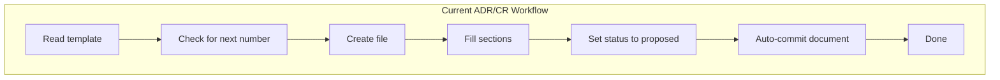
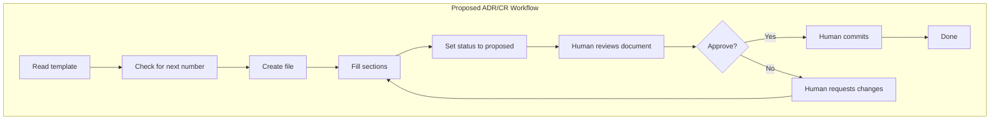
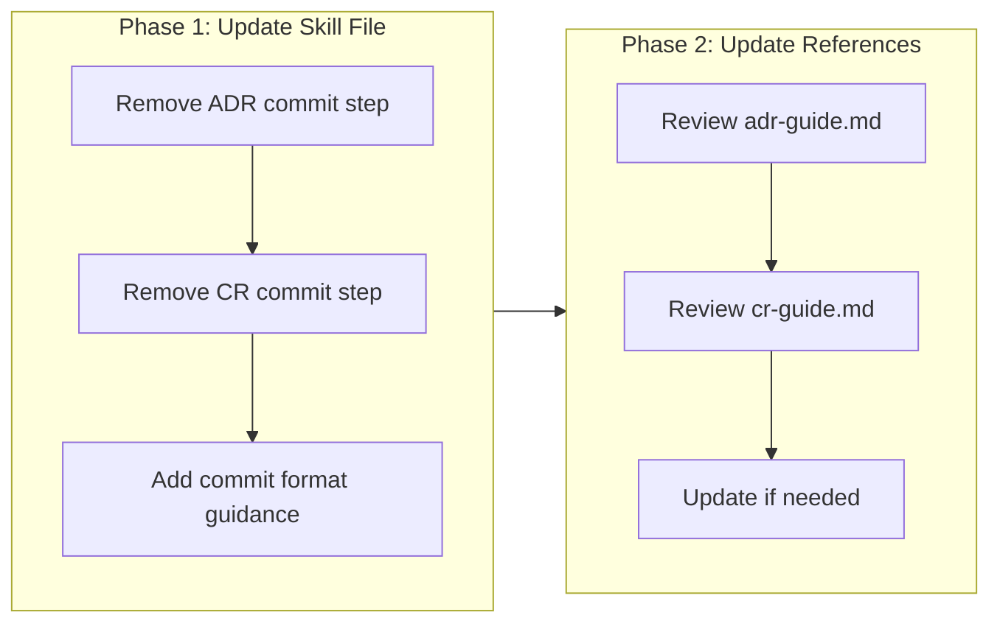

# Remove Auto-Commit from Governance Skill Workflows

## Change Summary

The governance skill currently instructs agents to commit ADRs and CRs as part of the workflow checklists. This change request proposes removing the commit steps from both ADR and CR workflows, leaving the decision to commit to the human in the loop. The rationale is that governance documents are typically good enough on the first iteration and don't require automatic commits that bypass human review.

## Motivation and Background

When an agent creates an ADR or CR, the current workflow includes a final step to commit the document with a conventional commit message. However, this automatic commit behavior has several drawbacks:

1. **Bypasses human review**: The human in the loop should have the opportunity to review the generated document before it becomes part of the git history.
2. **First iteration quality**: ADRs and CRs generated by agents are typically comprehensive and well-structured on the first attempt, making immediate commits unnecessary.
3. **Flexibility**: Humans may want to make minor adjustments, combine multiple documents in a single commit, or use different commit messages.
4. **Git hygiene**: Automatic commits can lead to unnecessary commit noise if the document needs revision.

## Change Drivers

* Human-in-the-loop principle: Governance documents should be reviewed before committing
* Workflow flexibility: Allow humans to control when and how documents are committed
* Reduced commit noise: Avoid potential fix-up commits for minor adjustments

## Current State

The governance skill (`skills/governance/SKILL.md`) contains two workflow checklists that include commit steps:

**ADR Workflow (lines 24-31):**
```
- [ ] Read the template: templates/ADR.md
- [ ] Check docs/adr/ for the next available number
- [ ] Create file: docs/adr/ADR-NNNN-{short-title}.md
- [ ] Fill in all required sections
- [ ] Set status to "proposed"
- [ ] Commit with message: docs(adr): add ADR-NNNN {title}
```

**CR Workflow (lines 47-55):**
```
- [ ] Read the template: templates/CR.md
- [ ] Check docs/cr/ for the next available number
- [ ] Create file: docs/cr/CR-NNNN-{short-title}.md
- [ ] Fill in all required sections
- [ ] Write acceptance criteria in Gherkin format
- [ ] Set status to "proposed"
- [ ] Commit with message: docs(cr): add CR-NNNN {title}
```

### Current State Diagram



## Proposed Change

Remove the commit step from both ADR and CR workflow checklists. The workflows will end after setting the status to "proposed", leaving the commit decision to the human reviewer.

**Proposed ADR Workflow:**
```
- [ ] Read the template: templates/ADR.md
- [ ] Check docs/adr/ for the next available number
- [ ] Create file: docs/adr/ADR-NNNN-{short-title}.md
- [ ] Fill in all required sections
- [ ] Set status to "proposed"
```

**Proposed CR Workflow:**
```
- [ ] Read the template: templates/CR.md
- [ ] Check docs/cr/ for the next available number
- [ ] Create file: docs/cr/CR-NNNN-{short-title}.md
- [ ] Fill in all required sections
- [ ] Write acceptance criteria in Gherkin format
- [ ] Set status to "proposed"
```

### Proposed State Diagram



## Requirements

### Functional Requirements

1. The ADR workflow checklist **MUST** not include a commit step
2. The CR workflow checklist **MUST** not include a commit step
3. The skill **MUST** still provide the recommended commit message format in documentation for human reference

### Non-Functional Requirements

1. The change **MUST** maintain backward compatibility with existing ADRs and CRs
2. The documentation **MUST** clearly indicate that committing is the human's responsibility

## Affected Components

* `skills/governance/SKILL.md` - Main skill file containing workflow checklists
* `skills/governance/reference/adr-guide.md` - May contain commit instructions (to be verified)
* `skills/governance/reference/cr-guide.md` - May contain commit instructions (to be verified)

## Scope Boundaries

### In Scope

* Removing commit steps from ADR workflow checklist in `SKILL.md`
* Removing commit steps from CR workflow checklist in `SKILL.md`
* Updating any reference documentation that mentions auto-commit behavior
* Adding guidance for recommended commit message formats (for human reference)

### Out of Scope ("Here, But Not Further")

* Changes to ADR or CR templates - templates remain unchanged
* Changes to the document structure or required sections
* Automation of human review process
* Changes to other governance workflows not related to committing

## Impact Assessment

### User Impact

Users (humans in the loop) will now be responsible for committing ADRs and CRs after reviewing them. This provides more control but requires an additional manual step. The impact is positive as it aligns with the principle of human oversight for governance documents.

### Technical Impact

Minimal technical impact. The change only affects documentation/instructions within the skill file. No code changes, no breaking changes to existing documents, and no migration required.

### Business Impact

Improved governance document quality through human review before commit. Reduced risk of committing incomplete or incorrect governance documents. No negative business impact expected.

## Implementation Approach

The implementation is straightforward and consists of a single phase:

1. Edit `skills/governance/SKILL.md` to remove commit steps from both workflow checklists
2. Review and update reference guides if they contain commit instructions
3. Add a note about recommended commit message format for human reference

### Implementation Flow



## Test Strategy

### Tests to Add

This change is documentation-only and does not involve code changes. No automated tests are required.

| Test File | Test Name | Description | Inputs | Expected Output |
|-----------|-----------|-------------|--------|-----------------|
| N/A | Manual verification | Verify workflow checklists no longer contain commit steps | Read SKILL.md | No commit steps in checklists |

### Tests to Modify

Not applicable - no existing tests for documentation content.

### Tests to Remove

Not applicable - no tests to remove.

## Acceptance Criteria

### AC-1: ADR workflow does not include commit step

```gherkin
Given the governance skill SKILL.md file
When an agent reads the ADR workflow checklist
Then the checklist does not contain a commit step
  And the checklist ends with "Set status to proposed"
```

### AC-2: CR workflow does not include commit step

```gherkin
Given the governance skill SKILL.md file
When an agent reads the CR workflow checklist
Then the checklist does not contain a commit step
  And the checklist ends with "Set status to proposed"
```

### AC-3: Commit message format guidance is available

```gherkin
Given the governance skill documentation
When a human wants to commit an ADR or CR
Then they can find the recommended commit message format in the documentation
  And the format follows Conventional Commits specification
```

### AC-4: Reference guides are consistent

```gherkin
Given the governance skill reference guides
When reviewing adr-guide.md and cr-guide.md
Then neither guide instructs agents to auto-commit documents
  And both guides indicate committing is the human's responsibility
```

## Quality Standards Compliance

### Build & Compilation

- [x] Code compiles/builds without errors (N/A - documentation only)
- [x] No new compiler warnings introduced (N/A - documentation only)

### Linting & Code Style

- [x] All linter checks pass with zero warnings/errors (N/A - documentation only)
- [x] Code follows project coding conventions and style guides
- [x] Any linter exceptions are documented with justification (N/A)

### Test Execution

- [x] All existing tests pass after implementation (N/A - documentation only)
- [x] All new tests pass (N/A - documentation only)
- [x] Test coverage meets project requirements for changed code (N/A)

### Documentation

- [x] Inline code documentation updated where applicable
- [x] API documentation updated for any API changes (N/A)
- [x] User-facing documentation updated if behavior changes

### Code Review

- [ ] Changes submitted via pull request
- [ ] PR title follows Conventional Commits format
- [ ] Code review completed and approved
- [ ] Changes squash-merged to maintain linear history

### Verification Commands

```bash
# Verify SKILL.md does not contain commit instructions in checklists
grep -n "Commit with message" skills/governance/SKILL.md
# Expected: No output (no matches)

# Verify commit format guidance exists
grep -n "commit" skills/governance/SKILL.md
# Expected: Reference to commit format in guidance section
```

## Risks and Mitigation

### Risk 1: Humans forget to commit documents

**Likelihood:** low
**Impact:** low
**Mitigation:** Documents remain as uncommitted changes in the working directory, which is visible in git status. Humans will notice uncommitted files during their normal workflow.

### Risk 2: Inconsistent commit messages

**Likelihood:** medium
**Impact:** low
**Mitigation:** Provide clear guidance on recommended commit message format in the documentation. The Conventional Commits format is already established in the project's AGENTS.md.

## Dependencies

* None - this is a standalone documentation change

## Estimated Effort

* **Total effort:** 1-2 hours
* **Breakdown:**
  - Update SKILL.md: 30 minutes
  - Review and update reference guides: 30 minutes
  - Testing and verification: 30 minutes
  - Documentation and CR creation: 30 minutes (completed)

## Decision Outcome

Chosen approach: "Remove commit steps from workflow checklists and add commit format guidance", because it provides the best balance between human oversight and workflow efficiency. The human in the loop retains full control over when and how governance documents are committed, while still having access to the recommended commit message format.

## Related Items

* Links to architecture decisions: N/A
* Links to issues/tickets: N/A
* Links to pull requests: TBD (to be created after CR approval)
* Links to documentation: skills/governance/SKILL.md
