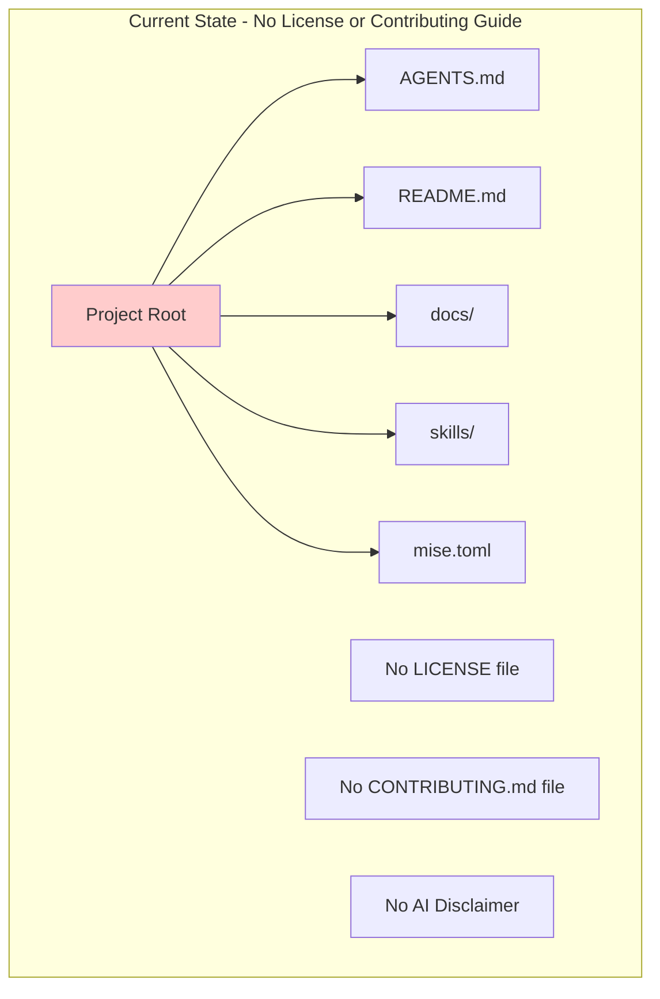
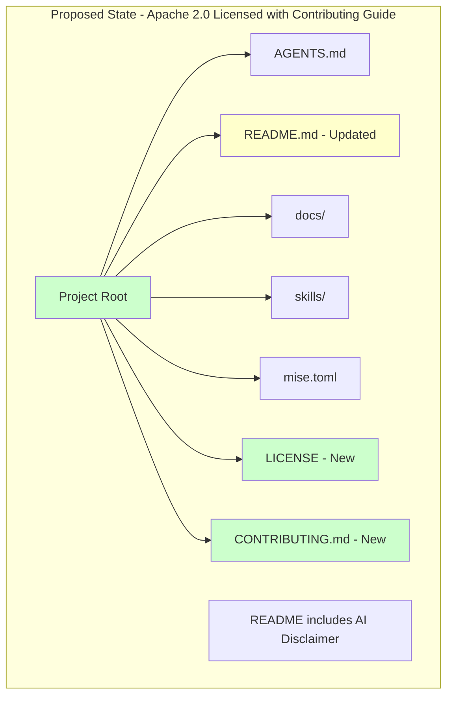
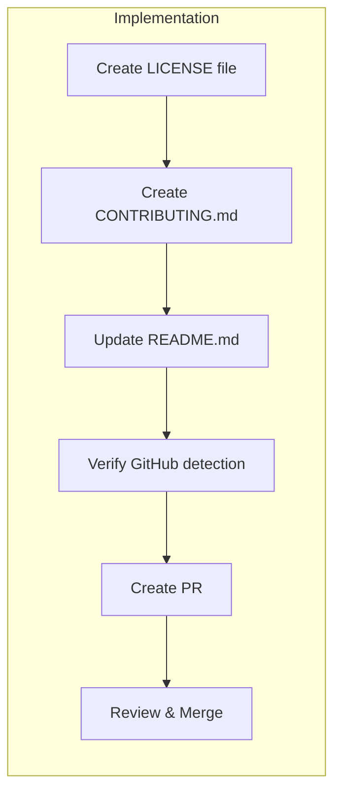

# Add Apache 2.0 License, Contributing Guidelines, and AI Disclaimer to Project

## Change Summary

This change request proposes adding the Apache License, Version 2.0, a CONTRIBUTING.md file, and an AI Disclaimer to the governance project. Currently, the project has no license file, which means all rights are reserved by default and the code cannot be legally used, modified, or distributed by others. Additionally, there are no documented contribution guidelines for potential contributors, and no disclaimer about AI-generated content. Adding the Apache 2.0 license will establish clear terms for open-source usage while providing patent protection for contributors and users. The CONTRIBUTING.md file will provide clear guidance for community members who wish to contribute to the project. The AI Disclaimer will inform users that this project uses AI and may produce inaccurate results, encouraging verification of critical outputs.

## Motivation and Background

Open-source projects require explicit licensing to enable community participation and legal clarity. Without a license, potential contributors cannot legally contribute code, and users cannot legally use or distribute the software. The Apache 2.0 license is a permissive license that encourages adoption while protecting both the project maintainers and contributors through explicit patent grants and liability limitations.

The Apache 2.0 license is widely recognized and trusted in the open-source community, used by major projects including Kubernetes, TensorFlow, and Apache Software Foundation projects. It provides a good balance between permissiveness and protection, making it suitable for governance documentation and tooling projects.

Beyond licensing, successful open-source projects provide clear contribution guidelines. A CONTRIBUTING.md file serves as the entry point for new contributors, explaining how to report issues, submit changes, and follow project conventions. This reduces friction for contributors and helps maintain consistent quality across contributions.

As this project involves AI-powered skills and tooling, it is important to set appropriate expectations for users. An AI Disclaimer in the README helps users understand that AI-generated outputs may contain inaccuracies and should be verified before use in critical contexts. This transparency builds trust and encourages responsible use of the project.

## Change Drivers

* **Legal compliance**: Projects without licenses have implicit "all rights reserved" status, preventing legal use
* **Community enablement**: Contributors need clear licensing terms before they can legally contribute
* **Industry standard**: Apache 2.0 is a well-understood, OSI-approved license with broad acceptance
* **Patent protection**: Apache 2.0 includes explicit patent grants, protecting users and contributors
* **Compatibility**: Apache 2.0 is compatible with many other open-source licenses, enabling integration
* **Contributor onboarding**: Clear contribution guidelines reduce barriers for new contributors
* **Quality consistency**: Documented processes help maintain consistent quality across contributions
* **AI transparency**: Users need to understand that AI-generated content may be inaccurate
* **Responsible use**: Clear disclaimers encourage verification of critical outputs

## Current State

The project currently has no license file or licensing information. This means:

1. All rights are reserved by the copyright holder(s)
2. No one can legally copy, distribute, or modify the code
3. Contributors have no clarity on how their contributions will be licensed
4. Users cannot legally incorporate this project into their own work

Additionally, the project lacks a CONTRIBUTING.md file, which means:

1. New contributors have no guidance on how to participate
2. There are no documented standards for code style, commit messages, or pull requests
3. The process for reporting issues or suggesting features is unclear
4. Contributors may not understand the project's workflow expectations

Furthermore, the project lacks an AI Disclaimer, which means:

1. Users may not be aware that AI is used in the project
2. Users may place undue trust in AI-generated outputs
3. There is no guidance to verify critical outputs
4. The project does not set appropriate expectations for AI accuracy

### Current Project Structure



## Proposed Change

Add Apache License, Version 2.0, contribution guidelines, and AI Disclaimer to the project by:

1. Creating a `LICENSE` file in the project root containing the full Apache 2.0 license text
2. Creating a `CONTRIBUTING.md` file in the project root with contribution guidelines
3. Updating `README.md` to include a license section, reference to contribution guidelines, and AI Disclaimer
4. Optionally adding license headers to source files (recommended but not required for Apache 2.0)

The Apache 2.0 license grants users the right to use, reproduce, modify, and distribute the software, with the following conditions:
- License and copyright notice must be included
- Changes must be documented
- Patent rights are granted
- Trademark rights are not granted

The CONTRIBUTING.md file will include:
- How to report bugs and request features
- How to submit pull requests
- Code style and commit message conventions
- Development setup instructions
- Code of conduct reference (if applicable)
- Licensing of contributions

The AI Disclaimer will include:
- Clear statement that the project uses AI
- Warning that AI may produce inaccurate results
- Recommendation to verify all critical outputs

Example AI Disclaimer text for README.md:

> **AI Disclaimer**: This skill uses AI and may produce inaccurate results. Verify all critical outputs.

### Proposed Project Structure



## Requirements

### Functional Requirements

1. The project **MUST** include a `LICENSE` file in the root directory containing the complete Apache License, Version 2.0 text
2. The `LICENSE` file **MUST** use the official Apache 2.0 license text without modifications
3. The `README.md` file **MUST** include a "License" section that identifies the project as Apache 2.0 licensed
4. The license section in `README.md` **MUST** link to or reference the `LICENSE` file
5. The project **MUST** include a `CONTRIBUTING.md` file in the root directory
6. The `CONTRIBUTING.md` file **MUST** explain how to report issues
7. The `CONTRIBUTING.md` file **MUST** explain how to submit pull requests
8. The `CONTRIBUTING.md` file **MUST** reference the project's commit message conventions (Conventional Commits)
9. The `CONTRIBUTING.md` file **MUST** state that contributions are licensed under Apache 2.0
10. The `README.md` file **MUST** include a "Contributing" section that references the `CONTRIBUTING.md` file
11. The `README.md` file **MUST** include an "AI Disclaimer" section
12. The AI Disclaimer **MUST** state that the project uses AI and may produce inaccurate results
13. The AI Disclaimer **MUST** recommend verifying all critical outputs

### Non-Functional Requirements

1. The `LICENSE` file **MUST** be a plain text file readable without special tools
2. The license information **MUST** be easily discoverable by users and automated license scanning tools
3. The implementation **MUST** follow standard open-source licensing conventions for file placement and naming
4. The `CONTRIBUTING.md` file **MUST** be written in clear, accessible language
5. The `CONTRIBUTING.md` file **MUST** follow standard Markdown formatting conventions
6. The contribution guidelines **MUST** be consistent with the project's existing AGENTS.md guidelines
7. The AI Disclaimer **MUST** be prominently placed in the README.md for easy discovery

## Affected Components

* `LICENSE` - New file to be created in project root
* `CONTRIBUTING.md` - New file to be created in project root
* `README.md` - Existing file to be updated with license, contributing, and AI Disclaimer sections
* Project metadata - License will be discoverable by GitHub and other platforms

## Scope Boundaries

### In Scope

* Creating the `LICENSE` file with Apache 2.0 license text
* Creating the `CONTRIBUTING.md` file with contribution guidelines
* Updating `README.md` to include license, contributing, and AI Disclaimer information
* Ensuring license is properly recognized by GitHub
* Documenting the pull request and commit message workflow
* Adding AI Disclaimer to set appropriate expectations for users

### Out of Scope ("Here, But Not Further")

* Adding license headers to individual source files - deferred to future consideration
* Creating a `NOTICE` file for third-party attributions - not currently needed as project has no third-party dependencies
* Contributor License Agreement (CLA) setup - may be addressed in future CR if needed
* License compliance tooling or automation - separate concern for future consideration
* Code of Conduct creation - may be addressed in a separate CR if needed
* Issue and PR templates - may be addressed in a separate CR if needed
* Automated contribution checks or CI/CD pipelines - separate concern for future consideration

## Alternative Approaches Considered

* **MIT License**: More permissive but lacks explicit patent grant protection. Rejected because Apache 2.0 provides better protection for contributors and users.
* **GPL v3**: Strong copyleft license that requires derivative works to also be open source. Rejected because it may limit adoption in commercial settings.
* **BSD 3-Clause**: Similar to MIT but with explicit non-endorsement clause. Rejected because Apache 2.0 provides more comprehensive terms including patent protection.
* **Creative Commons**: Better suited for documentation and creative works, not software. Rejected because this project contains code and tooling.
* **No License (Status Quo)**: Maintains all rights reserved. Rejected because it prevents community participation and legal use.

## Impact Assessment

### User Impact

Users will gain clear legal rights to use, modify, and distribute the project. This is a positive change that enables:
- Legal use of the governance templates and tools
- Integration into other projects (both open-source and commercial)
- Forking and modification for custom needs
- Confidence in the legal status of the project

No negative user impact is expected. Users who were previously using the project without a license will now have explicit permission to do so.

### Technical Impact

Minimal technical impact:
- Three files will be added/modified (`LICENSE`, `CONTRIBUTING.md`, and `README.md`)
- No code changes required
- No breaking changes to existing functionality
- GitHub will automatically detect and display the license

### Business Impact

Positive business impact:
- Enables broader adoption of the governance framework
- Reduces legal risk for organizations using the project
- Aligns with open-source best practices
- No cost associated with Apache 2.0 licensing

## Implementation Approach

The implementation is straightforward and can be completed in a single phase:

### Phase 1: Add License and Contributing Files

1. Create `LICENSE` file with official Apache 2.0 text
2. Create `CONTRIBUTING.md` file with contribution guidelines
3. Update `README.md` with license and contributing sections
4. Verify GitHub recognizes the license
5. Create pull request following project conventions

### Implementation Flow



## Test Strategy

### Tests to Add

This change does not involve code changes, so no automated tests are required. However, manual verification steps are defined below.

| Verification | Method | Description | Expected Result |
|--------------|--------|-------------|-----------------|
| LICENSE file exists | Manual | Check project root for LICENSE file | File exists with correct content |
| CONTRIBUTING.md exists | Manual | Check project root for CONTRIBUTING.md file | File exists with required sections |
| README.md updated | Manual | Check README.md for license, contributing, and AI Disclaimer sections | Sections exist with correct information |
| GitHub detection | Manual | Check GitHub repository page | License badge shows "Apache-2.0" |
| Contribution guidelines complete | Manual | Review CONTRIBUTING.md content | Contains issue reporting, PR process, commit conventions |
| AI Disclaimer present | Manual | Check README.md for AI Disclaimer section | Section exists with required warning text |

### Tests to Modify

Not applicable - no existing tests are affected by this documentation change.

### Tests to Remove

Not applicable - no tests need to be removed.

## Acceptance Criteria

### AC-1: LICENSE file exists with correct content

```gherkin
Given the project repository
When a user navigates to the project root directory
Then a file named "LICENSE" exists
  And the file contains the complete Apache License, Version 2.0 text
  And the license text matches the official Apache 2.0 license exactly
```

### AC-2: README.md includes license information

```gherkin
Given the project README.md file
When a user reads the README.md
Then a "License" section is present
  And the section identifies the project as licensed under Apache 2.0
  And the section references or links to the LICENSE file
```

### AC-3: GitHub recognizes the license

```gherkin
Given the project is hosted on GitHub
When a user views the repository main page
Then GitHub displays "Apache-2.0" as the detected license
  And clicking the license badge shows the license details
```

### AC-4: License file is properly formatted

```gherkin
Given the LICENSE file in the project root
When the file is opened in any text editor
Then the file is readable as plain text
  And the file uses standard line endings
  And the file does not contain any binary content
```

### AC-5: CONTRIBUTING.md file exists with required content

```gherkin
Given the project repository
When a user navigates to the project root directory
Then a file named "CONTRIBUTING.md" exists
  And the file explains how to report issues
  And the file explains how to submit pull requests
  And the file references Conventional Commits for commit messages
  And the file states that contributions are licensed under Apache 2.0
```

### AC-6: README.md includes contributing information

```gherkin
Given the project README.md file
When a user reads the README.md
Then a "Contributing" section is present
  And the section references or links to the CONTRIBUTING.md file
```

### AC-7: CONTRIBUTING.md is consistent with AGENTS.md

```gherkin
Given the CONTRIBUTING.md and AGENTS.md files
When comparing the documented conventions
Then the commit message format in CONTRIBUTING.md matches AGENTS.md
  And the branch protection rules are consistent
  And the merge strategy documentation is consistent
```

### AC-8: README.md includes AI Disclaimer

```gherkin
Given the project README.md file
When a user reads the README.md
Then an "AI Disclaimer" section is present
  And the section states that the project uses AI
  And the section warns that AI may produce inaccurate results
  And the section recommends verifying all critical outputs
```

## Quality Standards Compliance

### Build & Compilation

- [x] Not applicable - no code changes

### Linting & Code Style

- [x] Not applicable - no code changes
- [ ] Markdown files follow project conventions

### Test Execution

- [x] Not applicable - no automated tests for license files

### Documentation

- [ ] README.md updated with license section
- [ ] README.md updated with contributing section
- [ ] README.md updated with AI Disclaimer section
- [ ] LICENSE file added with complete Apache 2.0 text
- [ ] CONTRIBUTING.md file added with contribution guidelines

### Code Review

- [ ] Changes submitted via pull request
- [ ] PR title follows Conventional Commits format: `docs: add Apache 2.0 license, contributing guidelines, and AI disclaimer`
- [ ] Code review completed and approved
- [ ] Changes squash-merged to maintain linear history

### Verification Commands

```bash
# Verify LICENSE file exists
test -f LICENSE && echo "LICENSE file exists" || echo "LICENSE file missing"

# Verify LICENSE file contains Apache 2.0 identifier
grep -q "Apache License" LICENSE && echo "Apache License detected" || echo "License text not found"

# Verify CONTRIBUTING.md file exists
test -f CONTRIBUTING.md && echo "CONTRIBUTING.md file exists" || echo "CONTRIBUTING.md file missing"

# Verify CONTRIBUTING.md contains required sections
grep -qi "pull request" CONTRIBUTING.md && echo "PR section found" || echo "PR section missing"
grep -qi "issue" CONTRIBUTING.md && echo "Issue section found" || echo "Issue section missing"
grep -qi "conventional commits" CONTRIBUTING.md && echo "Commit convention found" || echo "Commit convention missing"

# Verify README.md contains license section
grep -qi "license" README.md && echo "License section found in README" || echo "License section missing"

# Verify README.md contains contributing section
grep -qi "contributing" README.md && echo "Contributing section found in README" || echo "Contributing section missing"

# Verify README.md contains AI Disclaimer section
grep -qi "AI Disclaimer" README.md && echo "AI Disclaimer section found in README" || echo "AI Disclaimer section missing"

# Verify AI Disclaimer contains required warning
grep -qi "may produce inaccurate results" README.md && echo "AI warning found" || echo "AI warning missing"
grep -qi "verify" README.md && echo "Verification recommendation found" || echo "Verification recommendation missing"
```

## Risks and Mitigation

### Risk 1: Incorrect license text

**Likelihood:** low
**Impact:** high
**Mitigation:** Use the official Apache 2.0 license text from apache.org without any modifications. Verify the text matches the canonical version.

### Risk 2: License not detected by GitHub

**Likelihood:** low
**Impact:** low
**Mitigation:** Ensure the LICENSE file is named exactly "LICENSE" (no extension) and placed in the repository root. GitHub's license detection is well-tested for Apache 2.0.

### Risk 3: Existing contributors not agreeing to license

**Likelihood:** low
**Impact:** medium
**Mitigation:** As this is a new project with limited contributions, the risk is minimal. All future contributions will be under Apache 2.0 terms as stated in the license.

### Risk 4: CONTRIBUTING.md inconsistent with AGENTS.md

**Likelihood:** low
**Impact:** medium
**Mitigation:** Review AGENTS.md before creating CONTRIBUTING.md to ensure consistency. The CONTRIBUTING.md should reference or align with the conventions already documented in AGENTS.md, particularly regarding Conventional Commits and branch protection rules.

### Risk 5: Contribution guidelines too restrictive or too permissive

**Likelihood:** low
**Impact:** low
**Mitigation:** Follow established open-source best practices for contribution guidelines. Keep the guidelines clear and reasonable, focusing on quality without creating unnecessary barriers to contribution.

## Dependencies

* No external dependencies
* No blocking items from other change requests
* Can be implemented immediately

## Estimated Effort

* **Total effort**: 2-3 hours
* **LICENSE file creation**: 15 minutes
* **CONTRIBUTING.md file creation**: 30-45 minutes
* **README.md update**: 15-20 minutes
* **Verification and PR creation**: 30 minutes
* **Review and merge**: 30-60 minutes

## Decision Outcome

Chosen approach: "Apache License, Version 2.0 with CONTRIBUTING.md and AI Disclaimer", because it provides the best balance of permissiveness and protection for an open-source governance project. The explicit patent grant protects contributors and users, while the permissive terms encourage adoption. Apache 2.0 is widely recognized, OSI-approved, and compatible with many other licenses. The addition of CONTRIBUTING.md ensures that potential contributors have clear guidance on how to participate, reducing friction and maintaining quality standards. The AI Disclaimer sets appropriate expectations for users regarding AI-generated content accuracy and encourages responsible verification of critical outputs.

## Related Items

* Links to official Apache 2.0 license: https://www.apache.org/licenses/LICENSE-2.0
* Links to OSI approval: https://opensource.org/licenses/Apache-2.0
* Links to GitHub license documentation: https://docs.github.com/en/repositories/managing-your-repositorys-settings-and-features/customizing-your-repository/licensing-a-repository
* Links to GitHub contributing guidelines: https://docs.github.com/en/communities/setting-up-your-project-for-healthy-contributions/setting-guidelines-for-repository-contributors
* Links to Conventional Commits: https://www.conventionalcommits.org/

## More Information

### Apache 2.0 License Key Terms

The Apache License, Version 2.0 includes the following key provisions:

1. **Grant of Copyright License**: Perpetual, worldwide, non-exclusive, royalty-free license to reproduce, prepare derivative works, publicly display, publicly perform, sublicense, and distribute the work.

2. **Grant of Patent License**: Perpetual, worldwide, non-exclusive, royalty-free patent license to make, use, sell, offer to sell, import, and otherwise transfer the work.

3. **Redistribution Requirements**:
   - Must include a copy of the license
   - Must include a readable copy of the NOTICE file if one exists
   - Modified files must carry prominent notices stating changes were made

4. **Trademark**: The license does not grant permission to use trade names, trademarks, service marks, or product names of the licensor.

5. **Disclaimer of Warranty**: The work is provided "AS IS" without warranties of any kind.

6. **Limitation of Liability**: Contributors are not liable for damages arising from use of the work.

### Why Apache 2.0 for Governance Projects

Governance documentation and tooling benefits from Apache 2.0 because:

- Organizations can adopt and customize the governance framework for their needs
- Commercial use is explicitly permitted, encouraging enterprise adoption
- Patent protection reduces legal risk for all parties
- The license is well-understood by legal teams, reducing adoption friction
- Compatibility with other Apache 2.0 projects enables ecosystem integration

### CONTRIBUTING.md Best Practices

The CONTRIBUTING.md file should include the following sections to provide comprehensive guidance for contributors:

1. **Welcome and Introduction**: A brief welcome message explaining the project's purpose and encouraging contributions.

2. **How to Report Issues**: Guidelines for creating bug reports and feature requests, including what information to include.

3. **How to Submit Changes**:
   - Fork and clone instructions
   - Branch naming conventions
   - Pull request process
   - Code review expectations

4. **Commit Message Conventions**: Reference to Conventional Commits specification, consistent with AGENTS.md:
   - Format: `<type>[optional scope]: <description>`
   - Common types: feat, fix, docs, style, refactor, test, chore

5. **Code Style and Standards**: Any coding conventions or style guides to follow.

6. **Branch Protection and Merge Strategy**:
   - No force pushes to protected branches
   - All changes via pull request
   - Squash merge only
   - Linear commit history required

7. **License Agreement**: Statement that contributions are licensed under Apache 2.0.

8. **Getting Help**: How to ask questions or get assistance.

### AI Disclaimer Best Practices

When adding an AI Disclaimer to a project README, consider the following best practices:

1. **Prominent Placement**: Place the disclaimer in a visible location, such as near the top of the README or in a dedicated section that users will easily find.

2. **Clear Language**: Use simple, direct language that clearly communicates the key points:
   - The project uses AI
   - AI outputs may be inaccurate
   - Users should verify critical outputs

3. **Appropriate Scope**: Tailor the disclaimer to the specific AI capabilities of the project. For this governance project with AI-powered skills, the disclaimer should address:
   - AI-generated documentation or suggestions
   - Automated decision support
   - Any content that may be produced by AI agents

4. **Recommended Disclaimer Text**:

   > **AI Disclaimer**: This skill uses AI and may produce inaccurate results. Verify all critical outputs.

5. **Additional Considerations**:
   - Consider linking to more detailed documentation about AI limitations if available
   - Update the disclaimer if AI capabilities change significantly
   - Ensure the disclaimer is consistent with any other AI-related documentation in the project
