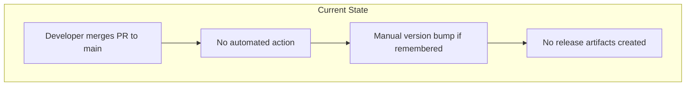
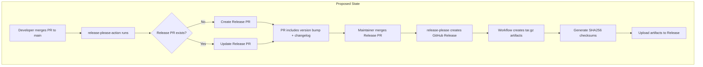
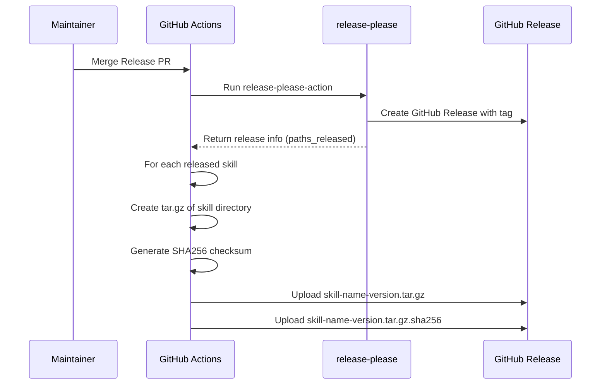
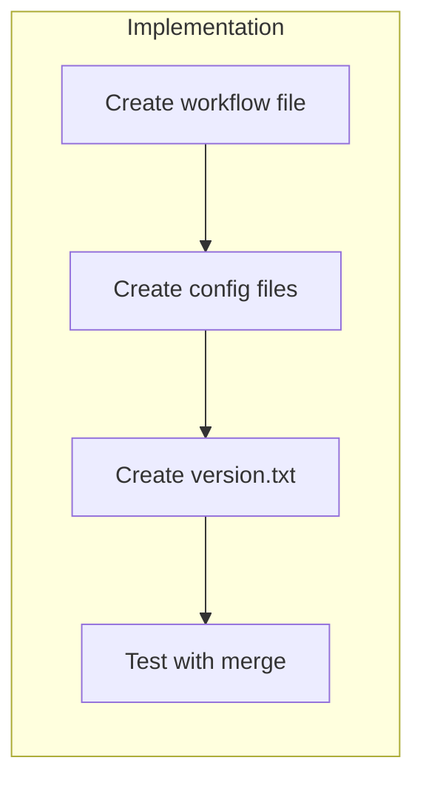

# Implement Release Workflow with release-please

## Change Summary

This change request introduces an automated release workflow using Google's `release-please` tool to manage versioning, changelog generation, and GitHub releases for skills in this repository. The workflow will trigger on merges to the `main` branch, automatically create release PRs based on Conventional Commits, and produce tar.gz artifacts with SHA256 checksums for each skill release.

## Motivation and Background

Currently, there is no automated release process for skills in this repository. Manual releases are error-prone, inconsistent, and time-consuming. By implementing `release-please`, we gain:

1. **Automated versioning** based on Conventional Commits (feat → minor, fix → patch, breaking → major)
2. **Automated changelog generation** that documents all changes between releases
3. **Consistent release artifacts** (tar.gz with SHA256 checksums) for skill distribution
4. **Reduced manual effort** and human error in the release process

The `release-please` tool from Google (googleapis/release-please) is a mature, well-maintained solution specifically designed for this purpose and integrates seamlessly with GitHub Actions.

## Change Drivers

* Need for automated, consistent release process for skills
* Requirement for versioned, distributable skill artifacts (tar.gz with checksums)
* Desire to leverage Conventional Commits for semantic versioning
* Need for automated changelog generation to track changes

## Current State

The repository currently has:
- One skill located at `skills/governance/` with version "1.1" in SKILL.md metadata
- No GitHub Actions workflows (`.github/workflows/` does not exist)
- No release automation or artifact generation
- No changelog files for skills
- Manual version management in SKILL.md frontmatter

### Current State Diagram



## Proposed Change

Implement a complete release automation system using `release-please` with the following components:

1. **GitHub Actions Workflow** (`.github/workflows/release.yml`)
   - Triggers on push to `main` branch
   - Runs `release-please-action` to create/update release PRs
   - On release creation, builds tar.gz artifacts for each released skill
   - Generates SHA256 checksums for all artifacts
   - Uploads artifacts to the GitHub Release

2. **Release Please Configuration** (`release-please-config.json`)
   - Configures monorepo mode for multiple skills
   - Uses `simple` release-type for generic (non-language-specific) packages
   - Defines each skill as a separate component with its own versioning

3. **Release Please Manifest** (`.release-please-manifest.json`)
   - Tracks current versions of each skill
   - Updated automatically by release-please on each release

4. **Skill Version Files** (`skills/*/version.txt`)
   - Simple text file containing the current version
   - Required by the `simple` release-type strategy

5. **Skill Changelogs** (`skills/*/CHANGELOG.md`)
   - Automatically generated and maintained by release-please
   - Documents all changes based on Conventional Commits

### Proposed State Diagram



### Release Artifact Flow



## Requirements

### Functional Requirements

1. The system **MUST** run `release-please-action` on every push to the `main` branch
2. The system **MUST** create or update a Release PR when commits following Conventional Commits format are merged
3. The system **MUST** automatically determine version bumps based on Conventional Commits:
   - `fix:` commits **MUST** result in a patch version bump
   - `feat:` commits **MUST** result in a minor version bump
   - Breaking changes (commits with `!` or `BREAKING CHANGE` footer) **MUST** result in a major version bump
4. The system **MUST** generate and maintain a `CHANGELOG.md` file for each skill
5. The system **MUST** create a GitHub Release when a Release PR is merged
6. The system **MUST** create a tar.gz archive for each skill that is released
7. The system **MUST** generate a SHA256 checksum file for each tar.gz artifact
8. The system **MUST** upload both the tar.gz and SHA256 checksum files to the GitHub Release
9. The system **MUST** name artifacts using the pattern `{skill-name}-{version}.tar.gz`
10. The system **MUST** include the skill's component name in the release tag (e.g., `governance-v1.2.0`)

### Non-Functional Requirements

1. The workflow **MUST** complete within 10 minutes for typical releases
2. The workflow **MUST** use only the `GITHUB_TOKEN` for authentication (no additional secrets required)
3. The workflow **MUST** be idempotent (safe to re-run without side effects)
4. The tar.gz artifacts **MUST** preserve file permissions and directory structure
5. The SHA256 checksum **MUST** be in a format compatible with `sha256sum --check`

## Affected Components

* `.github/workflows/release.yml` - New GitHub Actions workflow
* `release-please-config.json` - New release-please configuration
* `.release-please-manifest.json` - New version manifest
* `skills/governance/version.txt` - New version file for governance skill
* `skills/governance/CHANGELOG.md` - New changelog (auto-generated)
* `.gitignore` - May need updates for any build artifacts

## Scope Boundaries

### In Scope

* GitHub Actions workflow for release automation
* release-please configuration for monorepo with skills
* tar.gz artifact creation for released skills
* SHA256 checksum generation for artifacts
* Uploading artifacts to GitHub Releases
* Initial setup for the existing `governance` skill

### Out of Scope ("Here, But Not Further")

* Automatic publishing to external registries or package managers
* Signing artifacts with GPG or other cryptographic signatures
* Release notifications (Slack, email, etc.)
* Pre-release or beta versioning strategies
* Automatic deployment of skills to any runtime environment
* Migration of existing version from SKILL.md metadata to version.txt (manual one-time setup)

## Alternative Approaches Considered

* **semantic-release**: More complex configuration, primarily designed for npm packages, less suitable for generic artifacts
* **Manual releases with GitHub UI**: Error-prone, inconsistent, doesn't scale
* **Custom release script**: Requires maintenance, reinvents existing solutions
* **GoReleaser**: Primarily designed for Go projects, overkill for simple artifact packaging

## Impact Assessment

### User Impact

Users consuming skills will benefit from:
- Consistent, versioned releases with clear changelogs
- Downloadable tar.gz artifacts with integrity verification via SHA256
- Predictable versioning following Semantic Versioning

No negative user impact expected. Users can continue to clone the repository directly if preferred.

### Technical Impact

- **New files**: 4 new configuration/workflow files
- **New directories**: `.github/workflows/`
- **Dependencies**: None (uses GitHub-hosted actions only)
- **Breaking changes**: None
- **Migration**: One-time manual creation of `version.txt` for existing skill

### Business Impact

- **Cost**: GitHub Actions minutes (minimal, runs only on merge to main)
- **Timeline**: Can be implemented in a single PR
- **Risk**: Low - uses well-established tooling from Google

## Implementation Approach

The implementation will be completed in a single phase:

### Phase 1: Complete Implementation

1. Create `.github/workflows/release.yml` with release-please-action
2. Create `release-please-config.json` with monorepo configuration
3. Create `.release-please-manifest.json` with initial versions
4. Create `skills/governance/version.txt` with current version
5. Test workflow by merging a conventional commit

### Implementation Flow



### File Contents

#### `.github/workflows/release.yml`

```yaml
name: Release

on:
  push:
    branches:
      - main

permissions:
  contents: write
  pull-requests: write

jobs:
  release-please:
    runs-on: ubuntu-latest
    outputs:
      releases_created: ${{ steps.release.outputs.releases_created }}
      paths_released: ${{ steps.release.outputs.paths_released }}
    steps:
      - uses: googleapis/release-please-action@v4
        id: release
        with:
          token: ${{ secrets.GITHUB_TOKEN }}

  build-artifacts:
    needs: release-please
    if: needs.release-please.outputs.releases_created == 'true'
    runs-on: ubuntu-latest
    steps:
      - uses: actions/checkout@v4

      - name: Build and upload release artifacts
        env:
          GH_TOKEN: ${{ secrets.GITHUB_TOKEN }}
          PATHS_RELEASED: ${{ needs.release-please.outputs.paths_released }}
        run: |
          # Parse released paths and build artifacts
          echo "$PATHS_RELEASED" | jq -r '.[]' | while read -r path; do
            # Extract skill name from path (e.g., skills/governance -> governance)
            skill_name=$(basename "$path")
            
            # Get version from version.txt
            version=$(cat "$path/version.txt")
            
            # Create artifact name
            artifact_name="${skill_name}-${version}"
            
            # Create tar.gz archive
            tar -czvf "${artifact_name}.tar.gz" -C "$(dirname "$path")" "$skill_name"
            
            # Generate SHA256 checksum
            sha256sum "${artifact_name}.tar.gz" > "${artifact_name}.tar.gz.sha256"
            
            # Upload to GitHub Release
            gh release upload "${skill_name}-v${version}" \
              "${artifact_name}.tar.gz" \
              "${artifact_name}.tar.gz.sha256" \
              --clobber
          done
```

#### `release-please-config.json`

```json
{
  "$schema": "https://raw.githubusercontent.com/googleapis/release-please/main/schemas/config.json",
  "packages": {
    "skills/governance": {
      "release-type": "simple",
      "component": "governance",
      "include-component-in-tag": true,
      "include-v-in-tag": true
    }
  }
}
```

#### `.release-please-manifest.json`

```json
{
  "skills/governance": "1.1.0"
}
```

#### `skills/governance/version.txt`

```
1.1.0
```

## Test Strategy

### Tests to Add

Since this is a CI/CD workflow implementation, traditional unit tests are not applicable. Validation will be performed through:

| Test Type | Description | Validation Method | Expected Result |
|-----------|-------------|-------------------|-----------------|
| Workflow syntax | Validate YAML syntax | GitHub Actions linter | No syntax errors |
| Config validation | Validate release-please config | release-please CLI | Config accepted |
| Integration test | End-to-end release flow | Manual trigger with test commit | Release created with artifacts |

### Tests to Modify

Not applicable - no existing tests related to release workflows.

### Tests to Remove

Not applicable - no existing tests to remove.

### Manual Validation Steps

1. Merge a commit with `feat: test release workflow` message
2. Verify release-please creates a Release PR
3. Merge the Release PR
4. Verify GitHub Release is created with correct tag
5. Verify tar.gz artifact is attached to release
6. Verify SHA256 checksum file is attached to release
7. Download artifact and verify checksum matches

## Acceptance Criteria

### AC-1: Release PR Creation

```gherkin
Given a commit with message "feat: add new template" is merged to main
When the release workflow runs
Then a Release PR is created or updated
  And the PR title contains the new version number
  And the PR body contains the changelog entry for the commit
```

### AC-2: Version Bump Calculation

```gherkin
Given a Release PR exists with version 1.1.0
When a commit with message "fix: correct typo" is merged to main
Then the Release PR is updated to version 1.1.1
```

### AC-3: Minor Version Bump

```gherkin
Given a Release PR exists with version 1.1.0
When a commit with message "feat: add new feature" is merged to main
Then the Release PR is updated to version 1.2.0
```

### AC-4: Major Version Bump

```gherkin
Given a Release PR exists with version 1.1.0
When a commit with message "feat!: breaking change" is merged to main
Then the Release PR is updated to version 2.0.0
```

### AC-5: GitHub Release Creation

```gherkin
Given a Release PR for governance skill version 1.2.0 exists
When the Release PR is merged
Then a GitHub Release is created
  And the release tag is "governance-v1.2.0"
  And the release notes contain the changelog
```

### AC-6: Artifact Creation

```gherkin
Given a GitHub Release for governance skill version 1.2.0 is created
When the build-artifacts job runs
Then a file "governance-1.2.0.tar.gz" is uploaded to the release
  And the archive contains the complete skills/governance directory
```

### AC-7: Checksum Generation

```gherkin
Given a tar.gz artifact "governance-1.2.0.tar.gz" is created
When the checksum is generated
Then a file "governance-1.2.0.tar.gz.sha256" is uploaded to the release
  And the checksum file contains a valid SHA256 hash
  And the checksum can be verified with "sha256sum --check"
```

### AC-8: Changelog Update

```gherkin
Given commits have been merged since the last release
When a Release PR is merged
Then the CHANGELOG.md file in the skill directory is updated
  And the changelog contains entries for all conventional commits
  And the changelog is organized by version
```

### AC-9: Workflow Permissions

```gherkin
Given the release workflow is triggered
When the workflow runs
Then it uses only the GITHUB_TOKEN for authentication
  And no additional secrets are required
```

### AC-10: Idempotent Execution

```gherkin
Given the release workflow has already run for a commit
When the workflow is re-run for the same commit
Then no duplicate releases are created
  And no errors occur
```

## Quality Standards Compliance

### Build & Compilation

- [x] Not applicable - no compiled code
- [ ] GitHub Actions workflow syntax is valid

### Linting & Code Style

- [ ] YAML files follow standard formatting
- [ ] JSON files are valid and properly formatted
- [ ] Shell scripts in workflow follow best practices

### Test Execution

- [ ] Manual validation steps completed successfully
- [ ] Release PR created correctly
- [ ] Artifacts uploaded to release

### Documentation

- [ ] This CR documents the implementation
- [ ] Workflow file contains inline comments explaining steps

### Code Review

- [ ] Changes submitted via pull request
- [ ] PR title follows Conventional Commits format: `feat(ci): add release-please workflow`
- [ ] Code review completed and approved
- [ ] Changes squash-merged to maintain linear history

### Verification Commands

```bash
# Validate YAML syntax
yamllint .github/workflows/release.yml

# Validate JSON syntax
jq . release-please-config.json
jq . .release-please-manifest.json

# Verify version.txt exists and has content
cat skills/governance/version.txt
```

## Risks and Mitigation

### Risk 1: Workflow fails on first run due to missing manifest

**Likelihood:** low
**Impact:** low
**Mitigation:** Initialize `.release-please-manifest.json` with current version before first run

### Risk 2: Artifact upload fails due to tag naming mismatch

**Likelihood:** medium
**Impact:** medium
**Mitigation:** Carefully configure `include-component-in-tag` and test tag format matches upload command

### Risk 3: Large skill directories create oversized artifacts

**Likelihood:** low
**Impact:** low
**Mitigation:** Skills are documentation-only, typically small. Can add exclusions to tar command if needed.

### Risk 4: Concurrent workflow runs cause race conditions

**Likelihood:** low
**Impact:** medium
**Mitigation:** GitHub Actions provides concurrency controls; release-please handles concurrent updates gracefully

## Dependencies

* GitHub Actions enabled on the repository
* Repository uses Conventional Commits for commit messages (already required per AGENTS.md)
* `main` branch exists and is the default branch

## Estimated Effort

| Task | Effort |
|------|--------|
| Create workflow file | 1 hour |
| Create configuration files | 30 minutes |
| Create version.txt | 10 minutes |
| Testing and validation | 1 hour |
| Documentation (this CR) | 1 hour |
| **Total** | **3.5 hours** |

## Decision Outcome

Chosen approach: "release-please with GitHub Actions", because it provides mature, well-maintained release automation that integrates natively with GitHub, requires minimal configuration, and supports monorepo structures with independent versioning per component.

## Related Items

* Repository: googleapis/release-please - Source of release-please tool
* Repository: googleapis/release-please-action - GitHub Action for release-please
* AGENTS.md - Documents Conventional Commits requirement

## More Information

### release-please Documentation

- [release-please GitHub Repository](https://github.com/googleapis/release-please)
- [release-please-action](https://github.com/googleapis/release-please-action)
- [Manifest Configuration](https://github.com/googleapis/release-please/blob/main/docs/manifest-releaser.md)

### Conventional Commits

The repository already requires Conventional Commits per AGENTS.md. This workflow leverages that existing requirement to automate versioning:

| Commit Type | Version Bump | Example |
|-------------|--------------|---------|
| `fix:` | Patch (0.0.X) | `fix: correct template typo` |
| `feat:` | Minor (0.X.0) | `feat: add new ADR template` |
| `feat!:` or `BREAKING CHANGE:` | Major (X.0.0) | `feat!: restructure skill format` |
| `docs:`, `chore:`, `style:`, `refactor:`, `test:` | No bump | `docs: update README` |

### Adding New Skills

When adding a new skill to the repository, update the configuration files:

1. Add entry to `release-please-config.json`:
```json
{
  "packages": {
    "skills/governance": { ... },
    "skills/new-skill": {
      "release-type": "simple",
      "component": "new-skill",
      "include-component-in-tag": true,
      "include-v-in-tag": true
    }
  }
}
```

2. Add entry to `.release-please-manifest.json`:
```json
{
  "skills/governance": "1.1.0",
  "skills/new-skill": "0.0.0"
}
```

3. Create `skills/new-skill/version.txt` with initial version:
```
0.0.0
```
