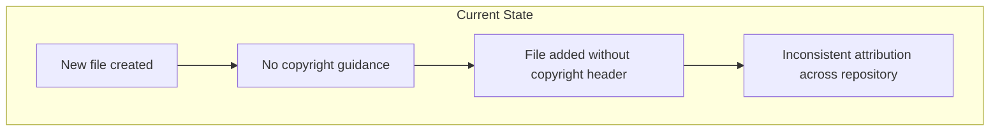
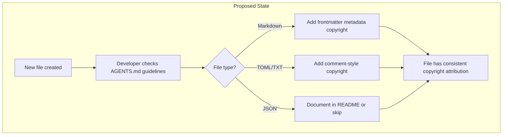
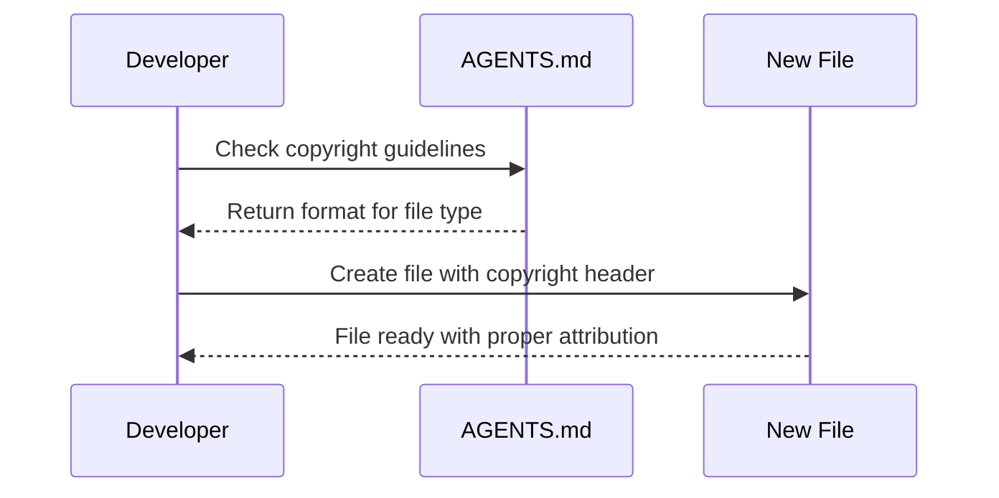
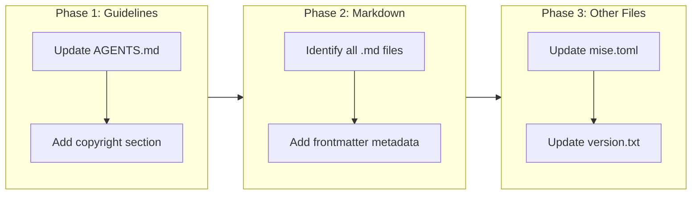

# Add Copyright Headers to All Files

## Change Summary

This change request introduces copyright headers to all existing files in the repository and establishes guidelines in AGENTS.md for adding copyright headers to future files. For markdown files, the copyright will be added as a metadata key in the frontmatter. For other file types, appropriate comment-style headers will be used.

## Motivation and Background

Copyright headers serve several important purposes:

1. **Legal Protection**: Clearly establishes ownership and licensing terms for the codebase
2. **Attribution**: Ensures proper credit is given to the copyright holder
3. **Compliance**: Many organizations and open-source projects require copyright notices
4. **Consistency**: Having a standard approach ensures all files are properly attributed

The repository currently has an Apache 2.0 LICENSE file but individual files lack copyright notices. Adding copyright headers to each file reinforces the licensing terms and provides clear attribution at the file level.

## Change Drivers

* Need for clear copyright attribution on all source files
* Requirement for consistent copyright format across different file types
* Desire to establish guidelines for future file creation
* Best practice for open-source project governance

## Current State

The repository currently has:
- An Apache 2.0 LICENSE file at the root
- 21 files across various types (markdown, TOML, JSON, TXT)
- No copyright headers in any individual files
- No guidelines in AGENTS.md for copyright headers

### Current File Inventory

| File Type | Count | Files |
|-----------|-------|-------|
| Markdown (.md) | 17 | AGENTS.md, CONTRIBUTING.md, README.md, docs/cr/*.md, docs/anthropic/*.md, docs/agentskills/*.md, docs/add-skills/*.md, skills/governance/*.md |
| TOML (.toml) | 1 | mise.toml |
| JSON (.json) | 1 | release-please-config.json |
| Text (.txt) | 1 | skills/governance/version.txt |
| License | 1 | LICENSE (already contains copyright) |

### Current State Diagram



## Proposed Change

Implement copyright headers across all files and establish guidelines for future files:

1. **Markdown Files**: Add copyright as frontmatter metadata
   ```yaml
   ---
   metadata:
     copyright: Copyright Daniel Grenemark 2026
   ---
   ```

2. **TOML Files**: Add copyright as a comment at the top
   ```toml
   # Copyright Daniel Grenemark 2026
   ```

3. **JSON Files**: JSON does not support comments, so copyright will be added as a metadata field where appropriate, or documented in accompanying README files

4. **Text Files**: Add copyright as a comment or first line where appropriate
   ```
   # Copyright Daniel Grenemark 2026
   ```

5. **AGENTS.md Guidelines**: Add a new section with instructions for adding copyright headers to future files

### Proposed State Diagram



### Copyright Header Flow



## Requirements

### Functional Requirements

1. All existing markdown files **MUST** have a frontmatter metadata section with copyright key
2. All existing TOML files **MUST** have a copyright comment as the first line
3. All existing text files (excluding LICENSE) **MUST** have a copyright notice where appropriate
4. AGENTS.md **MUST** include a new section with copyright header guidelines
5. The copyright text **MUST** be: "Copyright Daniel Grenemark 2026"
6. Markdown frontmatter **MUST** use the format:
   ```yaml
   metadata:
     copyright: Copyright Daniel Grenemark 2026
   ```

### Non-Functional Requirements

1. The copyright header format **MUST** be consistent within each file type
2. The implementation **MUST** not break existing file parsing or functionality
3. The AGENTS.md guidelines **MUST** be clear and actionable for future contributors

## Affected Components

* All markdown files in the repository (17 files)
* mise.toml configuration file
* skills/governance/version.txt
* AGENTS.md (for new guidelines section)

## Scope Boundaries

### In Scope

* Adding copyright headers to all existing files (except LICENSE which already has copyright)
* Adding copyright guidelines section to AGENTS.md
* Markdown files using frontmatter metadata format
* TOML files using comment format
* Text files using comment format where appropriate

### Out of Scope ("Here, But Not Further")

* JSON files - JSON does not support comments; release-please-config.json will not be modified
* LICENSE file - already contains copyright information
* Binary files - not applicable to this repository
* Automated copyright header insertion tooling - manual process for now
* Year update automation - will be addressed in future CR if needed

## Alternative Approaches Considered

* **SPDX License Identifiers**: Using standardized SPDX format (e.g., `SPDX-License-Identifier: Apache-2.0`). Rejected because the request specifically asks for copyright attribution, not license identification.

* **Single COPYRIGHT file**: Creating a single COPYRIGHT file listing all copyrights. Rejected because per-file headers provide clearer attribution and are more common in open-source projects.

* **HTML Comments in Markdown**: Using `<!-- Copyright -->` comments. Rejected because frontmatter metadata is cleaner and more structured for markdown files.

## Impact Assessment

### User Impact

Minimal impact on users. The copyright headers are metadata and do not affect the content or functionality of any files. Users reading markdown files will see the copyright in the frontmatter, which is standard practice.

### Technical Impact

* **Markdown Parsing**: Files with existing frontmatter will have the metadata section added. Files without frontmatter will have new frontmatter added.
* **TOML Parsing**: Comment lines are ignored by TOML parsers, so no functional impact.
* **Text Files**: No parsing impact as these are simple text files.
* **Breaking Changes**: None expected. All changes are additive metadata.

### Business Impact

* **Legal Clarity**: Improved copyright attribution across the repository
* **Professional Appearance**: Consistent copyright headers demonstrate good governance
* **Compliance**: Meets best practices for open-source project management

## Implementation Approach

The implementation will be done in three phases:

### Phase 1: Update AGENTS.md with Guidelines

Add a new `<copyright>` section to AGENTS.md with clear instructions for adding copyright headers to different file types.

### Phase 2: Update Existing Markdown Files

Add frontmatter metadata with copyright to all 17 markdown files. For files with existing frontmatter, add the metadata section. For files without frontmatter, create new frontmatter.

### Phase 3: Update Other File Types

Add copyright comments to mise.toml and version.txt.

### Implementation Flow



## Test Strategy

### Tests to Add

This change request involves documentation and metadata changes only. No automated tests are required.

| Test File | Test Name | Description | Inputs | Expected Output |
|-----------|-----------|-------------|--------|-----------------|
| N/A | Manual verification | Verify all files have copyright headers | All repository files | Each file has appropriate copyright header |

### Tests to Modify

Not applicable - no existing tests affected.

### Tests to Remove

Not applicable - no tests to remove.

## Acceptance Criteria

### AC-1: AGENTS.md contains copyright guidelines

```gherkin
Given the AGENTS.md file exists
When a developer reads the file
Then they find a <copyright> section with clear instructions for adding copyright headers to markdown, TOML, and text files
```

### AC-2: Markdown files have frontmatter copyright metadata

```gherkin
Given a markdown file in the repository
When the file is opened
Then the frontmatter contains a metadata section with copyright key
  And the copyright value is "Copyright Daniel Grenemark 2026"
```

### AC-3: TOML files have copyright comment

```gherkin
Given the mise.toml file
When the file is opened
Then the first line is a comment containing "Copyright Daniel Grenemark 2026"
```

### AC-4: Text files have copyright notice

```gherkin
Given the skills/governance/version.txt file
When the file is opened
Then the file contains a copyright notice "Copyright Daniel Grenemark 2026"
```

### AC-5: Existing frontmatter is preserved

```gherkin
Given a markdown file with existing frontmatter (e.g., CR documents)
When the copyright metadata is added
Then all existing frontmatter fields are preserved
  And the metadata.copyright field is added
```

### AC-6: File functionality is not affected

```gherkin
Given all files with copyright headers added
When the repository is used normally
Then all files parse correctly
  And no functionality is broken
```

## Quality Standards Compliance

### Build & Compilation

- [ ] All markdown files have valid frontmatter YAML syntax
- [ ] TOML file remains valid after adding comment

### Linting & Code Style

- [ ] Frontmatter follows consistent indentation
- [ ] Copyright text is identical across all files

### Test Execution

- [ ] Manual verification of all files completed
- [ ] No parsing errors in any file

### Documentation

- [ ] AGENTS.md updated with copyright guidelines
- [ ] Guidelines are clear and actionable

### Code Review

- [ ] Changes submitted via pull request
- [ ] PR title follows Conventional Commits format: `docs: add copyright headers to all files`
- [ ] Code review completed and approved
- [ ] Changes squash-merged to maintain linear history

### Verification Commands

```bash
# Verify markdown frontmatter is valid YAML
for f in $(find . -name "*.md" -not -path "./.git/*"); do
  head -50 "$f" | grep -q "copyright:" && echo "✓ $f" || echo "✗ $f"
done

# Verify TOML file has copyright comment
head -1 mise.toml | grep -q "Copyright" && echo "✓ mise.toml" || echo "✗ mise.toml"

# Verify version.txt has copyright
grep -q "Copyright" skills/governance/version.txt && echo "✓ version.txt" || echo "✗ version.txt"
```

## Risks and Mitigation

### Risk 1: Frontmatter parsing issues

**Likelihood:** low
**Impact:** medium
**Mitigation:** Test frontmatter syntax carefully. Use consistent YAML formatting. Verify files parse correctly after changes.

### Risk 2: Breaking existing tooling

**Likelihood:** low
**Impact:** medium
**Mitigation:** The metadata section is a standard frontmatter pattern. Release-please and other tools should handle it correctly. Test after implementation.

### Risk 3: Inconsistent copyright text

**Likelihood:** low
**Impact:** low
**Mitigation:** Use copy-paste for the copyright text. Verify with grep after implementation.

## Dependencies

* None - this is a standalone documentation change

## Estimated Effort

| Phase | Effort |
|-------|--------|
| Phase 1: Update AGENTS.md | 15 minutes |
| Phase 2: Update markdown files (17 files) | 30 minutes |
| Phase 3: Update other files (2 files) | 5 minutes |
| Verification | 10 minutes |
| **Total** | **1 hour** |

## Decision Outcome

Chosen approach: "Frontmatter metadata for markdown, comments for other files", because it follows standard conventions for each file type, maintains file validity, and provides clear, consistent attribution across the repository.

## Files to Update

### Markdown Files (17 total)

1. `/AGENTS.md` - Add frontmatter + guidelines section
2. `/CONTRIBUTING.md` - Add frontmatter
3. `/README.md` - Add frontmatter
4. `/docs/cr/CR-0001-refactor-governance-skill.md` - Add metadata to existing frontmatter
5. `/docs/cr/CR-0002-remove-auto-commit-from-governance-skill.md` - Add metadata to existing frontmatter
6. `/docs/cr/CR-0003-add-apache-2-license.md` - Add metadata to existing frontmatter
7. `/docs/cr/CR-0004-release-please-workflow.md` - Add metadata to existing frontmatter
8. `/docs/cr/CR-0005-copyright-headers.md` - Add metadata to existing frontmatter (this file)
9. `/docs/anthropic/prompt-engineering-use-xml-tags.md` - Add frontmatter
10. `/docs/anthropic/prompt-engineering-be-clear-and-direct.md` - Add frontmatter
11. `/docs/anthropic/structured-outputs.md` - Add frontmatter
12. `/docs/anthropic/prompt-engineering-prefill-claudes-response.md` - Add frontmatter
13. `/docs/anthropic/agent-skills-best-practices.md` - Add frontmatter
14. `/docs/agentskills/specification.md` - Add frontmatter
15. `/docs/add-skills/README.md` - Add frontmatter
16. `/skills/governance/CHANGELOG.md` - Add frontmatter
17. `/skills/governance/SKILL.md` - Add metadata to existing frontmatter
18. `/skills/governance/reference/adr-guide.md` - Add frontmatter
19. `/skills/governance/reference/cr-guide.md` - Add frontmatter
20. `/skills/governance/templates/ADR.md` - Add metadata to existing frontmatter
21. `/skills/governance/templates/CR.md` - Add metadata to existing frontmatter

### Other Files (2 total)

1. `/mise.toml` - Add copyright comment as first line
2. `/skills/governance/version.txt` - Add copyright comment

### Files Not Modified

1. `/LICENSE` - Already contains copyright information
2. `/release-please-config.json` - JSON does not support comments

## AGENTS.md Guidelines Addition

The following section will be added to AGENTS.md:

```xml
<copyright>
All new files **MUST** include a copyright header. Use the appropriate format based on file type:

**Markdown files** - Add to frontmatter metadata:
```yaml
---
metadata:
  copyright: Copyright Daniel Grenemark 2026
---
```

**TOML files** - Add as first line comment:
```toml
# Copyright Daniel Grenemark 2026
```

**Text files** - Add as first line comment:
```
# Copyright Daniel Grenemark 2026
```

**JSON files** - JSON does not support comments. Document copyright in accompanying README or skip.

**Note:** The LICENSE file at the repository root contains the full Apache 2.0 license text with copyright notice.
</copyright>
```

## Related Items

* Links to architecture decisions: N/A
* Links to related change requests: CR-0003 (Add Apache 2.0 License)
* Links to issues/tickets: N/A
* Links to pull requests: N/A
