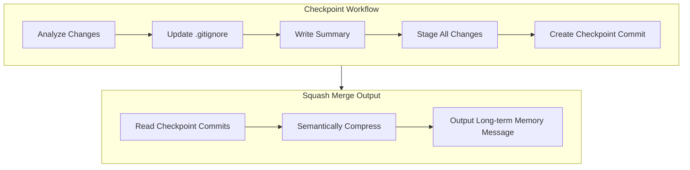
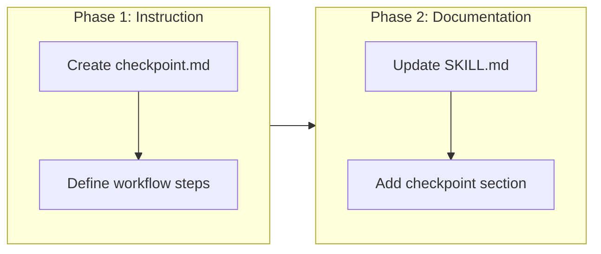

# Add Checkpoint Instruction to Governance Skill

## Change Summary

Add a new checkpoint instruction to the governance skill that enables iterative Git checkpoints for active branches. The checkpoint acts as short-term memory during development with the ability to compress commits for merge commits serving as long-term memory.

## Motivation and Background

During development on feature branches, agents need a mechanism to preserve work-in-progress state without creating formal commits. Checkpoints provide a structured way to capture all changes (staged, unstaged, and untracked) with meaningful commit messages. When the branch is merged, these checkpoint commits can be squashed into a single, well-documented merge commit that serves as long-term project memory.

Additionally, checkpoint operations often involve temporary files, build artifacts, or generated content that should not be committed to the repository. Maintaining `.gitignore` during checkpoints prevents repository bloat and keeps the codebase clean.

## Change Drivers

* Need for structured work-in-progress preservation during agent sessions
* Requirement for short-term memory on active branches
* Desire to compress checkpoint history into meaningful merge commits for long-term memory
* Prevention of repository bloat from temporary files during development

## Current State

The governance skill currently provides ADR and CR workflows for documenting architectural decisions and change requests. There is no mechanism for creating iterative checkpoints during development work.

## Proposed Change

Add a new checkpoint instruction template to the governance skill that:

1. Analyzes all staged, unstaged, and untracked changes in the repository
2. Creates a structured checkpoint commit with a one-sentence summary and detailed body
3. Ensures `.gitignore` is updated before committing to prevent repository bloat
4. Uses a consistent commit message format: `checkpoint(CR-xxxx): {summary}`

### Proposed State Diagram



## Requirements

### Functional Requirements

1. The instruction **MUST** analyze all staged changes using `git diff --staged`
2. The instruction **MUST** analyze all unstaged changes using `git diff`
3. The instruction **MUST** identify untracked files using `git ls-files --others --exclude-standard`
4. The instruction **MUST** review and update `.gitignore` before staging to exclude temporary files, build artifacts, and generated content that should not be committed
5. The instruction **MUST** create a one-sentence summary of the changes
6. The instruction **MUST** create a detailed body with multiple sentences or bullet points
7. The instruction **MUST** stage all changes using `git add -A`
8. The instruction **MUST** create a commit with format `checkpoint(CR-xxxx): {summary}`
9. The instruction **MUST NOT** perform any destructive Git operations (reset, rebase, amend, force push)
10. The instruction **MUST** provide a "squash merge" output that semantically compresses all checkpoint commits into a single long-term memory message suitable for PR descriptions or local squash merge commits

### Non-Functional Requirements

1. The instruction **MUST** be idempotent and safe to run multiple times
2. The instruction **MUST** work with both tracked and untracked files
3. The instruction **MUST** preserve all work without data loss

## Affected Components

* `skills/governance/SKILL.md` - Add checkpoint workflow section
* `skills/governance/instructions/checkpoint.md` - New instruction file

## Scope Boundaries

### In Scope

* Creating the checkpoint instruction template
* Adding `.gitignore` maintenance requirement to the checkpoint workflow
* Documenting the checkpoint workflow in SKILL.md

### Out of Scope ("Here, But Not Further")

* Automatic squashing of checkpoint commits during merge - manual process
* Integration with CI/CD pipelines - future enhancement
* Checkpoint restoration or rollback functionality - not needed for initial implementation

## Implementation Approach

### Phase 1: Create Instruction File

Create `skills/governance/instructions/checkpoint.md` with the checkpoint workflow instructions including `.gitignore` maintenance.

### Phase 2: Update SKILL.md

Add a new section to SKILL.md documenting the checkpoint workflow and linking to the instruction file.

### Implementation Flow



## Test Strategy

### Tests to Add

| Test File | Test Name | Description | Inputs | Expected Output |
|-----------|-----------|-------------|--------|-----------------|
| N/A | Manual verification | Verify instruction file exists and is valid markdown | checkpoint.md file | Valid markdown with all required sections |
| N/A | Manual verification | Verify SKILL.md references checkpoint instruction | SKILL.md content | Contains checkpoint workflow section |

### Tests to Modify

Not applicable - no existing tests for governance skill instructions.

### Tests to Remove

Not applicable - no tests being removed.

## Acceptance Criteria

### AC-1: Checkpoint instruction file exists

```gherkin
Given the governance skill directory structure
When I navigate to skills/governance/instructions/
Then a file named checkpoint.md exists
  And it contains instructions for analyzing Git changes
  And it contains instructions for updating .gitignore
  And it contains instructions for creating checkpoint commits
```

### AC-2: SKILL.md documents checkpoint workflow

```gherkin
Given the governance skill SKILL.md file
When I read the file contents
Then it contains a Checkpoint Workflow section
  And it links to the checkpoint instruction file
```

### AC-3: .gitignore maintenance is required

```gherkin
Given the checkpoint instruction
When I read the workflow steps
Then there is a step requiring .gitignore review and update
  And it specifies excluding temporary files and build artifacts
```

### AC-4: Commit message format is specified

```gherkin
Given the checkpoint instruction
When I read the commit message format
Then it specifies the format checkpoint(CR-xxxx): {summary}
  And it requires a detailed body with the changes
```

### AC-5: Squash merge output is provided

```gherkin
Given multiple checkpoint commits on a branch
When the user requests a squash merge message
Then the instruction outputs a semantically compressed summary
  And the summary combines all checkpoint changes into coherent long-term memory
  And the output is formatted for easy copy into PR descriptions or squash merge commits
```

## Quality Standards Compliance

### Build & Compilation

- [ ] Code compiles/builds without errors
- [ ] No new compiler warnings introduced

### Linting & Code Style

- [ ] All linter checks pass with zero warnings/errors
- [ ] Code follows project coding conventions and style guides
- [ ] Any linter exceptions are documented with justification

### Test Execution

- [ ] All existing tests pass after implementation
- [ ] All new tests pass
- [ ] Test coverage meets project requirements for changed code

### Documentation

- [ ] Inline code documentation updated where applicable
- [ ] API documentation updated for any API changes
- [ ] User-facing documentation updated if behavior changes

### Code Review

- [ ] Changes submitted via pull request
- [ ] PR title follows Conventional Commits format
- [ ] Code review completed and approved
- [ ] Changes squash-merged to maintain linear history

### Verification Commands

```bash
# Verify markdown files are valid
find skills/governance -name "*.md" -exec cat {} \; > /dev/null

# Verify instruction file exists
test -f skills/governance/instructions/checkpoint.md && echo "OK"
```

## Risks and Mitigation

### Risk 1: Checkpoint commits clutter Git history

**Likelihood:** medium
**Impact:** low
**Mitigation:** Document that checkpoint commits should be squashed during merge to maintain clean long-term history.

### Risk 2: .gitignore updates may be forgotten

**Likelihood:** medium
**Impact:** medium
**Mitigation:** Make .gitignore review an explicit required step in the checkpoint workflow before staging changes.

## Dependencies

* None - this is a standalone addition to the governance skill

## Estimated Effort

2-4 hours for implementation and documentation.

## Decision Outcome

Chosen approach: "Add checkpoint instruction with .gitignore maintenance", because it provides structured short-term memory for active branches while preventing repository bloat, and supports compression into meaningful merge commits for long-term memory.

## Related Items

* Links to architecture decisions: N/A
* Links to issues/tickets: N/A
* Links to pull requests: N/A
