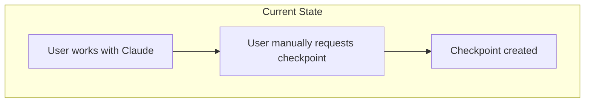
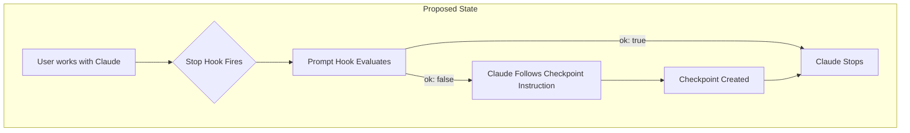
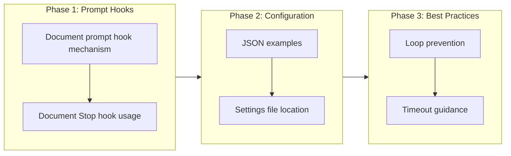

# Add Checkpoint Instructions for Claude Code Hooks

## Change Summary

Add comprehensive documentation for integrating the checkpoint instruction with Claude Code hooks using prompt-based hooks. A `Stop` hook with `type: "prompt"` can evaluate whether Claude should create a checkpoint before finishing, returning `{"ok": false, "reason": "..."}` to instruct Claude to follow the checkpoint workflow. This enables automated checkpoint creation at specific lifecycle points.

## Motivation and Background

The checkpoint instruction (CR-0006) provides a workflow for creating iterative Git checkpoints during development. However, manually triggering checkpoints requires explicit user intervention. Claude Code hooks provide lifecycle events that can automatically trigger checkpoint creation at appropriate moments, ensuring work is preserved without manual intervention.

By integrating checkpoints with prompt-based hooks, agents can:
- Automatically evaluate whether a checkpoint is needed when Claude finishes responding
- Instruct Claude to follow the checkpoint workflow via the hook's reason field
- Ensure work is preserved without manual intervention

## Change Drivers

* Need for automated checkpoint triggering without manual intervention
* Desire to use prompt-based hooks to evaluate checkpoint conditions via LLM
* Requirement to integrate checkpoint workflow with Claude Code's hook system
* Prevention of work loss during long development sessions

## Current State

The checkpoint instruction exists as a standalone workflow documented in `reference/checkpoint.md`. Users must manually invoke the checkpoint process. There is no documentation on how to automate checkpoint creation using Claude Code hooks.

### Current State Diagram



## Proposed Change

Add a new section to the checkpoint reference documentation that explains how to configure Claude Code hooks to automatically trigger checkpoint creation. The documentation will cover:

1. Hook event selection for checkpoint triggers
2. Configuration examples for common use cases
3. Script implementation for checkpoint hooks
4. Best practices for hook-based checkpoints

### Proposed State Diagram



## Requirements

### Functional Requirements

1. The documentation **MUST** explain how prompt-based hooks work for checkpoint triggers
2. The documentation **MUST** provide configuration examples for `Stop` hook with `type: "prompt"`
3. The documentation **MUST** explain how the hook's `reason` field instructs Claude to follow the checkpoint workflow
4. The documentation **MUST** explain how to use `$ARGUMENTS` placeholder to access hook input
5. The documentation **MUST** explain how to use the `stop_hook_active` field to prevent infinite loops
6. The documentation **MUST** document the JSON input fields available to prompt hooks
7. The documentation **MUST** explain how to configure hook timeout values appropriately
8. The documentation **MUST** reference the governance skill and checkpoint instruction

### Non-Functional Requirements

1. The documentation **MUST** be added to the existing `reference/checkpoint.md` file
2. The documentation **MUST** follow the existing documentation style and format
3. The documentation **MUST** include working code examples that can be copied directly
4. The documentation **MUST** reference the official Claude Code hooks documentation

## Affected Components

* `.junie/skills/governance/reference/checkpoint.md` - Add hooks integration section

## Scope Boundaries

### In Scope

* Documentation for Stop hook checkpoint integration using `type: "prompt"`
* Prompt configuration that activates the governance skill checkpoint instruction
* Configuration examples in JSON format
* Best practices for prompt-based checkpoint hooks

### Out of Scope ("Here, But Not Further")

* Command hooks (`type: "command"`) for checkpoints - prompt hooks are preferred
* Agent-based hooks (`type: "agent"`) - single-turn prompt evaluation is sufficient
* Async hook implementation - synchronous hooks are sufficient
* PreToolUse hook integration - checkpoints should run after changes, not before
* SessionEnd hook integration - session may terminate before checkpoint completes

## Alternative Approaches Considered

* **Command hooks**: Using shell scripts to create checkpoints directly. Rejected because prompt hooks can instruct Claude to follow the checkpoint instruction, leveraging the existing governance skill workflow.

* **Agent-based hooks**: Using a subagent to verify conditions before checkpointing. Rejected as overly complex for the checkpoint use case which has simple, well-defined triggers.

* **Async hooks**: Running checkpoints in the background. Rejected because checkpoint commits should complete before Claude continues to ensure work is preserved.

## Impact Assessment

### User Impact

Users will have clear documentation on how to automate checkpoint creation. This reduces manual intervention and ensures consistent work preservation during development sessions.

### Technical Impact

No code changes required. This CR adds documentation only. The checkpoint script and hook configuration are user-provided based on the documented patterns.

### Business Impact

Improved developer experience through automated work preservation. Reduced risk of work loss during long development sessions.

## Implementation Approach

### Phase 1: Document Prompt-Based Hooks

Document how prompt-based hooks work for checkpoint triggers:
- `Stop` hook with `type: "prompt"` evaluates whether checkpoint is needed
- Hook returns `{"ok": false, "reason": "..."}` to instruct Claude to checkpoint
- The `reason` field references the governance skill checkpoint instruction

### Phase 2: Create Configuration Examples

Provide JSON configuration examples showing how to configure prompt-based checkpoint triggers in `.claude/settings.json`.

### Phase 3: Document Best Practices

Add guidance on:
- Preventing infinite loops with `stop_hook_active` field
- Crafting effective prompts that reference the checkpoint instruction
- Setting appropriate timeout values

### Implementation Flow



## Test Strategy

### Tests to Add

This CR is documentation-only. No automated tests are required.

| Test File | Test Name | Description | Inputs | Expected Output |
|-----------|-----------|-------------|--------|-----------------|
| N/A | Manual verification | Verify documentation examples work | Copy examples to project | Checkpoint commits created |

### Tests to Modify

Not applicable - documentation-only change.

### Tests to Remove

Not applicable - documentation-only change.

## Acceptance Criteria

### AC-1: Prompt-Based Stop Hook Documentation

```gherkin
Given the checkpoint reference documentation
When a user reads the hooks integration section
Then they find a complete JSON configuration example for Stop hook with type: "prompt"
  And they find a prompt that references the governance skill checkpoint instruction
  And they find explanation of how to prevent infinite loops using stop_hook_active
```

### AC-2: Hook Response Schema Documentation

```gherkin
Given the checkpoint reference documentation
When a user reads the hooks integration section
Then they find explanation of the {"ok": true/false, "reason": "..."} response schema
  And they find how the reason field instructs Claude to follow the checkpoint workflow
  And they find guidance on crafting effective checkpoint prompts
```

### AC-3: Best Practices Section

```gherkin
Given the checkpoint reference documentation
When a user reads the hooks integration section
Then they find guidance on preventing infinite loops with Stop hooks
  And they find recommended timeout values for prompt hooks
  And they find reference to the governance skill checkpoint instruction
```

## Quality Standards Compliance

### Build & Compilation

- [x] Not applicable - documentation-only change

### Linting & Code Style

- [ ] Documentation follows existing style in reference/checkpoint.md
- [ ] Code examples are properly formatted in fenced code blocks
- [ ] JSON examples use proper syntax highlighting

### Test Execution

- [x] Not applicable - documentation-only change

### Documentation

- [ ] New section added to reference/checkpoint.md
- [ ] Examples are complete and can be copied directly
- [ ] References to Claude Code hooks documentation included

### Code Review

- [ ] Changes submitted via pull request
- [ ] PR title follows Conventional Commits format: `docs(governance): add checkpoint hooks integration guide`
- [ ] Changes squash-merged to maintain linear history

### Verification Commands

```bash
# Verify documentation file exists and has new content
grep -q "prompt" skills/governance/reference/checkpoint-hooks.md

# Verify JSON examples are valid (manual check)
# Copy examples to .claude/settings.json and verify Claude Code accepts them
```

## Risks and Mitigation

### Risk 1: Stop hook infinite loop

**Likelihood:** medium
**Impact:** high
**Mitigation:** Documentation explicitly covers checking `stop_hook_active` field in the prompt and includes example that prevents loops.

### Risk 2: Hook timeout during checkpoint

**Likelihood:** low
**Impact:** medium
**Mitigation:** Documentation recommends appropriate timeout values (e.g., 30 seconds for prompt evaluation) and explains timeout configuration.

## Dependencies

* CR-0006 (checkpoint instruction) - Must be implemented first
* Claude Code hooks feature - Must be available in user's Claude Code version

## Estimated Effort

* Documentation writing: 1-2 hours
* Review and refinement: 1 hour
* **Total: 2-3 hours**

## Decision Outcome

Chosen approach: "Use prompt-based Stop hook to activate checkpoint instruction", because prompt hooks can instruct Claude to follow the governance skill checkpoint workflow via the reason field, leveraging existing documentation rather than duplicating logic in shell scripts.

## Related Items

* Links to related change requests: CR-0006
* Links to documentation: docs/anthropic/hooks.md
