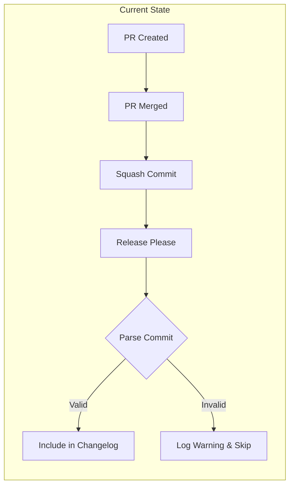
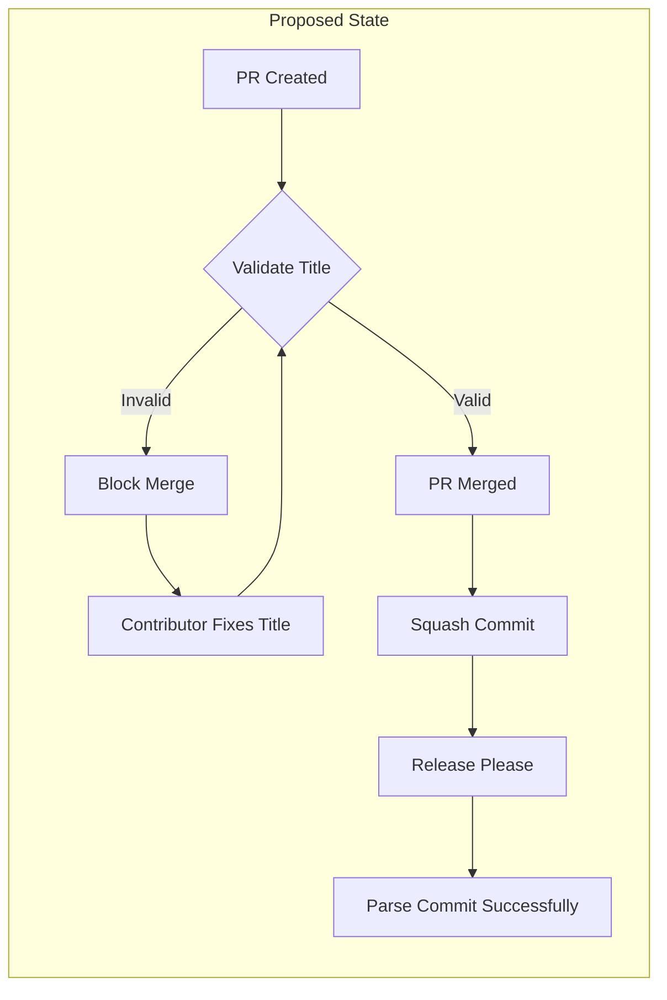
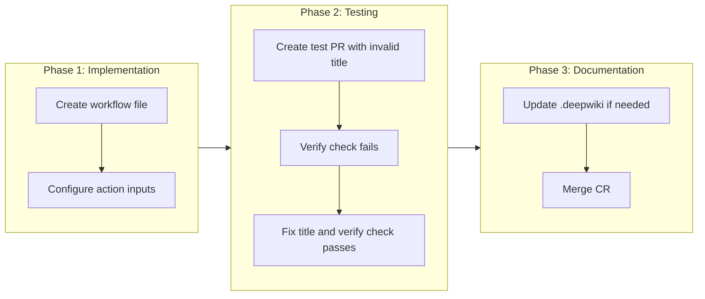

# Add PR Title Validation Workflow

## Change Summary

Add a GitHub Actions workflow that validates pull request titles follow the Conventional Commits specification. This prevents malformed commit messages from being merged via squash merge, which causes release-please to fail parsing commits.

## Motivation and Background

On 2026-02-10, the release-please workflow run [#21881088289](https://github.com/desek/governance/actions/runs/21881088289/job/63163480450) logged a parsing error:

```
❯ commit could not be parsed: 1a2515f564a26ed827da0328f4eb551037c1ed3d Dev/cr 0007 (#10)
❯ error message: Error: unexpected token ' ' at 1:7, valid tokens [(, !, :]
```

The PR title "Dev/cr 0007 (#10)" does not follow Conventional Commits format. Since the repository uses squash merge (per AGENTS.md), the PR title becomes the commit message. When release-please encounters non-conforming commits, it cannot parse them for changelog generation.

## Change Drivers

* Release-please parsing failures on non-conforming commit messages
* Repository policy requires Conventional Commits (AGENTS.md)
* Squash merge strategy means PR titles become commit messages
* Need to catch violations before merge, not after

## Current State

Currently, there is no automated validation of PR titles. Contributors can create PRs with any title format, and these become commit messages after squash merge. Release-please then fails to parse these commits, logging warnings but continuing execution.

### Current State Diagram



## Proposed Change

Add a new GitHub Actions workflow that runs on pull request events and validates the PR title against Conventional Commits specification using the `amannn/action-semantic-pull-request` action. The workflow will fail if the PR title does not conform, blocking merge until corrected.

### Proposed State Diagram



## Requirements

### Functional Requirements

1. The system **MUST** validate PR titles on `pull_request` events (opened, edited, synchronize, reopened)
2. The system **MUST** enforce Conventional Commits format: `<type>[optional scope]: <description>`
3. The system **MUST** allow the following commit types: `feat`, `fix`, `docs`, `style`, `refactor`, `test`, `chore`, `perf`, `ci`, `build`, `revert`
4. The system **MUST** fail the check and block merge when PR title is invalid
5. The system **MUST** provide clear error messages indicating what is wrong with the PR title
6. The system **MUST** allow optional scopes in parentheses after the type
7. The system **MUST** require a colon and space after the type (and optional scope)
8. The system **MUST** require a non-empty description after the colon

### Non-Functional Requirements

1. The system **MUST** complete validation within 30 seconds
2. The system **MUST** use a well-maintained, widely-adopted action for validation
3. The system **MUST** not require additional secrets or tokens beyond default GITHUB_TOKEN

## Affected Components

* `.github/workflows/` - new workflow file
* Pull request process - new required check
* Repository settings - branch protection rules (manual configuration)

## Scope Boundaries

### In Scope

* New GitHub Actions workflow for PR title validation
* Configuration of allowed commit types per Conventional Commits spec
* Documentation of the new workflow in this CR

### Out of Scope ("Here, But Not Further")

* Commit message body validation - only title is validated
* Local git hook for commit message validation - deferred to future CR
* Automated fixing of PR titles - contributors must fix manually
* Branch protection rule configuration - requires manual setup by repository admin

## Implementation Approach

Create a new workflow file `.github/workflows/pr-title.yml` that:

1. Triggers on pull_request events (opened, edited, synchronize, reopened)
2. Uses `amannn/action-semantic-pull-request@v5` action
3. Configures allowed types matching Conventional Commits specification
4. Provides helpful error messages with link to Conventional Commits documentation

### Implementation Flow



### Workflow Implementation

```yaml
# .github/workflows/pr-title.yml
name: PR Title

on:
  pull_request:
    types:
      - opened
      - edited
      - synchronize
      - reopened

permissions:
  pull-requests: read

jobs:
  validate:
    name: Validate PR Title
    runs-on: ubuntu-latest
    steps:
      - uses: amannn/action-semantic-pull-request@v5
        env:
          GITHUB_TOKEN: ${{ secrets.GITHUB_TOKEN }}
        with:
          types: |
            feat
            fix
            docs
            style
            refactor
            test
            chore
            perf
            ci
            build
            revert
          requireScope: false
          subjectPattern: ^.+$
          subjectPatternError: |
            The PR title "{subject}" does not follow Conventional Commits format.
            
            Expected format: <type>[optional scope]: <description>
            
            Examples:
              feat: add new feature
              fix(auth): resolve login issue
              docs(readme): update installation instructions
            
            See: https://www.conventionalcommits.org/
```

## Test Strategy

### Tests to Add

| Test File | Test Name | Description | Inputs | Expected Output |
|-----------|-----------|-------------|--------|-----------------|
| Manual | Invalid PR title test | Create PR with title "Dev/test" | PR title: "Dev/test" | Check fails with error message |
| Manual | Valid PR title test | Create PR with title "docs(cr): add CR-0008" | PR title: "docs(cr): add CR-0008" | Check passes |
| Manual | Valid PR title without scope | Create PR with title "fix: resolve issue" | PR title: "fix: resolve issue" | Check passes |

### Tests to Modify

Not applicable - this is a new workflow with no existing tests.

### Tests to Remove

Not applicable - no tests to remove.

## Acceptance Criteria

### AC-1: Invalid PR title blocks merge

```gherkin
Given a pull request is created with title "Dev/test feature"
When the PR title validation workflow runs
Then the check fails with status "failure"
  And the error message explains the Conventional Commits format
  And the PR cannot be merged while the check is failing
```

### AC-2: Valid PR title allows merge

```gherkin
Given a pull request is created with title "feat: add new feature"
When the PR title validation workflow runs
Then the check passes with status "success"
  And the PR can be merged
```

### AC-3: PR title with scope validates correctly

```gherkin
Given a pull request is created with title "fix(auth): resolve login issue"
When the PR title validation workflow runs
Then the check passes with status "success"
```

### AC-4: Editing PR title triggers revalidation

```gherkin
Given a pull request exists with an invalid title
  And the PR title validation check has failed
When the contributor edits the PR title to a valid format
Then the PR title validation workflow runs again
  And the check passes with status "success"
```

### AC-5: All standard commit types are allowed

```gherkin
Given a pull request is created
When the PR title uses any of: feat, fix, docs, style, refactor, test, chore, perf, ci, build, revert
Then the check passes with status "success"
```

## Quality Standards Compliance

### Build & Compilation

- [x] Code compiles/builds without errors (YAML syntax valid)
- [x] No new compiler warnings introduced

### Linting & Code Style

- [x] All linter checks pass with zero warnings/errors
- [x] Code follows project coding conventions and style guides
- [x] Any linter exceptions are documented with justification

### Test Execution

- [ ] All existing tests pass after implementation
- [ ] All new tests pass (manual verification)
- [ ] Test coverage meets project requirements for changed code

### Documentation

- [x] Inline code documentation updated where applicable
- [x] API documentation updated for any API changes (N/A)
- [x] User-facing documentation updated if behavior changes (this CR)

### Code Review

- [ ] Changes submitted via pull request
- [ ] PR title follows Conventional Commits format
- [ ] Code review completed and approved
- [ ] Changes squash-merged to maintain linear history

### Verification Commands

```bash
# Validate YAML syntax
python3 -c "import yaml; yaml.safe_load(open('.github/workflows/pr-title.yml'))"

# Or using yq if available
yq eval '.name' .github/workflows/pr-title.yml
```

## Risks and Mitigation

### Risk 1: Action version deprecation

**Likelihood:** low
**Impact:** medium
**Mitigation:** Pin to major version (v5) which receives security updates. Monitor for deprecation notices.

### Risk 2: False positives blocking legitimate PRs

**Likelihood:** low
**Impact:** high
**Mitigation:** Configure comprehensive list of allowed types. Provide clear error messages with examples.

### Risk 3: Contributors unfamiliar with Conventional Commits

**Likelihood:** medium
**Impact:** low
**Mitigation:** Error message includes link to Conventional Commits documentation and examples.

## Dependencies

* None - uses existing GitHub Actions infrastructure

## Estimated Effort

* Implementation: 0.5 hours
* Testing: 0.5 hours
* Documentation: 1 hour (this CR)
* **Total: 2 hours**

## Decision Outcome

Chosen approach: "Use amannn/action-semantic-pull-request action", because it is well-maintained (1.5k+ stars), specifically designed for this purpose, and provides clear error messages with customizable validation rules.

## Related Items

* Links to related change requests: CR-0004-release-please-workflow.md
* Links to issues/tickets: Release-please parsing failure in run #21881088289
* Links to documentation: https://www.conventionalcommits.org/
