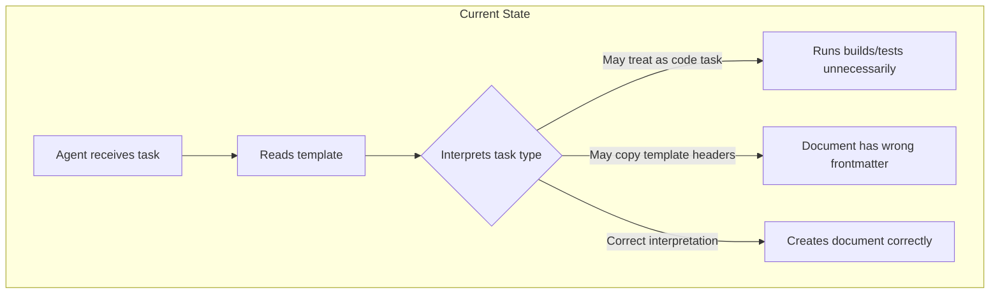
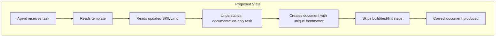
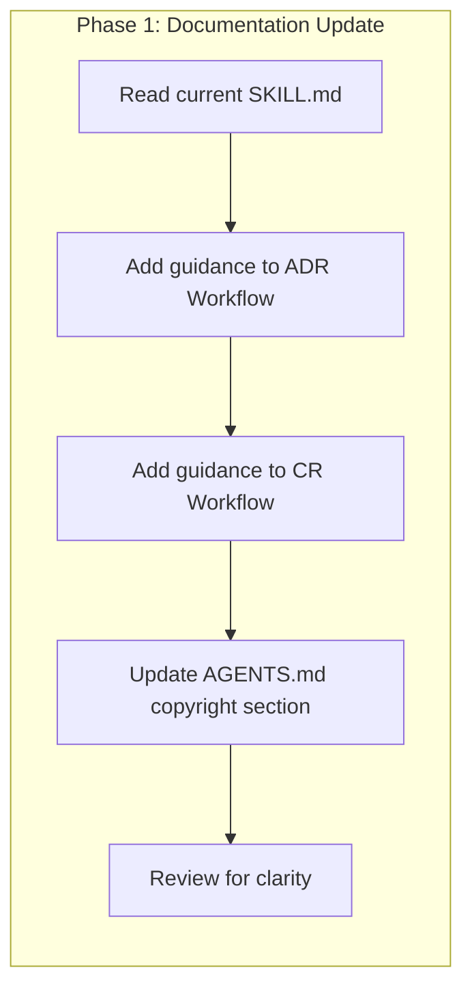

# Governance Document Creation Guidelines

## Change Summary

Clarify three key aspects of the governance document creation process: (1) creating a Change Request (CR) is a documentation-only task, (2) creating an Architecture Decision Record (ADR) is a documentation-only task, and (3) created CR and ADR documents must omit the `metadata.copyright` and `metadata.version` frontmatter fields. The implementation is done in the `skills/governance` directory which contains the source of the project's governance skill. Currently, the governance skill instructions do not explicitly state these constraints, which can lead to agents treating document creation as a code task or including unnecessary metadata fields in output documents.

## Motivation and Background

The governance skill provides templates for CRs and ADRs that contain their own frontmatter copyright headers identifying them as templates. For example, the CR template contains:

```yaml
---
name: cr-template
description: Template for creating Change Requests (CRs).
metadata:
  copyright: Copyright Daniel Grenemark 2026
  version: "0.0.1"
---
```

And the ADR template contains:

```yaml
---
name: adr-template
description: Template for creating Architecture Decision Records (ADRs).
metadata:
  copyright: Copyright Daniel Grenemark 2026
  version: "0.0.1"
---
```

These template-level copyright headers describe the template files themselves, not the documents produced from them. When an agent creates a new CR or ADR, the output document must have its own unique frontmatter with its own `name` and `description` fields — not the template's values. The template's `name: cr-template` or `name: adr-template` and `description: Template for creating...` are metadata about the template, not about the document being created. Furthermore, created CR and ADR documents must omit the `metadata.copyright` and `metadata.version` fields entirely, as these are not applicable to governance documents.

Additionally, agents may incorrectly classify CR or ADR creation as a code change task, triggering unnecessary build steps, test execution, or linting. Since these are purely documentation artifacts written in Markdown, no code compilation, test execution, or linting is required.

## Change Drivers

* Agents may copy template copyright headers verbatim into created documents, producing incorrect frontmatter
* Agents may include `metadata.copyright` and `metadata.version` fields in created documents where they are not applicable
* Agents may treat governance document creation as a code task, wasting time on unnecessary build and test steps
* The governance skill instructions do not explicitly state that CR and ADR creation are documentation-only tasks
* The distinction between template metadata and document metadata is not documented

## Current State

The governance skill (`skills/governance/SKILL.md`) provides ADR and CR workflows with checklists. The templates (`skills/governance/templates/CR.md` and `skills/governance/templates/ADR.md`) contain frontmatter with `name`, `description`, and `metadata` fields that identify them as templates. The skill instructions do not explicitly state:

1. That creating a CR is a documentation-only task requiring no code changes, builds, or tests
2. That creating an ADR is a documentation-only task requiring no code changes, builds, or tests
3. That the template's own frontmatter values (particularly `name: cr-template`, `name: adr-template`, and their descriptions) must not appear in created documents
4. That created documents must omit the `metadata.copyright` and `metadata.version` fields

### Current State Diagram



## Proposed Change

Update the governance skill documentation (`skills/governance/SKILL.md`) and `AGENTS.md` to explicitly state that:

1. Creating a CR is a documentation-only task — no code compilation, test execution, or linting is required
2. Creating an ADR is a documentation-only task — no code compilation, test execution, or linting is required
3. The CR and ADR template copyright headers (the template's own `name`, `description`, and `metadata` fields) must not be used in created documents; each created document must have its own unique frontmatter values
4. Created CR and ADR documents must omit the `metadata.copyright` and `metadata.version` frontmatter fields

The implementation is done in the `skills/governance` directory which contains the source of the project's governance skill. Additionally, `AGENTS.md` must be updated to reflect that `metadata.copyright` and `metadata.version` are not required for all Markdown files.

### Proposed State Diagram



## Requirements

### Functional Requirements

1. The governance skill documentation **MUST** explicitly state that creating a CR is a documentation-only task
2. The governance skill documentation **MUST** explicitly state that creating an ADR is a documentation-only task
3. The governance skill documentation **MUST** explicitly state that no code compilation, test execution, or linting is required when creating CRs or ADRs
4. The governance skill documentation **MUST** explicitly state that the CR template's frontmatter values (`name: cr-template`, `description: Template for creating Change Requests (CRs).`) must not appear in created CR documents
5. The governance skill documentation **MUST** explicitly state that the ADR template's frontmatter values (`name: adr-template`, `description: Template for creating Architecture Decision Records (ADRs).`) must not appear in created ADR documents
6. The governance skill documentation **MUST** instruct that each created document must have its own unique `name` and `description` frontmatter values appropriate to the specific CR or ADR being created
7. The governance skill documentation **MUST** instruct that created CR and ADR documents must omit the `metadata.copyright` and `metadata.version` frontmatter fields
8. `AGENTS.md` **MUST** be updated to reflect that `metadata.copyright` and `metadata.version` fields are not required for governance documents (CRs and ADRs)

### Non-Functional Requirements

1. The documentation updates **MUST** be clear and unambiguous to prevent misinterpretation by AI agents
2. The documentation updates **MUST** be placed within the existing workflow sections (ADR Workflow and CR Workflow) where agents will encounter them during document creation
3. The documentation updates **MUST** not alter the existing template files themselves

## Affected Components

* `skills/governance/SKILL.md` — governance skill documentation (primary change target)
* `AGENTS.md` — project-level agent guidelines (copyright section update)

## Scope Boundaries

### In Scope

* Updating the governance skill `skills/governance/SKILL.md` to add explicit guidance about documentation-only task classification
* Updating the governance skill `skills/governance/SKILL.md` to add explicit guidance about template copyright header exclusion
* Adding clear instructions that created documents must have unique frontmatter values
* Adding clear instructions that created documents must omit `metadata.copyright` and `metadata.version` fields
* Updating `AGENTS.md` copyright section to reflect that governance documents omit `metadata.copyright` and `metadata.version`

### Out of Scope ("Here, But Not Further")

* Modifying the CR template (`skills/governance/templates/CR.md`) — the template itself is correct; the issue is about how agents use it
* Modifying the ADR template (`skills/governance/templates/ADR.md`) — the template itself is correct; the issue is about how agents use it
* Adding validation tooling to enforce these guidelines programmatically — deferred to a future CR if needed
* Modifying existing CRs or ADRs that may have incorrect frontmatter — those can be corrected independently

## Alternative Approaches Considered

* **Modify the templates to remove their own copyright headers** — Rejected because the templates are files in the repository and per `AGENTS.md` guidelines, all files must have copyright headers. The templates correctly have their own copyright headers; the issue is agents copying them.
* **Add comments inside the templates warning not to copy headers** — Considered but insufficient alone. Agents may not process HTML comments reliably. The primary fix should be in the skill instructions that agents follow as workflow guidance.
* **Create a pre-commit hook to validate frontmatter** — Out of scope for this CR. Programmatic enforcement could be a future enhancement but the immediate need is clear documentation.

## Impact Assessment

### User Impact

No end-user impact. This change affects only the AI agent workflow for creating governance documents. Human contributors who create CRs or ADRs manually will benefit from clearer instructions.

### Technical Impact

Minimal technical impact. The change modifies the governance skill documentation (`skills/governance/SKILL.md`) and the project-level agent guidelines (`AGENTS.md`). No code, configuration, or infrastructure changes are required.

### Business Impact

Reduces wasted agent time on unnecessary build/test cycles during documentation tasks. Prevents incorrect frontmatter in governance documents, improving document quality and consistency.

## Implementation Approach

The implementation is a documentation update across two files in the `skills/governance` directory and the project root:

1. Open `skills/governance/SKILL.md`
2. Add a "Documentation-Only Task" note to the ADR Workflow section stating that ADR creation requires no code changes, builds, or tests
3. Add a "Documentation-Only Task" note to the CR Workflow section stating that CR creation requires no code changes, builds, or tests
4. Add a "Template Frontmatter" note to both workflow sections clarifying that the template's own `name`, `description`, and copyright metadata must not be copied into created documents
5. Add explicit guidance that created documents must omit `metadata.copyright` and `metadata.version` fields
6. Update `AGENTS.md` copyright section to note that governance documents (CRs and ADRs) omit `metadata.copyright` and `metadata.version` fields
7. Verify the updated files read clearly and the guidance is positioned where agents will encounter it during their workflow

### Implementation Flow



## Test Strategy

### Tests to Add

This is a documentation-only change. No automated tests are applicable.

| Test File | Test Name | Description | Inputs | Expected Output |
|-----------|-----------|-------------|--------|-----------------|
| Not applicable | Not applicable | Documentation-only change — no code tests required | N/A | N/A |

### Tests to Modify

Not applicable — no existing tests are affected by documentation changes.

| Test File | Test Name | Current Behavior | New Behavior | Reason for Change |
|-----------|-----------|------------------|--------------|-------------------|
| Not applicable | Not applicable | N/A | N/A | N/A |

### Tests to Remove

Not applicable — no tests need removal.

| Test File | Test Name | Reason for Removal |
|-----------|-----------|-------------------|
| Not applicable | Not applicable | N/A |

## Acceptance Criteria

### AC-1: ADR creation identified as documentation-only task

```gherkin
Given an agent reads the governance skill SKILL.md
When the agent follows the ADR Workflow section
Then the agent finds explicit guidance that ADR creation is a documentation-only task
  And the agent finds explicit guidance that no code compilation, test execution, or linting is required
```

### AC-2: CR creation identified as documentation-only task

```gherkin
Given an agent reads the governance skill SKILL.md
When the agent follows the CR Workflow section
Then the agent finds explicit guidance that CR creation is a documentation-only task
  And the agent finds explicit guidance that no code compilation, test execution, or linting is required
```

### AC-3: Template frontmatter exclusion for ADR

```gherkin
Given an agent reads the governance skill SKILL.md
When the agent follows the ADR Workflow section
Then the agent finds explicit guidance that the ADR template's frontmatter values must not be copied into created documents
  And the agent finds explicit guidance that each ADR must have its own unique name and description
```

### AC-4: Template frontmatter exclusion for CR

```gherkin
Given an agent reads the governance skill SKILL.md
When the agent follows the CR Workflow section
Then the agent finds explicit guidance that the CR template's frontmatter values must not be copied into created documents
  And the agent finds explicit guidance that each CR must have its own unique name and description
```

### AC-5: Correct frontmatter in created documents

```gherkin
Given an agent creates a new CR or ADR following the updated SKILL.md
When the agent writes the document frontmatter
Then the document's name field reflects the specific document (e.g., cr-0009-governance-document-creation-guidelines)
  And the document's description field describes the specific document's purpose
  And the document does not contain name: cr-template or name: adr-template
  And the document does not contain description: Template for creating Change Requests (CRs). or description: Template for creating Architecture Decision Records (ADRs).
```

### AC-6: Templates remain unchanged

```gherkin
Given the implementation of this CR is complete
When the template files are inspected
Then templates/CR.md is unchanged from its current state
  And templates/ADR.md is unchanged from its current state
```

## Quality Standards Compliance

### Build & Compilation

- [x] Not applicable — documentation-only change

### Linting & Code Style

- [x] Not applicable — documentation-only change

### Test Execution

- [x] Not applicable — documentation-only change

### Documentation

- [x] Governance skill SKILL.md updated with new guidance
- [x] Guidance is clear and unambiguous

### Code Review

- [ ] Changes submitted via pull request
- [ ] PR title follows Conventional Commits format: `docs(cr): add CR-0009 governance document creation guidelines`
- [ ] Code review completed and approved
- [ ] Changes squash-merged to maintain linear history

### Verification Commands

```bash
# No build, lint, or test commands required — documentation-only change

# Verify the CR file exists
ls docs/cr/CR-0009-governance-document-creation-guidelines.md

# Verify SKILL.md contains the new guidance (after implementation)
grep -c "documentation-only" skills/governance/SKILL.md

# Verify AGENTS.md has been updated
grep -c "governance" AGENTS.md
```

## Risks and Mitigation

### Risk 1: Agents may not read the updated SKILL.md guidance

**Likelihood:** low
**Impact:** medium
**Mitigation:** Place the guidance prominently within the workflow checklists that agents follow step-by-step, rather than in a separate section they might skip.

### Risk 2: Guidance may be too verbose and reduce readability

**Likelihood:** low
**Impact:** low
**Mitigation:** Keep the additions concise and use formatting (bold, bullet points) to make key points scannable.

## Dependencies

* No dependencies on other CRs or external systems

## Estimated Effort

Approximately 1 person-hour for the documentation update and review.

## Decision Outcome

Chosen approach: "Update governance skill SKILL.md with explicit guidance", because it addresses the root cause (missing instructions) at the point where agents consume workflow guidance, without modifying templates that are correctly structured.

## Related Items

* Templates: `skills/governance/templates/CR.md`, `skills/governance/templates/ADR.md`
* Governance skill: `skills/governance/SKILL.md`
* Copyright guidelines: `AGENTS.md`
