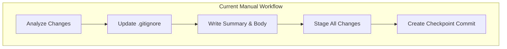
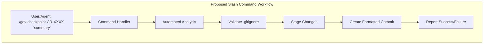
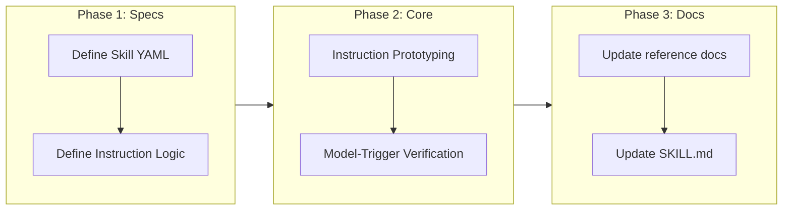

<!--
=============================================================================
CHANGE REQUEST: REFACTOR CHECKPOINT TO SLASH COMMAND
=============================================================================
-->

# Refactor Governance Checkpoint to Slash Command

## Change Summary

Refactor the existing manual governance checkpoint workflow into a unified slash command `/gov:checkpoint`. This change will transition the checkpoint process from a set of documented manual steps into an automated command implemented as a **Claude Code Skill**. The skill **MUST** handle change analysis, `.gitignore` validation, and commit creation through a set of **Instruction-Based Steps** defined in the `SKILL.md`. This avoids the need for a separate shell script and instead leverages the model's ability to execute complex workflows directly within the skill's context. This approach also allows for **model-triggered commits** by removing the `disable-model-invocation: true` constraint, while still being available as a user-initiated slash command.

## Motivation and Background

The current checkpoint workflow (defined in CR-0006) requires users or agents to manually perform multiple steps: analyze changes, update `.gitignore`, write a summary, stage changes, and finally create a formatted commit. While effective for preserving work-in-progress, this manual process is:
1. **Error-prone**: Users might skip `.gitignore` validation or use incorrect commit formats.
2. **Verbose**: It requires multiple tool calls or long thought blocks for agents to execute correctly.
3. **Inconsistent**: Different agents or users might interpret the "detailed body" requirement differently.

By refactoring this into a slash command, we provide a "golden path" for work preservation that is easier to use, faster to execute, and guarantees compliance with governance standards.

## Change Drivers

* **User Experience**: Simplifies the complex multi-step process into a single command.
* **Automation**: Makes it easier for scripts and LLM-based agents to trigger checkpoints reliably.
* **Consistency**: Ensures every checkpoint commit follows the exact `checkpoint(CR-xxxx): {summary}` format.
* **Reliability**: Automates the mandatory `.gitignore` check to prevent repository bloat.

## Current State

Currently, the checkpoint workflow is documented in `skills/governance/reference/checkpoint.md` and referenced in the `governance` skill's `SKILL.md`. It consists of five manual steps that must be executed in sequence.

### Current State Diagram



## Proposed Change

Introduce a new slash command `/gov:checkpoint` implemented as a Claude Code Skill in `.claude/skills/gov-checkpoint/SKILL.md`. This skill will encapsulate the entire workflow through a series of natural language instructions. The command **MUST** use the `$ARGUMENTS` placeholder to accept optional arguments for the CR number and summary. By providing the model with clear instructions, we ensure it can accurately analyze changes and create the commit without a separate script, allowing the model to trigger checkpoints when appropriate.

### Skill Definition Example

```yaml
---
name: gov:checkpoint
description: Creates a Git checkpoint commit for work-in-progress.
argument-hint: [CR-XXXX] [summary]
allowed-tools: Bash, Read, Grep, Glob
---

Follow these instructions to create a checkpoint for $ARGUMENTS:

1. **Analyze Changes**: Run `git status` and `git diff` to identify all staged and unstaged changes, as well as untracked files.
2. **Validate .gitignore**: Ensure no temporary or ignored files are about to be staged. Update `.gitignore` if necessary.
3. **Stage Changes**: Execute `git add -A` to stage all relevant changes.
4. **Draft Commit Message**:
   - Use the format `checkpoint(CR-xxxx): {summary}` where `CR-xxxx` and `{summary}` are from `$ARGUMENTS`.
   - If missing, infer them from context.
   - Include a detailed body with a list of modified files and a brief summary of what changed.
5. **Create Commit**: Execute `git commit -m "{message}"`.
6. **Report**: Share the commit hash and a summary of the action taken.
```

### Proposed State Diagram



## Requirements

### Functional Requirements

1. The system **MUST** provide a `/gov:checkpoint` command implemented as a Claude Code Skill.
2. The skill **SHOULD NOT** include `disable-model-invocation: true` in its frontmatter, allowing the model to suggest or trigger checkpoints during long development tasks.
3. The skill **MUST** use `$ARGUMENTS` (or `$0`, `$1`) to capture the CR identifier and summary.
4. The command **MUST** automatically perform a `git add -A` to stage all changes, including untracked files.
5. The command **MUST** validate that no sensitive or large temporary files are being staged by checking against `.gitignore` before committing.
6. The command **MUST** require a CR identifier (e.g., `CR-0010`) and a summary string as input.
7. If the CR identifier or summary is missing, the command **MUST** infer them from the current context or prompt for a clear error message.
8. The command **MUST** generate a commit message in the format: `checkpoint(CR-xxxx): {summary}\n\n{detailed_body}` based on the analysis of the actual changes.
9. The detailed body **MUST** include a list of modified files and a summary of changes detected during the analysis phase.
10. The command **MUST** fail if there are no changes to commit.
11. The command **MUST** provide clear feedback to the user upon successful commit, including the commit hash.

### Non-Functional Requirements

1. The execution of the `/gov:checkpoint` command **MUST** take less than 5 seconds for repositories with fewer than 1000 changed files.
2. The command **MUST** be idempotent; running it multiple times with no new changes should result in a graceful "no changes" message.
3. The implementation **MUST** be compatible with the existing `governance` skill structure.
4. The command **MUST NOT** perform destructive operations like `git reset` or `git push`.

## Affected Components

* `skills/governance/SKILL.md`: Update "Checkpoint Workflow" section to promote the slash command.
* `skills/governance/reference/checkpoint.md`: Update documentation to reflect the new instruction-based workflow.
* `skills/governance/reference/checkpoint-hooks.md`: Update hook configuration examples to use the `/gov:checkpoint` slash command.
* `docs/cr/CR-0010-checkpoint-slash-command.md`: This document defining the change.
* `.claude/skills/gov-checkpoint/SKILL.md`: New skill definition containing the instructions.

## Scope Boundaries

### In Scope

* Definition and implementation of the `/gov:checkpoint` slash command logic.
* Automation of change analysis and commit message generation.
* Integration with the existing governance skill documentation.
* Validation of `.gitignore` as part of the command execution.

### Out of Scope ("Here, But Not Further")

* Automated pushing of checkpoint commits to remote repositories.
* Squash merging functionality (remains a separate manual or automated step at PR time).
* Support for non-Git version control systems.
* Migration of existing checkpoint commits to a new format (they are already compatible).

## Alternative Approaches Considered

1. **Keep Manual Workflow**: Rejected because it remains a point of friction and inconsistency for users and agents.
2. **Git Alias**: Considered creating a Git alias `git checkpoint`. Rejected because it doesn't easily handle the "detailed body" generation or the integration with LLM agent instructions as well as a native slash command/tool.
3. **Automated Background Checkpoints**: Considered triggering checkpoints on a timer. Rejected as it might capture incomplete or broken states that the user didn't intend to checkpoint yet.

## Impact Assessment

### User Impact

Users will experience a much simpler interface for preserving work. Instead of remembering 5 steps, they only need to remember one command. This will lead to more frequent and higher-quality checkpoints.

### Technical Impact

Introduction of a new command handler. Minimal impact on existing Git workflows as it builds on standard Git commands. Requires updating agent instructions to favor the new command over manual steps.

### Business Impact

Higher developer productivity and better project traceability. More reliable checkpoints ensure that work is never lost and that the evolution of a feature is well-documented through its CR-linked commits.

## Implementation Approach

### Phase 1: Skill Definition
Define the `SKILL.md` in `.claude/skills/gov-checkpoint/`. Set appropriate frontmatter (`name`, `description`). Use `$ARGUMENTS` for input handling.

### Phase 2: Instruction Refinement
Draft the natural language instructions within `SKILL.md` to guide the model through:
1. Analysis of current Git state.
2. Verification of `.gitignore` compliance.
3. Message construction using context-aware details.
4. Execution of the `git commit` command.

### Phase 3: Documentation Update
Update `SKILL.md`, `checkpoint.md`, and `checkpoint-hooks.md` to deprecate the manual steps in favor of the `/gov:checkpoint` command and the model-triggered checkpoint capability. Ensure the hook configuration examples in `checkpoint-hooks.md` are updated to use the new slash command.

### Implementation Flow



## Test Strategy

### Tests to Add

| Test File | Test Name | Description | Inputs | Expected Output |
|-----------|-----------|-------------|--------|-----------------|
| `tests/checkpoint_test.sh` | `test_checkpoint_basic` | Verify basic checkpoint creation | CR-0010, "test summary" | Commit with correct subject/body |
| `tests/checkpoint_test.sh` | `test_checkpoint_no_changes` | Verify behavior when no changes exist | CR-0010, "summary" | Exit with "no changes" message |
| `tests/checkpoint_test.sh` | `test_checkpoint_missing_args` | Verify error on missing arguments | (empty) | Error message requesting CR ID |
| `tests/checkpoint_test.sh` | `test_checkpoint_gitignore` | Verify ignored files are not committed | Ignored file modified | Ignored file remains unstaged |

### Tests to Modify

Not applicable. This is a new feature that augments existing manual workflows.

### Tests to Remove

Not applicable.

## Acceptance Criteria

### AC-1: Successful Checkpoint Creation

```gherkin
Given a repository with uncommitted changes
When I execute `/gov:checkpoint CR-0010 'implementing slash command'`
Then a new Git commit MUST be created
  And the commit subject MUST be 'checkpoint(CR-0010): implementing slash command'
  And the commit body MUST contain a list of changed files
```

### AC-2: Handling No Changes

```gherkin
Given a repository with no uncommitted changes
When I execute `/gov:checkpoint CR-0010 'some summary'`
Then no commit MUST be created
  And the system MUST report "No changes to checkpoint"
```

### AC-3: Validation of Arguments

```gherkin
Given I am in a repository
When I execute `/gov:checkpoint` without any arguments
Then the system MUST NOT create a commit
  And the system MUST prompt for or request a CR identifier and summary
```

## Quality Standards Compliance

### Build & Compilation
- [ ] Command script/binary builds without errors
- [ ] Integrated tool passes schema validation

### Linting & Code Style
- [ ] All shell/implementation scripts pass relevant linters
- [ ] Documentation follows project standards

### Test Execution
- [ ] All new checkpoint tests pass in the CI environment
- [ ] Existing Git workflows remain unaffected

### Verification Commands

```bash
# Verify the new command implementation (example)
./scripts/checkpoint.sh CR-TEST "verification run"

# Check Git log for correct format
git log -1 --pretty=format:"%B"
```

## Risks and Mitigation

### Risk 1: Over-staging files
**Likelihood:** medium
**Impact:** low
**Mitigation:** The command **MUST** explicitly rely on `.gitignore` and **SHOULD** provide a "dry-run" or confirmation if too many files (>50) are being staged.

### Risk 2: Incorrect CR ID
**Likelihood:** high
**Impact:** medium
**Mitigation:** The command **SHOULD** try to find the most recent CR ID used in the branch history to suggest as a default.

## Dependencies

* Requires a Git-enabled environment.
* Depends on the existence of CR documentation for ID validation (optional but recommended).

## Estimated Effort

* Command implementation: 4-6 hours
* Documentation updates: 2 hours
* Testing and validation: 2 hours
* **Total: 8-10 hours**

## Decision Outcome

Chosen approach: "Implement as a dedicated slash command/tool within the agent's environment", because it provides the highest level of automation and control over the commit quality while minimizing user effort.

## Related Items

* Links to related change requests: CR-0006, CR-0007
* Links to architecture decisions: ADR-0001 (Refactor Governance Skill)
