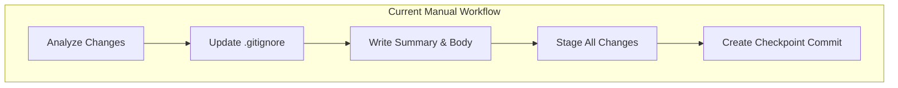
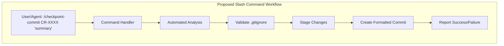
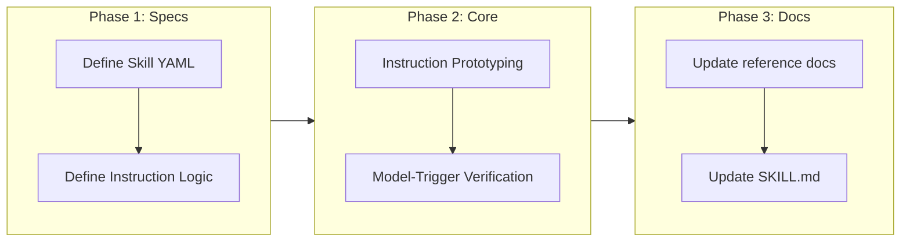

<!--
=============================================================================
CHANGE REQUEST: REFACTOR CHECKPOINT TO SLASH COMMAND
=============================================================================
-->

# Refactor Governance Checkpoint to Slash Command

## Change Summary

Refactor the existing manual governance checkpoint workflow into a unified slash command `/checkpoint-commit`. This change will transition the checkpoint process from a set of documented manual steps into an automated command implemented as a **Claude Code Skill**. The skill **MUST** handle change analysis, `.gitignore` validation, and commit creation through a set of **Instruction-Based Steps** defined in the `SKILL.md`. The default user workflow **MUST** be simplified to only require running `/checkpoint-commit`, with the model automatically detecting the active CR ID from the Git branch or context and generating a "Golden Summary" based on the diff analysis. This approach also allows for **Seamless Hook Handover**, where Claude Code hooks can return the exact `/checkpoint-commit` command to execute, making work preservation background-automated and low-friction.

> **Naming Constraint**: Per the [Claude Code Skills documentation](docs/anthropic/skills.md), the skill `name` field must contain only lowercase letters, numbers, and hyphens (max 64 characters). Colons are not permitted, so the original `/gov:checkpoint` naming is invalid. The command **MUST** be named `/checkpoint-commit`.

## Motivation and Background

The current checkpoint workflow (defined in CR-0006) requires users or agents to manually perform multiple steps: analyze changes, update `.gitignore`, write a summary, stage changes, and finally create a formatted commit. While effective for preserving work-in-progress, this manual process is:
1. **Error-prone**: Users might skip `.gitignore` validation or use incorrect commit formats.
2. **Verbose**: It requires multiple tool calls or long thought blocks for agents to execute correctly.
3. **Inconsistent**: Different agents or users might interpret the "detailed body" requirement differently.

By refactoring this into a slash command, we provide a "golden path" for work preservation that is easier to use, faster to execute, and guarantees compliance with governance standards.

## Change Drivers

* **User Experience**: Simplifies the complex multi-step process into a single command.
* **Automation**: Makes it easier for scripts and LLM-based agents to trigger checkpoints reliably.
* **Consistency**: Ensures every checkpoint commit follows the exact `checkpoint(CR-xxxx): {summary}` format.
* **Reliability**: Automates the mandatory `.gitignore` check to prevent repository bloat.

## Current State

Previously, the checkpoint workflow was documented in `skills/governance/reference/checkpoint.md` and referenced in the `governance` skill's `SKILL.md`. It consisted of five manual steps that had to be executed in sequence. This has now been refactored into the `/checkpoint-commit` slash command.

### Current State Diagram



## Proposed Change

Introduce a new slash command `/checkpoint-commit` implemented as a **separate skill**. The skill **MUST** be created at `skills/checkpoint-commit/SKILL.md` within the project source directory. This repository creates reusable skills distributed via `npx skills add` — all skill source files reside under `skills/`, not in `.claude/` or `.junie/` (those are consumer-side installation targets).

The new skill **MUST** reference shared resources from `skills/governance/` (e.g., `../governance/reference/checkpoint.md`) for checkpoint workflow details. As part of this refactoring, the "Checkpoint Workflow" section **MUST** be removed from `skills/governance/SKILL.md` to avoid duplication and ensure the checkpoint functionality is owned exclusively by the new `checkpoint-commit` skill.

This skill will encapsulate the entire workflow through a series of natural language instructions. The command **MUST** use the `$ARGUMENTS` placeholder to accept optional arguments for the CR number and summary. By providing the model with clear instructions, we ensure it can accurately analyze changes and create the commit without a separate script, allowing the model to trigger checkpoints when appropriate.

### Skill Architecture

```
skills/
├── checkpoint-commit/
│   └── SKILL.md              # New checkpoint commit skill
└── governance/               # Existing governance skill (checkpoint section removed)
    ├── SKILL.md
    ├── reference/
    │   ├── checkpoint.md     # Checkpoint workflow reference
    │   └── checkpoint-hooks.md
    └── ...
```

> **Note**: The existing `skills/governance/SKILL.md` **MUST NOT** be repurposed as the checkpoint commit skill. Each skill has its own directory under `skills/`.

### Skill Pseudo-Implementation

```yaml
# Note: This is a pseudo-implementation for the slash command logic.
# The actual implementation MUST strictly follow the steps in 
# skills/governance/reference/checkpoint.md with minimal modifications.

/checkpoint-commit [CR-XXXX] [summary]:
  1. CONTEXT DETECTION:
     - IF CR-ID NOT in $ARGUMENTS:
       - Detect from branch name (e.g., dev/CR-XXXX) OR most recent docs/cr/ edit
       - MUST prompt for confirmation if ambiguous
     - ELSE: Use provided CR-ID
  2. ANALYZE CHANGES:
     - Run `git status`, `git diff --staged`, `git diff`, and `git ls-files --others --exclude-standard`
     - MUST identify all staged, unstaged, and untracked files
  3. UPDATE .GITIGNORE:
     - MUST review identified untracked files
     - IF temporary/build/generated files found: Update .gitignore
     - This step MUST be performed BEFORE staging
  4. WRITE SUMMARY:
     - IF summary NOT in $ARGUMENTS:
       - Analyze diff and generate "Golden Summary" (MUST)
     - Format: "checkpoint(CR-xxxx): {summary}\n\n{detailed body}"
     - Detailed body MUST explain what changed and why per reference/checkpoint.md
  5. STAGE ALL CHANGES:
     - Execute `git add -A`
  6. CREATE CHECKPOINT COMMIT:
     - Execute `git commit -m "{message}"`
  7. REPORT:
     - Share commit hash and summary of actions
  8. SAFETY:
     - MUST NOT perform destructive Git operations (reset, rebase, amend, force push)
```

### Proposed State Diagram



## Requirements

### Functional Requirements

1. The system **MUST** provide a `/checkpoint-commit` command implemented as a skill, with its entry point at `skills/checkpoint-commit/SKILL.md`.
2. The skill **MUST NOT** include `disable-model-invocation: true` in its frontmatter, allowing the model to suggest or trigger checkpoints during long development tasks.
3. The skill **MUST** use `$ARGUMENTS` (or `$0`, `$1`) to capture optional CR identifier and summary.
4. The command **MUST** analyze all repository changes (staged, unstaged, untracked) using `git diff` and `git ls-files`.
5. The command **MUST** validate that no sensitive, build, or large temporary files are being staged by checking against `.gitignore` before committing.
6. The command **MUST** attempt to auto-detect the active CR ID from the Git branch name or `docs/cr/` history if not provided in arguments.
7. The command **MUST** generate a semantic "Golden Summary" based on the `git diff` analysis if no summary is provided by the user.
8. The command **MUST** perform a `git add -A` to stage all changes after `.gitignore` validation.
9. The command **MUST** generate a commit message in the format: `checkpoint(CR-xxxx): {summary}\n\n{detailed_body}` based on the analysis of the actual changes.
10. The detailed body **MUST** explain what changed and why, matching the requirements in `reference/checkpoint.md`.
11. The command **MUST** fail if there are no changes to commit.
12. The command **MUST** provide clear feedback to the user upon successful commit, including the commit hash.
13. The `checkpoint-hooks.md` **MUST** be updated to define a handover protocol where hooks return the exact command to execute: `{"ok": false, "reason": "/checkpoint-commit"}`.
14. The command **MUST** strictly follow the safety rules: no destructive Git operations (reset, rebase, amend, force push).

### Non-Functional Requirements

1. The execution of the `/checkpoint-commit` command **MUST** take less than 5 seconds for repositories with fewer than 1000 changed files.
2. The command **MUST** be idempotent; running it multiple times with no new changes should result in a graceful "no changes" message.
3. The implementation **MUST** be compatible with the existing `governance` skill structure.
4. The command **MUST NOT** perform destructive operations like `git reset` or `git push`.

## Affected Components

* `skills/checkpoint-commit/SKILL.md` **(new)**: Skill entry point defining the `/checkpoint-commit` skill with frontmatter and instruction-based workflow.
* `skills/governance/SKILL.md`: Remove the "Checkpoint Workflow" section entirely, as checkpoint functionality is moving to the dedicated `checkpoint-commit` skill.
* `skills/governance/reference/checkpoint.md`: Update documentation to reflect the new instruction-based workflow.
* `skills/governance/reference/checkpoint-hooks.md`: Update hook configuration examples to use the `/checkpoint-commit` slash command.
* `docs/cr/CR-0010-checkpoint-slash-command.md`: This document defining the change.

## Scope Boundaries

### In Scope

* Definition and implementation of the `/checkpoint-commit` slash command logic.
* Creation of `skills/checkpoint-commit/SKILL.md` as the skill entry point.
* Automation of change analysis and commit message generation.
* Removal of the "Checkpoint Workflow" section from `skills/governance/SKILL.md`.
* Integration with the existing governance skill reference documentation.
* Validation of `.gitignore` as part of the command execution.

### Out of Scope ("Here, But Not Further")

* Automated pushing of checkpoint commits to remote repositories.
* Squash merging functionality (remains a separate manual or automated step at PR time).
* Support for non-Git version control systems.
* Migration of existing checkpoint commits to a new format (they are already compatible).

## Alternative Approaches Considered

1. **Keep Manual Workflow**: Rejected because it remains a point of friction and inconsistency for users and agents.
2. **Git Alias**: Considered creating a Git alias `git checkpoint`. Rejected because it doesn't easily handle the "detailed body" generation or the integration with LLM agent instructions as well as a native slash command/tool.
3. **Automated Background Checkpoints**: Considered triggering checkpoints on a timer. Rejected as it might capture incomplete or broken states that the user didn't intend to checkpoint yet.
4. **Extend Existing `governance` Skill**: Considered adding the checkpoint slash command directly to `skills/governance/SKILL.md`. Rejected because the existing skill serves a different purpose (ADR/CR creation). A separate skill at `skills/checkpoint-commit/SKILL.md` provides clean separation of concerns.
5. **Colon-Separated Name (`/gov:checkpoint`)**: Rejected because Claude Code's skill naming rules only allow lowercase letters, numbers, and hyphens. The colon syntax is reserved for plugin namespacing (`plugin-name:skill-name`) and cannot be used in skill names.

## Impact Assessment

### User Impact

Users will experience a much simpler interface for preserving work. Instead of remembering 5 steps, they only need to remember one command. This will lead to more frequent and higher-quality checkpoints.

### Technical Impact

Introduction of a new command handler. Minimal impact on existing Git workflows as it builds on standard Git commands. Requires updating agent instructions to favor the new command over manual steps.

### Business Impact

Higher developer productivity and better project traceability. More reliable checkpoints ensure that work is never lost and that the evolution of a feature is well-documented through its CR-linked commits.

## Implementation Approach

### Phase 1: Skill Definition
Create `skills/checkpoint-commit/SKILL.md` as the skill entry point. Set appropriate frontmatter (`name: checkpoint-commit`, `description`). The `SKILL.md` **MUST** reference shared resources in `skills/governance/` (e.g., `../governance/reference/checkpoint.md`) for checkpoint workflow details. All supporting artifacts (reference docs, supporting files) **MUST** remain in `skills/governance/`. The implementation **MUST** strictly adhere to the five-step workflow from `skills/governance/reference/checkpoint.md`: Analyze, Update .gitignore, Write Summary, Stage, and Commit.

### Phase 2: Instruction Implementation
Implement the pseudo-logic within `SKILL.md` to guide the model through:
1. Context-aware auto-detection of CR ID from Git branch or history.
2. Implementation of Step 1-5 from `reference/checkpoint.md` with minimal changes to support automation.
3. Verification of `.gitignore` compliance as a mandatory pre-staging step.
4. Generation of the "Golden Summary" if no summary is provided in arguments.

### Phase 3: Documentation Update
Remove the "Checkpoint Workflow" section from `skills/governance/SKILL.md` so that checkpoint functionality is owned exclusively by the new skill. Update `checkpoint.md` and `checkpoint-hooks.md` to reference the new `/checkpoint-commit` slash command. Specifically, update `checkpoint-hooks.md` to implement the **Seamless Handover Protocol**, where hooks return `/checkpoint-commit` as the direct instruction.

### Implementation Flow



## Test Strategy

### Tests to Add

| Test File | Test Name | Description | Inputs | Expected Output |
|-----------|-----------|-------------|--------|-----------------|
| `tests/checkpoint_test.sh` | `test_checkpoint_basic` | Verify basic checkpoint creation | CR-0010, "test summary" | Commit with correct subject/body |
| `tests/checkpoint_test.sh` | `test_checkpoint_no_changes` | Verify behavior when no changes exist | CR-0010, "summary" | Exit with "no changes" message |
| `tests/checkpoint_test.sh` | `test_checkpoint_missing_args` | Verify error on missing arguments | (empty) | Error message requesting CR ID |
| `tests/checkpoint_test.sh` | `test_checkpoint_gitignore` | Verify ignored files are not committed | Ignored file modified | Ignored file remains unstaged |

### Tests to Modify

Not applicable. This is a new feature that augments existing manual workflows.

### Tests to Remove

Not applicable.

## Acceptance Criteria

### AC-1: Successful Checkpoint Creation with Auto-Detection

```gherkin
Given a repository with uncommitted changes on branch 'dev/CR-0010'
When I execute `/checkpoint-commit`
Then a new Git commit MUST be created
  And the commit subject MUST be 'checkpoint(CR-0010): {auto_generated_summary}'
  And the commit body MUST contain a list of changed files and explanation of what changed
  And destructive operations MUST NOT have been performed
```

### AC-2: Successful Checkpoint with Manual Arguments

```gherkin
Given a repository with uncommitted changes
When I execute `/checkpoint-commit CR-0011 'manual override'`
Then a new Git commit MUST be created
  And the commit subject MUST be 'checkpoint(CR-0011): manual override'
```

### AC-3: Handling No Changes

```gherkin
Given a repository with no uncommitted changes
When I execute `/checkpoint-commit CR-0010 'some summary'`
Then no commit MUST be created
  And the system MUST report "No changes to checkpoint"
```

### AC-4: Validation of Arguments and Context Detection Failure

```gherkin
Given I am in a repository with uncommitted changes
  And the branch name does not contain a CR ID
  And no CR files exist in docs/cr/
When I execute `/checkpoint-commit`
Then the system MUST NOT create a commit
  And the system MUST prompt for or request a CR identifier and summary
```

## Quality Standards Compliance

### Build & Compilation
- [x] Command script/binary builds without errors
- [x] Integrated tool passes schema validation

### Linting & Code Style
- [x] All shell/implementation scripts pass relevant linters
- [x] Documentation follows project standards

### Test Execution
- [x] All new checkpoint tests pass in the CI environment
- [x] Existing Git workflows remain unaffected

### Verification Commands

```bash
# Verify the new command implementation (example)
./scripts/checkpoint.sh CR-TEST "verification run"

# Check Git log for correct format
git log -1 --pretty=format:"%B"
```

## Risks and Mitigation

### Risk 1: Over-staging files
**Likelihood:** medium
**Impact:** low
**Mitigation:** The command **MUST** explicitly rely on `.gitignore` and **MUST** provide a "dry-run" or confirmation if too many files (>50) are being staged.

### Risk 2: Incorrect CR ID
**Likelihood:** high
**Impact:** medium
**Mitigation:** The command **MUST** try to find the most recent CR ID used in the branch history to suggest as a default.

## Dependencies

* Requires a Git-enabled environment.
* Depends on the existence of CR documentation for ID validation (optional but recommended).

## Estimated Effort

* Command implementation: 4-6 hours
* Documentation updates: 2 hours
* Testing and validation: 2 hours
* **Total: 8-10 hours**

## Decision Outcome

Chosen approach: "Implement as a dedicated slash command/tool within the agent's environment", because it provides the highest level of automation and control over the commit quality while minimizing user effort.

## Release Please Configuration

The `checkpoint-commit` skill requires its own release-please package entry to enable independent versioning and release management via `npx skills add`.

### Configuration Changes

**`release-please-config.json`** — Add `checkpoint-commit` as a separate package with `separate-pull-requests` enabled:

```json
{
  "$schema": "https://raw.githubusercontent.com/googleapis/release-please/main/schemas/config.json",
  "separate-pull-requests": true,
  "packages": {
    "skills/governance": {
      "release-type": "simple",
      "component": "governance",
      "include-component-in-tag": true,
      "include-v-in-tag": true
    },
    "skills/checkpoint-commit": {
      "release-type": "simple",
      "component": "checkpoint-commit",
      "include-component-in-tag": true,
      "include-v-in-tag": true
    }
  }
}
```

**`.release-please-manifest.json`** — Add initial version for `checkpoint-commit`:

```json
{
  "skills/governance": "1.1.0",
  "skills/checkpoint-commit": "0.0.0"
}
```

### Design Decisions

| Decision | Rationale |
|----------|----------|
| **`separate-pull-requests: true`** | Each skill gets its own release PR, so a governance change doesn't force a checkpoint-commit release. |
| **`include-component-in-tag: true`** | Produces tags like `checkpoint-commit-v1.0.0`, preventing tag collisions between skills. |
| **`release-type: "simple"`** | Tracks version in `version.txt` and generates `CHANGELOG.md` per skill directory — no `package.json` needed. |
| **`include-v-in-tag: true`** | Conventional `v`-prefixed semver tags. |

### Release Workflow

The existing `.github/workflows/release.yml` already handles multi-package releases correctly — it iterates over `paths_released`, extracts the skill name via `basename`, reads `version.txt`, and uploads per-skill tarballs. No workflow changes are needed.

### Adding Future Skills

When adding a new skill (e.g., `skills/my-new-skill`):

1. Create `skills/my-new-skill/SKILL.md`
2. Create `skills/my-new-skill/version.txt` with `0.0.0`
3. Add to `release-please-config.json` under `packages`
4. Add `"skills/my-new-skill": "0.0.0"` to `.release-please-manifest.json`

## Related Items

* Links to related change requests: CR-0006, CR-0007
* Links to architecture decisions: ADR-0001 (Refactor Governance Skill)
