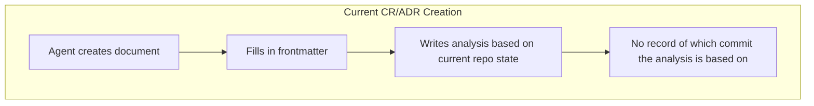
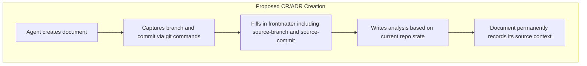
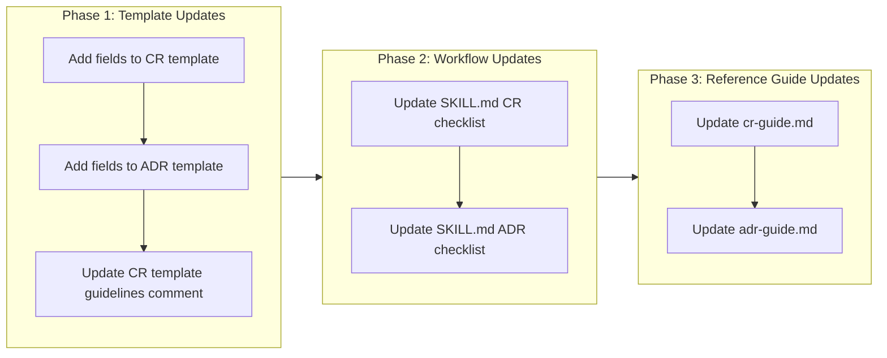

# Add Source Traceability to Governance Document Templates

## Change Summary

Currently, CR and ADR documents do not record the repository state (branch and commit) at the time of their creation. This makes it difficult to determine whether a governance document's analysis and implementation plan are still valid after subsequent changes to the repository. This CR proposes adding `source-branch` and `source-commit` frontmatter fields to both the CR and ADR templates, along with workflow instructions for populating them and guidance on when a document may need to be "rebased."

## Motivation and Background

When a CR is created, its analysis of the current state, impact assessment, and implementation plan are all based on a specific snapshot of the repository. If another CR is implemented before this one, the repository state changes and the original CR's assumptions may become invalid. Without recording the source commit, there is no systematic way to detect this staleness.

Similarly, ADRs document decisions based on the state of the codebase at a particular point in time. Knowing the exact commit helps reviewers understand the context in which the decision was made and whether the architectural landscape has shifted enough to warrant revisiting the decision.

Adding source traceability metadata enables:

1. **Staleness detection** — Compare the document's `source-commit` against the current HEAD to see what has changed since the document was written.
2. **Conflict identification** — When multiple CRs are in-flight, reviewers can determine if one CR's implementation invalidates another CR's analysis.
3. **Audit trail** — Provides a clear link between governance documents and the repository state they were based on.

## Change Drivers

* CRs can invalidate each other when implemented out of order, but there is no mechanism to detect this today
* Reviewers have no way to assess whether a CR's "Current State" section is still accurate
* ADR decisions may need revisiting after significant codebase changes, but there is no baseline to compare against

## Current State

The CR template (`skills/governance/templates/CR.md`) frontmatter contains:

```yaml
id: "CR-XXXX"
status: "{proposed | approved | rejected | implemented | on-hold | cancelled}"
date: {YYYY-MM-DD when the change request was last updated}
requestor: {person or team requesting the change}
stakeholders: {list everyone involved in reviewing/approving the change}
priority: "{critical | high | medium | low}"
target-version: {version or milestone when this change should be implemented}
```

The ADR template (`skills/governance/templates/ADR.md`) frontmatter contains:

```yaml
status: "{proposed | rejected | accepted | deprecated | … | superseded by ADR-0123"
date: {YYYY-MM-DD when the decision was last updated}
decision-makers: {list everyone involved in the decision}
consulted: {list everyone whose opinions are sought}
informed: {list everyone who is kept up-to-date on progress}
```

Neither template includes any reference to the repository state at the time of document creation. The SKILL.md workflow checklists and reference guides also do not mention capturing source traceability information.

### Current State Diagram



## Proposed Change

Add two new frontmatter fields to both the CR and ADR templates:

- **`source-branch`**: The Git branch name at the time of document creation (e.g., `main`, `feature/xyz`)
- **`source-commit`**: The short Git commit hash at the time of document creation (e.g., `807366a`)

These fields provide a precise reference point for the repository state that the document's analysis is based on. Agents creating governance documents **MUST** populate these fields by running `git rev-parse --abbrev-ref HEAD` and `git rev-parse --short HEAD`.

Additionally, update the SKILL.md workflow checklists and reference guides to instruct agents to capture this information during document creation.

### Proposed State Diagram



## Requirements

### Functional Requirements

1. The CR template **MUST** include `source-branch` and `source-commit` fields in its frontmatter
2. The ADR template **MUST** include `source-branch` and `source-commit` fields in its frontmatter
3. The SKILL.md CR workflow checklist **MUST** include a step to capture the current branch and commit
4. The SKILL.md ADR workflow checklist **MUST** include a step to capture the current branch and commit
5. The CR template guidelines comment block **MUST** document the purpose and population method for the new fields
6. The CR reference guide **MUST** document the source traceability fields and their usage
7. The ADR reference guide **MUST** document the source traceability fields and their usage
8. Agents creating CR or ADR documents **MUST** populate `source-branch` by running `git rev-parse --abbrev-ref HEAD`
9. Agents creating CR or ADR documents **MUST** populate `source-commit` by running `git rev-parse --short HEAD`

### Non-Functional Requirements

1. The template changes **MUST** be backward-compatible — existing CR and ADR documents without these fields remain valid
2. The additional frontmatter fields **MUST NOT** increase document creation time by more than a few seconds (two simple git commands)

## Affected Components

* `skills/governance/templates/CR.md` — CR template frontmatter and guidelines comment block
* `skills/governance/templates/ADR.md` — ADR template frontmatter
* `skills/governance/SKILL.md` — Workflow checklists for both CR and ADR creation
* `skills/governance/reference/cr-guide.md` — CR reference guide
* `skills/governance/reference/adr-guide.md` — ADR reference guide

## Scope Boundaries

### In Scope

* Adding `source-branch` and `source-commit` frontmatter fields to CR and ADR templates
* Updating SKILL.md workflow checklists to include source traceability capture steps
* Updating template guidelines comment block to document the new fields
* Updating CR and ADR reference guides to document the new fields

### Out of Scope ("Here, But Not Further")

* Backfilling existing CR and ADR documents with source traceability fields — existing documents remain valid without these fields
* Automated staleness detection tooling (e.g., a script that compares `source-commit` against HEAD) — deferred to a future CR
* Automated "rebase" workflow for governance documents — deferred to a future CR
* Changes to the checkpoint skill or any other skill beyond governance

## Alternative Approaches Considered

* **Full commit hash instead of short hash** — Rejected because the short hash is sufficient for identification and more readable in frontmatter. The full hash can always be resolved from the short hash.
* **Recording only the commit without the branch** — Rejected because the branch name provides useful context about whether the document was created from `main` (stable baseline) or a feature branch (potentially unstable baseline).
* **Adding a separate "Source Context" section in the document body** — Rejected because frontmatter is machine-parseable and can be used by future automated tooling for staleness detection.

## Impact Assessment

### User Impact

Agents creating governance documents will need to run two additional git commands and include the results in frontmatter. This is a minimal workflow addition that provides significant traceability benefits.

### Technical Impact

* No breaking changes — the new fields are additive
* Existing documents without these fields remain valid
* Future tooling can parse frontmatter to detect stale documents
* Templates grow by approximately 2-3 lines of frontmatter each

### Business Impact

* Reduces risk of implementing CRs based on outdated analysis
* Improves governance document quality and reliability
* Enables future automation for staleness detection

## Implementation Approach

This is a single-phase documentation change affecting five files in the governance skill source directory.

### Implementation Flow



### Detailed Implementation Steps

#### 1. CR Template (`skills/governance/templates/CR.md`)

Add to frontmatter after `target-version`:

```yaml
source-branch: {current Git branch name, from `git rev-parse --abbrev-ref HEAD`}
source-commit: {short commit hash, from `git rev-parse --short HEAD`}
```

Add to the template guidelines comment block (after section 0 "ID + FILENAME CONVENTION") a new section:

```
8. SOURCE TRACEABILITY (Required)
   - The `source-branch` and `source-commit` frontmatter fields **MUST** be populated
   - Run `git rev-parse --abbrev-ref HEAD` to get the branch name
   - Run `git rev-parse --short HEAD` to get the short commit hash
   - These fields record the repository state the document's analysis is based on
   - If the repository has changed significantly since `source-commit`, the CR may need
     to be reviewed and updated ("rebased") to reflect the current state
```

#### 2. ADR Template (`skills/governance/templates/ADR.md`)

Add to frontmatter after `informed`:

```yaml
source-branch: {current Git branch name, from `git rev-parse --abbrev-ref HEAD`}
source-commit: {short commit hash, from `git rev-parse --short HEAD`}
```

#### 3. SKILL.md Workflow Checklists

Update the CR workflow checklist:

```
- [ ] Read the template: templates/CR.md
- [ ] Check docs/cr/ for the next available number
- [ ] Capture current branch (`git rev-parse --abbrev-ref HEAD`) and commit (`git rev-parse --short HEAD`)
- [ ] Create file: docs/cr/CR-NNNN-{short-title}.md
- [ ] Fill in all required sections (including source-branch and source-commit in frontmatter)
- [ ] Write acceptance criteria in Gherkin format
- [ ] Set status to "proposed"
```

Update the ADR workflow checklist:

```
- [ ] Read the template: templates/ADR.md
- [ ] Check docs/adr/ for the next available number
- [ ] Capture current branch (`git rev-parse --abbrev-ref HEAD`) and commit (`git rev-parse --short HEAD`)
- [ ] Create file: docs/adr/ADR-NNNN-{short-title}.md
- [ ] Fill in all required sections (including source-branch and source-commit in frontmatter)
- [ ] Set status to "proposed"
```

#### 4. Reference Guides

Add a "Source Traceability" section to both `cr-guide.md` and `adr-guide.md` explaining:

* The purpose of `source-branch` and `source-commit` fields
* How to populate them
* When a document may need to be "rebased" (i.e., when the diff between `source-commit` and current HEAD affects the document's analysis or implementation plan)

## Test Strategy

### Tests to Add

| Test File | Test Name | Description | Inputs | Expected Output |
|-----------|-----------|-------------|--------|-----------------|
| `tests/governance/test_cr_template.bats` | `test_cr_template_has_source_branch_field` | Validates CR template frontmatter contains source-branch | CR template file | Field present in frontmatter |
| `tests/governance/test_cr_template.bats` | `test_cr_template_has_source_commit_field` | Validates CR template frontmatter contains source-commit | CR template file | Field present in frontmatter |
| `tests/governance/test_adr_template.bats` | `test_adr_template_has_source_branch_field` | Validates ADR template frontmatter contains source-branch | ADR template file | Field present in frontmatter |
| `tests/governance/test_adr_template.bats` | `test_adr_template_has_source_commit_field` | Validates ADR template frontmatter contains source-commit | ADR template file | Field present in frontmatter |

### Tests to Modify

| Test File | Test Name | Current Behavior | New Behavior | Reason for Change |
|-----------|-----------|------------------|--------------|-------------------|
| N/A | N/A | N/A | N/A | No existing tests need modification |

### Tests to Remove

| Test File | Test Name | Reason for Removal |
|-----------|-----------|-------------------|
| N/A | N/A | No tests need removal |

## Acceptance Criteria

### AC-1: CR template contains source traceability fields

```gherkin
Given the CR template at skills/governance/templates/CR.md
When an agent reads the template frontmatter
Then the frontmatter contains a "source-branch" field with placeholder instructions
  And the frontmatter contains a "source-commit" field with placeholder instructions
```

### AC-2: ADR template contains source traceability fields

```gherkin
Given the ADR template at skills/governance/templates/ADR.md
When an agent reads the template frontmatter
Then the frontmatter contains a "source-branch" field with placeholder instructions
  And the frontmatter contains a "source-commit" field with placeholder instructions
```

### AC-3: CR template guidelines document source traceability

```gherkin
Given the CR template at skills/governance/templates/CR.md
When an agent reads the template guidelines comment block
Then the guidelines contain a section explaining source traceability fields
  And the guidelines explain how to populate the fields using git commands
  And the guidelines explain when a CR may need to be "rebased"
```

### AC-4: SKILL.md CR workflow includes source capture step

```gherkin
Given the SKILL.md at skills/governance/SKILL.md
When an agent reads the CR workflow checklist
Then the checklist includes a step to capture the current branch and commit
```

### AC-5: SKILL.md ADR workflow includes source capture step

```gherkin
Given the SKILL.md at skills/governance/SKILL.md
When an agent reads the ADR workflow checklist
Then the checklist includes a step to capture the current branch and commit
```

### AC-6: CR reference guide documents source traceability

```gherkin
Given the CR reference guide at skills/governance/reference/cr-guide.md
When an agent reads the guide
Then the guide contains a section on source traceability
  And the section explains the purpose of source-branch and source-commit fields
  And the section explains when a CR may need to be rebased
```

### AC-7: ADR reference guide documents source traceability

```gherkin
Given the ADR reference guide at skills/governance/reference/adr-guide.md
When an agent reads the guide
Then the guide contains a section on source traceability
  And the section explains the purpose of source-branch and source-commit fields
```

### AC-8: Existing documents remain valid

```gherkin
Given existing CR and ADR documents without source-branch and source-commit fields
When the updated templates are deployed
Then the existing documents are not affected and remain valid
```

## Quality Standards Compliance

### Build & Compilation

- [ ] Not applicable — documentation-only change

### Linting & Code Style

- [ ] Markdown formatting follows existing conventions
- [ ] Frontmatter YAML is valid

### Test Execution

- [ ] Template validation tests pass (if test infrastructure exists)

### Documentation

- [ ] CR and ADR templates updated with new fields
- [ ] SKILL.md workflow checklists updated
- [ ] Reference guides updated with source traceability documentation

### Code Review

- [ ] Changes submitted via pull request
- [ ] PR title follows Conventional Commits format
- [ ] Code review completed and approved
- [ ] Changes squash-merged to maintain linear history

### Verification Commands

```bash
# Verify CR template contains new fields
grep -c "source-branch" skills/governance/templates/CR.md
grep -c "source-commit" skills/governance/templates/CR.md

# Verify ADR template contains new fields
grep -c "source-branch" skills/governance/templates/ADR.md
grep -c "source-commit" skills/governance/templates/ADR.md

# Verify SKILL.md mentions source capture
grep -c "git rev-parse" skills/governance/SKILL.md
```

## Risks and Mitigation

### Risk 1: Agents forget to populate the new fields

**Likelihood:** medium
**Impact:** low
**Mitigation:** The SKILL.md workflow checklist explicitly includes the step, and the template guidelines comment block documents the requirement. Future automation could validate field population.

### Risk 2: Short commit hash collisions

**Likelihood:** low
**Impact:** low
**Mitigation:** Short hashes are sufficient for human identification. If exact resolution is needed, `git log` can disambiguate. The 7-character default provides uniqueness for repositories of this size.

## Dependencies

* No external dependencies — this change only modifies governance skill source files

## Estimated Effort

Approximately 1-2 person-hours to implement all template, workflow, and reference guide changes across the five affected files.

## Decision Outcome

Chosen approach: "Add source-branch and source-commit frontmatter fields to templates", because frontmatter is machine-parseable, minimally invasive, and enables future automated staleness detection while providing immediate human-readable traceability.

## Related Items

* Links to architecture decisions: N/A
* Links to related change requests: N/A — this is a foundational traceability improvement
