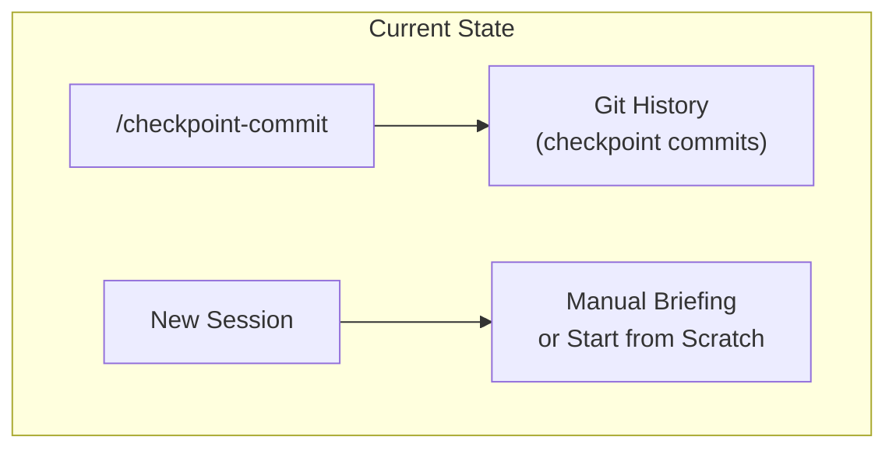
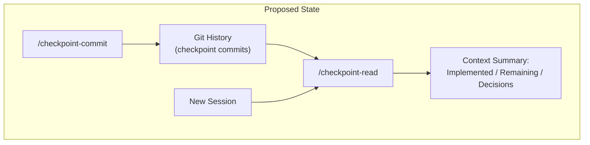
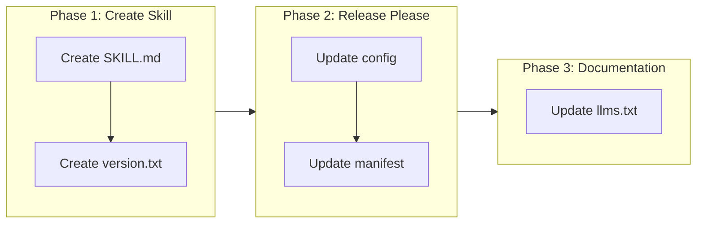

<!--
=============================================================================
CHANGE REQUEST: CHECKPOINT READ SLASH COMMAND
=============================================================================
-->

# Add /checkpoint-read Slash Command for Session Context Recovery

## Change Summary

Add a new slash command `/checkpoint-read` that reads checkpoint commit history to recover project context when starting a new session. Currently, agents starting fresh sessions have no automated way to recover the state of prior work. The `/checkpoint-read` command will query Git history for checkpoint commits, display the most recent relevant checkpoint details, and summarize what was implemented, what remains, and any decisions captured — enabling seamless session continuity.

## Motivation and Background

The `/checkpoint-commit` command (CR-0010) enables agents and users to preserve work-in-progress state as structured checkpoint commits. However, there is no corresponding mechanism to **read** those checkpoints when starting a new session. Without this, agents must either be manually briefed on prior work or start from scratch, losing valuable context about implementation progress, pending tasks, and architectural decisions.

A `/checkpoint-read` command closes this gap by providing a standardized way to recover session context from the checkpoint commit history. This is especially valuable in LLM-based agent workflows where context windows are limited and session state is ephemeral.

## Change Drivers

* **Session Continuity**: Agents lose all context between sessions; checkpoint-read provides automated recovery.
* **Efficiency**: Eliminates manual re-briefing at the start of each new session.
* **Complementary Feature**: The existing `/checkpoint-commit` creates checkpoints but there is no counterpart to consume them.
* **Agent Autonomy**: Enables agents to self-orient without human intervention by reading structured commit history.

## Current State

The `/checkpoint-commit` slash command exists as a skill at `skills/checkpoint-commit/SKILL.md`. It creates checkpoint commits with the format `checkpoint(CR-xxxx): {summary}` containing detailed bodies that describe what changed and why. These commits accumulate in Git history but there is no skill or command to read and interpret them for context recovery.

### Current State Diagram



## Proposed Change

Introduce a new slash command `/checkpoint-read` implemented as a separate skill at `skills/checkpoint-read/SKILL.md`. The skill **MUST** follow the same architectural pattern as `/checkpoint-commit` — a standalone skill directory under `skills/` with instruction-based steps in `SKILL.md`.

The command **MUST** execute the following workflow:

1. **List recent checkpoints** by querying Git log for commits matching the checkpoint format.
2. **Read the most recent relevant checkpoint** by displaying its commit stats and full message.
3. **Summarize context** including what was implemented, what remains, and any decisions captured.
4. **Handle the no-checkpoints case** gracefully by stating no checkpoints exist and proceeding.

### Proposed State Diagram



### Skill Architecture

```
skills/
├── checkpoint-commit/
│   └── SKILL.md              # Existing checkpoint commit skill
├── checkpoint-read/
│   └── SKILL.md              # New checkpoint read skill
└── governance/
    ├── SKILL.md
    ├── reference/
    │   ├── checkpoint.md
    │   └── checkpoint-hooks.md
    └── ...
```

## Requirements

### Functional Requirements

1. The skill **MUST** be created at `skills/checkpoint-read/SKILL.md` as a standalone skill directory.
2. The command **MUST** list recent checkpoint commits using `git log --oneline --decorate --grep '^checkpoint.*:' -n 25`.
3. The command **MUST** read the most recent relevant checkpoint using `git show --stat {SHA}` and `git show {SHA}` when checkpoints exist.
4. The command **MUST** produce a summary containing three sections: what was implemented, what remains, and any decisions captured in commit messages.
5. The command **MUST** handle the case where no checkpoint commits exist by stating that no checkpoints were found and proceeding without error.
6. The skill **MUST** follow the Agent Skills specification format with proper frontmatter including `name`, `description`, `license`, and `metadata` fields.
7. The skill `name` field **MUST** contain only lowercase letters, numbers, and hyphens (max 64 characters) per Claude Code Skills naming constraints.
8. The command **MUST NOT** perform any destructive Git operations (`git reset`, `git rebase`, `git commit --amend`, `git push --force`).
9. The command **MUST** be read-only — it **MUST NOT** create commits, modify files, or alter Git state.
10. The skill **MUST** include a `version.txt` file with initial content `0.0.0`.
11. The skill **MUST** be registered in `release-please-config.json` and `.release-please-manifest.json`.

### Non-Functional Requirements

1. The command **MUST** complete execution within a reasonable time frame, relying only on local Git operations (no network calls).
2. The command **MUST** produce output that is concise enough to fit within LLM context windows while retaining all essential information.
3. The skill **MUST** be distributable via `npx skills add` alongside existing skills.

## Affected Components

* `skills/checkpoint-read/SKILL.md` — New skill file (to be created)
* `skills/checkpoint-read/version.txt` — New version file (to be created)
* `release-please-config.json` — Add new package entry for checkpoint-read
* `.release-please-manifest.json` — Add initial version tracking for checkpoint-read
* `docs/llms.txt` — Update with reference to this CR

## Scope Boundaries

### In Scope

* Creating the `/checkpoint-read` skill with SKILL.md and version.txt
* Defining the step-by-step workflow for reading checkpoint commits from Git history
* Registering the skill in release-please configuration
* Updating `docs/llms.txt` with this CR

### Out of Scope ("Here, But Not Further")

* Modifying the existing `/checkpoint-commit` skill — it remains unchanged
* Adding filtering by CR-ID or date range — deferred to future iteration
* Cross-repository checkpoint reading — only local Git history is supported
* Interactive checkpoint selection UI — the command reads the most recent relevant checkpoint automatically
* Modifying `skills/governance/SKILL.md` — no changes to the governance skill

## Alternative Approaches Considered

* **Add checkpoint-read as a step in the governance skill**: Rejected because the governance skill handles document creation (ADRs/CRs), not Git history analysis. Mixing concerns would violate single-responsibility.
* **Combine with checkpoint-commit as a single skill with subcommands**: Rejected because Claude Code skills map to individual slash commands. A combined skill would require argument parsing to distinguish between read and commit operations, adding unnecessary complexity.
* **Use a shell script instead of a skill**: Rejected because a skill provides natural language instructions that allow the agent to interpret and summarize results contextually, which a raw script cannot do.

## Impact Assessment

### User Impact

Users and agents starting new sessions will be able to run `/checkpoint-read` to immediately recover context from prior work. This eliminates the need for manual briefing and reduces onboarding time for each session to a single command invocation.

### Technical Impact

* No breaking changes — this is a purely additive feature.
* Adds one new skill directory with two files (`SKILL.md`, `version.txt`).
* Requires minor updates to release-please configuration files (JSON).
* No new dependencies introduced — relies solely on Git CLI commands.

### Business Impact

Reduces wasted time at session boundaries. Agents can self-orient faster, leading to more productive sessions and fewer context-related errors.

## Implementation Approach

The implementation consists of three phases:

### Phase 1: Create Skill

1. Create `skills/checkpoint-read/SKILL.md` with the complete workflow instructions.
2. Create `skills/checkpoint-read/version.txt` with content `0.0.0`.

### Phase 2: Register in Release Please

1. Add package entry to `release-please-config.json`.
2. Add version entry to `.release-please-manifest.json`.

### Phase 3: Update Documentation

1. Update `docs/llms.txt` with this CR entry.

### Implementation Flow



### Skill Pseudo-Implementation

```yaml
# Pseudo-implementation for the /checkpoint-read workflow.
# The actual implementation MUST be in SKILL.md as natural language instructions.

/checkpoint-read:
  1. LIST RECENT CHECKPOINTS:
     - Run: git log --oneline --decorate --grep '^checkpoint.*:' -n 25
     - IF no results: Report "No checkpoint commits found" and STOP
     - ELSE: Display the list of checkpoint commits

  2. READ MOST RECENT CHECKPOINT:
     - Extract SHA from the most recent (first) checkpoint in the list
     - Run: git show --stat {SHA}
     - Run: git show {SHA}
     - Parse the commit message subject and body

  3. SUMMARIZE CONTEXT:
     - What was implemented: Extract from commit body bullet points
     - What remains: Identify pending items or TODOs mentioned
     - Decisions captured: Note any architectural or design decisions in the message

  4. REPORT:
     - Present structured summary to the user
     - Include the checkpoint commit SHA and date for reference
```

## Test Strategy

### Tests to Add

| Test File | Test Name | Description | Inputs | Expected Output |
|-----------|-----------|-------------|--------|-----------------|
| `tests/checkpoint-read/test_skill_structure.sh` | `test_skill_md_exists` | Validates SKILL.md exists at correct path | Skill directory path | File exists with correct frontmatter |
| `tests/checkpoint-read/test_skill_structure.sh` | `test_version_txt_exists` | Validates version.txt exists with correct content | Skill directory path | File contains `0.0.0` |
| `tests/checkpoint-read/test_skill_structure.sh` | `test_release_please_config` | Validates release-please-config.json contains checkpoint-read entry | Config file | Entry exists with correct settings |
| `tests/checkpoint-read/test_skill_structure.sh` | `test_release_please_manifest` | Validates .release-please-manifest.json contains checkpoint-read entry | Manifest file | Entry exists with version `0.0.0` |
| `tests/checkpoint-read/test_skill_structure.sh` | `test_skill_frontmatter` | Validates SKILL.md frontmatter has required fields | SKILL.md content | Contains name, description, license, metadata |
| `tests/checkpoint-read/test_skill_structure.sh` | `test_skill_name_format` | Validates skill name follows naming constraints | SKILL.md name field | Lowercase, hyphens only, max 64 chars |
| `tests/checkpoint-read/test_skill_structure.sh` | `test_read_only_safety` | Validates SKILL.md contains no destructive Git commands | SKILL.md content | No reset, rebase, amend, or force-push commands |

### Tests to Modify

| Test File | Test Name | Current Behavior | New Behavior | Reason for Change |
|-----------|-----------|------------------|--------------|-------------------|
| Not applicable | — | — | — | No existing tests require modification |

### Tests to Remove

| Test File | Test Name | Reason for Removal |
|-----------|-----------|-------------------|
| Not applicable | — | No existing tests require removal |

## Acceptance Criteria

### AC-1: Skill file structure

```gherkin
Given the skills directory exists
When the /checkpoint-read skill is implemented
Then a file MUST exist at skills/checkpoint-read/SKILL.md
  And a file MUST exist at skills/checkpoint-read/version.txt containing "0.0.0"
```

### AC-2: SKILL.md frontmatter compliance

```gherkin
Given the SKILL.md file exists
When the frontmatter is parsed
Then it MUST contain a name field set to "checkpoint-read"
  And it MUST contain a description field
  And it MUST contain a license field set to "Apache-2.0"
  And it MUST contain metadata with copyright "Copyright Daniel Grenemark 2026"
```

### AC-3: Checkpoint listing step

```gherkin
Given a Git repository with checkpoint commits
When /checkpoint-read is executed
Then the command MUST run git log --oneline --decorate --grep '^checkpoint.*:' -n 25
  And display the list of recent checkpoint commits
```

### AC-4: Checkpoint reading step

```gherkin
Given checkpoint commits exist in Git history
When /checkpoint-read identifies the most recent checkpoint
Then the command MUST run git show --stat {SHA} for the most recent checkpoint
  And the command MUST run git show {SHA} for the most recent checkpoint
```

### AC-5: Context summary output

```gherkin
Given a checkpoint commit has been read
When the command produces its summary
Then the summary MUST include what was implemented
  And the summary MUST include what remains to be done
  And the summary MUST include any decisions captured in the commit message
```

### AC-6: No checkpoints found

```gherkin
Given a Git repository with no checkpoint commits
When /checkpoint-read is executed
Then the command MUST state that no checkpoint commits were found
  And the command MUST proceed without error
```

### AC-7: Read-only safety

```gherkin
Given the /checkpoint-read skill definition
When the SKILL.md content is reviewed
Then it MUST NOT contain any destructive Git operations
  And it MUST NOT create commits or modify files
  And it MUST NOT alter Git state in any way
```

### AC-8: Release Please registration

```gherkin
Given the release-please configuration files
When the checkpoint-read skill is registered
Then release-please-config.json MUST contain a "skills/checkpoint-read" package entry
  And the entry MUST have "release-type" set to "simple"
  And the entry MUST have "component" set to "checkpoint-read"
  And .release-please-manifest.json MUST contain "skills/checkpoint-read" set to "0.0.0"
```

### AC-9: Documentation updated

```gherkin
Given the docs/llms.txt file
When the checkpoint-read CR is created
Then llms.txt MUST contain an entry for CR-0012
```

## Quality Standards Compliance

### Build & Compilation

- [ ] No build step required — skill is documentation/instruction-based
- [ ] No new compiler warnings introduced (not applicable)

### Linting & Code Style

- [ ] SKILL.md follows existing skill format conventions (matches checkpoint-commit structure)
- [ ] Frontmatter follows Agent Skills specification
- [ ] Copyright header included per project guidelines

### Test Execution

- [ ] All existing tests pass after implementation
- [ ] New structural validation tests pass
- [ ] Skill content validated for read-only safety

### Documentation

- [ ] `docs/llms.txt` updated with CR-0012 entry
- [ ] SKILL.md contains clear usage instructions

### Code Review

- [ ] Changes submitted via pull request
- [ ] PR title follows Conventional Commits format
- [ ] Code review completed and approved
- [ ] Changes squash-merged to maintain linear history

### Verification Commands

```bash
# Verify skill file exists
test -f skills/checkpoint-read/SKILL.md && echo "PASS" || echo "FAIL"

# Verify version.txt exists with correct content
test "$(cat skills/checkpoint-read/version.txt)" = "0.0.0" && echo "PASS" || echo "FAIL"

# Verify release-please-config.json contains entry
grep -q '"skills/checkpoint-read"' release-please-config.json && echo "PASS" || echo "FAIL"

# Verify manifest contains entry
grep -q '"skills/checkpoint-read"' .release-please-manifest.json && echo "PASS" || echo "FAIL"

# Verify SKILL.md contains no destructive Git commands
! grep -qE 'git (reset|rebase|commit|push --force|amend)' skills/checkpoint-read/SKILL.md && echo "PASS" || echo "FAIL"

# Verify llms.txt updated
grep -q 'CR-0012' docs/llms.txt && echo "PASS" || echo "FAIL"

# Run existing tests
cd tests && bash run_tests.sh
```

## Risks and Mitigation

### Risk 1: Checkpoint commit format changes

**Likelihood:** low
**Impact:** high
**Mitigation:** The grep pattern `'^checkpoint.*:'` is intentionally broad to match the `checkpoint(CR-xxxx):` format. If the format changes in `/checkpoint-commit`, the grep pattern in `/checkpoint-read` **MUST** be updated accordingly. Both skills reference the same checkpoint format defined in `skills/governance/reference/checkpoint.md`.

### Risk 2: Large number of checkpoint commits slows output

**Likelihood:** medium
**Impact:** low
**Mitigation:** The `-n 25` limit on `git log` caps the number of commits listed. The command reads only the most recent relevant checkpoint in detail, not all 25.

### Risk 3: Checkpoint commit bodies lack structured content

**Likelihood:** low
**Impact:** medium
**Mitigation:** The `/checkpoint-commit` skill enforces detailed body content with bullet points. The `/checkpoint-read` summary step relies on the agent's ability to interpret natural language, which is resilient to minor format variations.

## Dependencies

* Requires `/checkpoint-commit` (CR-0010) to be implemented — checkpoint commits must exist in Git history for `/checkpoint-read` to have data to read.
* Relies on Git CLI being available in the execution environment.

## Estimated Effort

* **Phase 1 (Create Skill):** 1 hour
* **Phase 2 (Release Please):** 15 minutes
* **Phase 3 (Documentation):** 15 minutes
* **Total:** ~1.5 hours

## Decision Outcome

Chosen approach: "Standalone skill with instruction-based steps", because it follows the established pattern from `/checkpoint-commit` (CR-0010), maintains single-responsibility per skill, and leverages the agent's natural language capabilities for context summarization rather than requiring scripted parsing logic.

## Related Items

* Links to related change requests: CR-0006 (Checkpoint Instruction), CR-0010 (Checkpoint Slash Command)
* Links to architecture decisions: None
* Links to existing skills: `skills/checkpoint-commit/SKILL.md`
