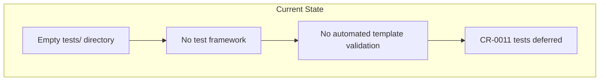
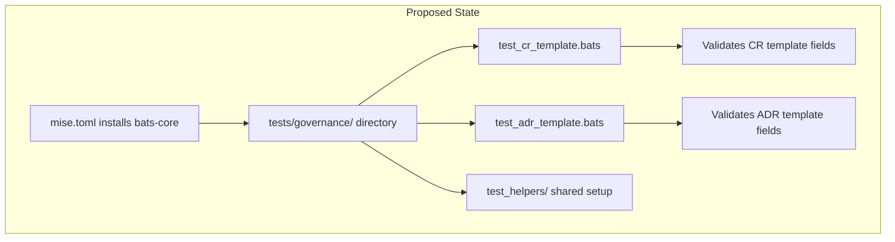
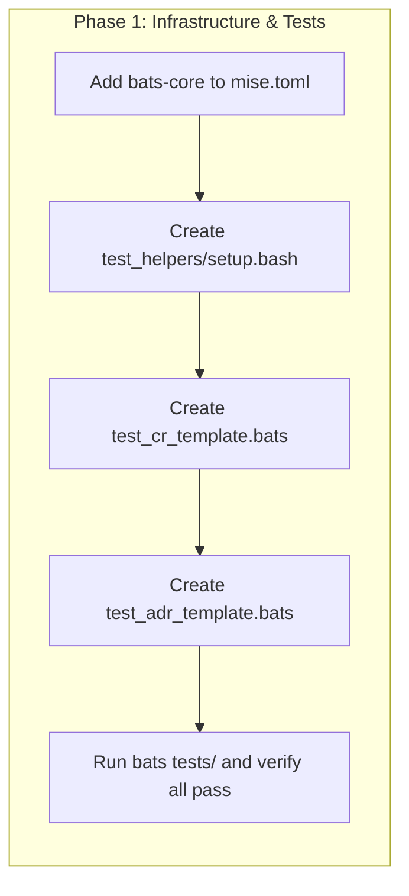

# Add Bats Test Infrastructure and CR-0011 Governance Tests

## Change Summary

The repository currently has no test infrastructure. CR-0011 specified bats tests for validating governance template fields but deferred their creation because no test harness existed. This CR proposes adding Bats (Bash Automated Testing System) as the project's test framework via `mise.toml`, establishing the `tests/governance/` directory structure with shared helpers, and implementing the four template validation tests defined in CR-0011's test strategy.

## Motivation and Background

Governance templates are the foundation of this repository's skill output. When template fields are added, renamed, or removed — as happened with `source-branch` and `source-commit` in CR-0011 — there is no automated way to verify that the templates remain structurally correct. Manual inspection is error-prone and does not scale as the number of templates and required fields grows.

Bats is the natural choice for this project because:

1. **Shell-native** — The tests validate file contents using `grep` and similar commands, which is exactly what Bats is designed for.
2. **Zero runtime dependencies** — No programming language runtime (Node.js, Python, Go) is required beyond Bash.
3. **Lightweight** — Bats adds minimal tooling overhead to a documentation-focused repository.
4. **Ecosystem maturity** — `bats-core` is actively maintained with companion libraries (`bats-support`, `bats-assert`) that provide readable assertion syntax.

Establishing test infrastructure now creates a foundation for future CRs to include tests as a standard part of their implementation, rather than deferring them indefinitely.

## Change Drivers

* CR-0011 defined four bats tests but could not implement them due to missing test infrastructure
* No automated validation exists for governance template structure, risking silent regressions
* Future CRs involving template or skill changes need a test harness to verify their implementations
* The repository uses `mise.toml` for tool management, making Bats installation straightforward

## Current State

The repository has an empty `tests/` directory and no test framework installed. The `mise.toml` file contains only JetBrains Junie CLI and MCP tooling:

```toml
# Copyright Daniel Grenemark 2026
[tools]
"npm:@jetbrains/junie-cli" = "704.1.0"
"npm:mcp-remote" = "0.1.37"
```

CR-0011's test strategy specified four tests across two files:

| Test File | Test Name |
|-----------|-----------|
| `tests/governance/test_cr_template.bats` | `test_cr_template_has_source_branch_field` |
| `tests/governance/test_cr_template.bats` | `test_cr_template_has_source_commit_field` |
| `tests/governance/test_adr_template.bats` | `test_adr_template_has_source_branch_field` |
| `tests/governance/test_adr_template.bats` | `test_adr_template_has_source_commit_field` |

These tests were not implemented because the test strategy was conditional: "Template validation tests pass (if test infrastructure exists)."

### Current State Diagram



## Proposed Change

Install Bats and its assertion libraries via `mise.toml`, create a test directory structure with shared helpers, and implement the CR-0011 governance template validation tests.

### Proposed State Diagram



## Requirements

### Functional Requirements

1. `mise.toml` **MUST** include `bats-core` as a managed tool
2. A `tests/governance/test_helpers/` directory **MUST** exist with a shared setup file that resolves the repository root path
3. `tests/governance/test_cr_template.bats` **MUST** validate that the CR template frontmatter contains `source-branch` and `source-commit` fields
4. `tests/governance/test_adr_template.bats` **MUST** validate that the ADR template frontmatter contains `source-branch` and `source-commit` fields
5. All test files **MUST** include the project copyright header as a comment
6. Tests **MUST** be runnable via `bats tests/` from the repository root
7. The shared test helper **MUST** define `REPO_ROOT` so tests reference template files via absolute paths, making them independent of the working directory

### Non-Functional Requirements

1. The test suite **MUST** complete in under 5 seconds for the initial set of tests
2. The test infrastructure **MUST NOT** require any tools beyond what `mise` installs
3. Test output **MUST** use TAP (Test Anything Protocol) format, which is the Bats default

## Affected Components

* `mise.toml` — Add `bats-core` tool entry
* `tests/governance/test_cr_template.bats` — New file: CR template validation tests
* `tests/governance/test_adr_template.bats` — New file: ADR template validation tests
* `tests/governance/test_helpers/setup.bash` — New file: shared test setup
* `.gitignore` — Review for any test artifact exclusions if needed

## Scope Boundaries

### In Scope

* Installing Bats via `mise.toml`
* Creating the `tests/governance/` directory structure with shared helpers
* Implementing the four CR-0011 template validation tests
* Adding copyright headers to all new files

### Out of Scope ("Here, But Not Further")

* CI/CD pipeline integration (e.g., GitHub Actions workflow to run bats) — deferred to a future CR
* Installing `bats-support` and `bats-assert` helper libraries — the initial tests are simple enough to use plain Bash assertions; these libraries can be added when test complexity warrants them
* Tests for non-governance skills — this CR only covers the governance skill templates
* Backfilling tests for all existing template fields — only the `source-branch` and `source-commit` fields specified by CR-0011 are tested initially

## Alternative Approaches Considered

* **Use `bats-support` and `bats-assert` from the start** — Rejected because the initial tests are simple `grep` checks that do not benefit from assertion library syntax. Adding these libraries later is trivial and avoids unnecessary complexity now.
* **Use a different test framework (e.g., `shunit2`, `shellspec`)** — Rejected because CR-0011 already specified Bats by name, and Bats has the largest community and best documentation for Bash testing.
* **Write tests in a general-purpose language (Python, Node.js)** — Rejected because the tests validate file contents via shell commands, making Bash the natural choice. Adding a language runtime would be disproportionate overhead.
* **Skip shared helpers and inline all setup** — Rejected because a shared `setup.bash` with `REPO_ROOT` prevents path duplication across test files and makes adding new test files easier.

## Impact Assessment

### User Impact

No impact on end users of the governance skill. Tests are a development-time concern only.

### Technical Impact

* Adds `bats-core` as a development dependency managed by `mise`
* Establishes the `tests/` directory convention for future test files
* Provides a pattern (shared helpers, file structure) for future test authors to follow

### Business Impact

* Reduces risk of template regressions going undetected
* Fulfills the deferred testing obligation from CR-0011
* Establishes a quality gate for future template changes

## Implementation Approach

This is a single-phase change with four deliverables.

### Implementation Flow



### Detailed Implementation Steps

#### 1. Add Bats to `mise.toml`

Add `bats-core` to the `[tools]` section:

```toml
# Copyright Daniel Grenemark 2026
[tools]
"npm:@jetbrains/junie-cli" = "704.1.0"
"npm:mcp-remote" = "0.1.37"
"npm:bats" = "latest"
```

Bats is available as an npm package (`bats`) which integrates naturally with the existing `npm:`-prefixed tool management in `mise.toml`.

#### 2. Create Shared Test Helper

Create `tests/governance/test_helpers/setup.bash`:

```bash
# Copyright Daniel Grenemark 2026

# Resolve the repository root relative to this helper file.
# test_helpers/ is at tests/governance/test_helpers/, so root is three levels up.
REPO_ROOT="$(cd "$(dirname "${BATS_TEST_FILENAME}")/../.." && pwd)"

# Template paths
CR_TEMPLATE="${REPO_ROOT}/skills/governance/templates/CR.md"
ADR_TEMPLATE="${REPO_ROOT}/skills/governance/templates/ADR.md"
```

#### 3. Create CR Template Tests

Create `tests/governance/test_cr_template.bats`:

```bash
#!/usr/bin/env bats
# Copyright Daniel Grenemark 2026

setup() {
    load test_helpers/setup.bash
}

@test "CR template has source-branch field" {
    grep -q "^source-branch:" "$CR_TEMPLATE"
}

@test "CR template has source-commit field" {
    grep -q "^source-commit:" "$CR_TEMPLATE"
}
```

#### 4. Create ADR Template Tests

Create `tests/governance/test_adr_template.bats`:

```bash
#!/usr/bin/env bats
# Copyright Daniel Grenemark 2026

setup() {
    load test_helpers/setup.bash
}

@test "ADR template has source-branch field" {
    grep -q "^source-branch:" "$ADR_TEMPLATE"
}

@test "ADR template has source-commit field" {
    grep -q "^source-commit:" "$ADR_TEMPLATE"
}
```

## Test Strategy

### Tests to Add

| Test File | Test Name | Description | Inputs | Expected Output |
|-----------|-----------|-------------|--------|-----------------|
| `tests/governance/test_cr_template.bats` | `CR template has source-branch field` | Validates CR template frontmatter contains source-branch | CR template file path | `grep` exit code 0 |
| `tests/governance/test_cr_template.bats` | `CR template has source-commit field` | Validates CR template frontmatter contains source-commit | CR template file path | `grep` exit code 0 |
| `tests/governance/test_adr_template.bats` | `ADR template has source-branch field` | Validates ADR template frontmatter contains source-branch | ADR template file path | `grep` exit code 0 |
| `tests/governance/test_adr_template.bats` | `ADR template has source-commit field` | Validates ADR template frontmatter contains source-commit | ADR template file path | `grep` exit code 0 |

### Tests to Modify

| Test File | Test Name | Current Behavior | New Behavior | Reason for Change |
|-----------|-----------|------------------|--------------|-------------------|
| N/A | N/A | N/A | N/A | No existing tests to modify |

### Tests to Remove

| Test File | Test Name | Reason for Removal |
|-----------|-----------|-------------------|
| N/A | N/A | No existing tests to remove |

## Acceptance Criteria

### AC-1: Bats is installable via mise

```gherkin
Given the mise.toml file in the repository root
When a developer runs mise install
Then bats-core is installed and the bats command is available on the PATH
```

### AC-2: Shared test helper resolves repository root

```gherkin
Given the file tests/governance/test_helpers/setup.bash
When a bats test file loads the helper via load test_helpers/setup.bash
Then the REPO_ROOT variable points to the repository root directory
  And the CR_TEMPLATE variable points to skills/governance/templates/CR.md
  And the ADR_TEMPLATE variable points to skills/governance/templates/ADR.md
```

### AC-3: CR template source-branch test passes

```gherkin
Given the CR template at skills/governance/templates/CR.md contains a source-branch field
When bats executes tests/governance/test_cr_template.bats
Then the test "CR template has source-branch field" passes
```

### AC-4: CR template source-commit test passes

```gherkin
Given the CR template at skills/governance/templates/CR.md contains a source-commit field
When bats executes tests/governance/test_cr_template.bats
Then the test "CR template has source-commit field" passes
```

### AC-5: ADR template source-branch test passes

```gherkin
Given the ADR template at skills/governance/templates/ADR.md contains a source-branch field
When bats executes tests/governance/test_adr_template.bats
Then the test "ADR template has source-branch field" passes
```

### AC-6: ADR template source-commit test passes

```gherkin
Given the ADR template at skills/governance/templates/ADR.md contains a source-commit field
When bats executes tests/governance/test_adr_template.bats
Then the test "ADR template has source-commit field" passes
```

### AC-7: Full test suite runs from repository root

```gherkin
Given all test files are in place under tests/governance/
When a developer runs bats tests/ from the repository root
Then all four tests execute and pass
  And the output follows TAP format
```

### AC-8: All new files include copyright headers

```gherkin
Given the new files created by this CR
When reviewing each file
Then every .bats file contains "# Copyright Daniel Grenemark 2026"
  And every .bash file contains "# Copyright Daniel Grenemark 2026"
  And the mise.toml retains its existing copyright header
```

## Quality Standards Compliance

### Build & Compilation

- [ ] Not applicable — shell scripts and documentation only

### Linting & Code Style

- [ ] Bats test files follow existing project conventions
- [ ] Copyright headers present on all new files
- [ ] Shell scripts use consistent quoting and variable expansion

### Test Execution

- [ ] All four governance template tests pass
- [ ] `bats tests/` completes successfully from repository root
- [ ] Test output follows TAP format

### Documentation

- [ ] This CR documents the test infrastructure setup
- [ ] Test helper file includes comments explaining path resolution

### Code Review

- [ ] Changes submitted via pull request
- [ ] PR title follows Conventional Commits format
- [ ] Code review completed and approved
- [ ] Changes squash-merged to maintain linear history

### Verification Commands

```bash
# Install tools
mise install

# Verify bats is available
bats --version

# Run all governance tests
bats tests/

# Run individual test files
bats tests/governance/test_cr_template.bats
bats tests/governance/test_adr_template.bats

# Verify copyright headers
grep -l "Copyright Daniel Grenemark 2026" tests/governance/*.bats tests/governance/test_helpers/setup.bash
```

## Risks and Mitigation

### Risk 1: Bats npm package version incompatibility with mise

**Likelihood:** low
**Impact:** medium
**Mitigation:** Use `"latest"` initially; pin to a specific version after verifying installation works. The `bats` npm package is a well-maintained wrapper around `bats-core`.

### Risk 2: Path resolution breaks on different operating systems

**Likelihood:** low
**Impact:** medium
**Mitigation:** The shared helper uses POSIX-compatible `cd` and `pwd` for path resolution, and `BATS_TEST_FILENAME` is a standard Bats variable. This works on macOS and Linux.

## Dependencies

* `mise` — Already used by the project for tool management
* CR-0011 (implemented) — Defines the test cases this CR implements

## Estimated Effort

Approximately 1 person-hour to implement all infrastructure and test files.

## Decision Outcome

Chosen approach: "Install Bats via mise npm package and implement CR-0011 tests with shared helpers", because it aligns with the existing `npm:`-prefixed tool management pattern in `mise.toml`, requires no additional runtime dependencies, and fulfills CR-0011's deferred test obligation with minimal overhead.

## Related Items

* Links to related change requests: CR-0011 (governance source traceability — defined the test cases)
* Links to architecture decisions: N/A
