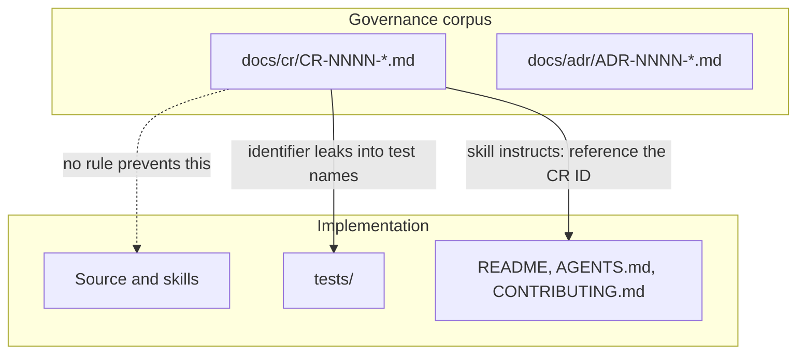
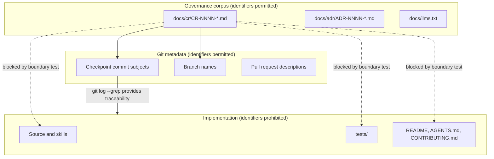
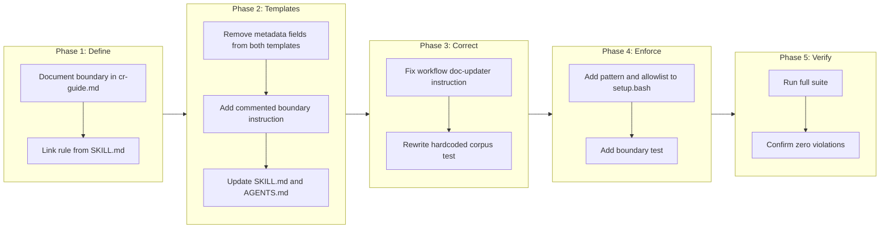

# Decouple Governance References From Implementation

## Change Summary

Governance identifiers such as `CR-0011`, `FR-3`, `NFR-2`, and `AC-5` currently have no defined boundary: nothing prevents them from being written into source code, test names, or user-facing documentation, and the governance skill actively encourages at least one such leak. This CR establishes an explicit **governance reference boundary** — governance identifiers live in the governance corpus and in Git metadata, and nowhere else — documents that boundary in the governance skill, removes the instructions that encourage crossing it, and adds an automated test that fails when an identifier appears outside its permitted territory.

The CR and ADR templates are treated as the boundary's origin point rather than as ordinary files. Their `metadata.copyright` and `metadata.version` fields are removed, eliminating the copy-through leak that the skill currently mitigates with a written instruction to strip them afterwards, and a commented instruction carrying the boundary rule is added to both templates so that every document produced from them states the rule to whoever implements it.

## Motivation and Background

A Change Request is a record of a decision at a moment in time. An implementation is a living artifact that outlives that moment. When the two are coupled by identifier — a comment reading `// per FR-3`, a test named `validates CR-0012 entry`, a README section headed "CR-0009 behavior" — the implementation acquires a dependency on a document that the reader may not have, may not be able to find, and which may since have been superseded, rejected, or cancelled.

The coupling causes concrete harm:

1. **The reference is meaningless to its audience.** A user reading the README, or a contributor reading a test name, has no access to the governance corpus and no reason to care which CR produced a behavior. The identifier occupies space that a description of the actual behavior should occupy.
2. **The reference rots silently.** Nothing links `FR-3` in a comment to the third functional requirement of a specific CR. Renumber the requirements, split the CR, or supersede it, and the comment now points at something that no longer exists — with no build error, no test failure, and no way to detect the drift.
3. **The reference inverts the direction of traceability.** Traceability is supposed to flow from the governance document to the implementation, so that a reader of the CR can find the code. Embedding identifiers in code makes it flow backwards, so that a reader of the code must first obtain the governance corpus to understand what they are reading.
4. **The identifier is not a specification.** A test named for an acceptance criterion describes its provenance instead of its assertion. When it fails, the failure message names a document rather than the behavior that broke.

The repository already demonstrates every one of these failure modes. `tests/checkpoint-read/test_skill_structure.bats` contains a test named for a specific CR identifier, asserting that the documentation index contains an entry for that same identifier — a test that must be edited every time the corpus grows, and which tests the index's contents rather than its structure. The governance skill's own implementation workflow reference instructs a documentation agent to "reference the CR ID where appropriate", which is an instruction to create precisely this coupling.

Git metadata is the correct home for the provenance that these references are reaching for. A checkpoint commit subject carrying a CR identifier ties the change to its governance document permanently, is queryable with `git log --grep`, and does not appear in the working tree where readers of the code will trip over it.

### The templates are where the leak originates

A template is not an ordinary file. It is copied, so every field it carries is a field that arrives in the created document by default, and every field that does not belong there must be removed by an agent who remembers to remove it. The `metadata.copyright` and `metadata.version` fields describe the template itself, not the document produced from it, and the skill currently compensates with a written instruction — repeated once for ADRs and once for CRs — telling agents not to copy them, backed by a further note in `AGENTS.md`. That is three separate statements of a rule that stops being necessary the moment the fields are deleted. Removing them replaces an instruction that can be forgotten with a default that cannot.

The same reasoning applies in the opposite direction. The boundary rule is most needed by whoever implements a CR, and that is precisely the reader who has the CR open and the skill documentation closed. Carrying the rule into the templates as a commented instruction puts it in front of that reader at the moment it applies, without adding anything to the rendered document.

## Change Drivers

* Governance identifiers currently leak into tests and are encouraged to leak into documentation, with no rule prohibiting it
* Embedded identifiers rot silently when governance documents are renumbered, superseded, or cancelled
* User-facing documentation and test names should describe behavior, not provenance
* Git commit metadata already provides durable, queryable provenance without polluting the working tree
* No automated check exists to detect a leak once introduced
* Template metadata fields that do not belong in created documents are stripped by written instruction rather than by simply not existing
* The boundary rule is invisible to the reader who most needs it: whoever is implementing an open CR

## Current State

The repository has no defined boundary for governance identifiers. Five distinct problems exist today.

**No rule is documented.** Neither `skills/governance/SKILL.md` nor `skills/governance/reference/cr-guide.md` states where governance identifiers may or may not appear. The `## Source Traceability` section of the CR reference guide covers the `source-branch` and `source-commit` frontmatter fields, which record what the CR was written against, but says nothing about the reverse direction.

**The skill encourages a leak.** `skills/governance/reference/cr-implementation-workflow.md` instructs the Documentation Updater agent:

```
7. Do NOT duplicate content already in the CR -- reference the CR ID where appropriate.
```

This directs an agent to write a governance identifier into user-facing project documentation.

**An existing test violates the boundary.** `tests/checkpoint-read/test_skill_structure.bats` contains:

```bash
@test "llms.txt contains CR-0012 entry" {
    grep -q 'CR-0012' "${REPO_ROOT}/docs/llms.txt"
```

The test name carries a governance identifier, and the assertion hardcodes a specific corpus entry rather than validating the index's structure. This mirrors a defect already corrected once in this repository, where a test asserting a hardcoded version string was rewritten to validate the version's format instead.

**The templates carry fields that must be stripped by hand.** Both `skills/governance/templates/CR.md` and `skills/governance/templates/ADR.md` open with frontmatter describing the template:

```yaml
metadata:
  copyright: Copyright Daniel Grenemark 2026
  version: "0.0.1"
```

These fields belong to the template, never to the document created from it. The repository compensates in three places rather than removing them: `skills/governance/SKILL.md` carries a "Template frontmatter" paragraph under the ADR workflow and a second, near-identical paragraph under the CR workflow, each stating that created documents must omit the two fields; and the `<copyright>` section of `AGENTS.md` repeats the carve-out a third time.

**The templates say nothing about the boundary.** Neither template mentions where governance identifiers may appear. The extensive commented guideline block at the head of each template covers requirements language, acceptance criteria, diagrams, test strategy, and quality standards, but is silent on the one rule that governs how the document relates to the code implementing it.

### Current State Diagram



## Proposed Change

Define a governance reference boundary with two territories, document it as a normative rule in the governance skill, remove the instruction that violates it, correct the existing violation, and add a test that enforces it.

**Permitted territory.** A governance reference pattern may appear in:

* The governance corpus: any file under `docs/cr/` or `docs/adr/`, including filenames
* The governance corpus index: `docs/llms.txt`, whose purpose is to enumerate the corpus
* Git metadata: commit messages, branch names, pull request titles and descriptions, and issue text
* The governance skill's own definition of the rule and of its document-naming conventions, where the pattern appears as a placeholder rather than as a reference to a specific document. Because these files use concrete-looking digit forms in their examples (for example `CR-0001` in `reference/cr-guide.md`, `ADR-0123` in `templates/ADR.md`, and the `AC-1` / `AC-2` acceptance-criteria headers in `templates/CR.md`), they match the reference pattern and **MUST** therefore appear on the allowlist by path. The allowlisted skill files are exactly `skills/governance/templates/CR.md`, `skills/governance/templates/ADR.md`, `skills/governance/reference/cr-guide.md`, and `skills/governance/reference/adr-guide.md`
* The boundary test's own machinery: `tests/governance/test_reference_boundary.bats` and `tests/governance/test_helpers/setup.bash`, which must embed the pattern and sample identifiers in order to define and exercise the check

**Prohibited territory.** A governance reference pattern must not appear in:

* Source code of any kind, including code comments
* Test names, test descriptions, and test assertions
* User-facing documentation: `README.md`, `AGENTS.md`, `CONTRIBUTING.md`, `WORKFLOW.md`, skill `SKILL.md` files, and any documentation outside the governance corpus that is not explicitly named on the permitted allowlist above

The distinction is one of audience. The governance corpus is read by people who are reasoning about decisions, and identifiers are how they navigate it. Everything else is read by people who are using or changing the software, for whom an identifier is a dead end.

**Template changes.** Both templates are amended at the point where documents are produced from them:

* The `metadata.copyright` and `metadata.version` fields are deleted from the frontmatter of `templates/CR.md` and `templates/ADR.md`. A field that does not exist cannot be copied, so the three written instructions telling agents to strip it are no longer load-bearing and are reduced to a single statement of the resulting convention.
* A commented instruction is added to the guideline block of both templates, stating that governance identifiers must not appear in the implementation and naming commit messages as the mechanism for linking the two. Being an HTML comment, it is visible to anyone editing or implementing the document and absent from the rendered output.

This makes the two templates a deliberate exception to the blanket rule in the `<copyright>` section of `AGENTS.md` that every markdown file carries copyright frontmatter. The exception is recorded there rather than left implicit.

### Proposed State Diagram



## Requirements

### Functional Requirements

1. The governance skill **MUST** document the governance reference boundary as a normative rule, naming both the permitted and the prohibited territories.
2. The governance skill **MUST** define the governance reference pattern as an identifier matching `CR-`, `ADR-`, `FR-`, `NFR-`, or `AC-` followed by one or more digits.
3. The governance skill **MUST** state that Git commit messages, branch names, and pull request descriptions are the permitted mechanism for linking an implementation to its governance document.
4. The governance skill **MUST NOT** contain any instruction directing an agent to write a governance identifier into source code, test names, or user-facing documentation.
5. The Documentation Updater agent instruction in the implementation workflow reference **MUST** direct the agent to describe implemented behavior without naming the governance document it originated from.
6. The repository **MUST** contain an automated test that fails when a governance reference pattern appears in a file outside the permitted territory.
7. The boundary test **MUST** report the offending file path and the matched identifier when it fails, so the violation can be located without further searching.
8. The existing test asserting a hardcoded corpus entry in the documentation index **MUST** be replaced by a test that validates the index's entry structure without naming any specific governance document.
9. Every existing violation of the boundary within the repository **MUST** be corrected as part of this change.
10. The CR template and the ADR template **MUST NOT** contain a `metadata.copyright` field or a `metadata.version` field in their frontmatter.
11. The CR template and the ADR template **MUST** each contain a commented instruction stating that governance identifiers must not appear in source code, test names, or user-facing documentation.
12. That commented instruction **MUST** name Git commit messages as the mechanism for linking an implementation to the governance document it originated from.
13. That commented instruction **MUST** be an HTML comment, so that it is absent from the rendered document.
14. The governance skill and `AGENTS.md` **MUST** be updated so that no instruction directs an agent to strip the removed template fields from a created document.
15. The `<copyright>` section of `AGENTS.md` **MUST** record the CR and ADR templates as an explicit exception to the requirement that every markdown file carry copyright frontmatter.

### Non-Functional Requirements

1. The boundary test **MUST** execute as part of the existing Bats suite, requiring no additional test framework or runtime dependency.
2. The boundary test **MUST** determine the permitted territory from an explicit path allowlist held in one location, so that adding a permitted path is a single-line change.
3. The governance skill's documentation of the boundary **MUST** be reachable from `SKILL.md` within one link, so an agent loading the skill encounters the rule without reading the full reference guide.

## Affected Components

* `skills/governance/templates/CR.md` — removes the two template-describing metadata fields and gains the commented boundary instruction
* `skills/governance/templates/ADR.md` — same two changes
* `AGENTS.md` — records the template exception to the copyright frontmatter rule and drops the now-redundant strip-these-fields note
* `skills/governance/SKILL.md` — states the boundary rule, links to the detailed guidance, and collapses the two "Template frontmatter" paragraphs now that the fields no longer exist
* `skills/governance/reference/cr-guide.md` — documents the boundary in full, with the pattern definition, both territories, and the rationale
* `skills/governance/reference/cr-implementation-workflow.md` — removes the Documentation Updater instruction that directs an identifier into project documentation
* `tests/governance/test_reference_boundary.bats` — new test enforcing the boundary across the repository
* `tests/governance/test_helpers/setup.bash` — shared definitions for the reference pattern and the path allowlist
* `tests/checkpoint-read/test_skill_structure.bats` — replaces the hardcoded corpus-entry test with a structural one
* `tests/governance/test_cr_template.bats` and `tests/governance/test_adr_template.bats` — assert the removed fields are absent and the commented instruction is present

## Scope Boundaries

### In Scope

* Defining the governance reference pattern and both territories
* Documenting the boundary in the governance skill
* Removing the skill instruction that directs an agent to embed a CR identifier in documentation
* An automated Bats test enforcing the boundary
* Correcting the existing violation in the checkpoint-read test suite
* Removing `metadata.copyright` and `metadata.version` from the CR and ADR templates
* Adding a commented boundary instruction to both templates
* Recording the template exception in the `<copyright>` section of `AGENTS.md`

### Out of Scope ("Here, But Not Further")

* **The reverse direction of traceability.** How a CR points at its implementation, via the existing `source-branch` and `source-commit` frontmatter fields, is unchanged.
* **Checkpoint commit format.** The `/checkpoint-commit` skill continues to place CR identifiers in commit subjects; commit messages are permitted territory and the skill is not modified.
* **The governance corpus itself.** Existing CRs and ADRs are not rewritten. Cross-references between governance documents remain both permitted and encouraged, and no existing document has frontmatter fields removed.
* **The copyright rule for every other file type.** Only the two template files become an exception. Markdown, TOML, and text files elsewhere in the repository continue to carry copyright headers exactly as before.
* **The remaining template guideline content.** The commented guideline blocks are added to, not restructured or trimmed; their existing sections on requirements language, acceptance criteria, diagrams, and test strategy are untouched.
* **The documentation index format.** `docs/llms.txt` continues to list every governance document by identifier; only the test that asserts against it changes.
* **Enforcement outside this repository.** Projects that consume the governance skill inherit the documented rule but not the test; distributing the boundary test as part of the skill is deferred.
* **Retroactive Git history.** Commit messages and branch names already in history are permitted territory and are not rewritten.

## Alternative Approaches Considered

* **Documentation-only rule, no test.** Write the boundary into the skill and rely on review to catch violations. Rejected: the repository's existing violation was introduced and merged under exactly this regime, demonstrating that review alone does not hold the line.
* **A Git pre-commit hook instead of a test.** Rejected: hooks are per-clone and opt-in, so a contributor without the hook installed sees no enforcement, whereas the Bats suite already runs in CI on every pull request.
* **Permit identifiers in code comments but not in user-facing documentation.** Rejected: comments rot in exactly the same way as prose, and a partial rule requires a judgment call at every site, which is what a mechanically checkable boundary is meant to eliminate.
* **A structured traceability matrix mapping requirements to files.** Rejected as disproportionate: it introduces a second artifact that must be kept current, reintroducing the drift problem this change exists to remove.

## Impact Assessment

### User Impact

Users of the governance skill gain an explicit rule where previously there was silence, and stop receiving generated documentation annotated with identifiers they cannot resolve. No workflow changes: authoring a CR, running a checkpoint commit, and reading commit history all behave exactly as before.

### Technical Impact

No breaking changes. The change is confined to skill documentation and the test suite; no consumer-facing interface is modified. One existing test is replaced by a structurally equivalent one, so the suite's coverage does not regress. The new boundary test adds a single repository-wide grep to the suite, with negligible runtime cost.

The principal ongoing cost is the risk of false positives: a legitimate mention of the pattern in a newly added file will fail the suite until its path is added to the allowlist. This is intentional — the failure forces an explicit decision about which territory the file belongs to.

### Business Impact

None directly. The change reduces the maintenance burden of the governance corpus by removing coupling that would otherwise require updating implementation files whenever governance documents are renumbered or superseded.

## Implementation Approach

Five sequential phases. Each phase leaves the repository in a state where the full test suite passes.

### Implementation Flow



### Detailed Implementation Steps

The steps below map onto the five phases of the Implementation Flow one-to-one, except that **Phase 3 ("Correct") comprises two steps** — fixing the workflow instruction and rewriting the hardcoded corpus test. A phase implementor assigned Phase 3 **MUST** perform both. The phase each step belongs to is named in its heading.

#### Phase 1 — Document the boundary

Add a `## Governance Reference Boundary` section to `skills/governance/reference/cr-guide.md`, placed after `## Source Traceability` so the two directions of traceability read together. The section defines the reference pattern, enumerates the permitted and prohibited territories as two lists, and states the rationale in brief. Add the section to the guide's table of contents.

Add a short subsection to `skills/governance/SKILL.md` stating the rule in two sentences and linking to the guide section, satisfying the one-link reachability requirement.

#### Phase 2 — Amend both templates

Delete the `metadata:` block containing `copyright` and `version` from the frontmatter of `skills/governance/templates/CR.md` and `skills/governance/templates/ADR.md`. Both templates retain their `name` and `description` fields, which identify the template itself and are already understood to be replaced in the created document.

Add a numbered entry to the commented guideline block at the head of each template, placed alongside the existing entries on requirements language and acceptance criteria. The entry states that governance identifiers must not appear in source code, code comments, test names, or user-facing documentation, and that the link between an implementation and its governance document belongs in the commit message. Because the guideline block is already an HTML comment, the instruction inherits that property.

Update `skills/governance/SKILL.md`: the two "Template frontmatter" paragraphs, one under the ADR workflow and one under the CR workflow, no longer need to instruct agents to omit fields that are gone. Reduce each to a statement that created documents carry their own `name` and `description` and no template metadata.

Update the `<copyright>` section of `AGENTS.md`: replace the note carving out governance documents with one covering both governance documents and the two template files, so that a contributor adding copyright frontmatter to a template is told not to.

#### Phase 3 (part 1 of 2) — Remove the instruction that violates the boundary

In `skills/governance/reference/cr-implementation-workflow.md`, replace the Documentation Updater's step 7 so that it directs the agent to describe the implemented behavior on its own terms and explicitly prohibits naming the governance document. Verify no other agent instruction in the workflow directs an identifier into the working tree outside `docs/cr/`; the `/checkpoint-commit` invocations and the validation report path both remain permitted.

#### Phase 3 (part 2 of 2) — Replace the hardcoded corpus test

Rewrite the offending test in `tests/checkpoint-read/test_skill_structure.bats` so its name describes the structural property it asserts and its assertion validates the index's entry format rather than any specific entry. The replacement checks that the index contains at least one entry matching the corpus link structure, so it continues to detect an empty or malformed index without naming a document.

#### Phase 4 — Add the boundary test

Add the reference pattern and the permitted-path allowlist to `tests/governance/test_helpers/setup.bash` as shell variables, so both are defined once. The allowlist **MUST** enumerate every permitted-territory path that contains the pattern: `docs/cr/`, `docs/adr/`, `docs/llms.txt`, the four governance-skill placeholder files (`skills/governance/templates/CR.md`, `skills/governance/templates/ADR.md`, `skills/governance/reference/cr-guide.md`, `skills/governance/reference/adr-guide.md`), and the boundary test's own machinery (`tests/governance/test_reference_boundary.bats` and `tests/governance/test_helpers/setup.bash`). Omitting any one of these makes the boundary test fail against the current repository.

Add `tests/governance/test_reference_boundary.bats` containing a test that greps the repository for the reference pattern, excludes the allowlisted paths and the Git directory, and fails if any match remains. On failure the test emits each offending path together with the matched identifier. A second test asserts that the allowlisted governance corpus does still contain identifiers, so that a mistake in the exclusion logic that silently matches nothing is itself caught.

#### Phase 5 — Verify

Run the full Bats suite. Confirm it passes, and confirm by inspection that the boundary test fails when a governance identifier is temporarily introduced into a prohibited file.

## Test Strategy

### Tests to Add

| Test File | Test Name | Description | Inputs | Expected Output |
|-----------|-----------|-------------|--------|-----------------|
| `tests/governance/test_reference_boundary.bats` | `no governance references outside permitted paths` | Greps the repository for the reference pattern excluding allowlisted paths, failing on any match | Repository tree, reference pattern, path allowlist | Zero matches; on failure, each offending path and matched identifier is printed |
| `tests/governance/test_reference_boundary.bats` | `governance corpus contains references` | Guards against exclusion logic that matches nothing, by asserting the corpus itself still contains identifiers | `docs/cr/` contents | At least one match, confirming the pattern is live |
| `tests/governance/test_reference_boundary.bats` | `reference pattern matches all governed prefixes` | Verifies the pattern matches each of the five governed prefixes and rejects an unrelated hyphenated token | Sample strings for each prefix, plus a negative sample | Five matches, one non-match |
| `tests/governance/test_cr_template.bats` | `CR template has no copyright metadata field` | Asserts the removed field is absent from the template frontmatter | `templates/CR.md` | No match for a `copyright:` key |
| `tests/governance/test_cr_template.bats` | `CR template has no version metadata field` | Asserts the removed field is absent from the template frontmatter | `templates/CR.md` | No match for a `version:` key |
| `tests/governance/test_cr_template.bats` | `CR template states the reference boundary` | Asserts the commented instruction is present and sits inside an HTML comment | `templates/CR.md` | Instruction found within a comment block |
| `tests/governance/test_adr_template.bats` | `ADR template has no copyright metadata field` | Asserts the removed field is absent from the template frontmatter | `templates/ADR.md` | No match for a `copyright:` key |
| `tests/governance/test_adr_template.bats` | `ADR template has no version metadata field` | Asserts the removed field is absent from the template frontmatter | `templates/ADR.md` | No match for a `version:` key |
| `tests/governance/test_adr_template.bats` | `ADR template states the reference boundary` | Asserts the commented instruction is present and sits inside an HTML comment | `templates/ADR.md` | Instruction found within a comment block |
| `tests/governance/test_reference_boundary.bats` | `SKILL.md states the boundary rule and links to the guide` | Covers AC-1 and NFR-3: asserts `SKILL.md` states the boundary rule and links to the guide section within one hop | `skills/governance/SKILL.md` | Rule text present and a markdown link to the cr-guide boundary section present |
| `tests/governance/test_reference_boundary.bats` | `cr-guide documents pattern, territories, and commit mechanism` | Covers AC-2 and AC-3: asserts the guide's boundary section defines the pattern, enumerates both territories, and names Git commit metadata as the link mechanism | `skills/governance/reference/cr-guide.md` | Pattern definition, both territory lists, and the commit-metadata statement all present |
| `tests/governance/test_reference_boundary.bats` | `doc-updater instruction names no governance identifier` | Covers AC-4: asserts the Documentation Updater step neither instructs referencing a governance document identifier nor contains the reference pattern | `skills/governance/reference/cr-implementation-workflow.md` | No "reference the CR ID" instruction and no pattern match in the doc-updater step |
| `tests/governance/test_reference_boundary.bats` | `no strip-fields instruction remains and AGENTS.md records the template exception` | Covers AC-11: asserts `SKILL.md` and `AGENTS.md` carry no instruction to strip the removed fields, and that `AGENTS.md` records the two templates as an exception to the copyright frontmatter rule | `skills/governance/SKILL.md`, `AGENTS.md` | No omit-those-fields instruction remains; the template exception is recorded in the copyright section |

### Tests to Modify

| Test File | Test Name | Current Behavior | New Behavior | Reason for Change |
|-----------|-----------|------------------|--------------|-------------------|
| `tests/checkpoint-read/test_skill_structure.bats` | `llms.txt contains CR-0012 entry` → `llms.txt contains governance corpus entries` | Asserts the index contains a hardcoded identifier, with that identifier in the test name | Asserts the index contains at least one entry matching the corpus link structure, naming no document | Test name and assertion both violate the boundary; the assertion also breaks whenever the referenced document is renamed |

### Tests to Remove

Not applicable. No test becomes redundant; the single affected test is modified rather than removed, since its underlying purpose — verifying the index is populated — remains valid.

## Acceptance Criteria

### AC-1: Boundary rule is documented and reachable

```gherkin
Given the governance skill is loaded
When an agent reads SKILL.md
Then the governance reference boundary rule is stated
  And a link to the full guidance in the CR reference guide is present
```

### AC-2: Reference pattern is defined

```gherkin
Given the CR reference guide
When a reader consults the governance reference boundary section
Then the reference pattern is defined as CR, ADR, FR, NFR, or AC followed by a hyphen and one or more digits
  And both the permitted and prohibited territories are enumerated as explicit lists
```

### AC-3: Commit metadata is named as the traceability mechanism

```gherkin
Given a contributor wants to link an implementation to its governance document
When they consult the governance reference boundary section
Then Git commit messages, branch names, and pull request descriptions are named as the permitted mechanism
  And embedding the identifier in the implementation is stated as prohibited
```

### AC-4: The skill no longer instructs an agent to embed an identifier

```gherkin
Given the implementation workflow reference
When the Documentation Updater agent instructions are read
Then no instruction directs the agent to reference a governance document identifier
  And the agent is instructed to describe implemented behavior without naming its originating document
```

### AC-5: A violation in a prohibited path fails the suite

```gherkin
Given the repository passes the full test suite
When a governance identifier is introduced into a file outside the permitted paths
And the test suite is run
Then the boundary test fails
  And the failure output names the offending file path and the matched identifier
```

### AC-6: The governance corpus is unaffected by the boundary test

```gherkin
Given the governance corpus contains many governance identifiers
When the boundary test is run
Then the test passes
  And no file under docs/cr/, docs/adr/, or docs/llms.txt is reported as a violation
```

### AC-7: The documentation index test names no specific document

```gherkin
Given the documentation index test in the checkpoint-read suite
When the test is run
Then it asserts the index contains at least one entry matching the corpus link structure
  And neither the test name nor the assertion contains a governance identifier
```

### AC-8: Template metadata fields are gone

```gherkin
Given the CR template and the ADR template
When their frontmatter is inspected
Then neither contains a metadata.copyright field
  And neither contains a metadata.version field
  And both retain their name and description fields
```

### AC-9: Templates carry the boundary instruction

```gherkin
Given an author opens the CR template or the ADR template
When they read the commented guideline block
Then an instruction states that governance identifiers must not appear in source code, test names, or user-facing documentation
  And the instruction names the commit message as the mechanism for linking implementation to governance document
```

### AC-10: The boundary instruction does not render

```gherkin
Given a governance document created from either template
When the document is rendered as markdown
Then the boundary instruction is not visible in the rendered output
```

### AC-11: The strip-these-fields instructions are retired

```gherkin
Given the templates no longer carry copyright or version metadata
When SKILL.md and AGENTS.md are read
Then no instruction directs an agent to omit those fields from a created document
  And the copyright section of AGENTS.md records the two templates as an exception to the copyright frontmatter rule
```

### AC-12: The repository is free of violations

```gherkin
Given this change request is fully implemented
When the full test suite is run
Then every test passes
  And the boundary test reports zero violations across the repository
```

## Quality Standards Compliance

### Build & Compilation

- [ ] Code compiles/builds without errors
- [ ] No new compiler warnings introduced

### Linting & Code Style

- [ ] All linter checks pass with zero warnings/errors
- [ ] Code follows project coding conventions and style guides
- [ ] Any linter exceptions are documented with justification

### Test Execution

- [ ] All existing tests pass after implementation
- [ ] All new tests pass
- [ ] Test coverage meets project requirements for changed code

### Documentation

- [ ] Inline code documentation updated where applicable
- [ ] API documentation updated for any API changes
- [ ] User-facing documentation updated if behavior changes

### Code Review

- [ ] Changes submitted via pull request
- [ ] PR title follows Conventional Commits format
- [ ] Code review completed and approved
- [ ] Changes squash-merged to maintain linear history

### Verification Commands

```bash
# Test execution
bats -r tests/

# Manual boundary verification. The set of excluded paths below MUST mirror the
# allowlist encoded in tests/governance/test_helpers/setup.bash exactly. The
# governance corpus is not the only permitted territory: the governance skill's
# own placeholder-bearing files (both templates and the cr-guide/adr-guide naming
# examples) and the boundary test's own sample fixtures also legitimately contain
# the pattern, so they are excluded here as well. With every allowlisted path
# excluded, expect no output.
grep -rnE '(CR|ADR|FR|NFR|AC)-[0-9]+' . \
  --exclude-dir=.git \
  --exclude-dir=cr \
  --exclude-dir=adr \
  --exclude-dir=templates \
  --exclude=llms.txt \
  --exclude=cr-guide.md \
  --exclude=adr-guide.md \
  --exclude=test_reference_boundary.bats \
  --exclude=setup.bash
```

## Risks and Mitigation

### Risk 1: The boundary test produces false positives on unrelated tokens

**Likelihood:** medium
**Impact:** low
**Mitigation:** The pattern requires a governed prefix immediately followed by a hyphen and digits, which excludes ordinary prose and most identifiers. A dedicated test asserts the pattern matches each governed prefix and rejects an unrelated hyphenated token. Where a genuine collision arises, the file's path is added to the allowlist with a comment recording why.

### Risk 2: The exclusion logic silently matches nothing

**Likelihood:** low
**Impact:** high
**Mitigation:** A test that would be trivially satisfied by a broken grep invocation provides no protection. The companion test asserting that the governance corpus does still contain identifiers fails if the pattern or the invocation stops matching, so a silently dead check is caught.

### Risk 3: Contributors experience the boundary as an obstacle

**Likelihood:** medium
**Impact:** low
**Mitigation:** The failure output names the offending path and identifier, and the rule is documented one link from `SKILL.md` with its rationale, so the correct action — describe the behavior, put the identifier in the commit message — is discoverable at the point of failure.

### Risk 4: The rule is applied to the governance corpus by mistake

**Likelihood:** low
**Impact:** medium
**Mitigation:** The permitted territory is stated first in the documentation and encoded as an explicit allowlist rather than inferred, and AC-6 asserts directly that no corpus file is ever reported as a violation.

### Risk 5: Removing template copyright frontmatter contradicts an existing requirement

**Likelihood:** high
**Impact:** medium
**Mitigation:** CR-0005 requires every markdown file in the repository to carry copyright frontmatter, and the `<copyright>` section of `AGENTS.md` restates it. Deleting the field from the two templates is a deliberate narrowing of that rule, not an oversight. It is recorded as an explicit exception in `AGENTS.md` in the same change, so a future contributor reading the copyright rule finds the carve-out beside it rather than discovering an apparent violation. The templates remain covered by the repository `LICENSE`; no copyright is surrendered by removing a field from a file that exists to be copied.

### Risk 6: The commented instruction is copied into created documents and never removed

**Likelihood:** high
**Impact:** low
**Mitigation:** This is the intended behavior. The instruction is guidance for whoever implements the document, so its presence in the created CR is the point. It is an HTML comment, so it does not render, and it is consistent with the template's existing guideline block, which is already carried into created documents in the same way.

### Risk 7: Whole-file allowlisting of the skill placeholder files blinds the check inside them

**Likelihood:** medium
**Impact:** low
**Mitigation:** A path allowlist cannot distinguish a legitimate placeholder (for example `CR-NNNN`) from a genuine leak (for example a stale `CR-0009` reference) that both live in the same file. Because `templates/CR.md`, `templates/ADR.md`, `reference/cr-guide.md`, and `reference/adr-guide.md` must be allowlisted by path to accommodate their placeholder examples, a real stray identifier introduced into one of those four files would not be caught by the boundary test. This is an accepted, bounded blind spot: the four files are small, change rarely, and are covered by ordinary review. The alternative — normalising every example in those files to a non-digit placeholder form so they need not be allowlisted at all — is recorded as an open decision in the review summary for the author to resolve.

## Dependencies

* Requires the Bats test infrastructure established by CR-0013, which is already in place
* Narrows the copyright frontmatter requirement established by CR-0005 for the two template files only
* Supersedes the created-document field-stripping guidance introduced by CR-0009, which becomes unnecessary once the fields no longer exist
* No external dependencies, no new tooling, and no changes to `mise.toml`

## Estimated Effort

Approximately 6 to 8 person-hours.

* Phase 1, documenting the boundary: 1.5 hours
* Phase 2, amending both templates and the two documents that reference their metadata: 1.5 hours
* Phase 3, correcting the two existing violations: 1 hour
* Phase 4, the boundary test and shared helper definitions: 2 hours
* Phase 5, verification: 0.5 hours

## Decision Outcome

Chosen approach: "a documented boundary with automated enforcement and an explicit path allowlist", because the repository's existing violation was introduced under a review-only regime, demonstrating that documentation alone does not hold. Encoding the permitted territory as an allowlist rather than inferring it keeps the rule mechanically checkable and makes every exception an explicit, reviewable decision rather than a judgment call repeated at each site.

## Related Items

* Links to related change requests: CR-0005 established the copyright frontmatter rule this change narrows for two files; CR-0009 introduced the field-stripping guidance this change makes unnecessary; CR-0011 established source traceability in the opposite direction; CR-0013 established the Bats infrastructure this change builds on
* Links to issues/tickets: #25

<!-- review-summary -->
## Review Summary (CR Reviewer)

Reviewed 2026-07-28 against branch `fix/governance-reference-leaks` at current HEAD.

### Findings by category

- **Drift: 0 substantive.** Every cited path, symbol, and quotation was verified against the current codebase and matches: the `SKILL.md` two "Template frontmatter" paragraphs, the `AGENTS.md <copyright>` note, the `cr-implementation-workflow.md` step-7 "reference the CR ID" instruction, the `test_skill_structure.bats` hardcoded `CR-0012` test, the `## Source Traceability` anchor and TOC in `cr-guide.md`, and dependency CRs 0005/0009/0011/0013 all exist as described. No commit has touched the affected components since the CR's `source-commit`. Two minor, non-blocking notes: (a) `docs/adr/` does not yet exist — allowlisting it is harmless and forward-looking; (b) `.junie/skills/governance` is a symlink mirror that `grep -r` (as used, not `-R`) does not follow, so it produces no duplicate matches.
- **Contradiction: 2 (both fixed).**
  1. The Verification Commands grep claimed "expect no output", but run as written it returns matches in the governance skill's placeholder files (`templates/CR.md`, `templates/ADR.md`, `reference/cr-guide.md`, `reference/adr-guide.md`), and the boundary test's own sample fixtures live in prohibited-by-path territory. As originally specified, the allowlist (only `docs/cr/`, `docs/adr/`, `docs/llms.txt`) contradicts the Permitted Territory, and the boundary test could never pass. Fixed by expanding the allowlist definition consistently across Permitted Territory, Implementation step 5 (Phase 4), and the Verification Commands.
  2. The Prohibited Territory catch-all ("any documentation outside the governance corpus") swept in the now-allowlisted skill files. Fixed with a qualifier excluding allowlisted paths.
- **Coverage: 1 (fixed).** AC-1, AC-2, AC-3, AC-4, and AC-11 (all documentation-content assertions) had no Test Strategy entry. Added four grep-based "Tests to Add" rows covering all five, consistent with the CR's existing template-grep approach. FR-to-AC coverage was already complete (every FR 1-15 maps to an AC).
- **Ambiguity: 0.** All requirements use MUST / MUST NOT. No SHOULD/MAY/"appropriate" language in requirements.
- **Scope + diagram: 1 (fixed).** The five Mermaid phases versus six numbered detailed steps were ambiguous for a per-phase implementor (Phase 3 "Correct" silently comprises two steps). Relabeled all six step headings by phase and added an explicit mapping note. All three Mermaid diagrams parse and quote punctuated labels correctly; Affected Components matches the Implementation phases.

### Fixes applied

1. Relabeled the six detailed steps by governing phase and added a 5-phase-to-6-step mapping note.
2. Corrected the Verification Commands grep so its exclusions mirror the real allowlist.
3. Expanded the Permitted Territory list to name the four skill placeholder files and the boundary test machinery, explaining they match the pattern via digit-form examples.
4. Qualified the Prohibited Territory catch-all to exempt allowlisted paths.
5. Enumerated the full allowlist in Implementation step 5 (Phase 4).
6. Added four Test Strategy rows covering AC-1, AC-2, AC-3, AC-4, and AC-11.
7. Added Risk 7 documenting the enforcement blind spot created by whole-file allowlisting.

### Unresolved — requires author/human decision

- **U1 (allowlist strategy).** The boundary is enforced with a path allowlist (NFR-2), but a path allowlist cannot distinguish a legitimate placeholder from a genuine leak inside the same file. The CR has been made internally consistent by allowlisting the four governance-skill placeholder files wholesale, which leaves a bounded blind spot inside them (Risk 7). The alternative is to normalise every example in those four files to a non-digit placeholder form (for example `CR-NNNN`, `AC-N`) so they need not be allowlisted at all, preserving full enforcement — but this expands scope with a new implementation step and edits to the templates and reference guides. The author must choose: accept the Risk 7 blind spot as written, or adopt the normalise-placeholders alternative and add the corresponding step and Affected Components.
<!-- /review-summary -->
