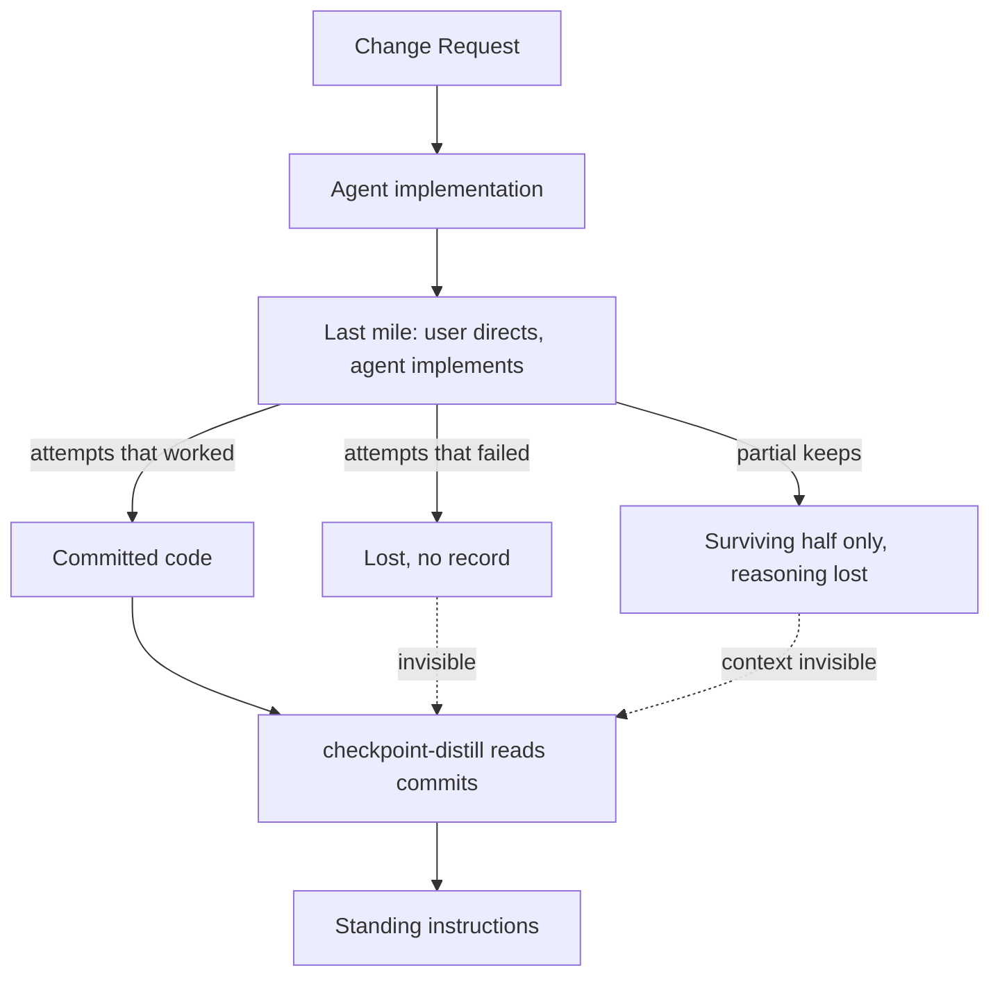
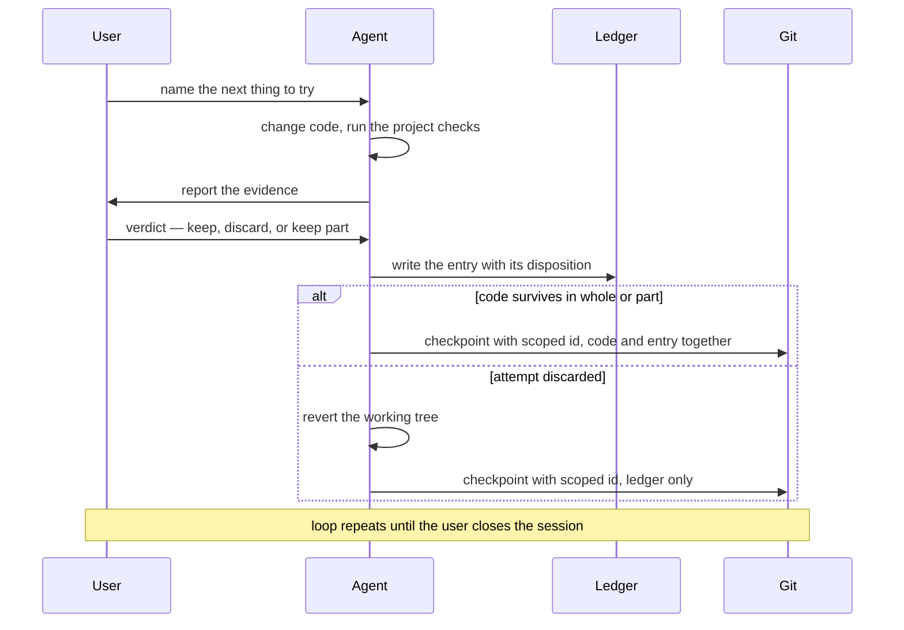
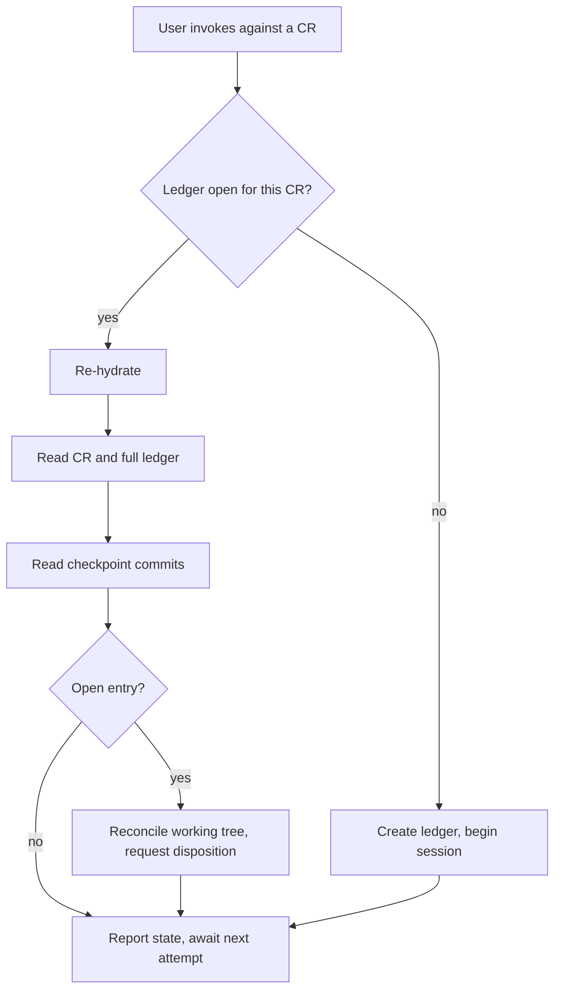
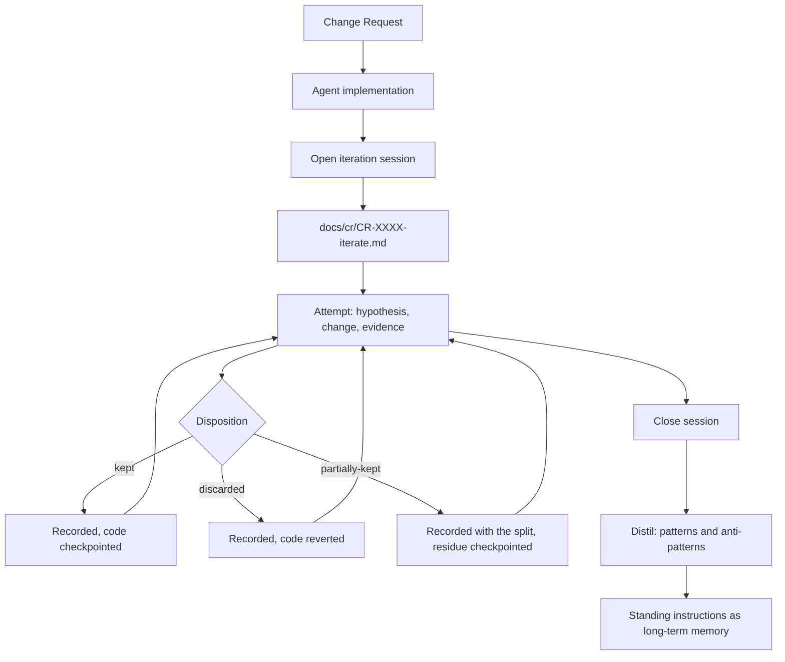
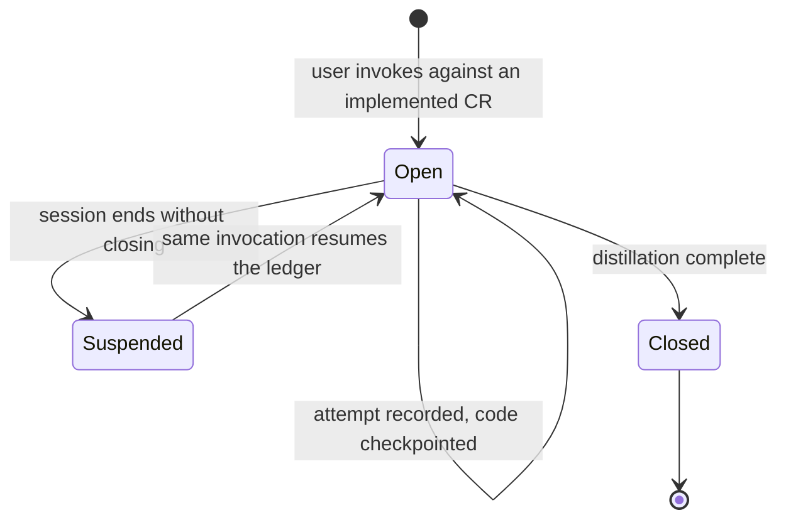
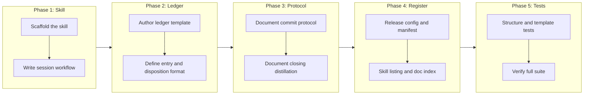

# Checkpoint Iterate: Session Ledger for Last-Mile Implementation

## Change Summary

A Change Request describes an implementation before it exists, so in a complex codebase the delivered result is rarely complete on the first pass. Closing that final gap is an interactive loop between a human and a coding agent: the human names what to try, the agent makes the change and reports the evidence, the human decides whether it survives. Today that loop leaves almost no trace — successful attempts survive as code, and everything discarded along the way vanishes. This CR adds an **iteration session** skill, initiated by the user against an implemented Change Request, in which the agent maintains a ledger at `docs/cr/CR-XXXX-iterate.md`, records every attempt with an explicit disposition of kept, discarded, or partially kept, checkpoint-commits code changes as it makes them, and closes by distilling the session into recommended patterns and anti-patterns for the project's standing instructions.

## Motivation and Background

The governance pipeline produces an implementation from a specification. The specification was written before the code existed, against a codebase the author understood incompletely, so the implementation that comes out the other end is approximately right rather than exactly right. A human and a coding agent then close the gap together, iterating until the behaviour is what was actually wanted. That last mile is where the real knowledge about the codebase is generated, and it is precisely the part the repository currently forgets.

The division of labour matters for what follows. The human supplies direction and judgment: what to try next, and whether the result survives. The agent does the work: it makes the code change, runs the checks, reports what happened, and — because it is the party present for every attempt and already writing to the repository — records the ledger entry and creates the commit. The ledger is therefore an agent-maintained artifact, not a notebook the human is asked to keep in parallel with the work.

**Commit history preserves the wrong half of the work.** A checkpoint commit records what was kept. The three approaches tried and abandoned before it leave nothing behind — not in the diff, not in the log, not anywhere. Yet those are the higher-value observations: knowing that an approach *does not* work in this codebase, and why, prevents a future implementer from spending an afternoon rediscovering it. The existing distillation workflow reads commit history, so it can only ever learn from successes. It is structurally blind to the failures.

**Partial keeps are invisible.** Real iteration is not binary. An attempt is tried, half of it turns out to be right, the rest is reverted, and the surviving half is folded into the next attempt. The commit shows the surviving half with no indication that it was the residue of a larger idea, or what the discarded remainder was. The reasoning that produced the split is lost the moment the session ends.

**Session context evaporates.** The reasoning lives in the agent's context window and the human's short-term memory, and both are gone by the next session. The next party to touch the area starts from the code alone, with no record of which alternatives were already eliminated.

**The knowledge never becomes durable.** Each last-mile session teaches the same lessons to a different person. Nothing accumulates. A project that has run twenty of these sessions is no better at the twenty-first, because there is no mechanism carrying what was learned into the instructions that future implementers actually read.

A ledger fixes all four, and it must be written *during* the session rather than reconstructed afterwards. Reconstruction is exactly what fails: by the time the session ends, the discarded attempts have already been forgotten, which is why commit history has no record of them.

## Change Drivers

* Implementations delivered from a specification are approximately correct, and the human-directed agent iteration that closes the gap is undocumented
* Discarded attempts are the highest-value observations and leave no trace anywhere in the repository
* Partial keeps carry reasoning that is lost the moment the session ends
* The existing distillation workflow reads commit history and is therefore structurally unable to learn from failure
* Nothing carries last-mile knowledge into the standing instructions that future implementers read

## Current State

Three checkpoint skills cover adjacent concerns, and there is a gap between them. This repository ships two of them, `/checkpoint-commit` and `/checkpoint-read`; the third, `/checkpoint-distill`, is a checkpoint workflow this session consumes at close (see Dependencies).

**`/checkpoint-commit`** creates a commit with subject `checkpoint(CR-XXXX): {summary}`, linking a unit of work to its governing document. It records outcomes, not the reasoning that produced them.

**`/checkpoint-read`** recovers context in a new session by querying `git log --grep '^checkpoint.*:'`. It can only surface what checkpoint commits contain, so it inherits the same blindness.

**`/checkpoint-distill`** analyses recent commits and writes durable practices into the project's standing instructions. Its own documentation identifies the highest-value finding as the **wrong-then-right sequence** — work done one way, found wrong, then redone — and directs the analysis to hunt for them in commit history. This only works when the wrong version was committed. An approach tried in the working tree and reverted before any commit is invisible to it, and that is how most last-mile iteration actually proceeds.

There is no artifact that records an attempt which was never committed, and no defined moment at which last-mile iteration is captured rather than merely performed.

### Current State Diagram



## Proposed Change

Add an **iteration session**: a bounded, resumable iteration loop opened against an implemented CR, which maintains a ledger of every attempt and closes by distilling that ledger into durable guidance.

**Initiation and roles.** The user initiates the session explicitly by invoking the skill against an implemented Change Request. It is never started automatically, and never spawned by the implementation pipeline — the whole point is that a human has looked at the delivered result and judged it not yet right.

| Invocation | Effect |
|---|---|
| `/checkpoint-iterate CR-XXXX` | Opens a session against that Change Request, or resumes one already open |
| `/checkpoint-iterate close CR-XXXX` | Closes the active session and distils the ledger |
| `/checkpoint-iterate status CR-XXXX` | Reports the active session, its attempt count, and its dispositions so far |

Within the session the roles are fixed:

* **The user** names what to try next and renders the verdict on each result. That verdict is a judgment the skill records; it is never inferred.
* **The agent** makes the code change, runs the project's checks, reports the evidence, then writes the ledger entry and creates the commit. The agent is the recorder for every attempt, because it is the party present at all of them and already writing to the repository.

The human is therefore never asked to maintain a notebook alongside the work. Their contribution is direction and judgment; the recording is a side effect of the agent doing what it was already doing.

**Opening.** Invoking the skill creates `docs/cr/CR-XXXX-iterate.md` from a bundled template, or resumes the existing ledger if one is already open. The ledger records the CR it serves, the branch and commit the session starts from, and its own open or closed status.

**Iterating.** Each attempt becomes a numbered ledger entry, written by the agent, recording the hypothesis being tested, the files touched, the verification evidence, and a disposition drawn from a closed set:

| Disposition | Meaning |
|---|---|
| `kept` | The attempt worked and survives in full |
| `discarded` | The attempt did not work and was reverted in full |
| `partially-kept` | Part survives; the entry records which part and which part was reverted |

Discarded entries are never deleted from the ledger. Retaining them is the entire point: they are the anti-pattern evidence that exists nowhere else.

**Committing.** The agent commits continuously as the session proceeds, without waiting to be asked, reusing the existing checkpoint mechanism rather than inventing a parallel one. Session commits are distinguished from the core implementation workflow by scoping the identifier, not by changing the type:

| Commit subject | Produced by |
|---|---|
| `checkpoint(CR-XXXX): {summary}` | The core agentic implementation workflow |
| `checkpoint(CR-XXXX-iterate): {summary}` | An iteration session against that Change Request |

Reusing the `checkpoint` type keeps session work visible to `/checkpoint-read`, whose query matches `^checkpoint.*:` — which is correct, because iteration work is part of what a later session needs to recover. The `-iterate` suffix on the scope makes the two separable on demand:

```bash
git log --grep '^checkpoint(CR-XXXX):'          # core implementation only
git log --grep '^checkpoint(CR-XXXX-iterate):'  # iteration session only
git log --grep '^checkpoint.*:'                 # both, the default recovery view
```

A code checkpoint carries the ledger entry for the attempt it embodies in the same commit, so evidence and change are never separated. A discarded attempt leaves no code, so its commit touches the ledger alone — still a session checkpoint, and identifiable by path rather than by a separate subject convention:

```bash
git log --grep '^checkpoint(CR-XXXX-iterate):' -- docs/cr/CR-XXXX-iterate.md
```

### Attempt Loop



**Entry states.** An entry is written when an attempt *starts*, not when it finishes, and it lives in one of two states. An **open** entry is an attempt in flight with no verdict yet. A **settled** entry carries one of the three dispositions. This split is what makes an interrupted session recoverable: a fresh agent can tell the difference between an attempt that was abandoned and one that was never judged. A session cannot be closed while any entry is still open.

**Re-hydration.** The ledger is on disk, so it survives context loss entirely. Recovering a cleared or new session takes exactly one user action — the same invocation used to open it. The agent then reconstructs state without further questions:

1. Reads the governing Change Request and the full ledger, including every settled entry.
2. Reads the checkpoint commits for that Change Request, via the existing history query.
3. Compares the working tree against the last commit. Uncommitted changes belong to the open entry, if there is one.
4. Reports the recovered state: what has been settled, what was eliminated, and what was in flight.
5. Requests a disposition for the open entry before starting anything new.

Step 5 is the one that prevents silent corruption. An interrupted attempt has code in the tree and no verdict; resuming without settling it would fold unjudged work into the next attempt and misattribute it.

Reading the discarded entries matters as much as reading the kept ones: without them, a re-hydrated agent will cheerfully retry an approach the session already eliminated, which is the exact waste the ledger exists to prevent.

**Parallel sessions.** Two sessions may run at once, but not in the same working tree. The constraint is not the ledger — those are distinct files — it is Git. The existing checkpoint commit workflow stages with `git add -A`, so two concurrent sessions sharing one working tree would each sweep the other's uncommitted work into their own commits, producing checkpoints that misattribute changes to the wrong Change Request and cross-contaminate both ledgers.

Three rules make concurrency safe:

* **One active session per working tree.** A second concurrent session runs in its own Git worktree. This is the primary isolation mechanism and the only one that fully separates the two.
* **Scoped staging.** A session stages only the paths it touched — its ledger and the files of the attempt in hand — never the whole tree. This is defence in depth: it bounds the damage if two sessions do end up sharing a tree.
* **Explicit identification.** Every invocation names its Change Request. There is no implicit "current session" to be ambiguous about. Where an invocation omits it and more than one ledger is open in the working tree, the skill refuses and lists the candidates rather than guessing.

The ledger records the worktree it was opened in, so a session resumed somewhere else is detected and reported rather than silently proceeding against a different tree.



**Closing.** The session is closed by distilling the ledger into two lists: what worked, expressed as recommended patterns, and what did not, expressed as anti-patterns. These are handed to the existing `/checkpoint-distill` workflow, with the ledger as a strictly richer input than commit history because it contains the discarded attempts commit history omits.

### Proposed State Diagram



### Session Lifecycle



## Requirements

### Functional Requirements

1. The repository **MUST** contain a new skill at `skills/checkpoint-iterate/` comprising `SKILL.md`, `version.txt`, and `CHANGELOG.md`, matching the structure of the existing checkpoint skills.
2. The skill **MUST** define a slash command that accepts a governing Change Request identifier as its argument.
3. The session **MUST** be initiated by explicit user invocation only, and **MUST NOT** be started automatically or spawned by the implementation pipeline.
4. The skill **MUST** provide a close invocation that ends the active session and triggers distillation.
5. The skill **MUST** provide a status invocation reporting the active session, its attempt count, and its dispositions to date.
6. The command **MUST** create a session ledger at `docs/cr/{CR_ID}-iterate.md` when none exists for the given identifier.
7. The command **MUST** resume the existing ledger when one is already present and open, appending to it rather than recreating or rewriting it.
8. The command **MUST** refuse to open a session against a Change Request whose document does not exist, and report which identifier could not be resolved.
9. The agent **MUST** write every ledger entry, and **MUST NOT** require the user to author ledger content in order for an attempt to be recorded.
10. The agent **MUST** record the disposition supplied by the user, and **MUST NOT** infer it, assume it, or substitute its own judgment for that verdict.
11. The agent **MUST** create every commit the session produces, without waiting for the user to request it.
12. The agent **MUST** report the verification evidence for an attempt to the user before a disposition is requested, so that the verdict is rendered against observed behaviour.
13. The ledger **MUST** carry frontmatter recording the governing Change Request identifier, session status, start date, closing date once closed, and the branch and commit the session started from.
14. The ledger **MUST NOT** carry `metadata.copyright` or `metadata.version` frontmatter fields, consistent with the convention for documents under `docs/cr/`.
15. The ledger **MUST** contain a session context section, an attempt ledger section, and a distillation section.
16. Each attempt **MUST** be recorded as a numbered entry stating the hypothesis being tested, the files or surfaces touched, the verification evidence observed, and the disposition.
17. The disposition of an attempt **MUST** be exactly one of `kept`, `discarded`, or `partially-kept`.
18. An attempt recorded as `partially-kept` **MUST** state which portion survives and which portion was reverted.
19. Entries with a disposition of `discarded` **MUST** be retained in the ledger for the life of the session and **MUST NOT** be deleted or overwritten by later entries.
20. Code changes made during a session **MUST** be committed continuously using the existing checkpoint commit workflow.
21. Every commit produced by a session **MUST** use the subject form `checkpoint({CR_ID}-iterate): {summary}`, reusing the checkpoint type with the identifier scoped by the `-iterate` suffix.
22. A session commit **MUST NOT** use the unsuffixed `checkpoint({CR_ID}):` form, which is reserved for the core agentic implementation workflow.
23. A checkpoint commit containing code changes **MUST** also contain the ledger entry for the attempt it embodies, so that change and evidence are committed atomically.
24. Reverting a discarded attempt **MUST** be limited to the working tree and **MUST NOT** rewrite, reset, or force-push committed history.
25. Closing a session **MUST** set the ledger status to closed, record the closing date, and populate the distillation section.
26. The distillation section **MUST** separate findings into what worked, expressed as recommended patterns, and what did not, expressed as anti-patterns.
27. The skill **MUST** direct the closing distillation into the project's standing instructions through the existing distillation workflow, rather than defining a competing mechanism.
28. Guidance written into the project's standing instructions as a result of distillation **MUST** describe the practice without naming the governing Change Request or the session that produced it.
29. The skill **MUST** be registered for release with a component entry in the release configuration and a corresponding manifest entry.
30. The repository's user-facing skill listing in `README.md` **MUST** be updated to include the new skill, and the documentation index at `docs/llms.txt` **MUST** be updated with a Change Requests entry for this Change Request, matching the per-CR convention that file already follows.
31. An entry **MUST** be written to the ledger when an attempt starts, before the code change is made, and **MUST** be marked open until a disposition is recorded.
32. A session **MUST NOT** be closed while any entry remains open.
33. The ledger **MUST** record the working tree the session was opened in.
34. On resuming, the agent **MUST** read the governing Change Request, every settled entry in the ledger including discarded ones, and the checkpoint commits for that Change Request, before proposing any new attempt.
35. On resuming, the agent **MUST** report the recovered state to the user, naming what has been settled, what approaches were eliminated, and what was in flight.
36. On resuming with an open entry present, the agent **MUST** reconcile uncommitted working-tree changes against that entry and **MUST** request its disposition before starting a new attempt.
37. The agent **MUST NOT** propose an approach that a settled entry records as discarded, without stating that it was already eliminated and why it is being revisited.
38. The skill **MUST** stage only the paths belonging to the session — its ledger and the files of the attempt in hand — and **MUST NOT** stage the entire working tree.
39. Every invocation **MUST** identify its governing Change Request, and where an invocation omits it and more than one ledger is open in the working tree, the skill **MUST** refuse and list the open ledgers rather than selecting one.
40. The skill **MUST** detect that a ledger is being resumed in a working tree other than the one it records, and **MUST** report this to the user rather than proceeding silently.
41. The skill **MUST** document that concurrent sessions run in separate Git worktrees, and that one working tree hosts at most one active session.
42. Session commits **MUST** remain matchable by the checkpoint history query used for context recovery, and the scoped and unsuffixed forms **MUST** be separable from one another by a subject-line query alone.

### Non-Functional Requirements

1. The ledger **MUST** be append-only within a session: later entries record reversals rather than editing earlier entries.
2. The skill **MUST** bundle its own ledger template, so that installing the skill independently yields a working session without requiring another skill to be present.
3. The skill **MUST NOT** introduce a new runtime, test framework, or tooling dependency.
4. The skill's own files **MUST NOT** contain governance identifiers in a form that violates the repository's governance reference boundary.
5. Ledger entries **MUST** be readable in isolation, so that a reader recovering context need not read the whole ledger to understand any single attempt.
6. Re-hydrating a session after context loss **MUST** require exactly one user action, with no further questions needed to reconstruct session state.
7. The ledger **MUST** be the sole durable record of session state, so that recovery depends on no in-memory or machine-local state.

## Affected Components

* `skills/checkpoint-iterate/SKILL.md` — the session workflow: opening, recording attempts, the commit protocol, and closing
* `skills/checkpoint-iterate/version.txt` and `skills/checkpoint-iterate/CHANGELOG.md` — release metadata matching the existing skills
* `skills/checkpoint-iterate/templates/ITERATE.md` — the bundled ledger template
* `release-please-config.json` and `.release-please-manifest.json` — registration of the new releasable component
* `README.md` — the user-facing skill listing
* `docs/llms.txt` — the documentation index; receives a Change Requests entry for this CR, matching the file's existing per-CR convention (it carries no per-skill entries)
* `tests/checkpoint-iterate/test_skill_structure.bats` and `tests/checkpoint-iterate/test_helpers/setup.bash` — structure and template tests
* `tests/checkpoint-iterate/test_iterate_template.bats` — ledger template assertions

## Scope Boundaries

### In Scope

* The iteration session skill, its ledger template, and its documented workflow
* The three-value disposition vocabulary and the requirement to retain discarded attempts
* The commit protocol, in which both code-plus-ledger checkpoints and ledger-only checkpoints share the scoped `checkpoint({CR_ID}-iterate):` subject and are told apart by the paths they touch
* Closing distillation into recommended patterns and anti-patterns, handed to the existing distillation workflow
* Re-hydration after context loss, and the entry states that make it possible
* Concurrency rules: worktree isolation, scoped staging, and explicit identification
* Registration for release, the skill listing, the documentation index, and tests

### Out of Scope ("Here, But Not Further")

* **Changing the existing checkpoint skills.** The commit, read, and distil skills are consumed as they are. If the distillation workflow needs to learn about ledgers as an input source, that is a separate change.
* **Automating the disposition decision.** Whether an attempt is kept, discarded, or partially kept is the user's judgment, which the agent records verbatim. The agent does not infer, propose, or override it.
* **Rewriting committed history.** The agent reverts a discarded attempt in the working tree, but no reset, rebase, amend, or force push is introduced. Once an attempt is checkpointed, undoing it is a forward commit, not a history edit.
* **Running an iteration session as part of the agent team pipeline.** The session is opened deliberately by a user who has judged the delivered implementation not yet right; it is never spawned by the implementation workflow.
* **A second distillation destination.** Distilled guidance goes where the existing workflow already sends it; no parallel knowledge base is created.
* **Creating worktrees on the user's behalf.** The skill documents that concurrent sessions require separate worktrees and detects when one is resumed in the wrong tree, but setting up a worktree stays with the user.
* **Changing how the existing checkpoint commit skill stages.** Its unscoped staging is the reason worktree isolation is required; narrowing it is a separate change against that skill.
* **Retroactive ledgers.** Sessions are recorded as they happen. Reconstructing a ledger for past work is not supported, because the discarded attempts it would need are already gone.

## Alternative Approaches Considered

* **Extend `/checkpoint-commit` with a disposition field.** Rejected: a commit is created only when work is kept, so the mechanism would still miss every discarded attempt. The gap is not in commit metadata; it is that no commit happens at all.
* **Record attempts as Git notes or as a branch of throwaway commits.** Rejected: it makes discarded work costly to record and awkward to read, when the recording needs to be cheap enough to happen every time. A markdown ledger beside the CR is readable without tooling.
* **Extend the CR itself with an iteration log.** Rejected: the CR is a specification finalised before this work begins, and reopening a completed document to append post-hoc iteration destroys its value as a record of what was decided beforehand. A sibling document preserves both.
* **Distil continuously rather than at session close.** Rejected: a pattern is only visible once the session has enough attempts to show a shape, and mid-session distillation would promote observations that the next attempt contradicts.

## Impact Assessment

### User Impact

A user closing the last mile gains a record of the iteration without writing it: they direct and judge as they already would, and the agent does the recording as part of work it was already doing. The added cost to the user is one explicit verdict per attempt, which replaces the implicit accept-or-retry they were performing anyway. Nothing existing changes behaviour, and the session is opt-in, so anyone who does not open one works exactly as before.

### Technical Impact

Additive. A new skill directory, a new releasable component, and a new test directory. No existing skill is modified, so no consumer of the current skills is affected. The ledger lives under `docs/cr/`, which is already permitted territory under the repository's governance reference boundary, so ledgers containing governance identifiers do not trip the boundary test. The distilled output lands in standing instructions, which are prohibited territory, hence the requirement that distilled guidance names practices rather than documents.

### Business Impact

The intended return is compounding: each session leaves the project better at the next implementation. The risk is that ledgers are opened and never closed, in which case the cost is paid and the return is not collected.

## Implementation Approach

Five sequential phases. Each phase leaves the repository with a passing test suite.

### Implementation Flow



### Detailed Implementation Steps

#### Phase 1 — Scaffold the skill and write the session workflow

Create `skills/checkpoint-iterate/` with `SKILL.md`, `version.txt` containing `0.1.0`, and a `CHANGELOG.md` matching the shape of the existing skills. The `SKILL.md` frontmatter follows the existing skills: `name`, `description`, `license`, and `metadata` with copyright and version. Note that the skill file is prohibited territory under the governance reference boundary, so placeholder identifiers must be written in the non-digit form the other skills already use.

Write the session workflow as ordered steps: resolve and validate the governing Change Request, create or resume the ledger, then loop over attempts. Document all three invocation forms — open or resume against an identifier, close, and status — and the failure behaviour when the Change Request cannot be resolved.

State the role split explicitly in the workflow, because it governs every later step: the user initiates the session, names each thing to try, and renders the verdict; the agent makes the change, runs the project's checks, reports the evidence, then writes the entry and creates the commit. The workflow must direct the agent to report evidence before requesting a disposition, and to record the user's verdict verbatim rather than inferring one.

#### Phase 2 — Author the ledger template

Create `skills/checkpoint-iterate/templates/ITERATE.md` with frontmatter covering the governing identifier, status, start and close dates, and source branch and commit, and with no copyright or version metadata.

Give the template three sections. **Session Context** states what the session is trying to close and the state it starts from. **Attempt Ledger** holds the numbered entries, each with hypothesis, surface, evidence, and disposition, and with an explicit split for a partial keep. **Distillation** is left empty until close, with headings for recommended patterns and anti-patterns.

Include a commented instruction in the template stating that discarded entries are never deleted, and that later entries record reversals rather than editing earlier ones.

#### Phase 3 — Document the commit protocol and closing distillation

Extend `SKILL.md` with the commit protocol: code changes go through the existing checkpoint commit workflow, every session commit uses the scoped `checkpoint({CR_ID}-iterate):` subject form, and a code checkpoint carries its ledger entry in the same commit. State why the scope is suffixed rather than the type replaced: session work stays visible to context recovery, while the suffix keeps it separable from the core implementation workflow by a subject query.

Then document closing: set status and closing date, populate the distillation section separating recommended patterns from anti-patterns, and hand the result to the existing distillation workflow. State explicitly that guidance written into standing instructions describes the practice and does not name the Change Request or the session, per the repository's governance reference boundary.

#### Phase 4 — Register the skill

Add a `skills/checkpoint-iterate` package entry to `release-please-config.json` and a matching entry to `.release-please-manifest.json`, following the existing entries exactly. Add the skill to the available-skills listing in `README.md`. Add a Change Requests entry for this CR to the `## Change Requests` section of `docs/llms.txt`, following the existing per-CR entries; `docs/llms.txt` lists Change Requests, not individual skills, so no per-skill entry is added there.

#### Phase 5 — Add tests and verify

Create `tests/checkpoint-iterate/test_helpers/setup.bash` resolving the repository root and skill paths, following the existing helper. Add `tests/checkpoint-iterate/test_skill_structure.bats` asserting the skill files exist, the version is valid semver, the frontmatter carries the required fields, the skill is registered in both release files, the skill appears in the README listing, and that the workflow documents its load-bearing behaviours: the three invocation forms, refusing a missing Change Request, resume-not-restart, user-only initiation, refusing to close with an open entry, refusing an ambiguous invocation, foreign-worktree detection, and the guard against silently retrying an eliminated approach. Add `tests/checkpoint-iterate/test_iterate_template.bats` asserting the template's frontmatter fields, the absence of copyright and version metadata, the presence of the three sections, that all three disposition values are documented, and that the partial-keep split is documented.

Run the full suite and confirm it passes, including the governance boundary test, which must not report the new skill files as violations.

## Test Strategy

### Tests to Add

| Test File | Test Name | Description | Inputs | Expected Output |
|-----------|-----------|-------------|--------|-----------------|
| `tests/checkpoint-iterate/test_skill_structure.bats` | `SKILL.md exists at correct path` | Skill file is present at the expected location | `skills/checkpoint-iterate/` | File exists |
| `tests/checkpoint-iterate/test_skill_structure.bats` | `version.txt exists with valid semver content` | Version file holds a valid semver string, not a hardcoded value | `skills/checkpoint-iterate/version.txt` | Matches semver pattern |
| `tests/checkpoint-iterate/test_skill_structure.bats` | `SKILL.md frontmatter has required fields` | Frontmatter carries name, description, and metadata | `skills/checkpoint-iterate/SKILL.md` | All fields present |
| `tests/checkpoint-iterate/test_skill_structure.bats` | `SKILL.md contains no destructive Git commands` | Session workflow introduces no destructive Git operation | `skills/checkpoint-iterate/SKILL.md` | No match for reset, rebase, amend, force push |
| `tests/checkpoint-iterate/test_skill_structure.bats` | `release-please-config contains checkpoint-iterate component` | Skill is registered as a releasable component | `release-please-config.json` | Component entry present |
| `tests/checkpoint-iterate/test_skill_structure.bats` | `release-please-manifest contains the skill` | Manifest carries the skill's initial version | `.release-please-manifest.json` | Entry present |
| `tests/checkpoint-iterate/test_skill_structure.bats` | `README lists the skill in Available Skills` | Skill is discoverable in the user-facing listing | `README.md` | Listing contains the skill |
| `tests/checkpoint-iterate/test_skill_structure.bats` | `SKILL.md documents all three invocation forms` | Open, close, and status are all specified | `skills/checkpoint-iterate/SKILL.md` | Three forms documented |
| `tests/checkpoint-iterate/test_skill_structure.bats` | `SKILL.md documents refusing a missing Change Request` | Opening against an unresolved identifier is refused and reported | `skills/checkpoint-iterate/SKILL.md` | Refusal behaviour documented |
| `tests/checkpoint-iterate/test_skill_structure.bats` | `SKILL.md documents resume rather than restart` | A second invocation resumes the existing ledger without rewriting entries | `skills/checkpoint-iterate/SKILL.md` | Resume behaviour documented |
| `tests/checkpoint-iterate/test_skill_structure.bats` | `SKILL.md states the session is user-initiated and never auto-started` | The session is never spawned by the implementation pipeline | `skills/checkpoint-iterate/SKILL.md` | Initiation rule documented |
| `tests/checkpoint-iterate/test_skill_structure.bats` | `SKILL.md forbids closing while an entry is open` | A session cannot close with any entry unjudged | `skills/checkpoint-iterate/SKILL.md` | Close-blocked rule documented |
| `tests/checkpoint-iterate/test_skill_structure.bats` | `SKILL.md documents refusing an ambiguous invocation` | An identifier-less invocation with more than one open ledger is refused and the candidates listed | `skills/checkpoint-iterate/SKILL.md` | Refuse-and-list documented |
| `tests/checkpoint-iterate/test_skill_structure.bats` | `SKILL.md documents foreign-worktree detection` | A resume in a working tree other than the recorded one is reported, not proceeded with | `skills/checkpoint-iterate/SKILL.md` | Detection documented |
| `tests/checkpoint-iterate/test_skill_structure.bats` | `SKILL.md forbids silently retrying an eliminated approach` | A discarded approach is not proposed without stating it was already eliminated | `skills/checkpoint-iterate/SKILL.md` | Guard documented |
| `tests/checkpoint-iterate/test_skill_structure.bats` | `SKILL.md assigns recording to the agent` | The workflow states the agent writes entries and commits | `skills/checkpoint-iterate/SKILL.md` | Instruction present |
| `tests/checkpoint-iterate/test_skill_structure.bats` | `SKILL.md requires evidence before disposition` | The workflow orders reporting before the verdict is requested | `skills/checkpoint-iterate/SKILL.md` | Instruction present |
| `tests/checkpoint-iterate/test_skill_structure.bats` | `SKILL.md documents the re-hydration procedure` | Resume reads CR, ledger, and checkpoint commits before proposing work | `SKILL.md` | Procedure documented |
| `tests/checkpoint-iterate/test_skill_structure.bats` | `SKILL.md requires worktree isolation for concurrent sessions` | Concurrency rule is stated | `SKILL.md` | Rule documented |
| `tests/checkpoint-iterate/test_skill_structure.bats` | `SKILL.md forbids staging the whole working tree` | Scoped staging is required | `SKILL.md` | No unscoped stage-all instruction |
| `tests/checkpoint-iterate/test_skill_structure.bats` | `SKILL.md specifies the scoped checkpoint subject form` | Session commits use the identifier suffixed with iterate | `SKILL.md` | Scoped form documented |
| `tests/checkpoint-iterate/test_skill_structure.bats` | `SKILL.md reserves the unsuffixed form for the implementation workflow` | The distinction between the two subject forms is stated | `SKILL.md` | Reservation documented |
| `tests/checkpoint-iterate/test_iterate_template.bats` | `iterate template has a worktree field` | Template records the tree the session was opened in | `templates/ITERATE.md` | Field present |
| `tests/checkpoint-iterate/test_iterate_template.bats` | `iterate template documents the open and settled entry states` | Both entry states are specified | `templates/ITERATE.md` | Both states documented |
| `tests/checkpoint-iterate/test_iterate_template.bats` | `iterate template has governing CR field` | Template frontmatter records the CR it serves | `templates/ITERATE.md` | Field present |
| `tests/checkpoint-iterate/test_iterate_template.bats` | `iterate template has status field` | Template frontmatter records session status | `templates/ITERATE.md` | Field present |
| `tests/checkpoint-iterate/test_iterate_template.bats` | `iterate template has source-branch and source-commit fields` | Template records the state the session started from | `templates/ITERATE.md` | Both fields present |
| `tests/checkpoint-iterate/test_iterate_template.bats` | `iterate template has no copyright metadata field` | Template does not carry template-describing metadata | `templates/ITERATE.md` | No match |
| `tests/checkpoint-iterate/test_iterate_template.bats` | `iterate template has no version metadata field` | Template does not carry template-describing metadata | `templates/ITERATE.md` | No match |
| `tests/checkpoint-iterate/test_iterate_template.bats` | `iterate template has the three required sections` | Session context, attempt ledger, and distillation are all present | `templates/ITERATE.md` | Three headings found |
| `tests/checkpoint-iterate/test_iterate_template.bats` | `iterate template documents all three dispositions` | The closed disposition vocabulary is stated in full | `templates/ITERATE.md` | kept, discarded, partially-kept all present |
| `tests/checkpoint-iterate/test_iterate_template.bats` | `iterate template documents the partial-keep split` | A partially-kept entry states which portion survives and which was reverted | `templates/ITERATE.md` | Split fields present |
| `tests/checkpoint-iterate/test_iterate_template.bats` | `iterate template separates patterns from anti-patterns` | Distillation section carries both headings | `templates/ITERATE.md` | Both headings found |
| `tests/checkpoint-iterate/test_iterate_template.bats` | `iterate template states that discarded entries are retained` | The retention rule is documented in the template itself | `templates/ITERATE.md` | Instruction present |

### Tests to Modify

Not applicable. This change is additive; no existing test covers behaviour that changes.

### Tests to Remove

Not applicable. No test becomes redundant.

## Acceptance Criteria

### AC-1: A session opens against an implemented Change Request

```gherkin
Given a Change Request document exists and its implementation is in place
When an iteration session is opened against that Change Request
Then a ledger is created at docs/cr/{CR_ID}-iterate.md
  And its frontmatter records the governing identifier, an open status, the start date, and the branch and commit the session starts from
  And its frontmatter carries no copyright or version metadata field
  And the ledger provides a session context section, an attempt ledger section, and a distillation section
```

### AC-2: Opening against a missing Change Request is refused

```gherkin
Given no Change Request document exists for the supplied identifier
When an iteration session is opened against that identifier
Then no ledger is created
  And the unresolved identifier is reported
```

### AC-3: A second invocation resumes rather than restarts

```gherkin
Given an open ledger already exists for a Change Request
When an iteration session is opened against the same Change Request
Then the existing ledger is resumed
  And no previously recorded entry is rewritten or removed
```

### AC-4: An attempt is recorded with its disposition

```gherkin
Given an open iteration session
When the agent completes an attempt and the user renders a verdict
Then the agent writes a numbered entry recording the hypothesis, the surface touched, the verification evidence, and the disposition
  And the disposition is exactly one of kept, discarded, or partially-kept
  And the disposition recorded is the one the user supplied
```

### AC-5: A partial keep records the split

```gherkin
Given an attempt whose outcome is partially kept
When the entry is recorded
Then it states which portion survives
  And it states which portion was reverted
```

### AC-6: Discarded attempts survive in the ledger

```gherkin
Given an attempt was recorded as discarded
When later attempts are recorded and the session continues
Then the discarded entry remains in the ledger unchanged
  And it is present when the session is closed
```

### AC-7: Code changes are checkpointed with their evidence

```gherkin
Given an attempt that changes code
When the agent commits the change without being asked
Then the commit subject is checkpoint with the governing identifier suffixed by iterate
  And the same commit contains the ledger entry for that attempt
```

### AC-8: Session commits are separable from implementation commits

```gherkin
Given a Change Request with both implementation commits and iteration session commits
When the history is queried by the scoped subject form
Then only the iteration session commits are returned
  And querying the unsuffixed form returns only the implementation commits
```

### AC-9: Closing populates the distillation

```gherkin
Given an open session with recorded attempts
When the session is closed
Then the ledger status becomes closed and the closing date is recorded
  And the distillation section separates recommended patterns from anti-patterns
```

### AC-10: Anti-patterns derive from discarded work

```gherkin
Given a session containing at least one discarded attempt
When the session is distilled
Then the anti-patterns list reflects that discarded attempt
  And the reason it did not work is stated
```

### AC-11: Distilled guidance names practices, not documents

```gherkin
Given distilled guidance is written into the project's standing instructions
When that guidance is read
Then it describes the practice
  And it contains no governance identifier naming the Change Request or session that produced it
```

### AC-12: The skill is registered and discoverable

```gherkin
Given the skill is implemented
When the release configuration, manifest, and README listing are read
Then each contains an entry for the new skill
  And the documentation index at docs/llms.txt contains a Change Requests entry for this Change Request
```

### AC-13: The skill introduces no destructive Git operation

```gherkin
Given the session workflow
When it is inspected for Git operations
Then it contains no reset, rebase, amend, or force push
  And reverting a discarded attempt is limited to the working tree
```

### AC-14: The user initiates, and nothing else does

```gherkin
Given an implemented Change Request
When the implementation pipeline runs to completion
Then no iteration session is opened
  And a session exists only where a user has explicitly invoked the skill
```

### AC-15: The agent records without being asked

```gherkin
Given an open iteration session
When an attempt completes
Then the agent writes the ledger entry and creates the commit on its own initiative
  And the user is not required to author ledger content for the attempt to be recorded
```

### AC-16: Evidence precedes the verdict

```gherkin
Given an attempt whose code change the agent has made
When the agent runs the project's checks
Then it reports the observed evidence to the user
  And it requests a disposition only after that evidence has been reported
```

### AC-17: Session status is reportable

```gherkin
Given an open session with recorded attempts
When the status invocation is used
Then the active session, its attempt count, and its dispositions to date are reported
```

### AC-18: One action re-hydrates a cleared session

```gherkin
Given an open session whose agent context has been cleared
When the user invokes the skill against the same Change Request
Then the agent reads the Change Request, the full ledger, and the checkpoint commits
  And it reports what has been settled, what was eliminated, and what was in flight
  And no further user action is required to reconstruct session state
```

### AC-19: An interrupted attempt is settled before work continues

```gherkin
Given a session was interrupted with an entry still open and uncommitted changes in the working tree
When the session is resumed
Then the agent reconciles those changes against the open entry
  And requests its disposition before starting a new attempt
```

### AC-20: Eliminated approaches are not silently retried

```gherkin
Given the ledger contains a settled entry with a disposition of discarded
When a resumed agent considers the next attempt
Then it does not propose that approach without stating it was already eliminated and why it is being revisited
```

### AC-21: A session cannot close with work unjudged

```gherkin
Given a session with at least one open entry
When the close invocation is used
Then the session is not closed
  And the open entry is reported as requiring a disposition
```

### AC-22: Concurrent sessions do not contaminate each other

```gherkin
Given two sessions are open against different Change Requests in separate Git worktrees
When each commits an attempt
Then each commit contains only the paths belonging to its own session
  And neither ledger records work performed in the other session
```

### AC-23: Ambiguous invocation is refused, not guessed

```gherkin
Given more than one ledger is open in the working tree
When an invocation omits the Change Request identifier
Then the skill refuses to act
  And lists the open ledgers for the user to choose between
```

### AC-24: A resumed session detects a foreign working tree

```gherkin
Given a ledger records the working tree it was opened in
When it is resumed from a different working tree
Then the skill reports the discrepancy rather than proceeding silently
```

### AC-25: Session commits remain visible to context recovery

```gherkin
Given commits produced by an iteration session
When the checkpoint history query used for context recovery is run
Then those commits appear in the results alongside implementation checkpoints
```

### AC-26: The suite passes with the boundary intact

```gherkin
Given the skill, its template, and its tests are in place
When the full test suite is run
Then every test passes
  And the governance boundary test reports no violation introduced by the new files
```

## Quality Standards Compliance

### Build & Compilation

- [ ] Not applicable: documentation and skills repository with no build step

### Linting & Code Style

- [ ] Not applicable: no linter is configured for this repository

### Test Execution

- [ ] All existing tests pass after implementation
- [ ] All new tests pass
- [ ] Test coverage meets project requirements for changed code

### Documentation

- [ ] Skill documentation complete and self-contained
- [ ] User-facing skill listing updated
- [ ] Documentation index updated

### Code Review

- [ ] Changes submitted via pull request
- [ ] PR title follows Conventional Commits format
- [ ] Code review completed and approved
- [ ] Changes squash-merged to maintain linear history

### Verification Commands

```bash
# Test execution
bats -r tests/
```

## Risks and Mitigation

### Risk 1: Sessions are opened but never closed

**Likelihood:** high
**Impact:** high
**Mitigation:** An unclosed ledger costs the recording effort and returns nothing, which is the change's principal failure mode. The ledger's open status makes the state explicit and greppable, so unclosed sessions are visible rather than silently accumulating. The closing step is deliberately small — two lists derived from entries already written — so that it is cheap enough to actually perform.

### Risk 2: The recording burden discourages recording the failures

**Likelihood:** medium
**Impact:** high
**Mitigation:** Discarded attempts are the entries most likely to be skipped, because nothing survives in the code to prompt writing them, and they are the ones the change exists to capture. Placing the recording duty on the agent rather than the user removes the main reason they would go unwritten: the agent is present for the failure and is already writing to the repository, whereas a human has moved on to the next idea. A discarded attempt still produces a ledger-only commit, so a failure that leaves no code behind still leaves a trace.

### Risk 3: Distilled guidance accumulates as unreviewed sediment

**Likelihood:** medium
**Impact:** medium
**Mitigation:** Distillation is routed through the existing workflow, which already has an approval gate and a tiering step, rather than writing directly into standing instructions. Nothing reaches the standing instructions without passing that gate.

### Risk 4: The ledger duplicates the Change Request

**Likelihood:** low
**Impact:** low
**Mitigation:** The two documents have disjoint jobs, and the ledger's sections are shaped to make overlap awkward: the CR records what was specified beforehand, the ledger records what was attempted afterwards. The session context section references the CR rather than restating it.

### Risk 5: A partial keep is recorded ambiguously

**Likelihood:** medium
**Impact:** medium
**Mitigation:** The disposition vocabulary is closed to three values, and the partial case is the only one carrying a mandatory split field, so an entry that does not state both sides of the split is visibly incomplete. A template test asserts all three values are documented.

### Risk 6: Concurrent sessions cross-contaminate through the shared working tree

**Likelihood:** medium
**Impact:** high
**Mitigation:** The existing checkpoint commit workflow stages with an unscoped stage-all, so two sessions sharing a working tree would each commit the other's in-flight changes, misattributing work to the wrong Change Request and corrupting both ledgers. Worktree isolation is the primary defence and is stated as a rule rather than a suggestion; scoped staging bounds the damage if it is ignored; and recording the working tree in the ledger makes a cross-tree resume detectable. Note that this constrains the session's own staging behaviour and does not change the existing checkpoint skill.

### Risk 7: An interrupted attempt is folded into the next one

**Likelihood:** medium
**Impact:** medium
**Mitigation:** Context can be lost mid-attempt, leaving code in the tree with no verdict. Writing the entry when the attempt starts, rather than when it finishes, means the interruption is visible as an open entry on resume. The resume procedure reconciles the working tree against that entry and settles it before anything new begins, so unjudged work is never silently attributed to a later attempt.

## Dependencies

* Consumes the existing checkpoint commit workflow for code changes; that skill is unchanged
* Consumes the existing distillation workflow as the closing step; that skill is unchanged
* Operates under the governance reference boundary, which permits ledgers under `docs/cr/` and prohibits governance identifiers in the distilled output
* No external dependencies and no new tooling

## Estimated Effort

Approximately 8 to 12 person-hours.

* Phase 1, skill scaffold and session workflow: 2.5 hours
* Phase 2, ledger template: 2 hours
* Phase 3, commit protocol and closing distillation: 2 hours
* Phase 4, registration and documentation: 1 hour
* Phase 5, tests and verification: 2.5 hours

## Decision Outcome

Chosen approach: "a sibling ledger document maintained during the session, closing into the existing distillation workflow", because the knowledge this change exists to capture is precisely the knowledge that never reaches a commit. Recording it as it happens is the only point at which it exists to be recorded, and a markdown sibling keeps the Change Request intact as a record of what was decided beforehand while giving the iteration a home of its own.

## Related Items

* Links to related change requests: CR-0010 and CR-0012 established the checkpoint commit and read workflows this session consumes; CR-0014 established the governance reference boundary that governs where the ledger and its distilled output may name documents
* Links to issues/tickets: #24

<!-- review-summary -->
## Review Summary (cr-reviewer)

Reviewed against repo state at branch `feat/cr-reconciliation-guidance`, HEAD `8f51fde`.

### Findings by category

- **Drift / accuracy: 2**
  1. Current State claimed "The repository has three checkpoint skills." The repository ships **two** (`checkpoint-commit`, `checkpoint-read`); `checkpoint-distill` exists only as an installed skill (`~/.claude/skills/checkpoint-distill/`), not in `skills/`. Reworded to state two are shipped and `/checkpoint-distill` is a consumed workflow.
  2. `docs/llms.txt` was described as a "documentation index ... to include the new skill." The file is a `## Change Requests` index (CR-0001..CR-0014) with **no per-skill entries**; the existing checkpoint skills are not listed there. Corrected FR-30, AC-12, Affected Components, and Phase 4 so the llms.txt update is a Change Requests entry for this CR, while the README carries the skill listing.
- **Contradiction: 0.** Every Acceptance Criterion is consistent with the Functional Requirements and Implementation Approach.
- **Ambiguity: 0.** All 42 FRs and 7 NFRs use MUST / MUST NOT. No "should / may / as appropriate" language.
- **Requirement to AC coverage: 2** uncovered FRs closed. FR-14 (ledger carries no copyright/version metadata) and FR-15 (three ledger sections) had test coverage but no AC exercising them; both folded into AC-1.
- **AC to Test-Strategy coverage: 8** uncovered ACs closed. AC-2, AC-3, AC-5, AC-14, AC-20, AC-21, AC-23, AC-24 had no Test Strategy row; added documentation-content test rows consistent with the existing prompt-skill test pattern, and reflected them in Phase 5.
- **Clarity / superseded-convention residue: 1.** Scope line "separating code checkpoints from ledger-only commits" could be read as the retired two-subject convention; reworded to path-based separation under the single scoped subject.

### Residue checks requested (all PASS, no findings)

- No `repl` / `REPL` stale naming anywhere (matches at lines using "replaces"/"replaced" are the ordinary verb). Template is `ITERATE.md`, ledger is `CR-XXXX-iterate.md`.
- No surviving `iterate(CR-XXXX):` ledger-only commit prefix and no "kept out of / excluded from checkpoint history" exclusion semantics. FR-21, FR-22, FR-42, AC-8, AC-25 all assert the current model: session commits reuse `checkpoint(...)`, stay visible to `/checkpoint-read`, and are separable by the `-iterate` scope suffix.
- No section assigns code or ledger work to the human. Role split (agent implements, records, commits; user directs and renders verdicts) is consistent across Change Summary, Proposed Change, Requirements, Risks, and diagrams.
- FR 1-42, NFR 1-7, AC 1-26 all present and contiguous; no orphaned numbering.
- Five Mermaid diagrams are accurate to the described flow, boundary-safe (`CR-XXXX` non-digit placeholder), and carry no stale naming.
- Affected Components matches the files the five phases touch (scope consistent).
- Governance reference boundary (CR-0014) respected: skill, template, and test contexts use non-digit placeholders (`CR-XXXX` / `{CR_ID}`), which do not match `(CR|ADR|FR|NFR|AC)-[0-9]+`; concrete identifiers appear only in permitted territory (`docs/cr/`, commit metadata). FR-28 / AC-11 correctly require distilled output to name practices, not documents. No instruction directs governance identifiers into skill files, tests, or user-facing docs.

### Item flagged for human awareness (not blocking)

- **External dependency on `/checkpoint-distill`.** The closing hand-off (FR-27) depends on `/checkpoint-distill`, which is installed in this environment but is **not shipped by this repository**. NFR-2 ("installing the skill independently yields a working session") still holds for the open/iterate/record loop; only the close-step distillation consumes the external workflow, and Dependencies discloses it. If checkpoint-iterate is intended to be installable stand-alone by third parties, the human should confirm whether `/checkpoint-distill` should be shipped from this repo or documented as a prerequisite.

### Fixes applied: 14. Unresolved: 0.
<!-- /review-summary -->
