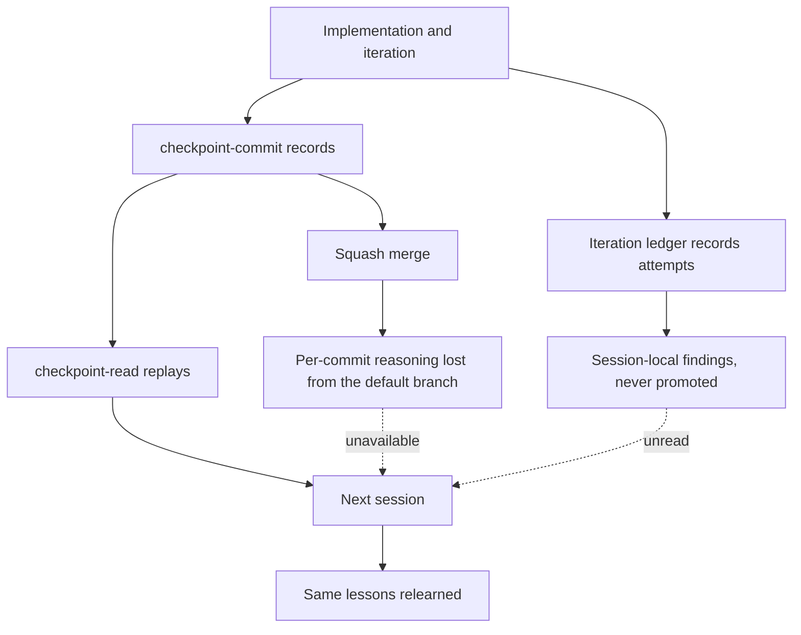
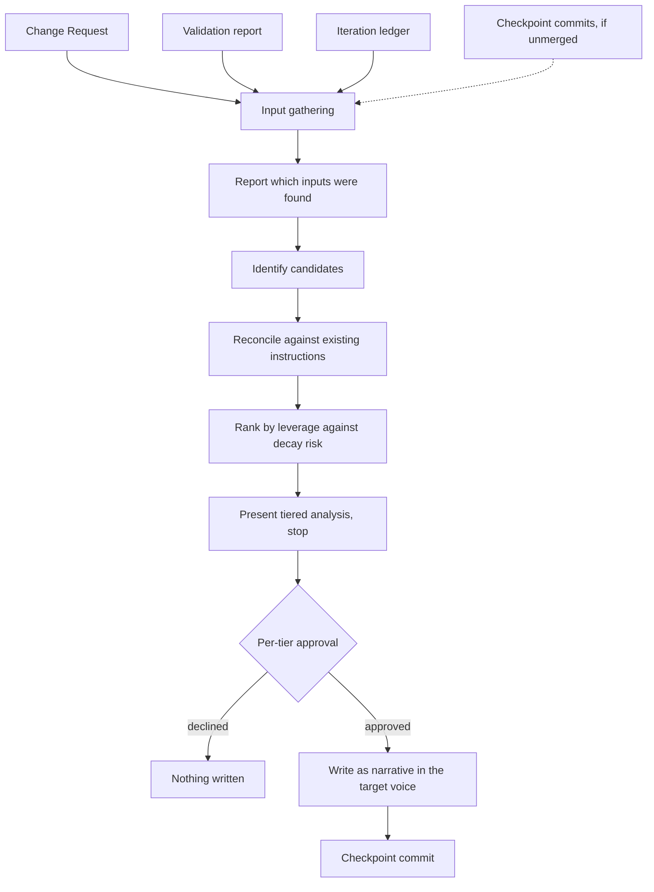
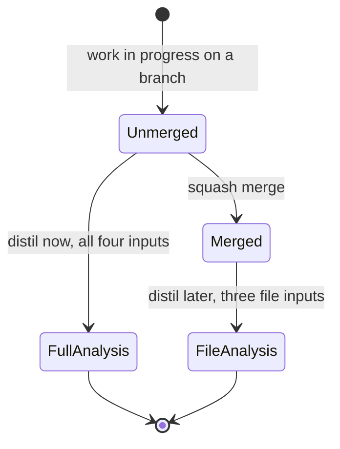
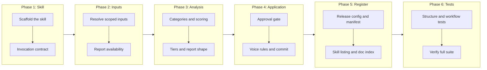

# Checkpoint Distill: Promote Session Knowledge Into Standing Instructions

## Change Summary

The repository can record what a change did and what an iteration session tried, but nothing promotes either into knowledge a future agent inherits. This CR adds a **checkpoint-distill** skill that reads the durable artifacts a completed Change Request leaves behind — the CR itself, its validation report, and its iteration ledger — extracts the constraints, failure narratives, and foot-guns worth keeping, ranks them by leverage against decay risk, and on per-tier approval writes them into the project's standing instructions as narrative in which every rule travels with the reasoning that produced it.

## Motivation and Background

Coding agents are episodic. Each session begins without the context of the last one: what was tried, what failed, what stuck, and why. Standing instructions are the mechanism for carrying that across the gap, but they only work if something puts the knowledge there, and doing it by hand is the first thing skipped when the next feature is waiting.

**A bare rule does not survive contact with inconvenience.** "Do X" tells a future agent what, not why. The first time the constraint is awkward, it gets changed, or it gets stripped on an audit pass as an arbitrary restriction. "We tried Y, it broke for reason Z, so the rule is X" survives, because the reader can evaluate whether Z still applies. The reasoning is the load-bearing part; the rule is a summary of it.

**The most valuable knowledge is about what failed.** A pattern that worked is visible in the code. A pattern that was tried and abandoned is visible nowhere — and it is the one that will be attempted again by the next agent, at full cost, because nothing marks it as already eliminated. Failure narratives are therefore the highest-leverage thing a distillation can capture, and the hardest to reconstruct after the fact.

**Squash merges destroy the commit-borne record.** This project squash-merges pull requests, so a branch's individual checkpoint commits never reach the default branch. Ten commits carrying per-phase reasoning collapse into one whose body is a pull request summary. Any mechanism that depends on reading those commit messages works only in the window between the work finishing and the branch merging, and fails silently afterwards — returning a thinner analysis rather than an error.

What does survive a squash merge is files. A Change Request, its validation report, and its iteration ledger are tracked documents that persist unchanged through the merge, and between them they hold more than the commits did: the CR carries what was specified and what was ruled out of scope, the validation report carries what was verified and which gaps had to be closed, and the ledger carries each attempt's hypothesis, its evidence, and — uniquely — the attempts that were discarded and the reasoning behind each partial keep.

Building the distillation on those artifacts rather than on commit history makes it robust to when it is run, and gives it better source material than commit messages ever contained.

## Change Drivers

* Standing instructions decay unless something deliberately adds to them, and doing it manually is reliably skipped
* Rules recorded without their reasoning get re-litigated or stripped by the next agent to find them inconvenient
* Failure narratives are the highest-value knowledge and are recorded nowhere that outlives the session
* Squash merges make commit history an unreliable input, and its loss is silent rather than loud
* Iteration ledgers already hold richer material than commit messages, with no mechanism to promote it

## Current State

The repository ships three checkpoint skills. Between them they capture work, recover it, and record iteration — but none of them promote anything into durable guidance.

**`/checkpoint-commit`** creates a commit with subject `checkpoint(CR-XXXX): {summary}`, linking a unit of work to its governing document. It records what changed.

**`/checkpoint-read`** recovers context in a new session by querying `git log --grep '^checkpoint.*:'`. It replays what was recorded, and inherits the squash-merge limitation: on the default branch, the checkpoint commits of a merged branch are no longer present.

**`/checkpoint-iterate`** maintains an iteration ledger at `docs/cr/CR-XXXX-iterate.md`, recording each last-mile attempt with a disposition of kept, discarded, or partially-kept, and closing with a session-local list of what worked and what did not. Its own checkpoint commits carry an iteration-scoped subject, `checkpoint(CR-XXXX-iterate): {summary}`, distinct from the plain `checkpoint(CR-XXXX): {summary}` form, so a single Change Request's commits span both subject scopes. That closing list is raw material scoped to a single session. Nothing promotes it beyond the ledger it lives in, and nothing reconciles it against what the standing instructions already say.

The standing instructions themselves are therefore updated only when someone remembers to update them by hand, and the reasoning behind existing rules is preserved only where an author happened to write it down.

### Current State Diagram



## Proposed Change

Add a **checkpoint-distill** skill that turns the artifacts of completed work into standing guidance.

**Scope of an analysis.** A distillation is scoped to a unit of work, not to an arbitrary count of recent commits. Two scopes are supported, and the first is the default because it is the one that survives a merge:

| Invocation | Scope |
|---|---|
| `/checkpoint-distill CR-XXXX` | Change Request scoped: resolves to that CR's durable artifacts |
| `/checkpoint-distill --branch` | Branch scoped: the current branch's commits, delimited by its merge base with the default branch |

**Inputs, ranked by durability.** A Change Request scoped run gathers up to four inputs and reports which were found:

| Input | Survives a squash merge | Contributes |
|---|---|---|
| The Change Request | yes | What was specified, what was deliberately ruled out, declared risks |
| The validation report | yes | What was verified, which gaps were found and how they were closed |
| The iteration ledger | yes | Each attempt's hypothesis and evidence, every discarded attempt, the reasoning behind each partial keep |
| Checkpoint commits for that identifier | no | Per-phase reasoning, when the branch has not yet merged |

The first three are tracked files and are always available. The fourth is available only before the work merges. The skill reports the difference explicitly rather than quietly producing a thinner analysis: an analysis that could not read commits is a different analysis, and the user needs to know which one they got.

**Relationship to the iteration ledger.** A ledger's closing findings are input, not competition. The ledger produces session-local raw material: unranked, scoped to one session, unreconciled against anything. This skill promotes across sessions — it deduplicates against what the standing instructions already say, ranks what remains, and writes it in the target document's voice. The ledger answers "what did this session learn"; the distillation answers "what should every future session know".

**Analysis.** Candidates are drawn from five categories: invariants the code now depends on that nothing explains; failure narratives, which rank highest because they prevent repeated work; reusable patterns; foot-guns that cost real debugging time; and drift, where an existing document now contradicts reality. Each candidate is scored on leverage, decay risk, and the cost of being wrong, then sorted into three tiers — must add, recommended, and optional.

**Approval.** Analysis is read-only by default and stops with a report. Writing happens only on explicit approval, and approval is per tier: a user may accept the first tier and decline the rest.

**Application.** Approved candidates are written into the project's standing instructions in narrative form, with each rule carrying the mechanism that makes it work, the cost of breaking it, and the history of what was tried before it stuck. The target document's existing structure is discovered by reading it, never assumed, so the addition matches whatever organising convention that project already uses.

### Proposed State Diagram



### Input Availability



## Requirements

### Functional Requirements

1. The repository **MUST** contain a new skill at `skills/checkpoint-distill/` comprising `SKILL.md`, `version.txt`, and `CHANGELOG.md`, matching the structure of the existing checkpoint skills.
2. The skill **MUST** define a slash command that accepts a governing Change Request identifier as its argument, and **MUST** treat Change Request scoped analysis as the default mode.
3. The skill **MUST** support a branch scoped mode that analyses the current branch's commits delimited by the merge base with the default branch.
4. The skill **MUST NOT** define a mode that analyses an arbitrary count of most-recent commits, because such a window is neither semantically bounded nor stable across a merge.
5. A Change Request scoped run **MUST** gather the Change Request document, its validation report, and its iteration ledger where each exists.
6. A Change Request scoped run **MUST** additionally gather checkpoint commits whose subject scope matches the governing identifier, where those commits are still reachable. The match **MUST** include both the plain subject scope `checkpoint(CR-XXXX):` and the iteration-session variant `checkpoint(CR-XXXX-iterate):`, so the commits carrying iteration-session reasoning are gathered rather than silently omitted.
7. The skill **MUST** report which of its inputs were found and which were absent, before presenting any finding.
8. The skill **MUST** state explicitly when commit-borne input was unavailable, and **MUST NOT** present an analysis lacking it as equivalent to one that had it.
9. The skill **MUST** document that checkpoint commits are unavailable once a branch has been squash merged, and that a run needing them must happen before the merge.
10. The skill **MUST** refuse to run against a Change Request identifier that resolves to no document, and report which identifier could not be resolved.
11. The skill **MUST** treat an iteration ledger's closing findings as an input to be reconciled and ranked, and **MUST NOT** copy them into the standing instructions unranked.
12. The skill **MUST** read the project's standing instructions in full before identifying candidates, so that already-documented knowledge is not proposed again.
13. Where a candidate is partially covered by existing documentation, the skill **MUST** treat the uncovered gap as the candidate rather than the whole topic.
14. The skill **MUST** identify candidates across invariants, failure narratives, reusable patterns, foot-guns, and documentation drift.
15. The skill **MUST** rank failure narratives above other categories of equivalent leverage, because they prevent work already proven wasteful.
16. The skill **MUST** score each candidate on leverage, decay risk, and the cost of the rule being broken.
17. The skill **MUST** sort candidates into three tiers, ordered from must-add to optional.
18. The skill **MUST** default to analysis without modification, presenting its findings and stopping.
19. The skill **MUST NOT** modify any file while in its default analysis mode.
20. The skill **MUST** obtain approval per tier, and **MUST** support approving one tier while declining another.
21. The skill **MUST NOT** provide any invocation that writes every tier without the user having selected them.
22. The skill **MUST** state, for any candidate it rules out, that it did so and why, rather than omitting it silently.
23. Every finding **MUST** trace to a specific source artifact, identified by file and location or by commit hash.
24. The skill **MUST NOT** record a finding whose reasoning cannot be reconstructed from its sources, and **MUST** request the missing context instead of inferring it.
25. Approved candidates **MUST** be written as narrative prose rather than as a list of bare constraints.
26. Each written rule **MUST** carry the mechanism that makes it work, the cost of breaking it, and what was tried before it stuck.
27. The skill **MUST** determine the target document's existing organising structure by reading it, and **MUST NOT** assume any particular sectioning, index, or naming convention.
28. Written additions **MUST** match the target document's existing voice, formatting, and cross-referencing conventions.
29. Where a rule already exists elsewhere in the target document, the skill **MUST** cross-reference it rather than restating it.
30. Where analysis finds an existing statement that contradicts current reality, the skill **MUST** correct that statement rather than only adding a new one alongside it.
31. Written guidance **MUST** describe the practice without naming the Change Request, iteration session, or commit that produced it, in accordance with the repository's governance reference boundary.
32. The skill **MUST NOT** delete existing content from the standing instructions, and **MUST** raise any pruning it believes necessary as a separate finding for explicit approval.
33. The skill **MUST NOT** perform destructive Git operations, including reset, rebase, amend, and force push.
34. After writing, the skill **MUST** create a checkpoint commit for the governing Change Request.
35. The skill **MUST** report, after writing, what landed and which tiers were deferred with the reason for each deferral.
36. The skill **MUST** be registered for release with a component entry in the release configuration and a corresponding manifest entry.
37. The repository's user-facing skill listing **MUST** be updated to include the new skill, and the documentation index **MUST** gain an entry for this Change Request.

### Non-Functional Requirements

1. The skill **MUST NOT** introduce a new runtime, test framework, or tooling dependency.
2. The skill **MUST** be usable in a project that has no iteration ledger and no validation report, degrading to the inputs that exist rather than failing.
3. Repeating an analysis over an unchanged scope **MUST** produce the same findings, or report that the knowledge is already captured, rather than proposing duplicates.
4. The skill's own files, its tests, and its test helpers **MUST NOT** contain governance identifiers in a form that violates the repository's governance reference boundary. Neither `skills/checkpoint-distill/` nor `tests/checkpoint-distill/` is on the boundary allowlist, so every identifier placeholder written into them **MUST** use a digitless form such as `CR-XXXX`.
5. The skill **MUST NOT** encode the structure, section naming, or subject matter of any specific project, so that it is usable unchanged in any repository.
6. The analysis report **MUST** be scannable in about a minute, with each candidate stating what it is, where it would live, and why it matters.

## Affected Components

* `skills/checkpoint-distill/SKILL.md` — the invocation contract, input resolution, analysis, approval, application, and reporting
* `skills/checkpoint-distill/version.txt` and `skills/checkpoint-distill/CHANGELOG.md` — release metadata matching the existing skills
* `release-please-config.json` and `.release-please-manifest.json` — registration of the new releasable component
* `README.md` — the user-facing skill listing
* `docs/llms.txt` — the documentation index
* `tests/checkpoint-distill/test_helpers/setup.bash` — shared test helper
* `tests/checkpoint-distill/test_skill_structure.bats` — structure, registration, and workflow assertions

## Scope Boundaries

### In Scope

* The skill, its two scoping modes, and its documented workflow
* Input gathering from the Change Request, validation report, iteration ledger, and reachable checkpoint commits
* Explicit reporting of which inputs were available
* Candidate identification, scoring, and three-tier ranking
* Analysis-by-default with per-tier approval before any write
* Voice rules for written output, and discovery of the target document's structure
* Registration for release, the skill listing, the documentation index, and tests

### Out of Scope ("Here, But Not Further")

* **Changing the existing checkpoint skills.** The commit, read, and iterate skills are consumed as they are. The iteration ledger's format is treated as given.
* **Preventing the loss of commit history at merge.** The skill documents and reports the consequence of squash merging; changing the merge strategy is a separate decision.
* **Automatic invocation.** The skill is run deliberately by a user. Nothing triggers it on merge, on a schedule, or from the implementation pipeline.
* **Writing outside the standing instructions.** Approved findings go to the project's standing-instruction file. Creating new long-form documents is not attempted.
* **Pruning existing guidance.** The skill adds and corrects. Removing content is raised as a finding for a human to act on, never performed.
* **Distilling across multiple Change Requests in one run.** A run is scoped to one unit of work; comparing across units is left to the reader.

## Alternative Approaches Considered

* **Analyse a window of recent commits.** Rejected: a count of commits is not a unit of work, and the window silently misses content once a branch merges. The scoping modes chosen are both semantically bounded.
* **Have the iteration session write standing guidance directly at close.** Rejected: a single session cannot see whether its finding generalises, cannot deduplicate against the whole corpus, and would promote observations the next session contradicts. Ranking requires a view wider than the session that produced the material.
* **Maintain a separate knowledge base rather than writing to standing instructions.** Rejected: a second destination competes with the file agents already read, and the failure mode is guidance nobody sees. Writing where the reader already looks is the point.
* **Apply findings automatically without approval.** Rejected: distillation is judgment, and a wrong rule written into standing instructions is worse than no rule, because every future session inherits it.

## Impact Assessment

### User Impact

A user gains a way to convert finished work into guidance that future sessions inherit, at the cost of reviewing a tiered report and deciding what to accept. Nothing existing changes behaviour, and the skill is opt-in.

### Technical Impact

Additive. A new skill directory, a new releasable component, and a new test directory. No existing skill is modified. Written output lands in the standing instructions, which are prohibited territory under the governance reference boundary, hence the requirement that guidance names practices rather than the documents that produced them.

### Business Impact

The return compounds: each distillation makes the next implementation start from a better-informed position. The risk is guidance accumulating faster than it is read, which the tiering and the per-tier approval gate exist to restrain.

## Implementation Approach

Six sequential phases. Each phase leaves the repository with a passing test suite.

### Implementation Flow



### Detailed Implementation Steps

Each step below corresponds to exactly one phase of the Implementation Flow, named in its heading.

#### Phase 1 — Scaffold the skill and define the invocation contract

Create `skills/checkpoint-distill/` with `SKILL.md`, `version.txt` containing `0.1.0`, and `CHANGELOG.md`, matching the shape of the existing checkpoint skills. The `SKILL.md` frontmatter follows those skills: `name`, `description`, `license`, and `metadata`.

Document the invocation contract: Change Request scoped as the default, branch scoped as the alternative, analysis without modification as the default behaviour, and approval required before any write. State the refusal behaviour when an identifier resolves to no document. Do not define a mode taking a count of recent commits.

Note that the skill file is prohibited territory under the governance reference boundary, so identifier placeholders must be written without digits.

#### Phase 2 — Resolve inputs and report their availability

Document input resolution for each scope. For a Change Request scoped run, resolve the Change Request document, the validation report, and the iteration ledger by their conventional paths, and gather checkpoint commits whose subject scope matches the identifier in both its plain form (`checkpoint(CR-XXXX):`) and its iteration-session form (`checkpoint(CR-XXXX-iterate):`). For a branch scoped run, delimit the commit range by the merge base with the default branch.

Document the availability report that precedes any finding, and state plainly that checkpoint commits do not survive a squash merge, so a run that needs them must happen before the branch merges. Require that an analysis lacking commit input says so rather than presenting itself as complete. Require graceful degradation when a validation report or ledger does not exist.

#### Phase 3 — Define candidate identification and ranking

Document the five candidate categories and the requirement to read the standing instructions in full first, treating a partially covered candidate as the gap rather than the whole topic. Document the scoring dimensions and the three tiers, with failure narratives ranked above equivalent-leverage candidates in other categories.

Document how the iteration ledger is used: its closing findings are input to be reconciled and ranked, never copied through unranked. Define the report shape, and require that a ruled-out candidate is stated with its reason rather than dropped.

#### Phase 4 — Define approval and application

Document the approval gate: analysis modifies nothing, approval is per tier, and no invocation writes every tier without selection.

Document the voice rules for written output: narrative rather than constraint lists, each rule carrying mechanism, cost, and history. Require that the target document's structure is discovered by reading it rather than assumed, that additions match its existing voice and cross-referencing conventions, that a rule existing elsewhere is cross-referenced rather than restated, and that a statement contradicting current reality is corrected rather than merely supplemented.

State the governance boundary rule explicitly: written guidance describes the practice and does not name the Change Request, session, or commit behind it. Document the prohibitions on deleting existing content and on destructive Git operations, the closing checkpoint commit, and the final report of what landed and what was deferred.

#### Phase 5 — Register the skill

Add a `skills/checkpoint-distill` package entry to `release-please-config.json` and a matching entry to `.release-please-manifest.json`, following the existing entries. Add the skill to the available-skills listing in `README.md`, and add an entry for this Change Request to `docs/llms.txt`, which is a Change Request index rather than a skill index.

#### Phase 6 — Add tests and verify

Create `tests/checkpoint-distill/test_helpers/setup.bash` following the existing helpers, and `tests/checkpoint-distill/test_skill_structure.bats` implementing every row of the Test Strategy table.

Run the full suite and confirm it passes, including the governance boundary test, which must not report the new files as violations. Because neither `skills/checkpoint-distill/` nor `tests/checkpoint-distill/` is on the boundary allowlist, every governance identifier written into the skill file, the tests, and the setup helper must use a digitless placeholder form (for example `CR-XXXX`) so the boundary pattern does not match.

## Test Strategy

### Tests to Add

| Test File | Test Name | Description | Inputs | Expected Output |
|-----------|-----------|-------------|--------|-----------------|
| `tests/checkpoint-distill/test_skill_structure.bats` | `SKILL.md exists at correct path` | Skill file is present | `skills/checkpoint-distill/` | File exists |
| `tests/checkpoint-distill/test_skill_structure.bats` | `version.txt exists with valid semver content` | Version is valid semver, not a hardcoded value | `version.txt` | Matches semver pattern |
| `tests/checkpoint-distill/test_skill_structure.bats` | `CHANGELOG.md exists` | Release metadata is complete | `CHANGELOG.md` | File exists |
| `tests/checkpoint-distill/test_skill_structure.bats` | `SKILL.md frontmatter has required fields` | Name, description, and metadata present | `SKILL.md` | All fields present |
| `tests/checkpoint-distill/test_skill_structure.bats` | `SKILL.md contains no destructive Git commands` | No reset, rebase, amend, or force push | `SKILL.md` | No match |
| `tests/checkpoint-distill/test_skill_structure.bats` | `SKILL.md documents Change Request scope as the default` | Default mode is CR scoped | `SKILL.md` | Documented |
| `tests/checkpoint-distill/test_skill_structure.bats` | `SKILL.md documents branch scope delimited by merge base` | Branch mode uses the merge base | `SKILL.md` | Documented |
| `tests/checkpoint-distill/test_skill_structure.bats` | `SKILL.md defines no recent-commit-count mode` | No arbitrary N-commit window is offered | `SKILL.md` | No such mode |
| `tests/checkpoint-distill/test_skill_structure.bats` | `SKILL.md names all four inputs` | CR, validation report, ledger, and commits are all named | `SKILL.md` | Four inputs documented |
| `tests/checkpoint-distill/test_skill_structure.bats` | `SKILL.md requires an availability report before findings` | Inputs found and absent are reported first | `SKILL.md` | Requirement present |
| `tests/checkpoint-distill/test_skill_structure.bats` | `SKILL.md documents the squash merge consequence` | Commit input is unavailable after merge | `SKILL.md` | Consequence documented |
| `tests/checkpoint-distill/test_skill_structure.bats` | `SKILL.md requires ledger findings to be ranked not copied` | Ledger output is input, not passthrough | `SKILL.md` | Requirement present |
| `tests/checkpoint-distill/test_skill_structure.bats` | `SKILL.md requires reading standing instructions first` | Existing knowledge is read before candidates | `SKILL.md` | Requirement present |
| `tests/checkpoint-distill/test_skill_structure.bats` | `SKILL.md documents all five candidate categories` | Invariants, failures, patterns, foot-guns, drift | `SKILL.md` | Five categories present |
| `tests/checkpoint-distill/test_skill_structure.bats` | `SKILL.md documents the three scoring dimensions` | Leverage, decay risk, cost of breaking | `SKILL.md` | Three dimensions present |
| `tests/checkpoint-distill/test_skill_structure.bats` | `SKILL.md documents three ranked tiers` | Must-add, recommended, optional | `SKILL.md` | Three tiers present |
| `tests/checkpoint-distill/test_skill_structure.bats` | `SKILL.md defaults to analysis without modification` | No file is modified by default | `SKILL.md` | Default documented |
| `tests/checkpoint-distill/test_skill_structure.bats` | `SKILL.md requires per-tier approval` | Tiers are approved individually | `SKILL.md` | Requirement present |
| `tests/checkpoint-distill/test_skill_structure.bats` | `SKILL.md offers no write-all-tiers invocation` | No invocation bypasses tier selection | `SKILL.md` | No such invocation |
| `tests/checkpoint-distill/test_skill_structure.bats` | `SKILL.md requires findings to trace to a source` | Every finding cites file or commit | `SKILL.md` | Requirement present |
| `tests/checkpoint-distill/test_skill_structure.bats` | `SKILL.md requires narrative output carrying reasoning` | Mechanism, cost, and history travel with each rule | `SKILL.md` | Requirement present |
| `tests/checkpoint-distill/test_skill_structure.bats` | `SKILL.md requires discovering the target structure` | Structure is read, never assumed | `SKILL.md` | Requirement present |
| `tests/checkpoint-distill/test_skill_structure.bats` | `SKILL.md requires correcting contradicted statements` | Drift is fixed, not merely supplemented | `SKILL.md` | Requirement present |
| `tests/checkpoint-distill/test_skill_structure.bats` | `SKILL.md forbids naming the source document in written guidance` | Boundary rule stated for distilled output | `SKILL.md` | Prohibition present |
| `tests/checkpoint-distill/test_skill_structure.bats` | `SKILL.md forbids deleting existing guidance` | Pruning is raised, never performed | `SKILL.md` | Prohibition present |
| `tests/checkpoint-distill/test_skill_structure.bats` | `SKILL.md encodes no project-specific structure` | No foreign section names or examples | `SKILL.md` | No project-specific references |
| `tests/checkpoint-distill/test_skill_structure.bats` | `release-please-config contains the component` | Skill is registered as releasable | `release-please-config.json` | Entry present |
| `tests/checkpoint-distill/test_skill_structure.bats` | `release-please-manifest contains the skill` | Manifest carries the initial version | `.release-please-manifest.json` | Entry present |
| `tests/checkpoint-distill/test_skill_structure.bats` | `README lists the skill in Available Skills` | Skill is discoverable | `README.md` | Listing present |
| `tests/checkpoint-distill/test_skill_structure.bats` | `llms.txt lists the Change Request entry` | Documentation index carries the new Change Request | `docs/llms.txt` | Entry present |
| `tests/checkpoint-distill/test_skill_structure.bats` | `SKILL.md documents refusal on an unresolvable identifier` | An identifier resolving to no document is refused and named | `SKILL.md` | Refusal documented |
| `tests/checkpoint-distill/test_skill_structure.bats` | `SKILL.md documents degradation to available inputs` | Absent validation report or ledger degrades rather than fails | `SKILL.md` | Degradation documented |
| `tests/checkpoint-distill/test_skill_structure.bats` | `SKILL.md requires ruled-out candidates to be stated with a reason` | A dropped candidate is reported, not omitted silently | `SKILL.md` | Requirement present |
| `tests/checkpoint-distill/test_skill_structure.bats` | `SKILL.md documents the closing checkpoint commit and landed-or-deferred report` | Writing ends in a checkpoint commit and a report of what landed and what deferred | `SKILL.md` | Both documented |
| `tests/checkpoint-distill/test_skill_structure.bats` | `SKILL.md documents idempotent re-analysis` | Re-analysing an unchanged scope proposes no duplicate | `SKILL.md` | Requirement present |
| `tests/checkpoint-distill/test_skill_structure.bats` | `SKILL.md requires cross-referencing an existing rule rather than restating it` | A rule already present is linked, not duplicated | `SKILL.md` | Requirement present |

### Tests to Modify

Not applicable. This change is additive; no existing test covers behaviour that changes.

### Tests to Remove

Not applicable. No test becomes redundant.

## Acceptance Criteria

### AC-1: Change Request scope is the default

```gherkin
Given a Change Request identifier
When the skill is invoked with that identifier and no other argument
Then the analysis is scoped to that Change Request's artifacts
  And no arbitrary count of recent commits is used to bound it
```

### AC-2: Branch scope is delimited by the merge base

```gherkin
Given a working branch with commits not present on the default branch
When the skill is invoked in branch scope
Then the analysed range is delimited by the merge base with the default branch
```

### AC-3: An unresolvable identifier is refused

```gherkin
Given an identifier that resolves to no Change Request document
When the skill is invoked with it
Then no analysis is produced
  And the unresolved identifier is reported
```

### AC-4: Available inputs are reported before findings

```gherkin
Given a Change Request scoped run
When the analysis begins
Then the inputs that were found and those that were absent are reported
  And that report precedes any finding
```

### AC-5: Missing commit input is stated, not hidden

```gherkin
Given a Change Request whose branch has been squash merged
When the skill is invoked against it
Then the analysis states that checkpoint commits were unavailable
  And it is not presented as equivalent to an analysis that had them
```

### AC-6: The skill degrades to the inputs that exist

```gherkin
Given a Change Request with no iteration ledger and no validation report
When the skill is invoked against it
Then the analysis proceeds using the Change Request alone
  And the absent inputs are named in the availability report
```

### AC-7: Ledger findings are ranked, not copied

```gherkin
Given an iteration ledger whose closing section lists findings
When those findings are considered for distillation
Then each is reconciled against the existing standing instructions and ranked
  And none is written through unranked
```

### AC-8: Existing knowledge is not proposed again

```gherkin
Given a candidate already documented in the standing instructions
When the analysis runs
Then that candidate is not proposed as new
  And where coverage is partial, the uncovered gap is proposed instead
```

### AC-9: Candidates are ranked into three tiers

```gherkin
Given a set of identified candidates
When they are scored on leverage, decay risk, and cost of being wrong
Then each is placed in one of three tiers ordered from must-add to optional
  And a failure narrative outranks an equivalent-leverage candidate of another category
```

### AC-10: Analysis modifies nothing

```gherkin
Given the skill is invoked in its default mode
When the analysis completes
Then no file has been modified
  And the run stops awaiting approval
```

### AC-11: Approval is granted per tier

```gherkin
Given a tiered analysis awaiting approval
When the user approves one tier and declines another
Then only the approved tier is written
```

### AC-12: No invocation writes every tier unselected

```gherkin
Given the documented invocations
When they are inspected
Then none writes all tiers without the user having selected them
```

### AC-13: Ruled-out candidates are stated

```gherkin
Given the analysis identifies a candidate it decides not to propose
When the report is presented
Then that candidate appears with the reason it was ruled out
```

### AC-14: Every finding traces to a source

```gherkin
Given any finding in the analysis
When its provenance is checked
Then it identifies a specific source artifact by file location or commit hash
  And a finding whose reasoning cannot be reconstructed is not recorded
```

### AC-15: Written rules carry their reasoning

```gherkin
Given an approved candidate is written into the standing instructions
When the addition is read
Then it is narrative prose rather than a bare constraint
  And it states the mechanism, the cost of breaking the rule, and what was tried before it stuck
```

### AC-16: The target structure is discovered

```gherkin
Given a project whose standing instructions use an unfamiliar organising convention
When the skill writes an addition
Then it matches that project's existing structure and voice
  And no sectioning or index convention is assumed beforehand
```

### AC-17: Contradicted statements are corrected

```gherkin
Given an existing statement in the standing instructions that current reality contradicts
When the analysis encounters it
Then that statement is corrected
  And a new statement is not merely added alongside the stale one
```

### AC-18: Written guidance names practices, not documents

```gherkin
Given guidance written into the standing instructions
When it is read
Then it describes the practice
  And it names no Change Request, iteration session, or commit that produced it
```

### AC-19: Existing guidance is never deleted

```gherkin
Given the analysis concludes that existing guidance should be removed
When the write step runs
Then nothing is deleted
  And the proposed removal is raised as a separate finding for explicit approval
```

### AC-20: The skill introduces no destructive Git operation

```gherkin
Given the documented workflow
When it is inspected for Git operations
Then it contains no reset, rebase, amend, or force push
```

### AC-21: Writing produces a checkpoint and a report

```gherkin
Given one or more tiers have been approved and written
When the run completes
Then a checkpoint commit for the governing Change Request has been created
  And the report states what landed and which tiers were deferred with the reason for each
```

### AC-22: The skill encodes no project-specific structure

```gherkin
Given the skill documentation
When it is read in a project other than the one it was written in
Then it references no section naming, index, or subject matter specific to any project
```

### AC-23: Repeating an analysis does not duplicate

```gherkin
Given an analysis has been applied
When the same scope is analysed again
Then the same findings are produced or the knowledge is reported as already captured
  And no duplicate is proposed
```

### AC-24: The skill is registered and discoverable

```gherkin
Given the skill is implemented
When the release configuration, manifest, README listing, and documentation index are read
Then each contains the expected entry
```

### AC-25: The suite passes with the boundary intact

```gherkin
Given the skill and its tests are in place
When the full test suite is run
Then every test passes
  And the governance boundary test reports no violation introduced by the new files
```

### AC-26: An existing rule is cross-referenced, not restated

```gherkin
Given a candidate whose rule already appears elsewhere in the target document
When the approved candidate is written
Then the addition cross-references the existing rule
  And the existing rule is not restated in a second location
```

## Quality Standards Compliance

### Build & Compilation

- [x] Not applicable: documentation and skills repository with no build step

### Linting & Code Style

- [x] Not applicable: no linter is configured for this repository

### Test Execution

- [x] All existing tests pass after implementation
- [x] All new tests pass
- [x] Test coverage meets project requirements for changed code

### Documentation

- [x] Skill documentation complete and self-contained
- [x] User-facing skill listing updated
- [x] Documentation index updated

### Code Review

- [x] Changes submitted via pull request
- [x] PR title follows Conventional Commits format
- [x] Code review completed and approved
- [x] Changes squash-merged to maintain linear history

### Verification Commands

```bash
# Test execution
bats -r tests/
```

### Finalization Summary

**Quality Gate:** PASSED (95/95 tests)
- Governance boundary test passed (test 89)
- All prohibited constructs verified as genuinely absent (not mere prose):
  - FR-4: No arbitrary N-most-recent-commits mode
  - FR-21: No invocation writes all tiers without user selection
- All files in diff conform to declared Affected Components
- Version matching verified: skills/checkpoint-distill/version.txt (0.1.0) matches .release-please-manifest.json (0.1.0)
- Skill registered in both release-please-config.json and .release-please-manifest.json
- MAKE_CI_EXIT=0

## Risks and Mitigation

### Risk 1: The skill is run after the merge and nobody notices the thinner analysis

**Likelihood:** high
**Impact:** medium
**Mitigation:** This is the failure mode the input model exists to prevent, and it is failure by silence rather than by error. The availability report runs before any finding, so the user learns which inputs were present at the point they start reading. The three file-borne inputs still carry most of the material, so a post-merge run remains worthwhile rather than useless — it is a different analysis, and the report says so.

### Risk 2: Guidance accumulates faster than anyone reads it

**Likelihood:** medium
**Impact:** high
**Mitigation:** Standing instructions that grow without bound stop being read, which defeats the purpose. Tiering exists to keep the must-add set small, per-tier approval puts a human between every candidate and the document, and the prohibition on pre-emptive abstraction keeps single-instance observations out until a second instance proves them general.

### Risk 3: A wrong rule is written and inherited by every future session

**Likelihood:** low
**Impact:** high
**Mitigation:** A wrong rule in standing instructions is worse than no rule, because it is authoritative and unexamined. Every finding must trace to a specific source, a finding whose reasoning cannot be reconstructed must be queried rather than inferred, and the write step never runs without explicit approval.

### Risk 4: Distillation and the iteration ledger duplicate each other

**Likelihood:** medium
**Impact:** medium
**Mitigation:** The two are given disjoint jobs: the ledger records what one session learned, unranked and unreconciled; the distillation decides what every future session should know. The ledger's findings are named as an input that must be ranked, and copying them through unranked is prohibited outright.

### Risk 5: Written additions clash with the target document's conventions

**Likelihood:** medium
**Impact:** low
**Mitigation:** Structure varies between projects, and an addition written to the wrong shape is visibly foreign and gets reverted. The skill is required to read the target and match what it finds, and is prohibited from encoding any project's conventions in its own documentation. A test asserts the absence of project-specific references.

## Dependencies

* Consumes the existing checkpoint commit workflow for its closing commit; that skill is unchanged
* Consumes the iteration ledger format produced by the existing iteration session skill; that skill is unchanged
* Operates under the governance reference boundary, which prohibits governance identifiers in written guidance
* No external dependencies and no new tooling

## Estimated Effort

Approximately 9 to 13 person-hours.

* Phase 1, scaffold and invocation contract: 1.5 hours
* Phase 2, input resolution and availability reporting: 2 hours
* Phase 3, candidate identification and ranking: 2.5 hours
* Phase 4, approval and application: 2.5 hours
* Phase 5, registration: 1 hour
* Phase 6, tests and verification: 2.5 hours

## Decision Outcome

Chosen approach: "scope the analysis to a unit of work and build it on the artifacts that survive a merge", because the knowledge worth keeping outlives the commits that carried it, and any mechanism reading commit history alone fails silently the moment a branch is squashed. Scoping to a Change Request rather than to a count of commits makes the unit semantic, and reading the iteration ledger gives the analysis the failure narratives that commit history structurally cannot hold.

## Related Items

* Links to related change requests: CR-0010 and CR-0012 established the checkpoint commit and read workflows; CR-0014 established the governance reference boundary that governs written guidance; CR-0015 established the iteration ledger that this skill consumes as its richest input
* Links to issues/tickets: #32

<!-- review-summary -->
## Review Summary (CR Reviewer)

Reviewed 2026-07-28 against repository HEAD d6f2e1e on branch feat/checkpoint-distill.

### Findings by category

- **Drift / accuracy: 1**
  - Commit-gathering (FR-6, Phase 2, Current State) matched only the plain `checkpoint(CR-XXXX):` subject scope. Verification against history shows a single Change Request's commits span two scopes: the plain form and the `checkpoint(CR-XXXX-iterate):` variant introduced by CR-0015. The iterate-scoped commits carry the iteration-session reasoning the CR values most, so matching only the plain form would silently drop them.
- **Contradiction: 0** — FR-4 (no arbitrary N-commit mode) and FR-21 (no write-all-tiers invocation) are respected throughout; the scoping table, AC-1, AC-12, and Alternative Approaches are all consistent with both prohibitions.
- **Ambiguity: 0** — every Functional and Non-Functional Requirement uses MUST / MUST NOT. No "should / may / as needed" language appears in normative text.
- **Requirement to AC coverage: 1** — FR-29 (cross-reference an existing rule rather than restate it) had no Acceptance Criterion.
- **AC to Test Strategy coverage: 6** — AC-3, AC-6, AC-13, AC-21, AC-23, and the documentation-index half of AC-24 had no Test Strategy entry.
- **Convention / boundary: 1** — NFR-4 and Phase 6 covered only the skill's own files; the new `tests/checkpoint-distill/` path is not on the governance boundary allowlist, and the boundary test greps the whole working tree, so the test files and setup helper must also avoid digit-form identifiers.

### Fixes applied

- FR-6 and Phase 2: commit-gathering now explicitly matches both `checkpoint(CR-XXXX):` and `checkpoint(CR-XXXX-iterate):` subject scopes.
- Current State: the `/checkpoint-iterate` paragraph now records that its commits carry the distinct iteration-scoped subject, so a Change Request's commits span both forms.
- Added AC-26 covering FR-29 (cross-reference rather than restate).
- Added seven Test Strategy rows: `docs/llms.txt` index entry, unresolvable-identifier refusal (AC-3), degradation to available inputs (AC-6), ruled-out-candidate reporting (AC-13), closing checkpoint commit and landed-or-deferred report (AC-21), idempotent re-analysis (AC-23), and cross-referencing an existing rule (AC-26).
- NFR-4 and Phase 6: extended the boundary-compliance requirement to the skill's tests and test helpers, requiring digitless placeholder identifiers because `tests/checkpoint-distill/` is not on the allowlist.

### Verified load-bearing claims

- Three checkpoint skills exist (`checkpoint-commit`, `checkpoint-read`, `checkpoint-iterate`) alongside `governance` — accurate.
- Input paths confirmed on disk: `docs/cr/CR-0014-validation-report.md`, `docs/cr/CR-0015-validation-report.md`, `docs/cr/CR-0015-iterate.md`.
- `docs/llms.txt` is a documentation index whose Change Requests section lists CRs — the entry added is a Change Request entry, and `docs/llms.txt` is on the boundary allowlist, so writing the identifier there is permitted.
- No Makefile exists; `bats -r tests/` is the project's actual verification workflow, so the CR's Verification Commands are correct as written.
- The CR instructs no governance identifier into skill files, tests, README, or standing instructions in a boundary-violating (digit) form; the written-guidance rule (FR-31, AC-18) and NFR-4 hold.

### Unresolved (human decision)

None.
<!-- /review-summary -->
