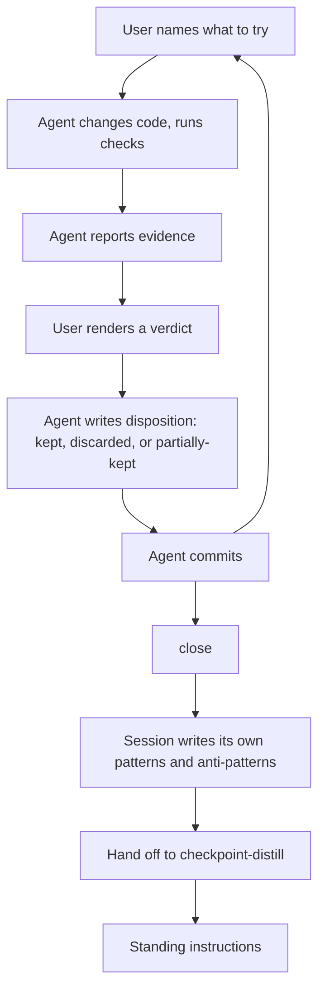
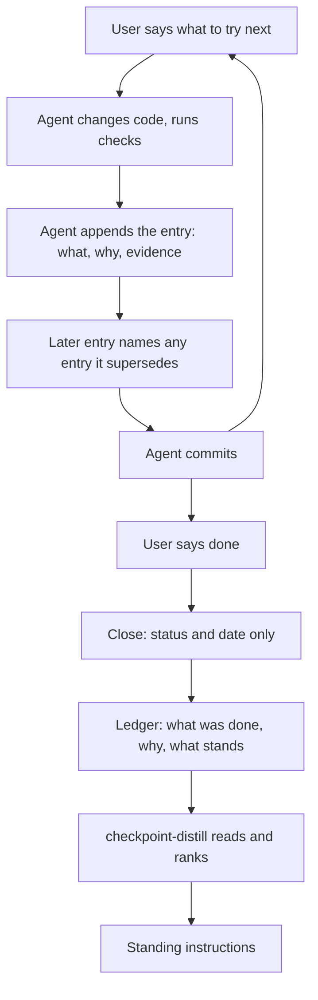
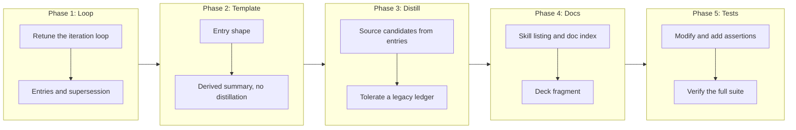

# Tune Iterate and Distill: A Roll-Forward Ledger, and One Place That Draws Conclusions

## Change Summary

The iteration session skill is too strict in its format and does not feel assistive in use. It stops after every attempt to ask the user for a verdict, it demands one of three disposition words before an entry may settle, and it ends by writing its own patterns and anti-patterns, which is the distillation skill's job. This CR retunes it around a **roll-forward ledger**: the agent records what the session did, why it did it, and what stands as a result. A later change may supersede an earlier one, and what is not superseded remains kept without anyone re-confirming it. The human drives the loop and says when it is done. The distillation skill, and only the distillation skill, draws conclusions from the finished ledger.

## Motivation and Background

**The ceremony costs more than the record it protects.** The current loop is six steps, and two of them are handshakes: the agent reports evidence, then waits, then asks for one of `kept`, `discarded`, or `partially-kept`, then transcribes it. In a last-mile session the user is already looking at the result and already saying what to try next. Asking them to also name a disposition word makes them narrate a decision they already expressed by moving on. The skill reads as a form to complete rather than as an assistant keeping notes.

**Kept is the resting state, not a verdict.** A change that was made, checked, and left in the working tree is kept. That is what "left in the tree" means. Requiring an explicit confirmation of it inverts the default: it treats the ordinary outcome as the one needing a signature, and reserves silence for nothing at all. The signal worth capturing is the exception, when a later change undoes or replaces an earlier one, and that exception is a thing the session does rather than a verdict the session collects.

**Roll forward, do not re-adjudicate.** An iteration session moves in one direction. Attempt three may make attempt one irrelevant; attempt five may replace attempt two outright. The useful record is a forward-running list of what was done and why, in which a later entry can name the earlier one it supersedes. Nothing earlier is edited, and nothing earlier is revisited for confirmation. Reading the entries in order, and honouring the supersessions, gives what stands now.

**Recording and concluding are different jobs, and one skill should not hold both.** The iteration skill sits inside a single session with a single gap in view. It cannot see whether a finding generalises, cannot reconcile it against the standing instructions, and cannot rank it against anything. The distillation skill exists precisely to do those three things, and already treats the ledger as an input to be ranked rather than copied. Having the iteration session pre-write its own patterns and anti-patterns therefore produces a conclusion at the point of least information, which the distillation skill must then either trust or redo. It also couples the two skills at close time, so the iteration skill cannot stand alone. Removing the distillation step from the session leaves each skill with one job: the ledger holds what was done, why, and what stands; the distillation reads that and concludes.

## Change Drivers

* The per-attempt disposition handshake interrupts a loop the user is already driving
* `kept` is the ordinary resting state of a change and does not need confirming
* Supersession, not adjudication, is what an iteration session actually produces
* A session-local distillation is a conclusion drawn with the least available context
* The iteration skill's close step depends on the distillation skill, so it does not stand alone
* The format's strictness (entry states, three fixed disposition words, a mandated split for partial keeps) exceeds what the record needs

## Current State

`/checkpoint-iterate` opens a ledger at `docs/cr/CR-XXXX-iterate.md` and runs a six-step loop per attempt: the user names what to try, the agent changes code and runs checks, the agent reports evidence, **the user renders a verdict**, the agent writes the entry with a disposition of `kept`, `discarded`, or `partially-kept`, and the agent commits. An entry carries a `State` of `open` or `settled`, and a session may not close while any entry is open. A `partially-kept` entry must additionally state which portion survived and which was reverted.

On `close`, the skill writes a **Distillation** section into the ledger, splitting the session's findings into recommended patterns and anti-patterns, and then hands the result to `/checkpoint-distill`. The template reserves a section for that split and leaves it empty until close.

`/checkpoint-distill` resolves the ledger as one of four inputs and requires that "an iteration ledger's closing findings are input to be reconciled and ranked, never copied through unranked" — a rule written on the assumption that a closed ledger carries a pre-written findings section.

The observed result is a skill that is correct and unpleasant: every attempt costs a handshake, the ledger cannot be closed without a distillation the session is poorly placed to write, and the two skills are joined at that seam.

### Current State Diagram



## Proposed Change

Retune the iteration session into a **roll-forward ledger** and cut the seam between the two skills.

**The loop loses the handshake.** The user says what to try. The agent makes the change, runs the checks, reports what it observed, appends the entry, and commits. It then waits for the next instruction rather than for a verdict. The user drives the loop and says when the session is done.

**Entries record work, not judgments.** An entry states what was changed, why it was tried, and what the evidence showed. There is no disposition field, no `open` or `settled` state, and no mandated vocabulary. Anything left in the working tree is kept, implicitly and without confirmation.

**Supersession is the only reversal mechanism.** When a later change undoes or replaces an earlier one, the agent appends a new entry naming the earlier entry it supersedes and why. The earlier entry is never edited, rewritten, or deleted: it is the record of an approach that was tried, which is exactly the material the distillation skill cannot get anywhere else. Supersession is initiated by the work, not solicited by a prompt.

**What stands is derived, not adjudicated.** The ledger carries a short derived section stating what stands now. It is regenerated from the entries rather than maintained by hand, and regenerating a derived summary is not a breach of the append-only rule, which governs the entries themselves.

**The session no longer distils.** Close sets the status and the date. The ledger's Distillation section, the patterns and anti-patterns split, and the hand-off to `/checkpoint-distill` are all removed. A completed ledger holds what was done, why, and what stands; that is a complete input.

**Distillation adapts to a raw ledger.** `/checkpoint-distill` draws its candidates from the ledger's entries, and treats a superseded entry as the failure narrative it is. It continues to rank everything it finds, and continues to refuse to copy anything through unranked. It also continues to read a legacy ledger that still carries a Distillation section, treating that section as raw candidate material rather than as a conclusion.

### Proposed State Diagram



### The Roll-Forward Model

Three properties define it, and they replace the disposition machinery entirely.

| Property | What it means | What it replaces |
|---|---|---|
| Kept is implicit | A change left in the working tree stands; nothing confirms it | The `kept` disposition and the verdict request |
| Supersession is explicit | A later entry names the earlier entry it undoes or replaces, and why | The `discarded` and `partially-kept` dispositions |
| The current state is derived | What stands is read forward from the entries, honouring supersessions | The `open` and `settled` entry states |

A partial reversal needs no special disposition under this model: the superseding entry says what it replaced and what it left alone, in prose, because that is a description of the work rather than a classification of it.

## Requirements

### Functional Requirements

1. The iteration skill **MUST NOT** require the user to supply a disposition, verdict, or classification for a change before the entry is recorded.
2. The iteration skill **MUST** treat a change left in the working tree as kept, without confirmation.
3. The iteration skill **MUST NOT** define the disposition vocabulary `kept`, `discarded`, and `partially-kept` as required entry fields.
4. The iteration skill **MUST** record supersession: where a change undoes or replaces earlier work, the new entry names the earlier entry it supersedes and states why.
5. The iteration skill **MUST NOT** edit, rewrite, or delete an earlier entry when a later entry supersedes it.
6. The iteration skill **MUST NOT** define `open` and `settled` entry states, and **MUST NOT** block closing on an unsettled entry.
7. An entry **MUST** carry what was changed, why it was tried, and what the evidence showed, and **MAY** carry a supersession reference. No other field is required.
8. The iteration skill **MUST** derive what currently stands by reading the entries in order and honouring supersessions, and **MAY** keep that derivation as a regenerable summary section which is exempt from the append-only rule that governs entries.
9. The iteration skill **MUST** leave the pace of the session to the user, continuing until the user says the session is done.
10. The agent **MUST** maintain the ledger as a side effect of the work, without asking the user to maintain it and without pausing the loop to collect a judgment.
11. The iteration skill **MUST NOT** distil, summarise into patterns and anti-patterns, or otherwise draw conclusions from its own ledger.
12. The iteration skill **MUST NOT** hand off to, invoke, or depend on the distillation skill at close or at any other point.
13. Closing a session **MUST** consist of setting the ledger status to closed and recording the closing date, and nothing further.
14. The iteration ledger template **MUST NOT** contain a distillation, patterns, or anti-patterns section.
15. The iteration skill **MUST** retain its safety rules unchanged: no destructive Git operation, refusal on an unresolvable Change Request identifier, refusal on an ambiguous invocation, one active session per working tree, scoped staging, and foreign-worktree detection.
16. The iteration skill **MUST** retain re-hydration from the ledger and the checkpoint commits, and **MUST NOT** re-propose an approach an earlier entry records as superseded without stating that it was already tried and why it is being revisited.
17. The distillation skill **MUST** draw candidates from the iteration ledger's entries, including entries a later entry superseded.
18. The distillation skill **MUST** treat a superseded entry as failure-narrative material, which its existing ranking already places above other categories of equal leverage.
19. The distillation skill **MUST NOT** require the iteration ledger to carry a distillation, patterns, or anti-patterns section, and **MUST** proceed normally when none is present.
20. The distillation skill **MUST** continue to read a ledger that does carry such a section, treating its content as raw candidate material to be ranked rather than as a conclusion to be copied.
21. The user-facing skill listing, the documentation index, and the walkthrough deck **MUST** be updated where they describe the removed disposition and distillation behaviour of the iteration session.
22. Both skills' frontmatter descriptions **MUST** be updated to describe the retuned behaviour.

### Non-Functional Requirements

1. Neither skill **MUST** gain a new runtime, test framework, or tooling dependency.
2. The iteration skill's `SKILL.md` **MUST** stay within the skill-authoring specification's token budget, measured in tokens rather than lines.
3. The iteration skill's prose **SHOULD** reserve RFC 2119 obligation keywords for safety and record integrity, and express the loop itself as guidance, so the skill reads as assistive rather than as a form.
4. The iteration skill **MUST** remain usable with the distillation skill absent, since the close-time dependency is removed.
5. Neither skill's files nor their tests **MUST** contain governance identifiers in a form that violates the repository's governance reference boundary; every placeholder stays digitless.
6. A ledger written under the previous format **MUST** remain readable by both skills without migration.

## Affected Components

* `skills/checkpoint-iterate/SKILL.md` — the loop, the entry model, supersession, close, and the frontmatter description
* `skills/checkpoint-iterate/templates/ITERATE.md` — entry shape, the derived summary, and removal of the distillation section
* `skills/checkpoint-distill/SKILL.md` — ledger input handling and the frontmatter description
* `skills/checkpoint-distill/references/candidate-categories.md` — sourcing candidates from ledger entries rather than from a findings section
* `tests/checkpoint-iterate/test_skill_structure.bats` — assertions covering the retuned loop
* `tests/checkpoint-iterate/test_iterate_template.bats` — assertions covering the retuned template
* `tests/checkpoint-distill/test_skill_structure.bats` — assertions covering the raw-ledger input
* `README.md` — the skill listing entry for the iteration session
* `docs/llms.txt` — the entry for this Change Request
* `deck/slides/checkpoint-distill/index.tsx` — the slide fragment showing the ledger's shape

## Scope Boundaries

### In Scope

* The iteration loop, its entry model, supersession, and close
* The iteration ledger template
* The distillation skill's handling of a ledger that carries no findings section
* Backward compatibility with ledgers written under the previous format
* The skill listing, the documentation index, the deck fragment, and the tests

### Out of Scope ("Here, But Not Further")

* **Migrating existing ledgers.** The ledger already in the repository stays as written; both skills read it as it is.
* **Changing the distillation skill's scoring, tiering, or approval model.** Only its ledger input handling changes.
* **Changing the checkpoint commit or checkpoint read skills.** The commit protocol, including the `-iterate` scope suffix, is unchanged.
* **Automatic invocation.** The session stays user-initiated and user-paced.
* **Changing where distilled guidance lands.** Standing instructions remain the destination, under the same governance reference boundary.

## Alternative Approaches Considered

* **Keep the dispositions but stop prompting for them, letting the agent infer each one.** Rejected: an inferred classification is a guess recorded as a fact, and the classification was the part carrying no information. Removing the field is honest; filling it in silently is not.
* **Keep the session distillation and let the distillation skill overrule it.** Rejected: two conclusions over the same material, one written with less context, and a reader who cannot tell which is authoritative. The seam is the problem, not the quality of either side.
* **Replace the ledger with commit messages alone.** Rejected: commits do not survive a squash merge, and a superseded approach that left no code leaves no commit worth reading. The file is the durable record.
* **Make the derived summary the whole ledger, dropping the entry list.** Rejected: the superseded entries are the highest-value input the distillation skill has, and a summary of what stands discards exactly them.

## Impact Assessment

### User Impact

The session gets shorter and quieter. The user names what to try and says when the work is done; nothing asks them to classify a result they already moved past. The ledger they get at the end says what was done, why, and what stands.

### Technical Impact

Confined to two skills, their template, their references, their tests, and three documentation surfaces. No new dependency, no change to the commit protocol, and no migration. The removed close-time hand-off makes the iteration skill independently installable.

### Business Impact

The record improves because the ceremony that discouraged its use is gone, and conclusions are drawn once, in the place with the widest view, rather than twice.

## Implementation Approach

Five sequential phases. Each phase leaves the repository with a passing test suite.

### Implementation Flow



### Detailed Implementation Steps

Each step below corresponds to exactly one phase of the Implementation Flow, named in its heading.

#### Phase 1 — Retune the iteration loop

Rewrite the loop in `skills/checkpoint-iterate/SKILL.md` to four movements: the user says what to try, the agent changes code and runs the checks, the agent appends the entry and commits, the agent waits for the next instruction. Remove the verdict step, the disposition vocabulary, the evidence-before-disposition rule, and the prohibition on inferring a disposition, which no longer has a subject.

Document the roll-forward model: kept is implicit, supersession is explicit and names the earlier entry, and what stands is derived by reading forward. State that an earlier entry is never edited when superseded. Rewrite the Role Split so the agent records as a side effect of the work rather than as a step that collects a judgment.

Replace the Closing section with a two-line close: set the status, record the date. Remove the distillation hand-off, the patterns and anti-patterns split, and the prerequisite note about the sibling skill. Keep the governance reference boundary paragraph, which still applies to the ledger's own content.

Keep the Commit Protocol, Re-hydration, Concurrency, and Safety Rules sections. In Re-hydration, replace the reconciliation of an open entry with the simpler recovery the model allows: uncommitted changes belong to work in flight and are recorded as an entry, not adjudicated. Update the frontmatter description, and reduce obligation keywords in the loop prose per the non-functional requirement.

#### Phase 2 — Retune the ledger template

Rewrite `skills/checkpoint-iterate/templates/ITERATE.md`. An entry carries what changed, why, and the evidence, plus an optional supersession reference. Remove the `State` field, the three-disposition block, and the portion-kept and portion-reverted fields.

Add a short derived section stating what stands now, labelled as regenerated from the entries so it is visibly exempt from the append-only rule. Keep the append-only rule for entries, and keep the frontmatter fields unchanged, including `worktree`. Delete the Distillation section and its two lists, and remove the closing instruction that pointed at them.

#### Phase 3 — Adapt the distillation skill

In `skills/checkpoint-distill/SKILL.md` and `references/candidate-categories.md`, retarget the ledger rule: candidates come from the ledger's entries, a superseded entry is failure-narrative material, and nothing is copied through unranked. State that a ledger carrying no findings section is normal, and that a legacy ledger with one is read as raw candidate material rather than as a conclusion. Update the frontmatter description if it names the removed behaviour. Leave scoring, tiering, approval, and application untouched.

#### Phase 4 — Update the documentation surfaces

Update the iteration session's row in the README skill listing so it no longer describes dispositions. Add this Change Request's entry to `docs/llms.txt`. Update the ledger fragment in `deck/slides/checkpoint-distill/index.tsx` so the illustrated shape matches the retuned template, and rebuild the deck export if the repository's deck workflow requires it.

#### Phase 5 — Update the tests and verify

In `tests/checkpoint-iterate/`, remove the assertions covering dispositions, entry states, the partial-keep split, the patterns and anti-patterns separation, and the close block on an open entry. Add assertions for the retuned model. In `tests/checkpoint-distill/`, add assertions for the raw-ledger input and legacy tolerance.

Run `bats -r tests/` and confirm the full suite passes, including the governance boundary test, which must not report any changed file as a violation.

## Test Strategy

### Tests to Add

| Test File | Test Name | Description | Inputs | Expected Output |
|-----------|-----------|-------------|--------|-----------------|
| `tests/checkpoint-iterate/test_skill_structure.bats` | `SKILL.md states that a change left in the tree is kept` | Kept is the implicit resting state | `SKILL.md` | Statement present |
| `tests/checkpoint-iterate/test_skill_structure.bats` | `SKILL.md documents supersession naming the earlier entry` | A later entry names what it supersedes and why | `SKILL.md` | Documented |
| `tests/checkpoint-iterate/test_skill_structure.bats` | `SKILL.md forbids editing a superseded entry` | Earlier entries are never rewritten | `SKILL.md` | Prohibition present |
| `tests/checkpoint-iterate/test_skill_structure.bats` | `SKILL.md requests no disposition from the user` | No verdict step in the loop | `SKILL.md` | No disposition request |
| `tests/checkpoint-iterate/test_skill_structure.bats` | `SKILL.md defines no disposition vocabulary` | The three words are not required fields | `SKILL.md` | Absent |
| `tests/checkpoint-iterate/test_skill_structure.bats` | `SKILL.md defines no open or settled entry state` | Entry states removed | `SKILL.md` | Absent |
| `tests/checkpoint-iterate/test_skill_structure.bats` | `SKILL.md documents a close of status and date only` | Close does nothing further | `SKILL.md` | Documented |
| `tests/checkpoint-iterate/test_skill_structure.bats` | `SKILL.md performs no distillation` | No patterns or anti-patterns produced | `SKILL.md` | Absent |
| `tests/checkpoint-iterate/test_skill_structure.bats` | `SKILL.md declares no dependency on the distillation skill` | The hand-off is gone | `SKILL.md` | No hand-off |
| `tests/checkpoint-iterate/test_skill_structure.bats` | `SKILL.md states the session is paced by the user` | The user says when it is done | `SKILL.md` | Statement present |
| `tests/checkpoint-iterate/test_skill_structure.bats` | `SKILL.md retains the safety rules` | Destructive Git, refusal, isolation, and detection intact | `SKILL.md` | All present |
| `tests/checkpoint-iterate/test_iterate_template.bats` | `iterate template entry carries change, reason, and evidence` | The three required fields | `templates/ITERATE.md` | All present |
| `tests/checkpoint-iterate/test_iterate_template.bats` | `iterate template carries an optional supersession reference` | Supersession is an entry field | `templates/ITERATE.md` | Field present |
| `tests/checkpoint-iterate/test_iterate_template.bats` | `iterate template has no disposition field` | Disposition removed | `templates/ITERATE.md` | Absent |
| `tests/checkpoint-iterate/test_iterate_template.bats` | `iterate template has no entry state field` | Open and settled removed | `templates/ITERATE.md` | Absent |
| `tests/checkpoint-iterate/test_iterate_template.bats` | `iterate template has no distillation section` | Distillation, patterns, and anti-patterns removed | `templates/ITERATE.md` | Absent |
| `tests/checkpoint-iterate/test_iterate_template.bats` | `iterate template carries a derived current-state section` | What stands is summarised and marked derived | `templates/ITERATE.md` | Section present |
| `tests/checkpoint-iterate/test_iterate_template.bats` | `iterate template keeps the append-only rule for entries` | Entries are never rewritten | `templates/ITERATE.md` | Rule present |
| `tests/checkpoint-distill/test_skill_structure.bats` | `SKILL.md sources candidates from ledger entries` | Entries, not a findings section, are the input | `SKILL.md` | Documented |
| `tests/checkpoint-distill/test_skill_structure.bats` | `SKILL.md treats a superseded entry as failure-narrative material` | Superseded work is ranked as a failure narrative | `SKILL.md` | Documented |
| `tests/checkpoint-distill/test_skill_structure.bats` | `SKILL.md requires no findings section in the ledger` | A ledger without one is normal | `SKILL.md` | Documented |
| `tests/checkpoint-distill/test_skill_structure.bats` | `SKILL.md reads a legacy findings section as raw candidates` | Legacy content is ranked, not copied | `SKILL.md` | Documented |

### Tests to Modify

| Test File | Test Name | Change |
|-----------|-----------|--------|
| `tests/checkpoint-iterate/test_skill_structure.bats` | `SKILL.md requires evidence before disposition` | Replace with an assertion that the entry records the evidence observed |
| `tests/checkpoint-iterate/test_skill_structure.bats` | `SKILL.md forbids closing while an entry is open` | Remove; entry states no longer exist |
| `tests/checkpoint-iterate/test_skill_structure.bats` | `SKILL.md forbids silently retrying an eliminated approach` | Retarget from a discarded disposition to a superseded entry |
| `tests/checkpoint-iterate/test_skill_structure.bats` | `SKILL.md documents the re-hydration procedure` | Retarget to recovery without open-entry reconciliation |
| `tests/checkpoint-iterate/test_iterate_template.bats` | `iterate template documents the open and settled entry states` | Remove |
| `tests/checkpoint-iterate/test_iterate_template.bats` | `iterate template documents all three dispositions` | Remove |
| `tests/checkpoint-iterate/test_iterate_template.bats` | `iterate template documents the partial-keep split` | Remove |
| `tests/checkpoint-iterate/test_iterate_template.bats` | `iterate template separates patterns from anti-patterns` | Remove |
| `tests/checkpoint-iterate/test_iterate_template.bats` | `iterate template states that discarded entries are retained` | Replace with retention of superseded entries |
| `tests/checkpoint-iterate/test_iterate_template.bats` | `iterate template has the three required sections` | Update to the retuned section set |

### Tests to Remove

Covered in the table above. No test file is deleted.

## Acceptance Criteria

### AC-1: No verdict is requested during the loop

```gherkin
Given an iteration session in progress
When the agent completes a change and runs the checks
Then it records the entry and commits
  And it does not ask the user for a disposition, verdict, or classification
```

### AC-2: A change left in the working tree is kept

```gherkin
Given a change the agent made during a session
When the change remains in the working tree
Then it is treated as kept
  And no confirmation of that is requested or recorded
```

### AC-3: Supersession names the earlier entry

```gherkin
Given an earlier entry recording work that a later change undoes or replaces
When the agent records the later change
Then the new entry names the earlier entry it supersedes
  And it states why the earlier work no longer stands
```

### AC-4: A superseded entry is preserved verbatim

```gherkin
Given an entry that a later entry supersedes
When the later entry is written
Then the earlier entry is neither edited, rewritten, nor deleted
```

### AC-5: The disposition vocabulary is gone

```gherkin
Given the iteration skill and its ledger template
When either is read
Then neither requires an entry field valued kept, discarded, or partially-kept
```

### AC-6: Entry states are gone

```gherkin
Given the iteration skill and its ledger template
When either is read
Then no entry carries an open or settled state
  And closing a session is not blocked by any entry
```

### AC-7: What stands is derived

```gherkin
Given a ledger with several entries, some superseded
When the current state is reported
Then it is derived by reading the entries in order and honouring supersessions
  And any summary section holding that derivation is marked as regenerated
```

### AC-8: The session is paced by the user

```gherkin
Given an open iteration session
When the agent finishes recording an entry
Then it waits for the user's next instruction
  And the session continues until the user says it is done
```

### AC-9: Closing does nothing but close

```gherkin
Given an open iteration session
When the user closes it
Then the ledger status is set to closed and the closing date is recorded
  And no findings, patterns, or anti-patterns are written
```

### AC-10: The iteration skill does not distil

```gherkin
Given the iteration skill
When it is read end to end
Then it draws no conclusions from its own ledger
  And it neither invokes nor depends on the distillation skill
```

### AC-11: The template has no distillation section

```gherkin
Given the iteration ledger template
When it is read
Then it contains no distillation, patterns, or anti-patterns section
```

### AC-12: Distillation sources candidates from the entries

```gherkin
Given a closed ledger holding entries and no findings section
When the distillation skill analyses it
Then it draws candidates from the entries themselves
  And it proceeds normally rather than reporting the ledger as malformed
```

### AC-13: A superseded entry is failure-narrative material

```gherkin
Given a ledger entry that a later entry superseded
When the distillation skill ranks its candidates
Then that entry is treated as a failure narrative
  And it outranks other categories of equal leverage
```

### AC-14: A legacy ledger still reads

```gherkin
Given a ledger written under the previous format, carrying dispositions and a distillation section
When either skill reads it
Then it is read without migration
  And its findings section is treated as raw candidate material, never copied through unranked
```

### AC-15: Safety rules survive the retuning

```gherkin
Given the retuned iteration skill
When its safety rules are read
Then it still forbids destructive Git operations
  And it still refuses an unresolvable identifier and an ambiguous invocation
  And it still requires worktree isolation, scoped staging, and foreign-worktree detection
```

### AC-16: The documentation surfaces match the retuned behaviour

```gherkin
Given the skill listing, the documentation index, and the walkthrough deck
When each is read after the change
Then none of them describes a per-attempt disposition or a session distillation
  And the documentation index carries an entry for this Change Request
```

### AC-17: The skill stays within its token budget

```gherkin
Given the retuned iteration skill file
When it is measured against the skill-authoring specification
Then its token count is within the specification's budget
  And the measurement is taken in tokens rather than lines
```

### AC-18: The suite passes with the boundary intact

```gherkin
Given the full change
When the test suite runs
Then every test passes
  And the governance boundary test reports no violation in any changed file
```

## Quality Standards Compliance

### Build & Compilation

- [ ] Not applicable: documentation and skills repository with no build step, except the deck export where the deck workflow requires it

### Linting & Code Style

- [ ] Not applicable: no linter is configured for this repository

### Test Execution

- [ ] All existing tests pass after implementation
- [ ] All new tests pass
- [ ] Removed assertions correspond to removed behaviour only

### Documentation

- [ ] Skill documentation updated and self-contained
- [ ] User-facing skill listing updated
- [ ] Documentation index updated
- [ ] Walkthrough deck fragment updated

### Code Review

- [ ] Changes submitted via pull request
- [ ] PR title follows Conventional Commits format
- [ ] Code review completed and approved
- [ ] Changes squash-merged to maintain linear history

### Verification Commands

```bash
# Test execution
bats -r tests/
```

## Risks and Mitigation

### Risk 1: Removing the verdict loses the signal it carried

**Likelihood:** medium
**Impact:** medium
**Mitigation:** The verdict carried one bit that mattered, whether earlier work still stands, and supersession records that bit at the moment the work happens rather than by interview afterwards. The bit is preserved; the interview is not.

### Risk 2: The ledger becomes vaguer without a fixed vocabulary

**Likelihood:** medium
**Impact:** medium
**Mitigation:** The three required fields (what changed, why, evidence) are the fields that carried the information. The removed field was a classification of them. Tests assert the three fields and the supersession reference, so the shape stays enforced where it is load-bearing.

### Risk 3: Nothing distils, because the close step no longer prompts for it

**Likelihood:** medium
**Impact:** medium
**Mitigation:** This is the accepted cost of the decoupling. The distillation skill is invoked deliberately, and the ledger it reads is a strictly better input than a session-written summary. The close step may name the distillation skill as a suggested next action without depending on it.

### Risk 4: A legacy ledger is misread as a conclusion

**Likelihood:** low
**Impact:** medium
**Mitigation:** The distillation skill's existing prohibition on copying anything through unranked already covers it, and this change restates it explicitly for a legacy findings section.

### Risk 5: The deck teaches a format that no longer exists

**Likelihood:** high if unaddressed
**Impact:** low
**Mitigation:** The ledger fragment is in scope for this change, and an acceptance criterion covers the three documentation surfaces together.

## Dependencies

* Depends on the existing checkpoint commit workflow, which is unchanged
* Removes the iteration session's close-time dependency on the distillation skill
* Operates under the governance reference boundary, which is unchanged

## Estimated Effort

Approximately 6 to 9 person-hours.

* Phase 1, retune the loop: 2 hours
* Phase 2, retune the template: 1 hour
* Phase 3, adapt the distillation skill: 1.5 hours
* Phase 4, documentation surfaces: 1 hour
* Phase 5, tests and verification: 2 hours

## Decision Outcome

Chosen approach: "record the work, derive what stands, and leave conclusions to the one skill with the widest view", because the disposition handshake priced a session's ordinary outcome as a decision and produced no information the work itself did not already carry, and because a conclusion drawn inside a single session is drawn at the point of least context and must then be either trusted or redone.

## Related Items

* Links to related change requests: CR-0015 introduced the iteration session and its disposition model, which this change retunes; CR-0016 introduced the distillation skill that consumes the ledger; CR-0014 established the governance reference boundary that both skills observe
