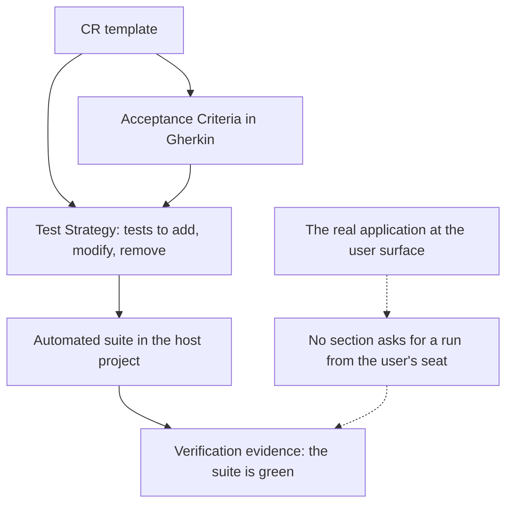
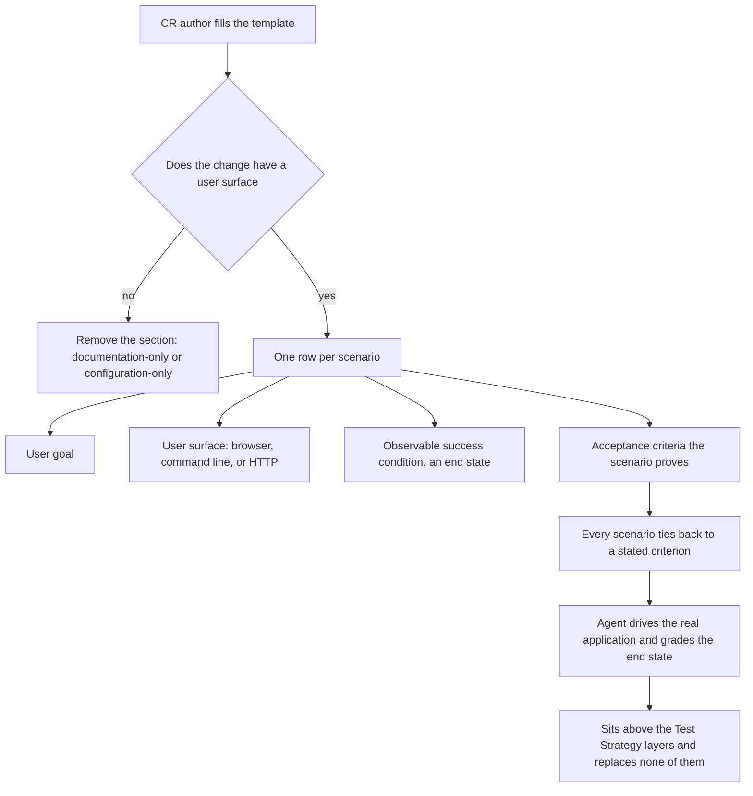
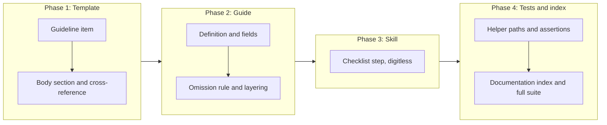

# Model-Based Testing: Proving a Change From the User's Seat

## Change Summary

The Change Request template asks an author to enumerate the automated tests a change needs, and to write acceptance criteria in Gherkin, but it never asks whether anyone has driven the changed software the way its user does. This Change Request adds an optional **Model-Based Testing** section to `skills/governance/templates/CR.md`, in which the author names, per scenario, the user goal, the user surface the scenario is driven on, the observable success condition that grades the run, and the acceptance criteria the scenario proves. The section is removed outright when the change has no user surface, which is the case for a documentation-only or configuration-only change, so an author is never asked to invent a surface that does not exist.

## Motivation and Background

**A passing suite is evidence about the code, not about the product.** The template's Test Strategy section produces unit and integration coverage: a test calls the changed function and asserts what it returns. That layer is necessary and this change does not touch it. What it cannot establish is that a person pursuing a goal through the interface they actually touch, a browser page, a command invocation, an HTTP request, reaches that goal. The gap between "the function returns the right value" and "the user gets what they came for" is where wiring faults, unreachable states, and broken surfaces live, and nothing in the current template asks anyone to look there.

**The agent implementing the change is able to run it.** An AI agent authoring and implementing a Change Request can launch the application and drive it. When the template does not ask for that run, the run does not happen, and the Change Request is closed on a green suite alone. Asking for it in the document is what converts an available capability into a recorded obligation.

**Graded on the end state, or not graded at all.** A run that is judged by reading its own transcript proves that the steps executed, which is not the question. The question is whether the world changed: the record exists with the right values, the file is on disk, the endpoint returns the changed resource. Naming that end state in the Change Request, before the run, is what stops the run from being graded on whether it looked like it worked.

**Optional, because most changes in some repositories have no user surface at all.** A section that must be filled in always gets filled in with fiction when it does not apply. This repository is the demonstration: it ships skills and templates, and its changes are read by agents rather than driven through a surface. Making the section removable, with a stated test for when to remove it, keeps the template honest in both kinds of project. Optionality here governs whether the section appears in a document, and nothing else: every obligation written inside the section stays an obligation.

**The vocabulary already exists outside this repository, and the template must not depend on it.** The concept has a settled vocabulary: a scenario source, a user surface, a success condition, an outcome. A skill implementing that loop and persisting its artifacts under `.agents/scenarios/` is installed on some machines, but it is not part of this repository and is not distributed with the governance skill. The template therefore carries the vocabulary and the obligation, and names no tool, skill, or directory as a prerequisite, so a project with no scenario tooling at all can still fill the section in.

## Change Drivers

* The template asks for automated coverage and for acceptance criteria, and asks nobody to drive the software as its user does
* An implementing agent can run the real application, so the missing piece is the instruction, not the capability
* A run graded on its own transcript produces confidence without evidence
* A mandatory section would be filled with invention on a change that has no user surface
* The relationship to the existing Test Strategy has to be stated, or the new section will be read as a licence to write fewer tests
* The concept's tooling lives outside this repository, so the template has to state the obligation without importing a dependency

## Current State

The Change Request template at `skills/governance/templates/CR.md` is 534 lines. Its guidance lives in one HTML comment block at the top, numbered `0` through `9`, and the body that an author fills in follows. Two of the numbered items bear on verification:

* Item `2`, acceptance criteria, requires the Given-When-Then formula and states that each criterion must be independently testable.
* Item `6`, test strategy, requires a strategy for every change touching code, in three categories: tests to add, tests to modify, tests to remove. For each it requires the test file, the test name, what the test validates, and the expected inputs and outputs.

The body reflects that structure. `## Test Strategy` carries three tables, one per category, and `## Acceptance Criteria` follows it with Gherkin blocks numbered `AC-1` upward. Between them there is nothing else, and neither section mentions a running application. Item `7`, quality standards, requires that tests pass and that documentation is updated; it does not ask for an observation made at a user surface.

Searching the repository for the vocabulary confirms the absence rather than assuming it. A case-insensitive search for `scenario` across the repository's Markdown, Bats, and text files returns no hits outside the vendored Anthropic documentation under `docs/anthropic/`. A search for `user surface`, `user perspective`, and `model-based` returns nothing at all. `.agents/` in this repository contains exactly one entry, `skills/`, so there is no `.agents/scenarios/` directory, and the five skills the repository ships are `governance`, `checkpoint-commit`, `checkpoint-read`, `checkpoint-iterate`, and `checkpoint-distill`. No skill implementing a user-surface run is present here, which is why the template must not name one.

The verification machinery that this change has to survive is equally concrete. `tests/governance/test_cr_template.bats` holds five assertions over the template: that `source-branch` and `source-commit` exist as frontmatter fields, that no line anywhere in the file begins with `copyright:` or `version:` after optional whitespace, and that the governance reference boundary statement lives inside an HTML comment rather than in the rendered body. `tests/governance/test_helpers/setup.bash` defines two path variables, `CR_TEMPLATE` and `ADR_TEMPLATE`, the governance reference pattern `(CR|ADR|FR|NFR|AC)-[0-9]+`, and the allowlist of paths where that pattern may appear. `skills/governance/templates/CR.md` and `skills/governance/reference/cr-guide.md` are on that allowlist; no `SKILL.md` is, and neither is `README.md`. The suite runs as `bats tests/ --recursive` in `.github/workflows/test.yml` and as `bats -r tests/` locally.

### Current State Diagram



## Proposed Change

Add one optional section to the template, define it in the guideline block, document it in the reference guide, and give the governance skill's Change Request checklist a line that decides whether it applies.

**The section.** A new `## Model-Based Testing` appears in the template body between `## Test Strategy` and `## Acceptance Criteria`, carrying the same optional-element marker the template already uses for its removable sections. It holds one row per scenario, and each row states four things: the **user goal**, the **user surface** the scenario is driven on, the **observable success condition** that grades the run, and the **acceptance criteria** the scenario proves. A fifth column records the persisted scenario record for a project that keeps them, and is left empty by a project that does not.

**The definition.** The guideline block gains an item defining model-based testing as the agent running the test from the user's perspective: it interacts with the real application through the surface the user touches, a browser page, a command invocation, or an HTTP request, and validates the change from the user's seat. The definition states that the success condition is an observable end state, and that it is never a property of the run's transcript or of the number of steps taken.

**The omission rule.** The same guideline item states when the section is removed: a change with no user surface carries no Model-Based Testing section, and the two cases named are a documentation-only change and a configuration-only change. Removing the section on such a change is correct behaviour and not an omission to be flagged.

**The relationship to Test Strategy.** The guideline item states that model-based testing sits above the automated tests the Test Strategy enumerates, and replaces none of them: dropping unit or integration coverage because a scenario covers the same path is a regression in the suite. Item `6`, the test strategy guidance, gains a pointer in the other direction, so an author reading either one learns that the other exists and what it is for.

**The tie to acceptance criteria.** Every scenario names at least one acceptance criterion it proves, and the section introduces no success condition that no acceptance criterion states. The section is therefore derived from the criteria rather than a second, competing specification of the change.

**No new dependency.** The section names no skill, no driver, and no directory as a prerequisite. An author with browser automation installed uses it; an author without it drives whatever surface is reachable.

### Proposed State Diagram



### The Four Fields

Each field answers a question that the rest of the document leaves open, and the section is worth its lines only because all four are absent elsewhere.

| Field | What it states | Why the document needs it |
|---|---|---|
| User goal | What the person is trying to achieve, in their terms | The acceptance criteria state behaviour; the goal states the errand the behaviour serves |
| User surface | The interface the person touches, and therefore the one the run drives | Fixes the run at the surface rather than at the function nearest the change |
| Success condition | The observable end state that grades the run | Written before the run, it is what stops the run being graded on its transcript |
| Acceptance criteria proved | The criteria this scenario establishes | Keeps the section derived from the criteria instead of specifying the change a second time |

## Requirements

### Functional Requirements

1. The Change Request template **MUST** carry a section titled `Model-Based Testing`, marked as an optional element in the same manner as the template's other removable sections.
2. The Model-Based Testing section **MUST** be placed after the Test Strategy section and before the Acceptance Criteria section.
3. The template **MUST** define model-based testing inside its guideline comment block as the agent running the test from the user's perspective, interacting with the real application through the user surface and validating the change from the user's seat.
4. The template **MUST** require each scenario in the section to state the user goal, the user surface, the observable success condition, and the acceptance criteria the scenario proves.
5. The template **MUST** state that the success condition is an observable end state, and **MUST** state that it is never a property of the run's transcript or of the number of steps taken.
6. The template **MUST** require every scenario to name at least one acceptance criterion it proves, and **MUST NOT** permit a scenario whose success condition no acceptance criterion states.
7. The template **MUST** name browser, command line, and HTTP request as candidate user surfaces, and **MUST** require the scenario to name the surface the user touches rather than the component nearest the change.
8. The template **MUST** state that the section is removed when the change has no user surface, and **MUST** name a documentation-only change and a configuration-only change as the cases in which it is removed.
9. The template **MUST** state that the section's optionality governs only whether the section appears in a document, and **MUST NOT** present it as permission to weaken requirement language: every obligation written inside the section remains **MUST** or **MUST NOT**.
10. The template **MUST** state that model-based testing sits above the automated tests the Test Strategy enumerates and replaces none of them, and the template's test strategy guidance **MUST** point at the Model-Based Testing section for verification at the user surface.
11. The template **MUST NOT** require any named skill, driver, tool, or directory as a precondition for filling in the section.
12. The section **MUST** provide a place to record a persisted scenario record per scenario, and the template **MUST** state that a project with no such convention leaves that place empty.
13. The governance skill's Change Request workflow checklist **MUST** carry a step deciding whether the Model-Based Testing section applies, and the wording added to `skills/governance/SKILL.md` **MUST NOT** contain a governance identifier in digit form.
14. The Change Request reference guide **MUST** document the section: its definition, its four required fields, the omission rule, and its relationship to the Test Strategy section.
15. The documentation index `docs/llms.txt` **MUST** carry an entry for this Change Request.
16. The governance test suite **MUST** assert the template's new section and each of its stated rules, and the added test names **MUST NOT** contain a governance identifier in digit form.

### Non-Functional Requirements

1. The change **MUST NOT** add a runtime, test framework, or tooling dependency to the repository or to any skill it ships.
2. All guidance added to the template **MUST** live inside HTML comment blocks, so that it never renders in a created Change Request, and the existing assertion that extracts comment text **MUST** continue to pass.
3. The text added to the template **MUST NOT** introduce a line beginning, after optional leading whitespace, with `copyright:` or `version:`, because the existing template assertions reject either token anywhere in the file.
4. Change Requests already in `docs/cr/` **MUST** remain valid without migration, and the absence of a Model-Based Testing section in an earlier document **MUST NOT** be treated as a defect.
5. `skills/governance/SKILL.md` **MUST** stay within the skill-authoring specification's token budget, measured in tokens rather than lines.
6. The addition to the template **MUST** stay proportionate to the template's existing sections, since an authoring agent reads the template in full on every use.
7. The change **MUST NOT** violate the governance reference boundary: no governance identifier in digit form outside the permitted territory the test helper's allowlist defines.
8. The five existing assertions over the Change Request template **MUST** continue to pass unmodified.

## Affected Components

* `skills/governance/templates/CR.md`: the new guideline item, the new body section, and the cross-reference from the test strategy guidance
* `skills/governance/reference/cr-guide.md`: the section's definition, its fields, the omission rule, and its relationship to the Test Strategy
* `skills/governance/SKILL.md`: the Change Request workflow checklist step deciding whether the section applies
* `tests/governance/test_helpers/setup.bash`: path variables for the governance skill file and the Change Request guide
* `tests/governance/test_cr_template.bats`: assertions over the new section, the guideline item, the checklist step, and the guide
* `docs/llms.txt`: the entry for this Change Request

## Scope Boundaries

### In Scope

* One optional Model-Based Testing section in the Change Request template, with its guideline item
* The four required per-scenario fields, the success-condition rule, and the tie to acceptance criteria
* The omission rule for a change with no user surface
* The stated relationship between the new section and the existing Test Strategy section, in both directions
* The governance skill's checklist step and the reference guide's documentation of the section
* Assertions in the governance test suite and the entry in the documentation index

### Out of Scope ("Here, But Not Further")

* **The Architecture Decision Record template.** An Architecture Decision Record records a decision rather than a change to be verified, and gains no section here.
* **Adding a scenario-running skill to this repository.** The template states the obligation; it ships no driver, no loop, and no automation.
* **Creating `.agents/scenarios/` or any artifact-persistence convention in this repository.** The section accommodates a project that has one; this repository does not acquire one.
* **Amending existing Change Requests.** No document under `docs/cr/` is revisited to add the new section.
* **Changing the Test Strategy section's own structure.** Its three categories and its columns stay exactly as they are; only a cross-reference is added to its guidance.
* **The quality standards checklist.** No new checklist item is added there; the new section carries its own obligations.
* **The skill listing in `README.md`.** The listing describes what the governance skill does, which does not change, and it is outside the boundary allowlist.

## Alternative Approaches Considered

* **Make the section mandatory for every Change Request.** Rejected: this repository's own changes have no user surface, so the section would be filled with invention in the very corpus that demonstrates the template. A stated omission test is stronger than a section nobody can honestly complete.
* **Extend the Test Strategy section with a fourth table instead of adding a section.** Rejected: the three existing tables are all statements about the automated suite, with columns for a test file and a test name. A scenario has neither, and folding it in would either distort those columns or bury the run under a heading that reads as unit-test bookkeeping.
* **Require the section to name a specific driver or skill.** Rejected: the tooling is per machine and per project, and this repository ships none of it. A template that names a prerequisite it cannot guarantee produces an author who reports the section inapplicable whenever the named tool is missing.
* **Record the runs outside the Change Request and reference them.** Rejected: the goal, the surface, and the success condition are decided when the change is specified, and writing them after the run is what allows a run to be graded on its transcript. The Change Request is where they belong; an artifact reference is accommodated alongside them.
* **Use the word "scenario" as the section title.** Rejected: on its own the word already means the Gherkin block under Acceptance Criteria in most readers' vocabulary, and the section would be read as a duplicate of it. The title names the method, and the rows are scenarios within it.

## Impact Assessment

### User Impact

An author of a Change Request gains one decision and, where the answer is yes, one short table. The decision is whether the change has a user surface, and it is answered in a sentence. The author of a documentation-only or configuration-only change deletes the section and is explicitly told that doing so is correct. An implementing agent gains a stated obligation it was already capable of meeting, and an end state to grade it against.

### Technical Impact

Confined to three files in the governance skill, two test files, and the documentation index. No new dependency, no change to any other skill, no migration, and no change to the commit protocol. The template grows by one guideline item and one body section, and the guideline item lives inside the existing comment block, so nothing new renders in a created document.

### Business Impact

A Change Request closes on evidence that a person pursuing the goal reaches it, rather than on a green suite alone, in the cases where such evidence can be produced. The optionality keeps that cost from being charged to changes that cannot produce it.

## Implementation Approach

Four sequential phases. Each phase leaves the repository with a passing test suite.

### Implementation Flow



### Detailed Implementation Steps

Each step below corresponds to exactly one phase of the Implementation Flow, named in its heading.

#### Phase 1: Add the section to the template

Add a numbered guideline item `10` to the template's opening HTML comment block, after item `9`, titled for model-based testing and its optionality. The item states, in this order: the definition, that the agent interacts with the real application at the user surface and validates the change from the user's seat; the four fields each scenario states; that the success condition is an observable end state and never a property of the transcript or the step count; that browser, command line, and HTTP request are the candidate surfaces and the surface named is the one the user touches; that every scenario names at least one acceptance criterion it proves and introduces no success condition no criterion states; that the section is removed when the change has no user surface, naming the documentation-only and configuration-only cases; that the optionality governs only whether the section appears and every obligation inside it stays an obligation; and that the section sits above the automated tests of the Test Strategy and replaces none of them.

Add the cross-reference in the other direction to guideline item `6`: one line stating that verification at the user surface is covered by the Model-Based Testing section, which does not substitute for any test named in the test strategy.

Add the body section between the Test Strategy heading and the Acceptance Criteria heading. It consists of three parts, in this order: a one-line HTML comment marker in the template's existing optional-element style, worded to say that the section is removed when the change has no user surface; a level-two heading reading `Model-Based Testing`; and a one-line instruction in braces stating that the table holds one row per scenario the agent runs against the real application from the user's seat. The table that follows carries six columns, the four required fields plus the row's own name and the scenario record:

| Column | Placeholder the template ships |
|---|---|
| `Scenario` | `{short name}` |
| `User Goal` | `{what the person is trying to achieve}` |
| `User Surface` | `{browser, command line, or HTTP request}` |
| `Success Condition` | `{the observable end state that grades the run}` |
| `Criteria Proved` | `{AC-n}` |
| `Scenario Record` | `{path, or empty}` |

Verify that no line added anywhere in the file begins with `copyright:` or `version:` after optional whitespace, and that every line of guidance sits inside a comment block that a bare `-->` line closes, so the existing comment-extraction assertion still finds it.

**Affected components:** `skills/governance/templates/CR.md`

#### Phase 2: Document the section in the reference guide

In `skills/governance/reference/cr-guide.md`, add a section under the requirements guidance, after `Include Test Strategy`, and add it to the table of contents. It carries the definition, a list of the four required fields with a sentence on each, the omission rule with its two named cases, and the layering statement that the method sits above the automated tests and replaces none of them. It states that the section names no required tool: where a project persists scenario records, for example under `.agents/scenarios/`, the record's path goes in the last column, and where it does not, that column stays empty.

**Affected components:** `skills/governance/reference/cr-guide.md`

#### Phase 3: Add the decision to the governance skill's checklist

In `skills/governance/SKILL.md`, add one line to the Change Request workflow checklist, after the acceptance-criteria line, instructing the author to decide whether the change has a user surface, to fill in the Model-Based Testing section when it does, and to remove the section when it does not. Add one line to the strict or flexible lists stating that the section is optional and governed by that test.

The file is not on the boundary allowlist, so the added wording stays free of any governance identifier in digit form: refer to the section and to acceptance criteria by name, never as `AC` followed by digits.

**Affected components:** `skills/governance/SKILL.md`

#### Phase 4: Add the assertions and the index entry

In `tests/governance/test_helpers/setup.bash`, add two path variables beside the existing `CR_TEMPLATE` and `ADR_TEMPLATE`: one for `skills/governance/SKILL.md` and one for `skills/governance/reference/cr-guide.md`. The helper is on the boundary allowlist, so it may carry the pattern it already defines, but the new variables are paths and carry no identifier.

In `tests/governance/test_cr_template.bats`, add the assertions listed in the Test Strategy. The placement assertion compares the line number of the Model-Based Testing heading against the line numbers of the Test Strategy and Acceptance Criteria headings. The guideline assertions run against the comment text extracted by the same `awk` expression the existing boundary assertion uses, closing a block only on a bare `-->` line, so a Mermaid arrow inside the block does not end the extraction early.

Add this Change Request's entry to `docs/llms.txt`, in the Change Requests list, after the entry for the preceding document.

Run `bats -r tests/` and confirm the whole suite passes, including the boundary assertion, which must report no violation in any changed file.

**Affected components:** `tests/governance/test_helpers/setup.bash`, `tests/governance/test_cr_template.bats`, `docs/llms.txt`

## Test Strategy

The repository's suite is Bats, and every assertion below is a text assertion over a shipped document, which is the only kind of assertion a template change admits.

### Tests to Add

| Test File | Test Name | Description | Inputs | Expected Output |
|-----------|-----------|-------------|--------|-----------------|
| `tests/governance/test_cr_template.bats` | `CR template has a model based testing section` | The body carries the new heading | `CR_TEMPLATE` | Heading present |
| `tests/governance/test_cr_template.bats` | `CR template marks the model based testing section optional` | The optional-element marker precedes the heading | `CR_TEMPLATE` | Marker present immediately above the heading |
| `tests/governance/test_cr_template.bats` | `CR template places model based testing between test strategy and acceptance criteria` | Section ordering | `CR_TEMPLATE` | Heading line number falls between the two |
| `tests/governance/test_cr_template.bats` | `CR template defines model based testing as a run at the user surface` | The definition names the real application and the user's seat | Comment text of `CR_TEMPLATE` | Definition present inside a comment |
| `tests/governance/test_cr_template.bats` | `CR template requires a user goal a user surface and a success condition per scenario` | The three stated fields are required | `CR_TEMPLATE` | All three named |
| `tests/governance/test_cr_template.bats` | `CR template ties each scenario to an acceptance criterion` | Every scenario names a criterion it proves | `CR_TEMPLATE` | Requirement present, and the table carries the column |
| `tests/governance/test_cr_template.bats` | `CR template states the success condition is an observable end state` | The grading rule, including its prohibition | Comment text of `CR_TEMPLATE` | End state required, transcript and step count rejected |
| `tests/governance/test_cr_template.bats` | `CR template names the candidate user surfaces` | Browser, command line, and HTTP request | `CR_TEMPLATE` | All three named |
| `tests/governance/test_cr_template.bats` | `CR template states the omission rule for a change with no user surface` | Removal is correct on such a change | Comment text of `CR_TEMPLATE` | Rule present, documentation-only and configuration-only named |
| `tests/governance/test_cr_template.bats` | `CR template keeps obligation language inside the optional section` | Optionality governs presence only | Comment text of `CR_TEMPLATE` | Statement present |
| `tests/governance/test_cr_template.bats` | `CR template states model based testing replaces no automated test` | The layering rule | Comment text of `CR_TEMPLATE` | Statement present |
| `tests/governance/test_cr_template.bats` | `CR template test strategy guidance points at model based testing` | The reverse cross-reference | Comment text of `CR_TEMPLATE` | Pointer present in the test strategy item |
| `tests/governance/test_cr_template.bats` | `CR template requires no named tool for model based testing` | No skill, driver, or directory is a precondition | `CR_TEMPLATE` | No prerequisite named, and the record column is stated as leavable empty |
| `tests/governance/test_cr_template.bats` | `governance skill checklist decides whether model based testing applies` | The workflow checklist carries the decision | `GOVERNANCE_SKILL` | Checklist line present |
| `tests/governance/test_cr_template.bats` | `governance skill model based testing wording carries no governance identifier` | The boundary holds in the added wording | `GOVERNANCE_SKILL` | No identifier in digit form |
| `tests/governance/test_cr_template.bats` | `CR guide documents the model based testing section` | Definition and the four fields | `CR_GUIDE` | Section present with all four fields |
| `tests/governance/test_cr_template.bats` | `CR guide documents the omission rule and the layering` | The two rules a reader needs from the guide | `CR_GUIDE` | Both present |
| `tests/governance/test_cr_template.bats` | `documentation index carries an entry for the model based testing change` | The index gains this document, matched by slug rather than by identifier per the boundary rule | `docs/llms.txt` | Entry for the model-based-testing document present |

### Tests to Modify

| Test File | Test Name | Current Behavior | New Behavior | Reason for Change |
|-----------|-----------|------------------|--------------|-------------------|
| `tests/governance/test_helpers/setup.bash` | Not a test; the shared helper | Defines `CR_TEMPLATE` and `ADR_TEMPLATE` only | Also defines a path variable for the governance skill file and one for the Change Request guide | The new assertions read two files the helper does not currently locate |

### Tests to Remove

None. No behaviour is removed by this change, so no assertion becomes obsolete.

### Existing Coverage Relied On

Two acceptance criteria are covered by assertions that already exist and are not modified, which is why no row above duplicates them.

| Test File | Test Name | Criterion it covers |
|-----------|-----------|---------------------|
| `tests/governance/test_cr_template.bats` | The four existing template assertions over the frontmatter fields and the two rejected metadata fields, plus the comment-extraction assertion | AC-15 |
| `tests/governance/test_reference_boundary.bats` | `no governance references outside permitted paths` | AC-16, for every file this change touches, including the added assertion names |

### Out-of-Band Verification

* **The skill token budget** (Non-Functional Requirement 5) is not expressible as a Bats assertion, because measuring it requires a tokenizer rather than a text match. It is verified out of band by measuring `skills/governance/SKILL.md` against the skill-authoring specification's budget, in tokens, and recording the measurement in the pull request.
* **Proportionality** (Non-Functional Requirement 6) is a judgment made in review against the template's existing sections, not an assertion.
* **This Change Request carries no Model-Based Testing section of its own, and that is the omission rule applying to itself.** The change alters templates, guidance, and text assertions. It has no user surface: there is no application to launch and no interface a person drives, so there is no scenario to run and no end state to grade. Stating this is how the rule is demonstrated rather than merely written.

## Acceptance Criteria

### AC-1: The section exists and is optional

```gherkin
Given the Change Request template
When it is read
Then it carries a section titled Model-Based Testing
  And that section is marked as an optional element
```

### AC-2: The section sits between test strategy and acceptance criteria

```gherkin
Given the Change Request template
When the position of the Model-Based Testing heading is compared with the other headings
Then it falls after the Test Strategy section
  And it falls before the Acceptance Criteria section
```

### AC-3: The method is defined as a run at the user surface

```gherkin
Given the Change Request template's guideline block
When the definition of model-based testing is read
Then it states that the agent interacts with the real application through the user surface
  And it states that the change is validated from the user's seat
```

### AC-4: Each scenario states four things

```gherkin
Given the Model-Based Testing section of the template
When a scenario row is filled in
Then it states the user goal
  And it states the user surface the scenario is driven on
  And it states the observable success condition
  And it names the acceptance criteria the scenario proves
```

### AC-5: The success condition is an end state

```gherkin
Given the template's guidance for the section
When the grading rule is read
Then the success condition is required to be an observable end state
  And a property of the run's transcript or of the number of steps taken is rejected as a success condition
```

### AC-6: No scenario floats free of a criterion

```gherkin
Given a filled-in Model-Based Testing section
When each scenario is checked against the Acceptance Criteria section
Then every scenario names at least one acceptance criterion it proves
  And no scenario states a success condition that no acceptance criterion states
```

### AC-7: The candidate surfaces are named

```gherkin
Given the template's guidance for the section
When the user surface field is read
Then browser, command line, and HTTP request are named as candidate surfaces
  And the surface named in a scenario is the one the user touches rather than the component nearest the change
```

### AC-8: A change with no user surface carries no section

```gherkin
Given a change that is documentation-only or configuration-only
When the author fills in the template
Then the Model-Based Testing section is removed from the document
  And the template states that removing it in that case is correct
```

### AC-9: Optionality is not weaker language

```gherkin
Given the template's guidance for the section
When its optionality is read
Then the optionality governs only whether the section appears in a document
  And every obligation written inside the section remains stated as MUST or MUST NOT
```

### AC-10: The section replaces no automated test, and each points at the other

```gherkin
Given the template's guidance
When the model-based testing item and the test strategy item are both read
Then the model-based testing item states that it sits above the automated tests and replaces none of them
  And the test strategy item points at the Model-Based Testing section for verification at the user surface
```

### AC-11: The section names no prerequisite tool

```gherkin
Given the Change Request template
When the Model-Based Testing section and its guidance are read
Then no skill, driver, tool, or directory is named as a precondition for filling it in
  And the scenario-record column is stated to be left empty by a project with no such convention
```

### AC-12: The governance skill decides whether the section applies

```gherkin
Given the governance skill's Change Request workflow checklist
When it is read
Then it carries a step deciding whether the change has a user surface
  And that step directs the author to fill in the section or to remove it
  And the added wording contains no governance identifier in digit form
```

### AC-13: The reference guide documents the section

```gherkin
Given the Change Request reference guide
When it is read
Then it documents the definition of model-based testing and its four required fields
  And it documents the omission rule and the relationship to the Test Strategy section
```

### AC-14: The documentation index carries this document

```gherkin
Given the documentation index
When it is read after the change
Then it carries an entry for this Change Request
```

### AC-15: The existing template guarantees survive

```gherkin
Given the changed Change Request template
When the existing template assertions run
Then the source-branch and source-commit fields are still found
  And no line begins with a copyright or a version field
  And the governance reference boundary statement is still found inside an HTML comment
```

### AC-16: The suite passes with the boundary intact

```gherkin
Given the full change
When the test suite runs
Then every assertion passes
  And the governance boundary assertion reports no violation in any changed file
  And no added assertion name contains a governance identifier in digit form
```

## Quality Standards Compliance

### Build & Compilation

- [ ] Not applicable: a documentation and skills repository with no build step

### Linting & Code Style

- [ ] Not applicable: no linter is configured for this repository

### Test Execution

- [ ] All existing tests pass after implementation
- [ ] All new assertions pass
- [ ] The five existing Change Request template assertions pass unmodified

### Documentation

- [ ] The template's guidance is self-contained and lives inside comment blocks
- [ ] The reference guide documents the section and is listed in its table of contents
- [ ] The governance skill's checklist carries the decision
- [ ] The documentation index is updated

### Code Review

- [ ] Changes submitted via pull request
- [ ] PR title follows Conventional Commits format
- [ ] Code review completed and approved
- [ ] Changes squash-merged to maintain linear history

### Verification Commands

```bash
# Test execution
bats -r tests/
```

## Risks and Mitigation

### Risk 1: The optional section is read as permission to write fewer tests

**Likelihood:** medium
**Impact:** high
**Mitigation:** The layering statement is a requirement, not a remark: the section sits above the automated tests and replaces none of them, and an assertion pins that sentence in the template. The cross-reference in the test strategy guidance says the same thing from the other side, so an author reaching the new section from either direction meets the rule.

### Risk 2: The section is skipped on changes that do have a user surface

**Likelihood:** medium
**Impact:** medium
**Mitigation:** The omission rule is a test with two named cases rather than a matter of taste, and the governance skill's checklist step forces the question to be answered while the document is being written. A reviewer can check the answer against the change in front of them.

### Risk 3: The section becomes a second specification competing with the acceptance criteria

**Likelihood:** medium
**Impact:** medium
**Mitigation:** Every scenario must name a criterion it proves, and no scenario may state a success condition that no criterion states. The section is therefore derived from the criteria, and a reviewer resolving a disagreement between the two reads the criteria as authoritative.

### Risk 4: The template grows past the point where an authoring agent reads it carefully

**Likelihood:** medium
**Impact:** medium
**Mitigation:** The guidance is one numbered item and one line added to an existing item, and the body addition is one marker, one sentence, and one table. Proportionality is a review judgment recorded against the template's existing sections, and the detail that would otherwise swell the template lives in the reference guide, which is read on demand.

### Risk 5: A project reads the section as requiring tooling it does not have

**Likelihood:** low
**Impact:** medium
**Mitigation:** No tool, skill, or directory is named as a precondition, an assertion checks that, and the scenario-record column is explicitly leavable empty. Where no automation is reachable, the author drives whatever surface is reachable instead of declaring the section inapplicable.

### Risk 6: The added text trips an existing template assertion

**Likelihood:** low
**Impact:** low
**Mitigation:** Two traps are known and stated in the implementation steps: a line beginning with `copyright:` or `version:` anywhere in the file fails an existing assertion, and guidance placed outside a comment block that a bare `-->` line closes is invisible to the comment-extraction assertion. Both are checked in Phase 1 and covered again by the full suite in Phase 4.

## Dependencies

* Depends on the existing Bats suite and its governance test helper, both unchanged in structure
* Operates under the governance reference boundary, which is unchanged
* Depends on no skill, driver, or directory outside this repository, by requirement

## Estimated Effort

Approximately 4 to 6 person-hours.

* Phase 1, the template: 1.5 hours
* Phase 2, the reference guide: 1 hour
* Phase 3, the governance skill checklist: 0.5 hours
* Phase 4, assertions and the documentation index: 1.5 hours

## Decision Outcome

Chosen approach: "one optional section, four fields, graded on an end state, removed when there is no user surface", because the template already asks for automated coverage and for criteria and asks nobody to drive the software as its user does, and because the honest way to add that question to a template used by projects with no user surface is to state the test for when it does not apply rather than to demand an answer that would be invented.

## Open Questions

The feature summary left three points open. Each was resolved by the smallest reasonable assumption, stated here so a reviewer can overturn one cheaply.

* **Placement.** The section is assumed to be a top-level section between Test Strategy and Acceptance Criteria, rather than a fourth table inside Test Strategy. A scenario has no test file and no test name, so it does not fit that section's columns. A reviewer preferring nesting would change Functional Requirement 2 and one assertion.
* **The title.** The section is titled `Model-Based Testing`, matching the requested vocabulary, and the rows within it are scenarios. The word "scenario" alone was not used as the title because it already names the Gherkin blocks under Acceptance Criteria.
* **The relationship to scenario tooling outside this repository.** A skill implementing this loop and persisting artifacts under `.agents/scenarios/` exists on some machines but is not part of this repository, which was verified rather than assumed: no file here mentions a scenario, and `.agents/` contains only `skills/`. The template therefore names no tool and no directory, and the guide mentions the artifact path only as an example of what the last column holds where a project has such a convention. If the repository later ships such a skill, the guide's example becomes a reference to it, which is a documentation change rather than a change to this section's contract.

## Related Items

* Links to related change requests: CR-0011 added the source traceability fields this document's frontmatter carries; CR-0013 added the Bats infrastructure the new assertions extend; CR-0014 established the governance reference boundary the new wording observes
