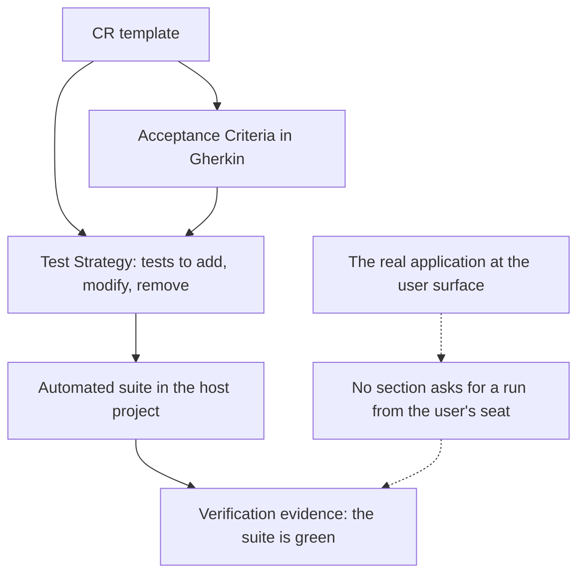
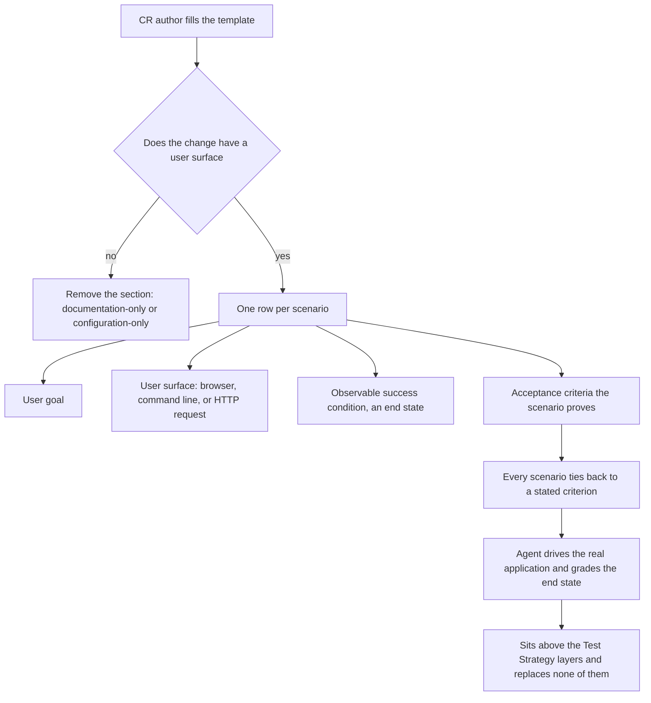
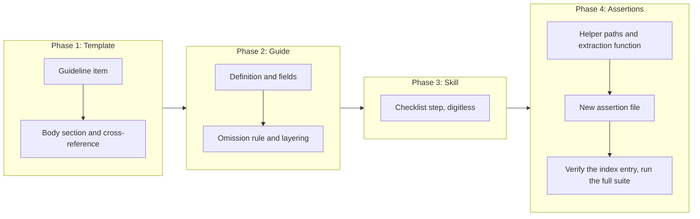

# Model-Based Testing: Proving a Change From the User's Seat

## Change Summary

The Change Request template asks an author to enumerate the automated tests a change needs, and to write acceptance criteria in Gherkin, but it never asks whether anyone has driven the changed software the way its user does. This Change Request adds an optional **Model-Based Testing** section to `skills/governance/templates/CR.md`, in which the author names, per scenario, the user goal, the user surface the scenario is driven on, the observable success condition that grades the run, and the acceptance criteria the scenario proves. The section is removed outright when the change has no user surface, which is the case for a documentation-only or configuration-only change, so an author is never asked to invent a surface that does not exist.

## Motivation and Background

**A passing suite is evidence about the code, not about the product.** The template's Test Strategy section produces unit and integration coverage: a test calls the changed function and asserts what it returns. That layer is necessary and this change does not touch it. What it cannot establish is that a person pursuing a goal through the interface they actually touch, a browser page, a command invocation, an HTTP request, reaches that goal. The gap between "the function returns the right value" and "the user gets what they came for" is where wiring faults, unreachable states, and broken surfaces live, and nothing in the current template asks anyone to look there.

**The agent implementing the change is able to run it.** An AI agent authoring and implementing a Change Request can launch the application and drive it. When the template does not ask for that run, the run does not happen, and the Change Request is closed on a green suite alone. Asking for it in the document is what converts an available capability into a recorded obligation.

**Graded on the end state, or not graded at all.** A run that is judged by reading its own transcript proves that the steps executed, which is not the question. The question is whether the world changed: the record exists with the right values, the file is on disk, the endpoint returns the changed resource. Naming that end state in the Change Request, before the run, is what stops the run from being graded on whether it looked like it worked.

**Optional, because most changes in some repositories have no user surface at all.** A section that must be filled in always gets filled in with fiction when it does not apply. This repository is the demonstration: it ships skills and templates, and its changes are read by agents rather than driven through a surface. Making the section removable, with a stated test for when to remove it, keeps the template honest in both kinds of project. Optionality here governs whether the section appears in a document, and nothing else: every obligation written inside the section stays an obligation.

**The vocabulary already exists outside this repository, and the template must not depend on it.** The concept has a settled vocabulary: a scenario source, a user surface, a success condition, an outcome. A skill implementing that loop and persisting its artifacts under `.agents/scenarios/` is installed on some machines, but it is not part of this repository and is not distributed with the governance skill. The template therefore carries the vocabulary and the obligation, and names no tool, skill, or directory as a prerequisite, so a project with no scenario tooling at all can still fill the section in.

## Change Drivers

* The template asks for automated coverage and for acceptance criteria, and asks nobody to drive the software as its user does
* An implementing agent can run the real application, so the missing piece is the instruction, not the capability
* A run graded on its own transcript produces confidence without evidence
* A mandatory section would be filled with invention on a change that has no user surface
* The relationship to the existing Test Strategy has to be stated, or the new section will be read as a licence to write fewer tests
* The concept's tooling lives outside this repository, so the template has to state the obligation without importing a dependency

## Current State

The Change Request template at `skills/governance/templates/CR.md` is 534 lines. Its guidance lives in one HTML comment block at the top, numbered `0` through `9`, and the body that an author fills in follows. Two of the numbered items bear on verification:

* Item `2`, acceptance criteria, requires the Given-When-Then formula and states that each criterion must be independently testable.
* Item `6`, test strategy, requires a strategy for every change touching code, in three categories: tests to add, tests to modify, tests to remove. For each it requires the test file, the test name, what the test validates, and the expected inputs and outputs.

The body reflects that structure. `## Test Strategy` carries three tables, one per category, and `## Acceptance Criteria` follows it with Gherkin blocks numbered `AC-1` upward. Between them there is nothing else, and neither section mentions a running application. Item `7`, quality standards, requires that tests pass and that documentation is updated; it does not ask for an observation made at a user surface.

Searching the repository for the vocabulary confirms the absence rather than assuming it. Every search below excludes this document and the documentation index entry that names it, both of which were added by the checkpoint commit that authored this Change Request and are therefore the only occurrences of the vocabulary in the working tree. Outside those two files, a case-insensitive search for `scenario` across the repository's Markdown, Bats, and text files returns no hits beyond the vendored Anthropic documentation under `docs/anthropic/`, and a search for `user surface`, `user perspective`, `model-based`, and `model based` returns nothing at all. `.agents/` in this repository contains exactly one entry, `skills/`, so there is no `.agents/scenarios/` directory, and the five skills the repository ships are `governance`, `checkpoint-commit`, `checkpoint-read`, `checkpoint-iterate`, and `checkpoint-distill`. No skill implementing a user-surface run is present here, which is why the template must not name one.

The verification machinery that this change has to survive is equally concrete. `tests/governance/test_cr_template.bats` holds five assertions over the template: that `source-branch` and `source-commit` exist as frontmatter fields, that no line anywhere in the file begins with `copyright:` or `version:` after optional whitespace, and that the governance reference boundary statement is found in text extracted from HTML comment blocks. `tests/governance/test_helpers/setup.bash` defines two path variables, `CR_TEMPLATE` and `ADR_TEMPLATE`, the governance reference pattern `(CR|ADR|FR|NFR|AC)-[0-9]+`, the allowlist of paths where that pattern may appear, and one helper function, `reference_path_is_allowed`. `skills/governance/templates/CR.md` and `skills/governance/reference/cr-guide.md` are on that allowlist; `skills/governance/SKILL.md` is not, and neither is `README.md`. `tests/governance/test_reference_boundary.bats` is the precedent for a feature-scoped assertion file: it is named for the boundary rule rather than for a document, and it asserts over four separate files (`skills/governance/SKILL.md`, `skills/governance/reference/cr-guide.md`, `skills/governance/reference/cr-implementation-workflow.md`, and `AGENTS.md`). The repository has no `Makefile` and `mise.toml` declares tools without a `[tasks]` table, so the project's verification command is `bats -r tests/` locally and `bats tests/ --recursive` in `.github/workflows/test.yml`. The suite currently reports 124 passing assertions.

**The existing comment-extraction expression over-captures, and this change must not build on it.** The extraction the fifth existing assertion uses, `awk '/<!--/{c=1} c{print} /^[[:space:]]*-->[[:space:]]*$/{c=0}'`, starts capturing on any line *containing* `<!--` and stops only on a line that is a bare `-->`. A one-line comment such as the template's optional-element marker therefore opens the capture and never closes it, so the expression emits 413 of the template's 534 lines, including every rendered body heading from `## Change Drivers` onward. Text found in its output is consequently not proof that the text sits inside a comment. The existing assertion still passes and is not modified, but a new assertion that must establish "this guidance never renders" cannot use that expression: it needs an extraction that captures only the contents of a properly delimited block, opened by a line that is a bare `<!--` and closed by a line that is a bare `-->`. Measured against the current template, such an extraction emits 207 lines, leaks no rendered body heading, and still contains the boundary statement.

### Current State Diagram



## Proposed Change

Add one optional section to the template, define it in the guideline block, document it in the reference guide, and give the governance skill's Change Request checklist a line that decides whether it applies.

**The section.** A new `## Model-Based Testing` appears in the template body between `## Test Strategy` and `## Acceptance Criteria`. It is preceded by the template's existing optional-element marker, reproduced verbatim as `<!-- This is an optional element. Feel free to remove. -->`, so the section is marked removable in exactly the manner the template's other removable sections already are, and by a second one-line comment immediately below it stating the test for when to remove it. It holds one row per scenario, and each row states four things: the **user goal**, the **user surface** the scenario is driven on, the **observable success condition** that grades the run, and the **acceptance criteria** the scenario proves. A further column records the persisted scenario record for a project that keeps them, and is left empty by a project that does not.

**The definition.** The guideline block gains an item defining model-based testing as the agent running the test from the user's perspective: it interacts with the real application through the surface the user touches and validates the change from the user's seat. The three candidate surfaces are named with a fixed vocabulary, `browser`, `command line`, and `HTTP request`, which is the wording the template carries and the wording the assertions match. The definition states that the success condition is an observable end state, and that it is never a property of the run's transcript or of the number of steps taken.

**The omission rule.** The same guideline item states when the section is removed: a change with no user surface carries no Model-Based Testing section, and the two cases named are a documentation-only change and a configuration-only change. Removing the section on such a change is correct behaviour and not an omission to be flagged.

**The relationship to Test Strategy.** The guideline item states that model-based testing sits above the automated tests the Test Strategy enumerates, and replaces none of them: dropping unit or integration coverage because a scenario covers the same path is a regression in the suite. Item `6`, the test strategy guidance, gains a pointer in the other direction, so an author reading either one learns that the other exists and what it is for.

**The tie to acceptance criteria.** Every scenario names at least one acceptance criterion it proves, and the section introduces no success condition that no acceptance criterion states. The section is therefore derived from the criteria rather than a second, competing specification of the change.

**No new dependency.** The section names no skill, no driver, and no directory as a prerequisite. An author with browser automation installed uses it; an author without it drives whatever surface is reachable.

### Proposed State Diagram



### The Four Fields

Each field answers a question that the rest of the document leaves open, and the section is worth its lines only because all four are absent elsewhere.

| Field | What it states | Why the document needs it |
|---|---|---|
| User goal | What the person is trying to achieve, in their terms | The acceptance criteria state behaviour; the goal states the errand the behaviour serves |
| User surface | The interface the person touches, and therefore the one the run drives | Fixes the run at the surface rather than at the function nearest the change |
| Success condition | The observable end state that grades the run | Written before the run, it is what stops the run being graded on its transcript |
| Acceptance criteria proved | The criteria this scenario establishes | Keeps the section derived from the criteria instead of specifying the change a second time |

## Requirements

### Functional Requirements

1. The Change Request template **MUST** carry a section titled `Model-Based Testing`, and the line immediately preceding that heading **MUST** be the template's existing optional-element marker reproduced verbatim, `<!-- This is an optional element. Feel free to remove. -->`, so the marker the assertions match is the same string the template's other removable sections already carry.
2. The Model-Based Testing section **MUST** be placed after the Test Strategy section and before the Acceptance Criteria section.
3. The template **MUST** define model-based testing inside its guideline comment block as the agent running the test from the user's perspective, interacting with the real application through the user surface and validating the change from the user's seat.
4. The template **MUST** require each scenario in the section to state the user goal, the user surface, the observable success condition, and the acceptance criteria the scenario proves.
5. The template **MUST** state that the success condition is an observable end state, and **MUST** state that it is never a property of the run's transcript or of the number of steps taken.
6. The template **MUST** require every scenario to name at least one acceptance criterion it proves, and **MUST NOT** permit a scenario whose success condition no acceptance criterion states.
7. The template **MUST** name the three candidate user surfaces using the fixed tokens `browser`, `command line`, and `HTTP request`, and **MUST** require the scenario to name the surface the user touches rather than the component nearest the change.
8. The template **MUST** state that the section is removed when the change has no user surface, and **MUST** name a documentation-only change and a configuration-only change as the cases in which it is removed.
9. The template **MUST** state that the section's optionality governs only whether the section appears in a document, and **MUST NOT** present it as permission to weaken requirement language: every obligation stated in the Model-Based Testing guideline item remains **MUST** or **MUST NOT**, and no obligation in that item is written with `SHOULD`, `MAY`, `RECOMMENDED`, or `OPTIONAL`.
10. The template **MUST** state that model-based testing sits above the automated tests the Test Strategy enumerates and replaces none of them, and the template's test strategy guidance **MUST** point at the Model-Based Testing section for verification at the user surface.
11. The template **MUST NOT** require any named skill, driver, tool, or directory as a precondition for filling in the section.
12. The section's table **MUST** carry a column headed `Scenario Record` that holds one persisted scenario record per scenario, and the template **MUST** state that a project with no such convention leaves that column empty.
13. `skills/governance/SKILL.md` **MUST** gain both of the following, and each added line **MUST NOT** contain a governance identifier in digit form: a step in the Change Request workflow checklist deciding whether the Model-Based Testing section applies and directing the author to fill it in or to remove it, and a line in that workflow's **Flexible (adapt to context)** list recording that the section's presence is governed by the user-surface test.
14. The Change Request reference guide **MUST** document the section as a level-three subsection under its `## Requirements` section: its definition, its four required fields, the omission rule, and its relationship to the Test Strategy section.
15. The documentation index `docs/llms.txt` **MUST** carry an entry for this Change Request. This requirement is already satisfied: the entry was added by the checkpoint commit that authored this document, so the implementation **MUST** verify the entry rather than add it, and **MUST NOT** introduce a second entry for the same document.
16. The governance test suite **MUST** carry one assertion for each row of this document's Tests to Add table, no fewer, and every added test name and every other line of the added assertion file **MUST NOT** contain a governance identifier in digit form.

### Non-Functional Requirements

1. The change **MUST NOT** add a runtime, test framework, or tooling dependency to the repository or to any skill it ships.
2. All guidance added to the template **MUST** live inside HTML comment blocks, so that it never renders in a created Change Request, and the existing assertion that extracts comment text **MUST** continue to pass unmodified.
3. Every added assertion that must establish that a statement sits inside a comment **MUST** extract comment text with an expression that opens a block only on a line that is a bare `<!--` and closes it only on a line that is a bare `-->`, and **MUST NOT** reuse the existing assertion's expression, which also emits rendered body text and therefore cannot establish that property.
4. The text added to the template **MUST NOT** introduce a line beginning, after optional leading whitespace, with `copyright:` or `version:`, because the existing template assertions reject either token anywhere in the file.
5. Change Requests already in `docs/cr/` **MUST** remain valid without migration, the change **MUST NOT** modify any file under `docs/cr/` other than this document, and the absence of a Model-Based Testing section in an earlier document **MUST NOT** be treated as a defect.
6. `skills/governance/SKILL.md` **MUST** stay within the token budget stated by `docs/agentskills/specification.md`, measured in tokens rather than lines, and the measured count and the budget **MUST** both be recorded in the pull request.
7. The template **MUST NOT** grow by more than 40 lines in total, measured with `wc -l` against the file's current 534 lines, since an authoring agent reads the template in full on every use. The bound is an assumption a reviewer can overturn, and it is recorded as such in Open Questions.
8. The change **MUST NOT** violate the governance reference boundary: no governance identifier in digit form outside the permitted territory the test helper's allowlist defines. `tests/governance/test_model_based_testing.bats` is not added to that allowlist, so it **MUST** stay free of any such identifier.
9. The five existing assertions over the Change Request template **MUST** continue to pass, and `tests/governance/test_cr_template.bats` **MUST NOT** be modified by this change at all.
10. Every new file this change adds **MUST** carry the repository's copyright header in the form its file type requires, per the project's copyright convention.

## Affected Components

* `skills/governance/templates/CR.md`: the new guideline item, the new body section, and the cross-reference from the test strategy guidance
* `skills/governance/reference/cr-guide.md`: the section's definition, its fields, the omission rule, and its relationship to the Test Strategy
* `skills/governance/SKILL.md`: the Change Request workflow checklist step deciding whether the section applies, and the line recording the section's optionality in the Flexible list
* `tests/governance/test_helpers/setup.bash`: three path variables, for the governance skill file, the Change Request guide, and the documentation index, and one helper function extracting the contents of the template's delimited comment blocks
* `tests/governance/test_model_based_testing.bats`: **new file**, holding all nineteen assertions this change adds: thirteen over the template's new section and guideline item, three over the governance skill file, two over the reference guide, and one over the documentation index
* `tests/governance/test_cr_template.bats`: **not modified.** Its five assertions are relied on unchanged and the file is left exactly as it is
* `docs/llms.txt`: **no edit required.** The entry for this Change Request is already present, added by the authoring checkpoint commit; Phase 4 verifies it and adds no second entry

## Scope Boundaries

### In Scope

* One optional Model-Based Testing section in the Change Request template, with its guideline item
* The four required per-scenario fields, the success-condition rule, and the tie to acceptance criteria
* The omission rule for a change with no user surface
* The stated relationship between the new section and the existing Test Strategy section, in both directions
* The governance skill's checklist step and the reference guide's documentation of the section
* One new feature-scoped assertion file in the governance test suite, and the three path variables plus the comment-extraction helper it needs
* Verification that the documentation index already carries this document's entry

### Out of Scope ("Here, But Not Further")

* **The Architecture Decision Record template.** An Architecture Decision Record records a decision rather than a change to be verified, and gains no section here.
* **Adding a scenario-running skill to this repository.** The template states the obligation; it ships no driver, no loop, and no automation.
* **Creating `.agents/scenarios/` or any artifact-persistence convention in this repository.** The section accommodates a project that has one; this repository does not acquire one.
* **Amending existing Change Requests.** No document under `docs/cr/` is revisited to add the new section.
* **Changing the Test Strategy section's own structure.** Its three categories and its columns stay exactly as they are; only a cross-reference is added to its guidance.
* **The quality standards checklist.** No new checklist item is added there; the new section carries its own obligations.
* **The skill listing in `README.md`.** The listing describes what the governance skill does, which does not change, and it is outside the boundary allowlist.
* **`tests/governance/test_cr_template.bats`.** The file is not touched. The new assertions go in their own feature-scoped file, following the precedent of `tests/governance/test_reference_boundary.bats`.
* **The existing comment-extraction expression.** The fifth existing template assertion keeps the expression it has, over-capturing and all. The corrected extraction is added alongside it for the new assertions; the existing assertion is not rewritten here.
* **The reference guide's table of contents.** That table lists level-two sections only, and the new subsection is level three under `## Requirements`, like `Include Test Strategy` beside it, so no entry is added.
* **A second documentation index entry.** The index already names this document; nothing is appended.

## Alternative Approaches Considered

* **Make the section mandatory for every Change Request.** Rejected: this repository's own changes have no user surface, so the section would be filled with invention in the very corpus that demonstrates the template. A stated omission test is stronger than a section nobody can honestly complete.
* **Extend the Test Strategy section with a fourth table instead of adding a section.** Rejected: the three existing tables are all statements about the automated suite, with columns for a test file and a test name. A scenario has neither, and folding it in would either distort those columns or bury the run under a heading that reads as unit-test bookkeeping.
* **Require the section to name a specific driver or skill.** Rejected: the tooling is per machine and per project, and this repository ships none of it. A template that names a prerequisite it cannot guarantee produces an author who reports the section inapplicable whenever the named tool is missing.
* **Record the runs outside the Change Request and reference them.** Rejected: the goal, the surface, and the success condition are decided when the change is specified, and writing them after the run is what allows a run to be graded on its transcript. The Change Request is where they belong; an artifact reference is accommodated alongside them.
* **Use the word "scenario" as the section title.** Rejected: on its own the word already means the Gherkin block under Acceptance Criteria in most readers' vocabulary, and the section would be read as a duplicate of it. The title names the method, and the rows are scenarios within it.

## Impact Assessment

### User Impact

An author of a Change Request gains one decision and, where the answer is yes, one short table. The decision is whether the change has a user surface, and it is answered in a sentence. The author of a documentation-only or configuration-only change deletes the section and is explicitly told that doing so is correct. An implementing agent gains a stated obligation it was already capable of meeting, and an end state to grade it against.

### Technical Impact

Confined to three files in the governance skill, one shared test helper, and one new assertion file. The documentation index already carries this document's entry and is not edited, `tests/governance/test_cr_template.bats` is not touched, and there is no new dependency, no change to any other skill, no migration, and no change to the commit protocol. The template grows by at most 40 lines, one guideline item and one body section, and the guideline item lives inside the existing comment block, so nothing new renders in a created document.

### Business Impact

A Change Request closes on evidence that a person pursuing the goal reaches it, rather than on a green suite alone, in the cases where such evidence can be produced. The optionality keeps that cost from being charged to changes that cannot produce it.

## Implementation Approach

Four sequential phases. Each phase ends by running the project's verification command, `bats -r tests/`, which **MUST** exit zero before the next phase begins; the repository declares no `Makefile` and `mise.toml` declares no `[tasks]` table, so that command is the project's documented equivalent and `bats tests/ --recursive` is the same suite as the pull-request workflow runs it. The baseline before Phase 1 is 124 passing assertions.

### Implementation Flow



### Detailed Implementation Steps

Each step below corresponds to exactly one phase of the Implementation Flow, named in its heading.

#### Phase 1: Add the section to the template

Add a numbered guideline item `10` to the template's opening HTML comment block, after item `9` and before the closing `=====` rule, titled for model-based testing and its optionality. The item states, in this order: the definition, that the agent interacts with the real application at the user surface and validates the change from the user's seat; the four fields each scenario states; that the success condition is an observable end state and never a property of the transcript or the step count; that `browser`, `command line`, and `HTTP request` are the candidate surfaces, written with those exact tokens, and that the surface named is the one the user touches; that every scenario names at least one acceptance criterion it proves and introduces no success condition no criterion states; that the section is removed when the change has no user surface, naming the documentation-only and configuration-only cases; that the optionality governs only whether the section appears and every obligation in this item stays **MUST** or **MUST NOT**; and that the section sits above the automated tests of the Test Strategy and replaces none of them. Every line of the item sits inside the opening block, which begins at the bare `<!--` on line 16 and ends at the bare `-->` on line 153, so the corrected extraction of Phase 4 finds it.

Add the cross-reference in the other direction to guideline item `6`: one line stating that verification at the user surface is covered by the Model-Based Testing section, which does not substitute for any test named in the test strategy.

Add the body section between the Test Strategy heading and the Acceptance Criteria heading, at the insertion point immediately before the `## Acceptance Criteria` line. It consists of four parts, in this order: the template's existing optional-element marker reproduced verbatim on its own line, `<!-- This is an optional element. Feel free to remove. -->`, so the string the assertion matches is the same one the template's other removable sections carry; immediately below it, a second one-line HTML comment stating that the section is removed when the change has no user surface; a level-two heading reading `Model-Based Testing`; and a one-line instruction in braces stating that the table holds one row per scenario the agent runs against the real application from the user's seat. The table that follows carries six columns, the four required fields plus the row's own name and the scenario record:

| Column | Placeholder the template ships |
|---|---|
| `Scenario` | `{short name}` |
| `User Goal` | `{what the person is trying to achieve}` |
| `User Surface` | `{browser, command line, or HTTP request}` |
| `Success Condition` | `{the observable end state that grades the run}` |
| `Criteria Proved` | `{AC-n}` |
| `Scenario Record` | `{path, or empty}` |

Verify that no line added anywhere in the file begins with `copyright:` or `version:` after optional whitespace, and that every line of guidance sits inside a block opened by a bare `<!--` line and closed by a bare `-->` line, so the corrected extraction finds it. Confirm the template's total line count has grown by at most 40 lines, to 574 or fewer.

**Affected components:** `skills/governance/templates/CR.md`

**Verification:** `bats -r tests/` exits zero, with the five existing template assertions passing unmodified, and `wc -l skills/governance/templates/CR.md` reports 574 or fewer.

#### Phase 2: Document the section in the reference guide

In `skills/governance/reference/cr-guide.md`, add a level-three subsection headed `### Model-Based Testing` under the `## Requirements` section, immediately after the `### Include Test Strategy` subsection and before the `## Document Numbering` heading. The guide's table of contents lists level-two sections only, so no entry is added to it, matching the treatment of `Include Test Strategy` and every other subsection beside it. The new subsection carries the definition, a list of the four required fields with a sentence on each, the omission rule with its two named cases, and the layering statement that the method sits above the automated tests and replaces none of them. It states that the section names no required tool: where a project persists scenario records, for example under `.agents/scenarios/`, the record's path goes in the `Scenario Record` column, and where it does not, that column stays empty.

**Affected components:** `skills/governance/reference/cr-guide.md`

**Verification:** `bats -r tests/` exits zero, including `cr-guide documents pattern, territories, and commit mechanism`, which asserts over the same file.

#### Phase 3: Add the decision to the governance skill's checklist

In `skills/governance/SKILL.md`, add one line to the Change Request workflow checklist block, immediately after the `Write acceptance criteria in Gherkin format` line, instructing the author to decide whether the change has a user surface, to fill in the Model-Based Testing section when it does, and to remove the section when it does not. Add one line to that workflow's **Flexible (adapt to context)** list, not to the **Strict requirements** list, recording that the section's presence is governed by the user-surface test; the presence of the section is what varies with context, while the obligation to answer the question is the checklist step above and does not vary.

The file is not on the boundary allowlist, so the added wording stays free of any governance identifier in digit form: refer to the section and to acceptance criteria by name, never as `AC` followed by digits.

**Affected components:** `skills/governance/SKILL.md`

**Verification:** `bats -r tests/` exits zero, including `SKILL.md states the boundary rule and links to the guide`, `no strip-fields instruction remains and AGENTS.md records the template exception`, and `no governance references outside permitted paths`, all three of which read this file.

#### Phase 4: Add the assertions

In `tests/governance/test_helpers/setup.bash`, add three path variables beside the existing `CR_TEMPLATE` and `ADR_TEMPLATE`: `GOVERNANCE_SKILL` for `skills/governance/SKILL.md`, `CR_GUIDE` for `skills/governance/reference/cr-guide.md`, and `DOCS_INDEX` for `docs/llms.txt`. The helper is on the boundary allowlist, so it may carry the pattern it already defines, but the new variables are paths and carry no identifier.

Add one helper function to the same file, beside the existing `reference_path_is_allowed`, that takes a file path and emits the contents of its properly delimited HTML comment blocks: it opens a block only on a line that is a bare `<!--` and closes it only on a line that is a bare `-->`, and it emits neither delimiter. `awk '/^[[:space:]]*<!--[[:space:]]*$/{c=1;next} /^[[:space:]]*-->[[:space:]]*$/{c=0;next} c'` satisfies that contract: measured against the current template it emits 207 lines, leaks no rendered body heading, and still contains the boundary statement. The existing assertion's expression **MUST NOT** be reused, because it opens on any line containing `<!--` and therefore emits 413 of the template's 534 lines, rendered body included, so a match in its output proves nothing about where the text lives. Because the function closes a block only on a bare `-->` line, a Mermaid arrow (`X --> Y`) inside a block does not end extraction early.

Create `tests/governance/test_model_based_testing.bats` as a new file and put every assertion listed in the Test Strategy in it. It is feature-scoped rather than document-scoped, following the precedent of `tests/governance/test_reference_boundary.bats`, which is named for a rule and asserts over four separate files. Three constraints govern the file:

* It opens with `#!/usr/bin/env bats` and then the repository's copyright header comment, matching the two existing governance assertion files, and it loads the shared helper with `load test_helpers/setup.bash` inside `setup()`.
* It is not on the boundary allowlist, so every line in it, test name or comment or body, **MUST NOT** contain a governance identifier in digit form. The documentation-index assertion therefore matches the document by its filename slug, `model-based-testing-section`, and never by identifier.
* `tests/governance/test_cr_template.bats` is not opened or edited. Its five assertions are relied on exactly as they stand.

The placement assertion compares the line number of the `## Model-Based Testing` heading against the line numbers of the `## Test Strategy` and `## Acceptance Criteria` headings. The optional-marker assertion reads the line immediately above the heading and requires it to equal the template's optional-element marker verbatim. The guideline assertions read the comment text the new helper function emits.

Confirm that `docs/llms.txt` already carries this document's entry in the Change Requests list and that it carries exactly one such entry. The entry was added by the authoring checkpoint commit, so this phase adds nothing to that file; adding a second entry is a defect.

Run `bats -r tests/` and confirm the whole suite passes: 124 baseline assertions plus the 19 added ones, with the boundary assertion reporting no violation in any changed or added file.

**Affected components:** `tests/governance/test_helpers/setup.bash`, `tests/governance/test_model_based_testing.bats` (new)

**Verification:** `bats -r tests/` exits zero and reports 143 passing assertions; `git status --porcelain` shows no modification to `tests/governance/test_cr_template.bats` and none to `docs/llms.txt`.

## Test Strategy

The repository's suite is Bats, and every assertion below is a text assertion over a shipped document, which is the only kind of assertion a template change admits.

### Tests to Add

All nineteen rows live in one new file, `tests/governance/test_model_based_testing.bats`. "Guideline comment text" names the output of the helper function Phase 4 adds, which emits only the contents of properly delimited comment blocks, not the output of the existing assertion's over-capturing expression.

| Test File | Test Name | Description | Inputs | Expected Output |
|-----------|-----------|-------------|--------|-----------------|
| `tests/governance/test_model_based_testing.bats` | `CR template has a model based testing section` | The body carries the new heading (AC-1, first clause) | `CR_TEMPLATE` | A line equal to `## Model-Based Testing` is present |
| `tests/governance/test_model_based_testing.bats` | `CR template marks the model based testing section optional` | The line immediately above the heading is the template's optional-element marker, verbatim (AC-1, second clause) | `CR_TEMPLATE` | The preceding line equals `<!-- This is an optional element. Feel free to remove. -->` |
| `tests/governance/test_model_based_testing.bats` | `CR template places model based testing between test strategy and acceptance criteria` | Section ordering (AC-2) | `CR_TEMPLATE` | Heading line number is greater than the Test Strategy heading's and less than the Acceptance Criteria heading's |
| `tests/governance/test_model_based_testing.bats` | `CR template defines model based testing as a run at the user surface` | The definition names the real application and the user's seat (AC-3) | Guideline comment text of `CR_TEMPLATE` | Definition present in the extracted comment text |
| `tests/governance/test_model_based_testing.bats` | `CR template requires a user goal a user surface and a success condition per scenario` | Three of the four required fields (AC-4) | `CR_TEMPLATE` | `User Goal`, `User Surface`, and `Success Condition` all named |
| `tests/governance/test_model_based_testing.bats` | `CR template ties each scenario to an acceptance criterion` | The fourth required field and the derivation rule (AC-4 and AC-6) | `CR_TEMPLATE` and its guideline comment text | Rule present in the comment text, and the table carries a `Criteria Proved` column |
| `tests/governance/test_model_based_testing.bats` | `CR template states the success condition is an observable end state` | The grading rule, including its prohibition (AC-5) | Guideline comment text of `CR_TEMPLATE` | End state required, transcript and step count both rejected |
| `tests/governance/test_model_based_testing.bats` | `CR template names the candidate user surfaces` | The three fixed surface tokens (AC-7) | `CR_TEMPLATE` | `browser`, `command line`, and `HTTP request` all present, and the rule that the surface named is the one the user touches |
| `tests/governance/test_model_based_testing.bats` | `CR template states the omission rule for a change with no user surface` | Removal is correct on such a change (AC-8) | Guideline comment text of `CR_TEMPLATE` | Rule present, documentation-only and configuration-only both named |
| `tests/governance/test_model_based_testing.bats` | `CR template keeps obligation language inside the optional section` | Optionality governs presence only (AC-9) | Guideline comment text of `CR_TEMPLATE` | Statement present |
| `tests/governance/test_model_based_testing.bats` | `CR template states model based testing replaces no automated test` | The layering rule (AC-10, first clause) | Guideline comment text of `CR_TEMPLATE` | Statement present |
| `tests/governance/test_model_based_testing.bats` | `CR template test strategy guidance points at model based testing` | The reverse cross-reference (AC-10, second clause) | Guideline comment text of `CR_TEMPLATE` | Pointer present within the test strategy guideline item |
| `tests/governance/test_model_based_testing.bats` | `CR template requires no named tool for model based testing` | No skill, driver, or directory is a precondition (AC-11) | `CR_TEMPLATE` and its guideline comment text | The table carries a `Scenario Record` column, that column is stated as leavable empty, and no tool, skill, driver, or directory is named as a precondition |
| `tests/governance/test_model_based_testing.bats` | `governance skill checklist decides whether model based testing applies` | The workflow checklist carries the decision (AC-12, clauses one and two) | `GOVERNANCE_SKILL` | Checklist line present, naming both filling the section in and removing it |
| `tests/governance/test_model_based_testing.bats` | `governance skill records the section as optional in the flexible list` | The Flexible list records the user-surface test (AC-12, clauses three and four) | `GOVERNANCE_SKILL` | Line present within the Flexible list, not the Strict list |
| `tests/governance/test_model_based_testing.bats` | `governance skill model based testing wording carries no governance identifier` | The boundary holds in the added wording (AC-12, fifth clause) | `GOVERNANCE_SKILL` | No match for the reference pattern anywhere in the file |
| `tests/governance/test_model_based_testing.bats` | `CR guide documents the model based testing section` | Definition and the four fields (AC-13, first clause) | `CR_GUIDE` | A level-three heading for the section is present, with all four fields named |
| `tests/governance/test_model_based_testing.bats` | `CR guide documents the omission rule and the layering` | The two rules a reader needs from the guide (AC-13, second clause) | `CR_GUIDE` | Both present |
| `tests/governance/test_model_based_testing.bats` | `documentation index carries one entry for the model based testing change` | The index names this document exactly once, matched by filename slug rather than by identifier per the boundary rule (AC-14) | `DOCS_INDEX` | Exactly one line contains `model-based-testing-section` |

### Tests to Modify

| Test File | Test Name | Current Behavior | New Behavior | Reason for Change |
|-----------|-----------|------------------|--------------|-------------------|
| `tests/governance/test_helpers/setup.bash` | Not a test; the shared helper | Defines `CR_TEMPLATE`, `ADR_TEMPLATE`, `REFERENCE_PATTERN`, `REFERENCE_ALLOWLIST`, and `reference_path_is_allowed` | Also defines `GOVERNANCE_SKILL`, `CR_GUIDE`, and `DOCS_INDEX`, plus one function emitting the contents of a file's properly delimited HTML comment blocks | Six of the new assertions read three files the helper does not currently locate, and eight of them need a comment extraction that the existing expression cannot provide |

### Tests to Remove

None. No behaviour is removed by this change, so no assertion becomes obsolete.

### Existing Coverage Relied On

Two acceptance criteria are covered by assertions that already exist and are not modified, which is why no row above duplicates them.

| Test File | Test Name | Criterion it covers |
|-----------|-----------|---------------------|
| `tests/governance/test_cr_template.bats` | The five existing assertions, unmodified: two over the frontmatter fields, two rejecting the metadata fields, and one over the extracted comment text | AC-15 |
| `tests/governance/test_reference_boundary.bats` | `no governance references outside permitted paths` | AC-16, for every file this change touches or adds, including the new assertion file and its test names |

### Out-of-Band Verification

* **The skill token budget** (Non-Functional Requirement 6) is not expressible as a Bats assertion, because measuring it requires a tokenizer rather than a text match. It is verified out of band by measuring `skills/governance/SKILL.md` in tokens against the budget stated in `docs/agentskills/specification.md`, and recording both the measured count and the budget in the pull request.
* **The template's growth bound** (Non-Functional Requirement 7) is checked with `wc -l skills/governance/templates/CR.md`, which **MUST** report 574 or fewer against the current 534, and the number is recorded in the pull request. The bound stands in for the unmeasurable judgment of proportionality, which remains a review consideration but is not what decides the requirement.
* **No new dependency** (Non-Functional Requirement 1) is checked against the branch diff: `git diff --name-only main...HEAD` **MUST** name none of `mise.toml`, `release-please-config.json`, `.release-please-manifest.json`, or any lockfile, and no added file **MUST** introduce a tool the suite does not already run. The only executables the added assertions use are `bats`, `grep`, `awk`, and `wc`, all already relied on by the existing suite.
* **Existing documents remain valid** (Non-Functional Requirement 5) is checked against the same diff: the only path under `docs/cr/` it names **MUST** be this document.
* **The new file carries its copyright header** (Non-Functional Requirement 10) is checked by reading the first two lines of `tests/governance/test_model_based_testing.bats`, which **MUST** be the Bats shebang followed by the repository's copyright comment, matching the two existing governance assertion files.
* **This Change Request carries no Model-Based Testing section of its own, and that is the omission rule applying to itself.** The change alters templates, guidance, and text assertions. It has no user surface: there is no application to launch and no interface a person drives, so there is no scenario to run and no end state to grade. Stating this is how the rule is demonstrated rather than merely written.

## Acceptance Criteria

### AC-1: The section exists and is optional

```gherkin
Given the Change Request template
When it is read
Then it carries a section titled Model-Based Testing
  And the line immediately above that heading is the template's optional-element marker, character for character the same string its other removable sections carry
```

### AC-2: The section sits between test strategy and acceptance criteria

```gherkin
Given the Change Request template
When the position of the Model-Based Testing heading is compared with the other headings
Then it falls after the Test Strategy section
  And it falls before the Acceptance Criteria section
```

### AC-3: The method is defined as a run at the user surface

```gherkin
Given the Change Request template's guideline block
When the definition of model-based testing is read
Then it states that the agent interacts with the real application through the user surface
  And it states that the change is validated from the user's seat
```

### AC-4: Each scenario states four things

```gherkin
Given the Model-Based Testing section of the template
When a scenario row is filled in
Then it states the user goal
  And it states the user surface the scenario is driven on
  And it states the observable success condition
  And it names the acceptance criteria the scenario proves
```

### AC-5: The success condition is an end state

```gherkin
Given the template's guidance for the section
When the grading rule is read
Then the success condition is required to be an observable end state
  And a property of the run's transcript or of the number of steps taken is rejected as a success condition
```

### AC-6: No scenario floats free of a criterion

```gherkin
Given a filled-in Model-Based Testing section
When each scenario is checked against the Acceptance Criteria section
Then every scenario names at least one acceptance criterion it proves
  And no scenario states a success condition that no acceptance criterion states
```

### AC-7: The candidate surfaces are named

```gherkin
Given the template's guidance for the section
When the user surface field is read
Then the tokens browser, command line, and HTTP request are all present as the candidate surfaces
  And the surface named in a scenario is the one the user touches rather than the component nearest the change
```

### AC-8: A change with no user surface carries no section

```gherkin
Given a change that is documentation-only or configuration-only
When the author fills in the template
Then the Model-Based Testing section is removed from the document
  And the template states that removing it in that case is correct
```

### AC-9: Optionality is not weaker language

```gherkin
Given the template's guidance for the section
When its optionality is read
Then the optionality governs only whether the section appears in a document
  And every obligation stated in the Model-Based Testing guideline item remains stated as MUST or MUST NOT
  And none of those obligations is written with SHOULD, MAY, RECOMMENDED, or OPTIONAL
```

### AC-10: The section replaces no automated test, and each points at the other

```gherkin
Given the template's guidance
When the model-based testing item and the test strategy item are both read
Then the model-based testing item states that it sits above the automated tests and replaces none of them
  And the test strategy item points at the Model-Based Testing section for verification at the user surface
```

### AC-11: The section names no prerequisite tool

```gherkin
Given the Change Request template
When the Model-Based Testing section and its guidance are read
Then no skill, driver, tool, or directory is named as a precondition for filling it in
  And the section's table carries a column headed Scenario Record
  And that column is stated to be left empty by a project with no such convention
```

### AC-12: The governance skill decides whether the section applies

```gherkin
Given the governance skill's Change Request workflow checklist
When it is read
Then it carries a step deciding whether the change has a user surface
  And that step directs the author to fill in the section or to remove it
  And the workflow's Flexible list records that the section's presence is governed by that test
  And the Strict list is left unchanged
  And the added wording contains no governance identifier in digit form
```

### AC-13: The reference guide documents the section

```gherkin
Given the Change Request reference guide
When it is read
Then it documents the definition of model-based testing and its four required fields under a level-three heading within its Requirements section
  And it documents the omission rule and the relationship to the Test Strategy section
  And its table of contents is unchanged, because that table lists level-two sections only
```

### AC-14: The documentation index carries this document exactly once

```gherkin
Given the documentation index
When it is read after the change
Then it carries an entry for this Change Request in the Change Requests list
  And it carries exactly one such entry, the one the authoring commit already added
  And the implementation has appended nothing to that file
```

### AC-15: The existing template guarantees survive

```gherkin
Given the changed Change Request template
When the existing template assertions run
Then the source-branch and source-commit fields are still found
  And no line begins with a copyright or a version field
  And the governance reference boundary statement is still found in the extracted comment text
  And the file holding those five assertions has not been modified by this change
```

### AC-16: The suite passes with the boundary intact

```gherkin
Given the full change
When bats -r tests/ runs
Then it exits zero with 143 passing assertions, the 124 already present plus the 19 added
  And the governance boundary assertion reports no violation in any changed or added file
  And no line of the added assertion file contains a governance identifier in digit form
```

## Quality Standards Compliance

### Build & Compilation

- [ ] Not applicable: a documentation and skills repository with no build step

### Linting & Code Style

- [ ] Not applicable: no linter is configured for this repository

### Test Execution

- [ ] All existing tests pass after implementation
- [ ] All nineteen new assertions pass
- [ ] `bats -r tests/` exits zero and reports 143 passing assertions
- [ ] The five existing Change Request template assertions pass, and their file is unmodified

### Documentation

- [ ] The template's guidance is self-contained and lives inside properly delimited comment blocks
- [ ] The reference guide documents the section as a level-three subsection, and its table of contents is untouched
- [ ] The governance skill's checklist carries the decision, and its Flexible list records the section's optionality
- [ ] The documentation index already carries this document's entry, exactly once, and was not edited
- [ ] The template grew by at most 40 lines, and the measurement is recorded in the pull request
- [ ] The governance skill file's token count and the specification's budget are both recorded in the pull request

### Code Review

- [ ] Changes submitted via pull request
- [ ] PR title follows Conventional Commits format
- [ ] Code review completed and approved
- [ ] Changes squash-merged to maintain linear history

### Verification Commands

```bash
# Test execution: the project declares no Makefile and no mise tasks, so this
# command is the project's verification workflow. The pull-request workflow runs
# the same suite as `bats tests/ --recursive`.
bats -r tests/

# Growth bound on the template (Non-Functional Requirement 7): 574 or fewer
wc -l skills/governance/templates/CR.md

# No dependency change and no other governance document touched
git diff --name-only main...HEAD
```

## Risks and Mitigation

### Risk 1: The optional section is read as permission to write fewer tests

**Likelihood:** medium
**Impact:** high
**Mitigation:** The layering statement is a requirement, not a remark: the section sits above the automated tests and replaces none of them, and an assertion pins that sentence in the template. The cross-reference in the test strategy guidance says the same thing from the other side, so an author reaching the new section from either direction meets the rule.

### Risk 2: The section is skipped on changes that do have a user surface

**Likelihood:** medium
**Impact:** medium
**Mitigation:** The omission rule is a test with two named cases rather than a matter of taste, and the governance skill's checklist step forces the question to be answered while the document is being written. A reviewer can check the answer against the change in front of them.

### Risk 3: The section becomes a second specification competing with the acceptance criteria

**Likelihood:** medium
**Impact:** medium
**Mitigation:** Every scenario **MUST** name a criterion it proves, and a scenario **MUST NOT** state a success condition that no criterion states. The section is therefore derived from the criteria, and a reviewer resolving a disagreement between the two reads the criteria as authoritative.

### Risk 4: The template grows past the point where an authoring agent reads it carefully

**Likelihood:** medium
**Impact:** medium
**Mitigation:** The guidance is one numbered item and one line added to an existing item, and the body addition is one marker, one sentence, and one table. Proportionality is a review judgment recorded against the template's existing sections, and the detail that would otherwise swell the template lives in the reference guide, which is read on demand.

### Risk 5: A project reads the section as requiring tooling it does not have

**Likelihood:** low
**Impact:** medium
**Mitigation:** No tool, skill, or directory is named as a precondition, an assertion checks that, and the scenario-record column is explicitly leavable empty. Where no automation is reachable, the author drives whatever surface is reachable instead of declaring the section inapplicable.

### Risk 6: The added text trips an existing template assertion

**Likelihood:** low
**Impact:** low
**Mitigation:** Three traps are known and stated in the implementation steps: a line beginning with `copyright:` or `version:` anywhere in the file fails an existing assertion; guidance placed outside a block that a bare `<!--` line opens and a bare `-->` line closes is invisible to the corrected extraction; and the existing assertion's expression over-captures, so reusing it would produce assertions that pass whether or not the guidance renders. The first two are checked in Phase 1 and again by the full suite in Phase 4, and the third is closed by requiring the corrected extraction in Non-Functional Requirement 3.

### Risk 7: The new assertion file drifts from the template it asserts over

**Likelihood:** low
**Impact:** medium
**Mitigation:** Every assertion matches a string the template is specified to carry verbatim: the optional-element marker, the six column headings, and the three surface tokens. Where the specified string and the assertion disagree, the assertion fails immediately rather than silently weakening, because each is an exact match rather than a loose pattern.

## Dependencies

* Depends on the existing Bats suite and its governance test helper: the helper gains three path variables and one extraction function, and its existing contents are unchanged
* Depends on `bats`, `grep`, `awk`, and `wc`, every one of which the current suite already uses
* Operates under the governance reference boundary, which is unchanged
* Depends on no skill, driver, or directory outside this repository, by requirement

## Estimated Effort

Approximately 5 to 7 person-hours.

* Phase 1, the template: 1.5 hours
* Phase 2, the reference guide: 1 hour
* Phase 3, the governance skill checklist: 0.5 hours
* Phase 4, the helper additions and the nineteen assertions in a new file: 2.5 hours

## Decision Outcome

Chosen approach: "one optional section, four fields, graded on an end state, removed when there is no user surface", because the template already asks for automated coverage and for criteria and asks nobody to drive the software as its user does, and because the honest way to add that question to a template used by projects with no user surface is to state the test for when it does not apply rather than to demand an answer that would be invented.

## Open Questions

Five points were left open, three by the feature summary and two by this document's review. Each was resolved by the smallest defensible assumption, stated here so a reviewer can overturn one cheaply.

* **Placement.** The section is assumed to be a top-level section between Test Strategy and Acceptance Criteria, rather than a fourth table inside Test Strategy. A scenario has no test file and no test name, so it does not fit that section's columns. A reviewer preferring nesting would change Functional Requirement 2 and one assertion.
* **The title.** The section is titled `Model-Based Testing`, matching the requested vocabulary, and the rows within it are scenarios. The word "scenario" alone was not used as the title because it already names the Gherkin blocks under Acceptance Criteria.
* **The template's growth bound.** Non-Functional Requirement 7 states a hard cap of 40 added lines, replacing the unmeasurable word "proportionate". The number is this review's assumption, derived from the size of the planned addition (one guideline item of roughly eighteen lines, one line in the test strategy item, and a body section of roughly eleven), not from a project convention. A reviewer who wants a different cap changes one number in that requirement and one number in the Out-of-Band Verification list.
* **Where the new assertions live.** They go in a new `tests/governance/test_model_based_testing.bats` rather than into `tests/governance/test_cr_template.bats`, because six of the nineteen assert over files other than the template and `tests/governance/test_reference_boundary.bats` already sets the precedent for a file named after a rule rather than a document. A reviewer preferring the assertions folded into the template's own file changes the Test File column of the nineteen rows and relaxes Non-Functional Requirement 9's second clause.
* **The relationship to scenario tooling outside this repository.** A skill implementing this loop and persisting artifacts under `.agents/scenarios/` exists on some machines but is not part of this repository, which was verified rather than assumed: outside this document and the index entry naming it, no file here mentions a scenario, and `.agents/` contains only `skills/`. The template therefore names no tool and no directory, and the guide mentions the artifact path only as an example of what the `Scenario Record` column holds where a project has such a convention. If the repository later ships such a skill, the guide's example becomes a reference to it, which is a documentation change rather than a change to this section's contract.

## Related Items

* Links to related change requests: CR-0011 added the source traceability fields this document's frontmatter carries; CR-0013 added the Bats infrastructure the new assertions extend; CR-0014 established the governance reference boundary the new wording observes

<!-- review-summary

CR-0018 review, 2026-09-24, against working tree at 4d8b98c on branch docs/cr-model-based-testing.
Baseline verified by running the suite: 124 assertions passing before any change.

FINDINGS BY CATEGORY
  drift ............... 4
  contradiction ....... 4
  ambiguity ........... 6
  coverage ............ 3
  convention .......... 4
  TOTAL .............. 21
FIXES APPLIED ........ 21
UNRESOLVED ........... 0

DRIFT (the code is reality; the plan was updated to match)
  D1. docs/llms.txt ALREADY carries this document's entry, added by the authoring
      checkpoint commit 4d8b98c (line 24 of the index). Phase 4's instruction to add
      it would have produced a duplicate entry. Fix: FR-15 restated as already
      satisfied and verify-not-add, AC-14 rewritten to require exactly one entry and
      no edit, Phase 4 step changed to a verification, Affected Components annotated,
      the test row renamed to assert exactly one entry, and a Scope Boundaries
      exclusion added for a second entry.
  D2. The existing comment-extraction expression the CR planned to reuse,
      quoted in Current State, does NOT extract comment text. It opens on any line
      CONTAINING an open-comment delimiter, so the template's one-line
      optional-element markers open a capture that nothing closes until the next
      bare close-comment line; measured against the current template it emits 413 of 534
      lines, including every rendered body heading from `## Change Drivers` onward.
      Five acceptance criteria (AC-3, AC-5, AC-8, AC-9, AC-10) and NFR-2 depended on
      that extraction proving "this guidance never renders", which it cannot do.
      Fix: Current State now documents the measured behaviour, a new NFR-3 requires a
      corrected extraction (open only on a bare open-comment line, close only on a
      bare close-comment line; measured: 207 lines, zero body headings, boundary
      statement still found), Phase 4 specifies the helper and forbids reuse of the old
      expression, and Risk 6 names the trap. The existing assertion is left untouched.
  D3. skills/governance/reference/cr-guide.md's table of contents lists level-two
      sections only; `### Include Test Strategy` and every sibling subsection are
      absent from it. Phase 2's "add it to the table of contents" and the matching
      Quality Standards checkbox contradicted the file's actual structure. Fix: the
      new subsection is specified as level three under `## Requirements`, the TOC is
      explicitly left unchanged (Phase 2, FR-14, AC-13, Quality Standards, Scope
      Boundaries).
  D4. Current State's absence claims were falsified by the CR's own authoring commit:
      this document and the index entry now contain "scenario", "user surface", and
      "model-based". Fix: every absence claim is scoped to exclude those two files,
      and the same scoping applied to the Open Questions bullet that repeats it.
  Commits since authoring: only 4d8b98c, which added this document and the index
  entry. No other file the CR cites has moved, been renamed, or changed shape; all
  six cited paths exist at the cited locations, and the cited five-assertion and
  534-line facts were confirmed.

CONTRADICTION
  X1. FR-1 required the marker used "in the same manner as the template's other
      removable sections" while Phase 1 specified a re-worded marker, leaving the
      "marker precedes the heading" assertion with no deterministic target. Fix: the
      template's marker is reproduced verbatim on its own line, with a second
      one-line comment below it carrying the removal test. FR-1, AC-1, Phase 1, the
      Proposed Change prose and the test row all now name the exact string.
  X2. Surface vocabulary disagreed with itself: "command invocation" in prose versus
      "command line" in FR-7, the table placeholder and the assertion. Fix: `browser`,
      `command line`, `HTTP request` fixed as the three tokens the template carries
      and the assertions match (FR-7, AC-7, Phase 1, Proposed Change, diagram).
  X3. Phase 3 added a line to the governance skill's strict-or-flexible lists that no
      Functional Requirement and no acceptance criterion covered, and did not say
      which list. Fix: folded into FR-13 and AC-12 as the Flexible list specifically,
      with the Strict list stated as unchanged, and given its own assertion row.
  X4. NFR-8 required the five existing template assertions to "pass unmodified" while
      the plan added thirteen assertions to the file holding them. Fix: the new
      assertions move to their own file and NFR-9 now forbids touching
      tests/governance/test_cr_template.bats at all.

AMBIGUITY (RFC 2119 and testability)
  A1. FR-9 and AC-9 bound obligations to "inside the section", where the body section
      holds only placeholders. Rewritten to name the guideline item, and to forbid
      SHOULD, MAY, RECOMMENDED and OPTIONAL in it explicitly.
  A2. FR-16's "each of its stated rules" was unbounded. Rewritten as one assertion per
      row of the Tests to Add table, no fewer.
  A3. NFR-6's "proportionate to the template's existing sections" was unmeasurable.
      Replaced by NFR-7, a hard 40-line growth bound checked with `wc -l` (534 to at
      most 574), with the number recorded in Open Questions as an overturnable
      assumption rather than presented as a project convention.
  A4. NFR-6's token budget cited no source and no number. Now cites
      docs/agentskills/specification.md and requires both the measured count and the
      budget in the pull request.
  A5. Phase 2's heading level was unstated. Now level three, at a named insertion
      point between two named headings.
  A6. Three residual non-RFC-2119 obligations ("must name", "may state", "may
      contain") in Phase 4 and Risk 3 rewritten to MUST and MUST NOT.

COVERAGE
  V1. NFR-1 (no new dependency) and NFR-5 (existing documents remain valid) had no
      acceptance criterion and no verification entry. Both now have concrete
      Out-of-Band checks against `git diff --name-only main...HEAD`.
  V2. FR-12's first clause (a place to record the scenario record) was asserted only
      indirectly. AC-11 now requires the `Scenario Record` column by name, and FR-12
      names the column heading.
  V3. NFR-10 added: every new file carries the repository's copyright header, with an
      Out-of-Band check, since the plan now adds a file and the project's copyright
      convention requires one.
  Coverage after fixes: all sixteen Functional Requirements map to at least one
  acceptance criterion; all sixteen acceptance criteria map to at least one Test
  Strategy entry or a named existing assertion; all ten Non-Functional Requirements
  map to an assertion, a phase check, or an Out-of-Band check.

CONVENTION
  C1. No phase stated its verification command. The repository has no Makefile and
      mise.toml declares no [tasks] table, so `bats -r tests/` is the documented
      equivalent; every phase now ends with an explicit Verification line, and the
      Verification Commands block carries the growth-bound and diff checks too.
  C2. Nineteen assertions, six of them over files other than the CR template, were
      all placed in a file named for the template. Moved to a new feature-scoped file,
      tests/governance/test_model_based_testing.bats, following the precedent of
      tests/governance/test_reference_boundary.bats, which is named for a rule and
      asserts over four separate files.
  C3. The new file is not on the reference-boundary allowlist, so NFR-8 now requires
      every line of it, not only its test names, to be free of governance identifiers
      in digit form, and the index assertion matches by filename slug.
  C4. Assertion counts made checkable end to end: 124 baseline plus 19 added equals
      143, stated in Phase 4, AC-16 and the Quality Standards checklist.

SCOPE AND DIAGRAMS
  Affected Components reconciled with the phases: two files annotated as deliberately
  untouched (test_cr_template.bats, docs/llms.txt), one file added, the helper's change
  described precisely. Five exclusions added to Out of Scope. The Implementation Flow
  diagram's Phase 4 updated to the new three-step shape; the Proposed State diagram's
  surface label aligned to the fixed tokens. Both diagrams and the Current State
  diagram re-checked against the current repository and against the project's Mermaid
  conventions: all labels quoted, no bare parentheses or colons outside quotes.

UNRESOLVED ITEMS REQUIRING HUMAN DECISION
  None. Two judgments this review had to make are recorded in Open Questions rather
  than left implicit, so the author can overturn either in a single edit: the 40-line
  growth bound that replaced the unmeasurable word "proportionate", and the decision
  to put the new assertions in their own file rather than in the template's.

-->
